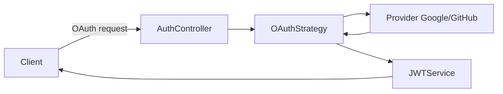
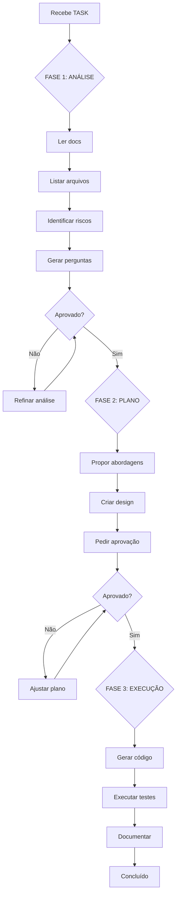
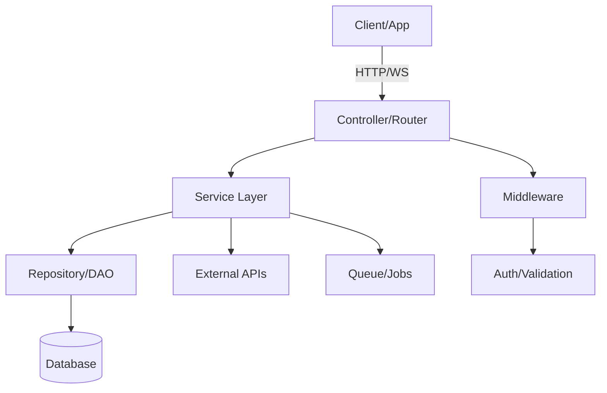
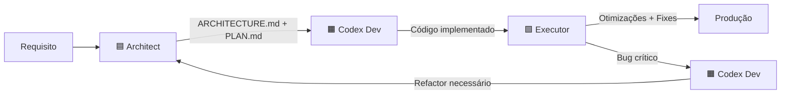

# RULES GLOBAL

## 1. Nomenclatura e Placeholders
- Módulos reutilizáveis devem usar o prefixo `obm-*`.
- Nunca usar prefixo “martyn” em nomes de módulos.
- Apps devem ser citados via placeholders: `{{APP_AUTH_SOCIAL}}`, `{{APP_3D_CORE}}`, `{{APP_ORBIT_SUITE}}`, `{{APP_MUSIC_PLATFORM}}`.

## 2. Contratos e Integração
- Todo módulo deve definir claramente: entradas, saídas, erros padronizados e APIs/SDKs.
- Preferir integração via `REST` entre linguagens diferentes; usar packages/libs quando na mesma linguagem.
- Documentar endpoints, formatos de request/response e códigos de erro.

## 3. Segurança
- Nunca hardcode secrets; usar `.env` ou secret manager.
- Padronizar autenticação por [[Glossario-Tecnico/JWT]] onde houver login.
- Validar inputs (DTOs/schemas), aplicar RBAC ([[Glossario-Tecnico/RBAC]]), rate limits e logs seguros.

## 4. Linkagem e Navegação
- Todo termo técnico vira um wikilink para `06-Glossario-Tecnico/...`.
- Manter navegação bidirecional entre conceitos relacionados e notas de módulos.

## 5. Fonte da Verdade e Aprovação
- Nunca adaptar, excluir ou reescrever documentação sem autorização explícita após leitura da nova fonte.
- Antes de incluir/excluir regras, solicitar aprovação.

## 6. Stack Fixa
- Stack oficial: NestJS (TS), FastAPI (Python), Next.js (React), Postgres, Redis, Docker.
- ORM oficial para NestJS + Postgres: [[06-Glossario-Tecnico/Prisma]].
- Fila/Jobs assíncronos: [[06-Glossario-Tecnico/BullMQ]] (Redis).
- Módulos de alta performance (quando necessário): Rust/Go/C++ com fronteiras [[06-Glossario-Tecnico/gRPC]], [[06-Glossario-Tecnico/FFI]] e [[06-Glossario-Tecnico/WebAssembly]].
- Módulos devem preferir padrões idiomáticos dessas stacks.

## 7. Conversão de Open-Source para Nossa Stack
- Conservar contratos (APIs/SDKs) e requisitos de segurança.
- Portar componentes para padrões `obm-*` com camadas de adaptação quando necessário.
- Documentar diferenças e testes de compatibilidade.

## 8. Ignore/Index e Docx
- Configurar arquivos ignorados do índice (logs, binários, cache, builds).
- Habilitar ingestão de `.docx` com conversão para `.md` quando aplicável.
- Manter os índices limpos e atualizados.

## 9. Cache Hygiene
- Ao atualizar documentação, limpar/otimizar caches relevantes.
- Registrar a operação e impactos se houver.

## 10. Validação e Confiabilidade
- Toda instrução deve vir com método de verificação e avisos de armadilhas.
- Nunca sugerir abordagens que possam levar a falhas.

## 11. Prompts de Auto-Limpeza e Plugins
- Auto-limpeza: verificar wikilinks quebrados, remover arquivos órfãos, otimizar imagens, reconstruir índices.
- Plugins recomendados: Dataview, Templater, Advanced Tables, Mermaid. Documentar configuração.

## 12. Regras para Tasks (Trae)
- `.task` é uma unidade atômica com objetivo claro, entradas e saídas.
- Criar tasks paralelas quando independentes (ingestão, glossário, scaffold, receitas, histórico).
- Cada task deve reportar progresso, lacunas e propostas.

## 13. Reaproveitamento Open-Source Ético
### ✔️ Permitido:
- Reutilizar bibliotecas e frameworks open-source com licenças compatíveis (MIT, Apache 2.0, BSD)
- Adaptar código open-source mantendo atribuição original
- Integrar componentes via SDKs e APIs públicas
- Criar wrappers e adaptadores para nossa stack
- Contribuir melhorias de volta para projetos originais

### ❌ Proibido:
- Apagar ou modificar avisos de licença
- Vender software GPL como produto fechado
- Fingir autoria de código de terceiros
- Violar termos de licença (copyleft, atribuição, etc.)
- Usar código proprietário sem autorização

### Checklist de Compliance:
- [ ] Verificar licença do projeto original
- [ ] Manter arquivo LICENSE e NOTICE
- [ ] Documentar dependências em `package.json`, `requirements.txt`, etc.
- [ ] Adicionar atribuições em `CREDITS.md` ou README
- [ ] Revisar incompatibilidades de licença (GPL + proprietary)

### Exemplos Práticos:
```typescript
// ✔️ BOM: Wrapper ético com atribuição
/**
 * Authentication adapter based on NextAuth.js
 * Original: https://github.com/nextauthjs/next-auth
 * License: ISC License
 */
export class OBMAuthAdapter extends NextAuthAdapter {
  // Nossa customização
}
```

```python
# ❌ RUIM: Código copiado sem atribuição
def auth_user(credentials):
    # [código copiado de outro projeto sem mencionar]
    pass
```

### Links de Referência:
- [[06-Glossario-Tecnico/Licencas-Open-Source]]
- [[08-Referencias-Externas/04-Catalogo-OS-3D-LLM-Reuso]]

## 14. IA: Não Reescreve Tudo
### Princípio:
IA deve fazer **alterações mínimas e cirúrgicas**, não reescrever arquivos inteiros.

### ✔️ A IA PODE:
- Ajustar imports e paths
- Corrigir tipos TypeScript/Python
- Atualizar configurações (tsconfig.json, .env.example)
- Adicionar documentação inline
- Refatorar funções isoladas (quando explicitamente solicitado)

### ❌ A IA NÃO PODE (sem autorização explícita):
- Reescrever arquivos inteiros "do zero"
- Alterar assinaturas de funções públicas (breaking changes)
- Trocar bibliotecas ou stack sem consulta
- Remover código funcional "por preferência"
- Reorganizar estrutura de pastas sem plano aprovado

### Checklist de Validação:
- [ ] Alteração resolve o problema específico?
- [ ] Diff é mínimo (< 50 linhas para bugs, < 200 para features)?
- [ ] Mantém compatibilidade com código existente?
- [ ] Não introduz dependências desnecessárias?
- [ ] Preserva testes e documentação existentes?

### Quando Chamar Executor:
- Quando é correção pontual (bug, typo, config)
- Quando alteração é < 100 linhas
- Quando não afeta contratos públicos

### Exemplo Prático:
```typescript
// ❌ RUIM: IA reescreveu tudo
- export class UserService {
-   constructor(private db: Database) {}
-   async getUser(id: string) { ... }
-   async updateUser(id: string, data: any) { ... }
- }
+ export class UserRepository extends BaseRepo<User> {
+   // [300 linhas de código novo]
+ }

// ✔️ BOM: IA fez alteração cirúrgica
export class UserService {
  constructor(private db: Database) {}
  
  async getUser(id: string) {
-   return this.db.users.findOne({ id });
+   return this.db.users.findUnique({ where: { id } }); // Prisma syntax fix
  }
}
```

## 15. Protocolo .TASK (3 Fases)
### Visão Geral:
Toda tarefa deve seguir 3 fases obrigatórias: **ANÁLISE → PLANO → EXECUÇÃO**.

### FASE 1: ANÁLISE (TASK 1)
**Objetivo:** Entender o problema sem gerar código.

**IA deve:**
- Ler toda documentação relevante
- Listar arquivos afetados
- Identificar dependências e riscos
- **NÃO gerar código ainda**

**Entregáveis:**
- Lista de arquivos a modificar
- Checklist de requisitos
- Perguntas para clarificação
- Estimativa de complexidade

**Exemplo de Output:**
```markdown
## ANÁLISE - Adicionar autenticação OAuth
### Arquivos Afetados:
- `modules/auth/service/src/auth.controller.ts`
- `modules/auth/service/src/strategies/oauth.strategy.ts` (NOVO)
- `modules/auth/docs/02-Integracao.md`

### Dependências:
- passport-oauth2 (já instalado)
- @nestjs/passport (já instalado)

### Riscos:
- Mudança em interface pública `AuthService`
- Requer variáveis de ambiente adicionais

### Perguntas:
1. Quais provedores OAuth suportar? (Google, GitHub, outros?)
2. Manter autenticação JWT existente?
```

### FASE 2: PLANO (TASK 2)
**Objetivo:** Planejar implementação com alternativas.

**IA deve:**
- Apresentar 2-3 abordagens possíveis
- Detalhar prós e contras de cada
- Propor estrutura de arquivos novos
- Solicitar aprovação antes de continuar

**Entregáveis:**
- Documento de design (mini RFC)
- Diagrama de fluxo (Mermaid)
- Checklist de implementação
- Pontos de decisão marcados

**Exemplo de Output:**
```markdown
## PLANO - Implementação OAuth

### Abordagem A: Passport Strategy
**Prós:** Integração nativa NestJS, bem documentado
**Contras:** Mais boilerplate

### Abordagem B: Custom OAuth Handler
**Prós:** Mais controle, menos dependências
**Contras:** Manutenção manual, reinventar roda

### Recomendação: Abordagem A

### Estrutura Proposta:


### Checklist Implementação:
- [ ] Criar `oauth.strategy.ts`
- [ ] Adicionar rotas `/auth/google`, `/auth/github`
- [ ] Atualizar `.env.example`
- [ ] Adicionar testes unitários
- [ ] Documentar em `02-Integracao.md`
```

### FASE 3: EXECUÇÃO (TASK 3)
**Objetivo:** Implementar após aprovação.

**IA deve:**
- Gerar código apenas após "OK para executar"
- Mostrar diffs, não arquivos inteiros
- Seguir plano aprovado
- Reportar progresso incremental

**Entregáveis:**
- Commits atômicos por mudança
- Testes passando
- Documentação atualizada
- Checklist de conclusão

**Exemplo de Output:**
```markdown
## EXECUÇÃO - OAuth Implementation

### Commit 1: Add OAuth strategy
```diff
+ // modules/auth/service/src/strategies/oauth.strategy.ts
+ @Injectable()
+ export class OAuthStrategy extends PassportStrategy(Strategy, 'oauth') {
+   constructor(private configService: ConfigService) {
+     super({
+       clientID: configService.get('OAUTH_CLIENT_ID'),
+       // ...
+     });
+   }
+ }
```

### Status:
- [x] Criar oauth.strategy.ts
- [x] Adicionar rotas
- [ ] Testes (em andamento)
```

### Fluxograma das 3 Fases:


### Consequências de Pular Etapas:
- **Pular ANÁLISE:** Código irrelevante, arquivos errados modificados
- **Pular PLANO:** Arquitetura ruim, refatorações futuras, dívida técnica
- **Pular EXECUÇÃO apropriada:** Código sem testes, docs desatualizadas

## 16. Regra de Ouro Martyn
### Princípio Central:
> **"Se houver mais de uma interpretação, PARE e PERGUNTE"**

### Proibições Absolutas:
- ❌ Assumir intenção do usuário
- ❌ Inferir requisitos não explícitos
- ❌ Inventar comportamentos
- ❌ Decidir sem confirmar
- ❌ "Achar que entendeu"

### Quando Aplicar:
- Requisito vago ou ambíguo
- Múltiplas implementações possíveis
- Impacto em módulos críticos
- Mudança em API pública
- Dúvida sobre escopo

### 5 Exemplos de Situações Ambíguas:

#### Exemplo 1: Feature vaga
**Usuário diz:** "Adicione autenticação"
**Ambiguidade:** JWT? OAuth? Session? Quais providers?
**IA deve fazer:**
```markdown
Entendi que quer adicionar autenticação. Preciso de clarificações:

1. Tipo de autenticação?
   - [ ] JWT (stateless)
   - [ ] OAuth (Google, GitHub, etc.)
   - [ ] Session-based
   - [ ] Outro?

2. Proteger quais rotas?
3. Usar biblioteca existente ou implementar do zero?
```

#### Exemplo 2: Modificação de módulo
**Usuário diz:** "Melhore o chat"
**Ambiguidade:** Performance? UI? Features? Bugs?
**IA deve fazer:**
```markdown
"Melhorar chat" pode significar várias coisas:

- [ ] Performance (reduzir latência, otimizar queries)?
- [ ] UI/UX (redesign, animações)?
- [ ] Features (anexos, reações, threads)?
- [ ] Bugs (corrigir problemas conhecidos)?

Por favor, especifique o objetivo.
```

#### Exemplo 3: Conflito de regras
**Usuário diz:** "Reescreva o AuthService usando Clean Architecture"
**Ambiguidade:** Conflita com Regra 14 (não reescrever tudo)
**IA deve fazer:**
```markdown
Sua solicitação conflita com Regra 14 (IA: Não Reescreve Tudo).

Opções:
A) Refatorar incrementalmente (preservar API pública)
B) Criar novo módulo paralelo (migração gradual)
C) Você autoriza exceção à Regra 14 neste caso?

Qual prefere?
```

#### Exemplo 4: Dependência não especificada
**Usuário diz:** "Adicione upload de arquivos"
**Ambiguidade:** Storage onde? S3? Local? Limits?
**IA deve fazer:**
```markdown
Para adicionar upload, preciso decidir:

1. Storage:
   - [ ] S3/AWS (requer credenciais)
   - [ ] Local disk (simples, não escalável)
   - [ ] Outro provider?

2. Limites:
   - Tamanho máximo por arquivo?
   - Tipos permitidos (images only, PDFs, etc.)?
   - Limite de upload por usuário?
```

#### Exemplo 5: Escopo de teste
**Usuário diz:** "Adicione testes"
**Ambiguidade:** Unitários? Integração? E2E? Coverage?
**IA deve fazer:**
```markdown
"Adicione testes" é amplo. Especifique:

- [ ] Testes unitários (funções isoladas)
- [ ] Testes de integração (módulos + DB)
- [ ] Testes E2E (fluxo completo)
- [ ] Coverage target (80%? 90%?)
- [ ] Focar em qual módulo/feature?
```

### Como Identificar Ambiguidade:
1. **Múltiplos caminhos técnicos:** Se há 2+ formas de implementar
2. **Falta de detalhes:** Requisitos vagos ou incompletos
3. **Impacto amplo:** Mudança afeta múltiplos módulos
4. **Conflito de regras:** Solicitação viola outra regra
5. **Intuição:** Se você não tem 100% de certeza, pergunte

### Template de Pergunta:
```markdown
## 🤔 Clarificação Necessária

**Entendi que:** [resumo da solicitação]

**Ambiguidades identificadas:**
1. [ponto ambíguo 1]
2. [ponto ambíguo 2]

**Preciso saber:**
- [ ] [pergunta 1]
- [ ] [pergunta 2]

**Alternativas possíveis:**
- **Opção A:** [descrição]
- **Opção B:** [descrição]

Qual caminho seguir?
```

## 17. Alterações UI/Layout Only
### Princípio:
IA pode alterar **apenas visual/estrutura HTML/CSS**, não lógica de negócio.

### ✔️ A IA PODE ALTERAR:
- Estrutura HTML/JSX (divs, sections, semantic tags)
- Classes CSS/Tailwind
- Estilos inline
- Ordem de elementos visuais
- Responsividade (media queries)
- Animações CSS

### ❌ A IA NÃO PODE ALTERAR:
- Lógica em componentes (hooks, handlers)
- API calls e fetch
- State management (useState, Redux)
- Props e interfaces TypeScript
- Event handlers (onClick, onChange)
- Roteamento

### Marcadores Obrigatórios:
Use comentários para delimitar seções de layout puro:

```jsx
// LAYOUT_START
<div className="flex flex-col gap-4 p-6">
  <header className="text-2xl font-bold">
    {title}
  </header>
  <main className="grid grid-cols-2 gap-4">
    {/* conteúdo */}
  </main>
</div>
// LAYOUT_END
```

### Exemplos de Antes/Depois:

#### ✔️ BOM: Alteração só de Layout
```jsx
// ANTES
<div className="container">
  <h1>{title}</h1>
  <button onClick={handleClick}>Submit</button>
</div>

// DEPOIS (IA ajustou layout)
<div className="flex flex-col items-center gap-4 p-8">
  <h1 className="text-3xl font-bold text-gray-900">{title}</h1>
  <button 
    onClick={handleClick}
    className="px-6 py-2 bg-blue-500 text-white rounded-lg hover:bg-blue-600"
  >
    Submit
  </button>
</div>
```

#### ❌ RUIM: IA alterou lógica junto
```jsx
// ANTES
<button onClick={handleClick}>Submit</button>

// DEPOIS (IA mudou lógica também)
<button 
  onClick={() => {
    validateForm();  // ❌ NOVA LÓGICA
    handleClick();
  }}
  className="btn-primary"
>
  Submit
</button>
```

### Checklist de Validação:
- [ ] Alteração é puramente visual?
- [ ] Props não foram renomeadas?
- [ ] Handlers não foram modificados?
- [ ] Componente mantém mesma API?
- [ ] Testes continuam passando sem alteração?

### Quando Solicitar Aprovação:
- Mudança afeta acessibilidade (ARIA, semantic HTML)
- Remoção de elementos (pode quebrar integrações)
- Adição de novas dependências CSS/UI libraries

## 18. Modularização (Modelo Martyn)
### Definição:
Um **módulo OBM** é uma unidade autônoma com:
- Responsabilidade única e bem definida
- API clara (REST, SDK, ou ambos)
- Documentação própria
- Testes isolados

### 8 Tipos de Módulos:

#### 1. Módulo de Autenticação (Auth)
- Registro, login, JWT, OAuth, RBAC
- SDK: `obm-auth-sdk-js`, `obm-auth-sdk-py`
- API: `/auth/register`, `/auth/login`, `/auth/verify`

#### 2. Módulo de Billing/Pagamentos
- Integração Stripe/Mercado Pago
- Planos, assinaturas, webhooks
- SDK: `obm-billing-sdk`
- API: `/billing/checkout`, `/billing/webhook`

#### 3. Módulo de Chat/Mensagens
- WebSocket, mensagens, salas
- Histórico, busca, anexos
- SDK: `obm-chat-sdk`
- API: WebSocket `/ws/chat`, REST `/messages`

#### 4. Módulo Orquestrador (Core)
- Coordena outros módulos
- Gateway, roteamento, logging
- BFF (Backend for Frontend)

#### 5. Módulo de Notificações
- Email, SMS, Push, In-app
- Templates, fila, retry logic
- SDK: `obm-notifications-sdk`
- API: `/notify/send`

#### 6. Módulo de Storage/Uploads
- S3, local disk, CDN
- Upload, download, gestão de arquivos
- SDK: `obm-storage-sdk`
- API: `/storage/upload`, `/storage/download`

#### 7. Módulo de Analytics
- Eventos, métricas, dashboards
- Integração com observabilidade
- SDK: `obm-analytics-sdk`
- API: `/analytics/track`

#### 8. Módulo de Jobs/Workers
- Filas, agendamento, cron
- Background processing
- SDK: `obm-jobs-sdk`
- API: `/jobs/enqueue`, `/jobs/status`

### Checklist Obrigatório por Módulo:

#### Estrutura de Arquivos:
```
modules/
  module-name/
    service/          # Implementação (NestJS, FastAPI)
      src/
      tests/
      Dockerfile
      README.md
    sdk-js/           # SDK JavaScript/TypeScript
      src/
      tests/
      package.json
    sdk-py/           # SDK Python
      src/
      tests/
      setup.py
    docs/             # Documentação do módulo
      01-Visao-Geral.md
      02-Integracao.md
      03-API-Reference.md
      04-SDK-Usage.md
```

#### Arquivos Obrigatórios:
- [ ] `README.md` (overview, quick start)
- [ ] `CHANGELOG.md` (versionamento semântico)
- [ ] `API.md` ou OpenAPI spec
- [ ] `.env.example` (variáveis necessárias)
- [ ] `docker-compose.yml` (para dev local)
- [ ] Testes (unitários e integração)

#### Contratos e Integração:
- [ ] Definir interfaces públicas (TypeScript interfaces, Pydantic models)
- [ ] Documentar endpoints REST (OpenAPI/Swagger)
- [ ] Criar SDKs para consumo externo
- [ ] Especificar códigos de erro
- [ ] Adicionar health check (`/health`, `/ready`)

#### Observabilidade:
- [ ] Logs estruturados (JSON)
- [ ] Métricas (Prometheus)
- [ ] Tracing (Jaeger/OpenTelemetry)
- [ ] Alertas críticos

### Arquitetura Interna Padrão:



### Exemplo de Módulo Completo:
Ver [[03-Modulos-OBM/02-Modulo-Auth]] para referência.

## 19. Papéis de Agents (3 Arquétipos)
### Visão Geral:
Sistema de **3 agentes especializados** com responsabilidades claras.

### 🟦 Architect (GPT-5 Pro)
**Responsabilidades:**
- Planejar arquitetura modular
- Especificar contratos (APIs, SDKs)
- Validar qualidade e compliance
- Criar documentos de design
- **NUNCA gerar código longo**

**Entregáveis:**
- `ARCHITECTURE.md`
- `PLAN.md`
- Diagramas (Mermaid)
- RFCs e specs

**Quando Chamar:**
- Novo módulo ou feature complexa
- Decisões arquiteturais
- Refatorações grandes
- Validação de design

**Exemplo de Prompt:**
```markdown
@Architect Preciso de um módulo de notificações OBM.

Requisitos:
- Suportar Email, SMS, Push
- Integração com Twilio e SendGrid
- Fila de retry para falhas

Gere ARCHITECTURE.md e PLAN.md.
```

### 🟧 Codex Dev (GPT-5.1)
**Responsabilidades:**
- Implementar código seguindo plano
- Gerar boilerplate e scaffolding
- Integrar dependências
- Criar testes
- **SEM tomar decisões arquiteturais próprias**

**Entregáveis:**
- Código funcional
- Testes unitários/integração
- Configurações (Dockerfile, package.json)
- README técnico

**Quando Chamar:**
- Após Architect aprovar plano
- Implementação de features
- Criação de novos componentes
- Setup de infraestrutura

**Exemplo de Prompt:**
```markdown
@CodexDev Implemente o plano em PLAN.md para módulo de notificações.

Siga especificações em ARCHITECTURE.md.
Stack: NestJS + BullMQ + Redis.

Gere código + testes.
```

### 🟩 Executor (GPT-5)
**Responsabilidades:**
- Correções pontuais (bugs, typos)
- Otimizações de performance
- Patches de segurança
- **Manter estrutura intacta**

**Entregáveis:**
- Diffs mínimos
- Hotfixes
- Atualizações de dependências
- Ajustes de config

**Quando Chamar:**
- Bugs reportados
- Código quebrado após merge
- Atualizações de segurança
- Refactors pequenos (< 50 linhas)

**Exemplo de Prompt:**
```markdown
@Executor Corrigir bug no AuthService.

Erro: JWT expira em 1h, deveria ser 24h.

Arquivo: modules/auth/service/src/auth.service.ts
```

### Handoffs e Responsabilidades:



### Matriz de Decisão:

| Situação | Architect | Codex Dev | Executor |
|----------|-----------|-----------|----------|
| Novo módulo | ✅ Planejar | ✅ Implementar | ❌ |
| Bug simples | ❌ | ❌ | ✅ Corrigir |
| Bug complexo | 🟡 Revisar | ✅ Implementar fix | ❌ |
| Refactor grande | ✅ Planejar | ✅ Executar | ❌ |
| Ajuste de config | ❌ | ❌ | ✅ Aplicar |
| Nova feature | ✅ Especificar | ✅ Implementar | 🟡 Polir |
| Code review | ✅ Validar | 🟡 Ajustar | 🟡 Ajustar |

**Legenda:**
- ✅ Responsável primário
- 🟡 Responsável secundário (suporte)
- ❌ Não envolver

### Exemplo de Workflow Completo:

```markdown
## Cenário: Adicionar autenticação OAuth

### Fase 1: Planejamento (Architect)
@Architect: Especificar módulo OAuth para Google + GitHub.
Output: ARCHITECTURE.md, PLAN.md

### Fase 2: Implementação (Codex Dev)
@CodexDev: Implementar PLAN.md usando NestJS + Passport.
Output: Código, testes, Dockerfile

### Fase 3: Refinamento (Executor)
@Executor: Ajustar timeout de 30s para 60s em oauth.strategy.ts.
Output: Diff de 2 linhas

### Fase 4: Validação (Architect)
@Architect: Revisar implementação contra ARCHITECTURE.md.
Output: Aprovação ou feedback
```

## 20. Evitar Ambiguidade
### Princípio:
> **"Nunca assuma. Sempre pergunte."**

### Regras:
1. **Liste TODAS as decisões antes de codar**
2. **Dê opções e espere autorização**
3. **Pergunte sobre edge cases**
4. **Confirme entendimento**

### 10 Perguntas que Architect Deve Fazer SEMPRE:

#### 1. Escopo e Requisitos
```markdown
### Escopo da Implementação:
- [ ] Quais features DEVEM estar na v1?
- [ ] Quais features são "nice to have"?
- [ ] Há deadline ou milestone específico?
```

#### 2. Stack e Tecnologia
```markdown
### Stack Técnica:
- [ ] Usar stack oficial (NestJS/FastAPI/Next.js)?
- [ ] Há exceções justificadas?
- [ ] Bibliotecas/frameworks específicos requeridos?
```

#### 3. Integração e Dependências
```markdown
### Integrações:
- [ ] Quais módulos OBM existentes usar?
- [ ] Integrações externas (APIs, SaaS)?
- [ ] Credenciais e secrets disponíveis?
```

#### 4. Banco de Dados e Persistência
```markdown
### Dados:
- [ ] Postgres (relacional) ou Redis (cache)?
- [ ] Modelo de dados definido?
- [ ] Migrações necessárias?
```

#### 5. Autenticação e Segurança
```markdown
### Segurança:
- [ ] Requer autenticação? Qual tipo (JWT, OAuth)?
- [ ] RBAC? Quais roles?
- [ ] Rate limiting? Qual threshold?
```

#### 6. Performance e Escala
```markdown
### Performance:
- [ ] Expectativa de carga (RPS, usuários simultâneos)?
- [ ] Caching necessário?
- [ ] Jobs assíncronos (BullMQ)?
```

#### 7. Testes
```markdown
### Qualidade:
- [ ] Coverage target (80%? 90%)?
- [ ] Tipos de testes (unit, integration, e2e)?
- [ ] Mocks de serviços externos?
```

#### 8. Documentação
```markdown
### Documentação:
- [ ] OpenAPI/Swagger para APIs?
- [ ] README com quick start?
- [ ] Exemplos de uso de SDKs?
```

#### 9. Deploy e Observabilidade
```markdown
### Operações:
- [ ] Ambiente de deploy (dev, staging, prod)?
- [ ] Logs, métricas, tracing configurados?
- [ ] Alertas e runbooks?
```

#### 10. Validação e Aprovação
```markdown
### Conclusão:
- [ ] Quem valida o resultado?
- [ ] Critérios de "done" definidos?
- [ ] Review process acordado?
```

### Template de Clarificação Completo:
```markdown
# 🔍 Análise e Clarificações - [Nome da Task]

## Entendimento Inicial:
[Resumo do que foi solicitado]

## Perguntas Críticas:
1. **Escopo:** [pergunta]
2. **Stack:** [pergunta]
3. **Integrações:** [pergunta]
4. **Segurança:** [pergunta]
5. **Performance:** [pergunta]

## Opções de Implementação:
### Opção A: [nome]
- **Prós:** 
- **Contras:** 
- **Esforço:** X dias

### Opção B: [nome]
- **Prós:** 
- **Contras:** 
- **Esforço:** Y dias

## Recomendação:
[Justificativa]

## Próximos Passos (após aprovação):
- [ ] Gerar ARCHITECTURE.md
- [ ] Criar PLAN.md
- [ ] Implementar
```

## 21. Raciocínio Profundo ("Pensar Antes")
### Princípio:
IA deve **gastar recursos de reasoning** antes de responder ou gerar código.

### Processo Interno (antes de responder):
1. **Ler tudo:** Documentação, código existente, requisitos
2. **Listar pensamentos:** Análise interna detalhada
3. **Identificar riscos:** O que pode dar errado?
4. **Considerar alternativas:** Há abordagem melhor?
5. **Revisar 3x:** Resposta está correta, completa, clara?

### Mais Tokens = Menos Erros
- **Reasoning leve (50 tokens):** Resposta superficial, bugs prováveis
- **Reasoning moderado (200 tokens):** Resposta boa, alguns edge cases ignorados
- **Reasoning profundo (500+ tokens):** Resposta excelente, edge cases cobertos

### Checklist de Raciocínio Profundo:
- [ ] Li toda documentação relevante?
- [ ] Entendi todos os requisitos?
- [ ] Considerei edge cases?
- [ ] Validei contra RULES GLOBAL?
- [ ] Identifiquei ambiguidades?
- [ ] Tenho 100% de certeza da resposta?

### Quando Aplicar Raciocínio Extra:
- Solicitações vagas ou ambíguas
- Mudanças em módulos críticos (Auth, Billing, Core)
- Conflitos entre regras
- Decisões arquiteturais
- Código que afeta múltiplos módulos

### Se Detectar Risco: PARE e PERGUNTE
```markdown
## ⚠️ Risco Detectado

**Situação:** [descrição]

**Riscos Identificados:**
1. [risco 1]
2. [risco 2]

**Opções:**
A) [abordagem segura, mais lenta]
B) [abordagem rápida, mais arriscada]

**Recomendação:** [escolha + justificativa]

Posso prosseguir com opção [X]?
```

### Exemplo de Raciocínio Interno:
```markdown
## Pensamento Interno (não mostrado ao usuário):

1. Usuário pede "adicione cache"
2. Não especificou: Redis? In-memory? Qual TTL?
3. Módulo afetado: Auth (crítico!)
4. Regra 16: "Se ambíguo, pergunte"
5. Regra 14: "Não reescrever tudo"
6. Preciso clarificar antes de codar

## Resposta ao Usuário:
[perguntas de clarificação]
```

### Diferença Entre Reasoning Rápido e Profundo:

#### ❌ Reasoning Rápido (ruim):
```markdown
Usuário: "Adicione cache no AuthService"
IA: [gera código imediatamente]
```

#### ✅ Reasoning Profundo (bom):
```markdown
Usuário: "Adicione cache no AuthService"

IA [internamente]:
1. AuthService é crítico (Regra 19)
2. Cache onde? Redis? In-memory?
3. O que cachear? Tokens? User data?
4. TTL? Invalidação?
5. Impacto em segurança?
6. Preciso perguntar (Regra 16)

IA [responde]:
Para adicionar cache no AuthService, preciso saber:
1. Tipo de cache: Redis (persistente) ou in-memory?
2. Dados a cachear: tokens JWT, user profiles, ou ambos?
3. TTL: 5min? 1h? 24h?
4. Estratégia de invalidação: manual ou automática?
```

> [!warning] Aprovação Obrigatória
> Qualquer alteração nas RULES GLOBAL requer aprovação explícita do responsável pelo projeto.