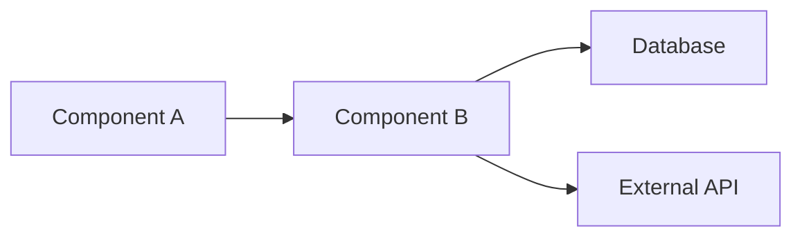
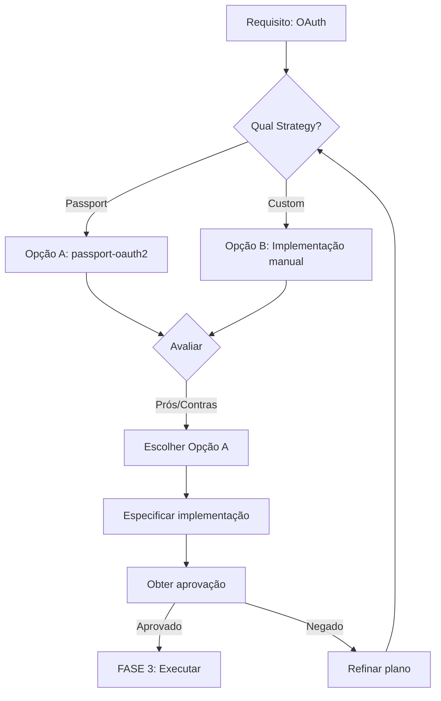
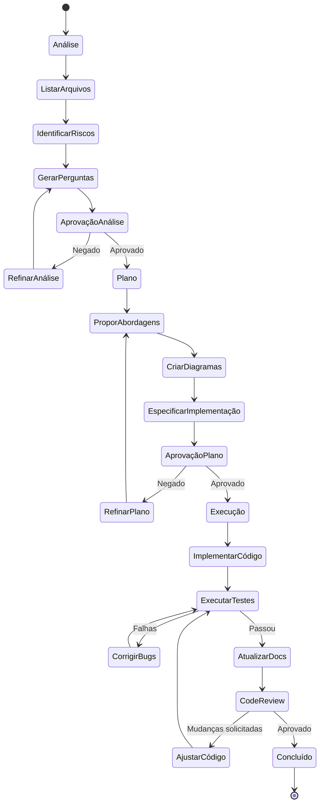
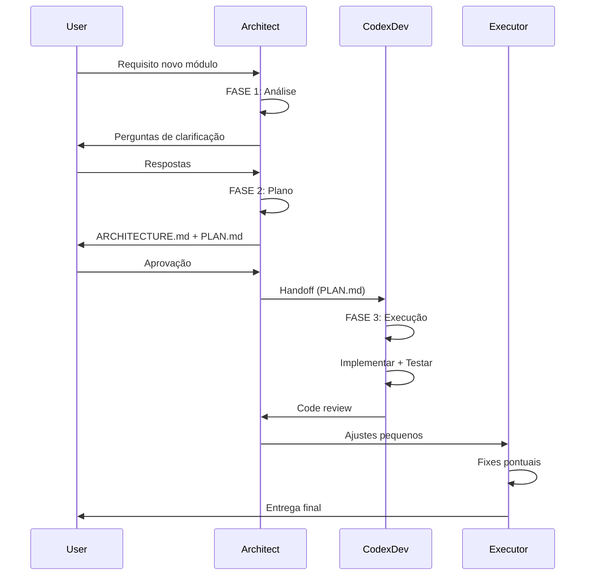

# Protocolo de Tasks (3 Fases) 📋

## Visão Geral
Este documento define o **Protocolo .TASK**, metodologia obrigatória para todas as tarefas de desenvolvimento no ecossistema OBM. O protocolo garante que toda implementação seja planejada, validada e executada com qualidade.

> [!info] Referência
> Baseado em [[00-Config/03-RULES-GLOBAL#15. Protocolo .TASK (3 Fases)]]

## Filosofia
> **"Pensar antes de executar. Planejar antes de codar."**

Toda tarefa deve passar por 3 fases sequenciais:
1. **ANÁLISE** - Entender o problema
2. **PLANO** - Projetar a solução
3. **EXECUÇÃO** - Implementar com qualidade

## Estrutura das 3 Fases

### FASE 1: ANÁLISE 🔍
**Duração:** 15-30% do tempo total
**Responsável:** Architect ou Codex Dev
**Proibido:** Gerar código nesta fase

#### Objetivos:
- Compreender requisitos completamente
- Mapear arquivos e módulos afetados
- Identificar dependências e riscos
- Levantar perguntas de clarificação

#### Entregáveis Obrigatórios:
```markdown
## TASK [ID] - ANÁLISE

### 1. Resumo da Solicitação
[Descrição clara do que foi pedido]

### 2. Arquivos Afetados
- `path/to/file1.ts` - [motivo]
- `path/to/file2.py` - [motivo]
- `docs/module.md` - [atualizar documentação]

### 3. Módulos Envolvidos
- `obm-auth` - [como será usado/modificado]
- `obm-chat` - [integração necessária]

### 4. Dependências Externas
- [ ] Biblioteca X (já instalada / precisa instalar)
- [ ] API Y (credenciais disponíveis?)
- [ ] Serviço Z (requer configuração)

### 5. Riscos Identificados
- **Risco 1:** Breaking change na API pública
  - **Mitigação:** Manter retrocompatibilidade
- **Risco 2:** Performance em queries grandes
  - **Mitigação:** Adicionar paginação

### 6. Perguntas de Clarificação
1. [Pergunta sobre escopo]
2. [Pergunta sobre tecnologia]
3. [Pergunta sobre integração]

### 7. Estimativa de Complexidade
- **Complexidade:** Baixa / Média / Alta
- **Esforço:** X horas/dias
- **Bloqueadores:** [se houver]
```

#### Checklist de Análise:
- [ ] Li toda documentação relevante
- [ ] Revisei código existente dos módulos afetados
- [ ] Identifiquei todos os arquivos a modificar
- [ ] Listei dependências e integrações
- [ ] Avaliei riscos e breaking changes
- [ ] Formulei perguntas para ambiguidades
- [ ] Estimei complexidade e esforço
- [ ] **NÃO gerei código ainda**

#### Exemplo - Análise de OAuth:
```markdown
## TASK 042 - ANÁLISE: Adicionar OAuth ao módulo Auth

### 1. Resumo
Adicionar autenticação via Google e GitHub usando OAuth 2.0 ao módulo `obm-auth`.

### 2. Arquivos Afetados
- `modules/auth/service/src/auth.controller.ts` - Adicionar rotas `/auth/google`, `/auth/github`
- `modules/auth/service/src/strategies/oauth.strategy.ts` - **NOVO** arquivo
- `modules/auth/service/src/auth.module.ts` - Registrar nova strategy
- `modules/auth/docs/02-Integracao.md` - Documentar OAuth
- `.env.example` - Adicionar OAUTH_CLIENT_ID, OAUTH_CLIENT_SECRET

### 3. Módulos Envolvidos
- `obm-auth` - Modificação direta

### 4. Dependências
- [x] `@nestjs/passport` - já instalado
- [x] `passport-google-oauth20` - já instalado
- [ ] `passport-github2` - **PRECISA INSTALAR**

### 5. Riscos
- **Breaking change:** Nova strategy pode conflitar com JWT existente
  - **Mitigação:** Testar coexistência de múltiplas strategies
- **Segurança:** Armazenar secrets OAuth
  - **Mitigação:** Usar environment variables, nunca hardcode

### 6. Perguntas
1. Manter autenticação JWT existente ou substituir?
2. Usuários OAuth precisam criar senha local também?
3. Merge de contas se email já existir?

### 7. Estimativa
- **Complexidade:** Média
- **Esforço:** 6-8 horas
- **Bloqueadores:** Precisa de OAuth credentials (Google + GitHub)
```

---

### FASE 2: PLANO 📐
**Duração:** 20-30% do tempo total
**Responsável:** Architect (design) ou Codex Dev (detalhamento)
**Proibido:** Implementar sem aprovação

#### Objetivos:
- Propor 2-3 abordagens alternativas
- Detalhar arquitetura da solução
- Criar diagramas e especificações
- Obter aprovação antes de executar

#### Entregáveis Obrigatórios:
```markdown
## TASK [ID] - PLANO

### 1. Abordagens Consideradas

#### Opção A: [Nome da Abordagem]
**Descrição:** [resumo]

**Prós:**
- [vantagem 1]
- [vantagem 2]

**Contras:**
- [desvantagem 1]
- [desvantagem 2]

**Esforço:** X horas
**Risco:** Baixo/Médio/Alto

#### Opção B: [Nome da Abordagem]
[mesmo formato]

### 2. Recomendação
**Escolha:** Opção A

**Justificativa:**
[Por que esta é a melhor abordagem]

### 3. Arquitetura Proposta



### 4. Estrutura de Arquivos

```
modules/
  auth/
    service/
      src/
        strategies/
          jwt.strategy.ts      # Existente
          oauth.strategy.ts    # NOVO
        auth.controller.ts     # Modificar
        auth.module.ts         # Modificar
```

### 5. Checklist de Implementação
- [ ] Criar `oauth.strategy.ts`
- [ ] Atualizar `auth.controller.ts` (adicionar rotas)
- [ ] Atualizar `auth.module.ts` (registrar strategy)
- [ ] Adicionar variáveis `.env.example`
- [ ] Criar testes unitários (`oauth.strategy.spec.ts`)
- [ ] Criar testes de integração (`auth-oauth.e2e.spec.ts`)
- [ ] Atualizar documentação (`02-Integracao.md`)
- [ ] Testar fluxo completo manualmente

### 6. Decisões Técnicas
| Decisão | Opção Escolhida | Justificativa |
|---------|-----------------|---------------|
| Biblioteca OAuth | passport-google-oauth20 | Integração nativa NestJS |
| Storage de tokens | Redis (TTL 1h) | Performance + expiração automática |
| Merge de contas | Por email | UX melhor, evita contas duplicadas |

### 7. Pontos de Atenção
- ⚠️ Testar coexistência JWT + OAuth
- ⚠️ Validar redirect_uri em produção
- ⚠️ Rate limiting nas rotas OAuth

### 8. Critérios de Aceitação
- [ ] Usuário consegue fazer login com Google
- [ ] Usuário consegue fazer login com GitHub
- [ ] JWT é emitido após OAuth bem-sucedido
- [ ] Contas são mergeadas por email se existir
- [ ] Testes passam (unit + e2e)
- [ ] Documentação atualizada
```

#### Checklist de Planejamento:
- [ ] Considerei múltiplas abordagens (mínimo 2)
- [ ] Avaliei prós/contras de cada opção
- [ ] Escolhi a melhor com justificativa clara
- [ ] Criei diagramas de arquitetura (Mermaid)
- [ ] Listei todos os arquivos a criar/modificar
- [ ] Defini checklist de implementação
- [ ] Documentei decisões técnicas
- [ ] Estabeleci critérios de aceitação
- [ ] Identifiquei pontos de atenção
- [ ] Solicitei aprovação antes de continuar

#### Exemplo de Fluxo de Decisão:


---

### FASE 3: EXECUÇÃO 💻
**Duração:** 40-60% do tempo total
**Responsável:** Codex Dev ou Executor
**Proibido:** Desviar do plano sem autorização

#### Objetivos:
- Implementar solução seguindo plano aprovado
- Gerar código incremental com commits atômicos
- Testar continuamente
- Documentar conforme necessário

#### Entregáveis Obrigatórios:
```markdown
## TASK [ID] - EXECUÇÃO

### 1. Progresso
- [x] Criar `oauth.strategy.ts`
- [x] Atualizar `auth.controller.ts`
- [x] Atualizar `auth.module.ts`
- [x] Adicionar `.env.example`
- [ ] Testes unitários (em andamento)
- [ ] Testes de integração
- [ ] Documentação

### 2. Commits
**Commit 1:** `feat(auth): add OAuth strategy base`
```diff
+ // modules/auth/service/src/strategies/oauth.strategy.ts
+ @Injectable()
+ export class OAuthStrategy extends PassportStrategy(Strategy, 'oauth') {
+   constructor(private configService: ConfigService) {
+     super({
+       clientID: configService.get('OAUTH_CLIENT_ID'),
+       clientSecret: configService.get('OAUTH_CLIENT_SECRET'),
+       callbackURL: configService.get('OAUTH_CALLBACK_URL'),
+     });
+   }
+ }
```

**Commit 2:** `feat(auth): add OAuth routes to controller`
[diff]

### 3. Testes Executados
- [x] Unit tests: 15/15 passing
- [ ] Integration tests: 3/5 passing (2 failures - investigating)
- [ ] E2E tests: pending

### 4. Problemas Encontrados
**Problema 1:** Conflito de redirect_uri em dev vs prod
**Solução:** Usar variável de ambiente `OAUTH_CALLBACK_URL`
**Status:** Resolvido

**Problema 2:** Tests falhando por falta de mock
**Solução:** Criar mock de ConfigService
**Status:** Em andamento

### 5. Documentação Atualizada
- [x] `02-Integracao.md` - Seção OAuth adicionada
- [x] `.env.example` - Variáveis OAuth documentadas
- [ ] `04-SDK-Usage.md` - Exemplos de uso (pending)

### 6. Checklist Final
- [x] Código implementado conforme PLANO
- [x] Linter passou (eslint)
- [ ] Testes passando (15/20)
- [ ] Build sem erros
- [x] Documentação atualizada
- [ ] Code review solicitado
```

#### Checklist de Execução:
- [ ] Segui o plano aprovado (FASE 2)
- [ ] Fiz commits atômicos e descritivos
- [ ] Rodei testes após cada mudança significativa
- [ ] Mantive código limpo (linter passing)
- [ ] Não desviei da arquitetura planejada
- [ ] Documentei código complexo
- [ ] Atualizei documentação externa
- [ ] Reportei problemas e soluções
- [ ] Executei build final
- [ ] Validei todos os critérios de aceitação

#### Estratégia de Commits:
```bash
# Commit 1: Setup básico
git commit -m "feat(auth): add OAuth strategy scaffold"

# Commit 2: Implementação core
git commit -m "feat(auth): implement Google OAuth flow"

# Commit 3: Testes
git commit -m "test(auth): add unit tests for OAuth strategy"

# Commit 4: Documentação
git commit -m "docs(auth): document OAuth integration"

# Commit 5: Ajustes finais
git commit -m "refactor(auth): improve error handling in OAuth"
```

#### Exemplo de Execução Incremental:
```markdown
### Progresso por Hora

**09:00 - Início**
- [x] Setup environment
- [x] Criar branch `feat/oauth-integration`

**10:00**
- [x] Implementar `oauth.strategy.ts`
- [x] Adicionar rotas em `auth.controller.ts`
- [x] Commit 1

**11:00**
- [x] Registrar strategy em `auth.module.ts`
- [x] Adicionar variáveis `.env.example`
- [x] Commit 2

**12:00**
- [x] Criar testes unitários
- [ ] Testes de integração (lunch break)

**14:00**
- [x] Testes de integração
- [x] Commit 3

**15:00**
- [x] Atualizar documentação
- [x] Code review
- [x] Commit 4

**16:00**
- [x] Ajustes do review
- [x] Merge para main
```

---

## Fluxograma Completo das 3 Fases



## Decisões e Handoffs

### Quando Pular Fases?
**Regra:** NUNCA pule fases sem autorização explícita.

**Exceções raríssimas:**
- Hotfix crítico de segurança (pode pular ANÁLISE, mas não PLANO)
- Typo ou ajuste de config trivial (Executor pode fazer direto)
- Emergência de produção (documentar decisões post-mortem)

### Handoffs Entre Agentes:



## Boas Práticas

### DO ✅
- Sempre começar com ANÁLISE, mesmo para tasks simples
- Documentar decisões e trade-offs
- Fazer commits atômicos e descritivos
- Testar incrementalmente
- Pedir clarificação quando ambíguo
- Reportar progresso frequentemente

### DON'T ❌
- Pular direto para código sem planejar
- Assumir requisitos não especificados
- Fazer commits gigantes (> 500 linhas)
- Testar apenas no final
- Ignorar falhas de testes
- Desviar do plano sem autorização

## Exemplos de Tasks por Tipo

### Task Simples (Bug Fix)
**Análise:** 15 min
**Plano:** 30 min
**Execução:** 1-2 horas

**Total:** ~3 horas

### Task Média (Nova Feature)
**Análise:** 1-2 horas
**Plano:** 2-4 horas
**Execução:** 1-2 dias

**Total:** ~3 dias

### Task Complexa (Novo Módulo)
**Análise:** 1 dia
**Plano:** 2-3 dias
**Execução:** 1-2 semanas

**Total:** ~3 semanas

## Validação e Conclusão

### Checklist Final (antes de marcar DONE):
- [ ] Todas as 3 fases foram cumpridas
- [ ] Código está no repositório
- [ ] Testes passando (unit + integration)
- [ ] Build sem erros
- [ ] Documentação atualizada
- [ ] Code review aprovado
- [ ] Deploy em staging validado
- [ ] Stakeholder aprovou resultado

### Retrospectiva (opcional, mas recomendado):
```markdown
## Retrospectiva - TASK [ID]

### O que funcionou bem:
- [ponto positivo]

### O que pode melhorar:
- [ponto de melhoria]

### Lições aprendidas:
- [aprendizado]

### Ações para próxima task:
- [ ] [ação]
```

---

> [!tip] Lembre-se
> O Protocolo .TASK existe para **prevenir retrabalho** e **garantir qualidade**. O tempo "gasto" em ANÁLISE e PLANO é **economizado** na EXECUÇÃO.

## Referências
- [[00-Config/03-RULES-GLOBAL]] - Rules 15, 16, 20, 21
- [[05-IA-e-Agents/01-Arquitetura-de-Agents]] - Papéis e handoffs
- [[02-Guia-para-Devs/04-Fluxo-de-Dev-do-Inicio-ao-Fim]] - Workflow completo
