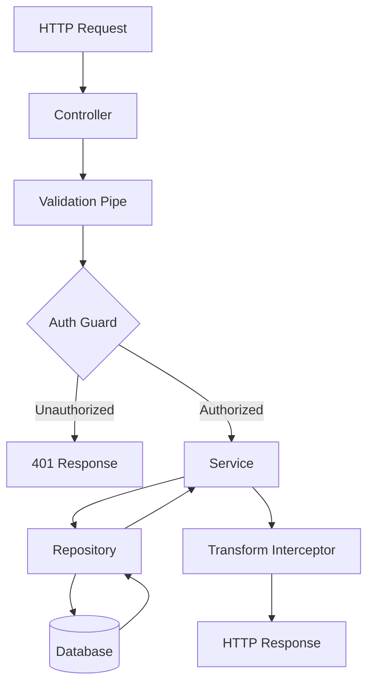

# Modelo de Modularização Martyn 🏗️

## Visão Geral
Este documento define o **Modelo Martyn de Modularização**, padrão arquitetural para todos os módulos OBM (Orbit Business Modules). Garante consistência, reutilização e manutenibilidade.

> [!info] Referência
> Baseado em [[00-Config/03-RULES-GLOBAL#18. Modularização (Modelo Martyn)]]

## Filosofia
> **"Um módulo = uma responsabilidade. Uma API = um contrato."**

Cada módulo OBM é:
- **Autônomo:** Roda independentemente
- **Reutilizável:** Serve múltiplas aplicações
- **Testável:** Isolado e mockável
- **Documentado:** API clara e exemplos de uso
- **Observável:** Logs, métricas, tracing

## Definição de Módulo OBM

### Características Obrigatórias:
1. **Responsabilidade única:** Faz uma coisa e faz bem
2. **API clara:** REST, GraphQL, ou SDK programático
3. **Contratos definidos:** Input/output tipados
4. **Documentação:** README + API Reference + SDK usage
5. **Testes:** Unitários + Integração (min 80% coverage)
6. **Observabilidade:** Logs estruturados, métricas, health checks
7. **Deploy independente:** Docker, K8s, ou standalone

### Exemplo de Módulo Completo:
```
modules/
  obm-auth/                   # Módulo de autenticação
    service/                  # Implementação backend
      src/
        controllers/
        services/
        strategies/
        entities/
        dto/
      tests/
      Dockerfile
      README.md
    sdk-js/                   # SDK JavaScript/TypeScript
      src/
      tests/
      package.json
    sdk-py/                   # SDK Python
      src/
      tests/
      setup.py
    docs/                     # Documentação do módulo
      01-Visao-Geral.md
      02-Integracao.md
      03-API-Reference.md
      04-SDK-Usage.md
      05-Deployment.md
```

## 8 Tipos de Módulos OBM

### 1. Módulo de Autenticação (Auth) 🔐
**Responsabilidade:** Gerenciar identidade, acesso e permissões.

**Funcionalidades Core:**
- Registro de usuários
- Login (JWT, OAuth, SSO)
- Gestão de sessões
- RBAC (Role-Based Access Control)
- 2FA/MFA
- Password reset

**Stack Oficial:**
- Backend: NestJS + Passport + JWT
- Database: Postgres (usuários) + Redis (sessões)
- SDKs: JS/TS, Python

**APIs Principais:**
```typescript
POST   /auth/register       // Criar conta
POST   /auth/login          // Autenticar
POST   /auth/logout         // Encerrar sessão
GET    /auth/me             // Usuário atual
POST   /auth/refresh        // Renovar token
POST   /auth/forgot-password
POST   /auth/reset-password
GET    /auth/verify/:token  // Verificar email
```

**Exemplo de Uso (SDK JS):**
```typescript
import { AuthClient } from '@obm/auth-sdk-js';

const auth = new AuthClient({ baseURL: 'https://auth.example.com' });

// Registrar usuário
const user = await auth.register({
  email: 'user@example.com',
  password: 'securePassword123',
  name: 'John Doe'
});

// Login
const { token, refreshToken } = await auth.login({
  email: 'user@example.com',
  password: 'securePassword123'
});

// Usar token em requests
auth.setToken(token);
const profile = await auth.getProfile();
```

**Contratos (DTOs):**
```typescript
// RegisterDTO
interface RegisterDTO {
  email: string;
  password: string;
  name: string;
}

// LoginDTO
interface LoginDTO {
  email: string;
  password: string;
}

// AuthResponse
interface AuthResponse {
  token: string;
  refreshToken: string;
  user: UserDTO;
  expiresIn: number;
}
```

---

### 2. Módulo de Billing/Pagamentos 💳
**Responsabilidade:** Gerenciar pagamentos, assinaturas e faturamento.

**Funcionalidades Core:**
- Integração Stripe/Mercado Pago
- Planos e pricing
- Assinaturas (recurring billing)
- Webhooks de pagamento
- Invoices e receipts
- Cancelamento e reembolsos

**Stack Oficial:**
- Backend: NestJS + Stripe SDK
- Database: Postgres (transações, plans)
- Queue: BullMQ (processar webhooks)
- SDKs: JS/TS, Python

**APIs Principais:**
```typescript
GET    /billing/plans            // Listar planos
POST   /billing/checkout         // Criar sessão de checkout
POST   /billing/webhook          // Receber eventos Stripe
GET    /billing/subscriptions    // Assinaturas do usuário
DELETE /billing/subscription/:id // Cancelar assinatura
GET    /billing/invoices         // Faturas do usuário
```

**Exemplo de Uso (SDK Python):**
```python
from obm_billing import BillingClient

billing = BillingClient(api_key="sk_test_xxx")

# Criar checkout
checkout = billing.create_checkout(
    user_id="user_123",
    plan_id="plan_pro_monthly",
    success_url="https://app.com/success",
    cancel_url="https://app.com/cancel"
)

# Verificar status de assinatura
subscription = billing.get_subscription(user_id="user_123")
if subscription.is_active:
    print("Usuário tem plano ativo")
```

**Contratos (DTOs):**
```typescript
// CheckoutDTO
interface CheckoutDTO {
  userId: string;
  planId: string;
  successUrl: string;
  cancelUrl: string;
}

// SubscriptionDTO
interface SubscriptionDTO {
  id: string;
  userId: string;
  planId: string;
  status: 'active' | 'canceled' | 'past_due';
  currentPeriodEnd: Date;
  cancelAtPeriodEnd: boolean;
}
```

---

### 3. Módulo de Chat/Mensagens 💬
**Responsabilidade:** Comunicação em tempo real e histórico de mensagens.

**Funcionalidades Core:**
- WebSocket bidirecionais
- Salas/canais de chat
- Mensagens 1:1 e grupos
- Histórico e busca
- Anexos (imagens, arquivos)
- Notificações de mensagens novas

**Stack Oficial:**
- Backend: NestJS + Socket.IO
- Database: Postgres (mensagens) + Redis (presença online)
- Storage: S3 (anexos)
- SDKs: JS/TS, Python

**APIs Principais:**
```typescript
// WebSocket
WS     /ws/chat                 // Conectar ao chat
EMIT   chat:join                // Entrar em sala
EMIT   chat:message             // Enviar mensagem
ON     chat:message             // Receber mensagem
ON     chat:typing              // Indicação de digitação

// REST (histórico e gestão)
GET    /messages/:roomId        // Histórico de sala
POST   /messages/:roomId        // Enviar mensagem (REST)
GET    /rooms                   // Salas do usuário
POST   /rooms                   // Criar sala
POST   /messages/upload         // Upload de anexo
```

**Exemplo de Uso (SDK JS):**
```typescript
import { ChatClient } from '@obm/chat-sdk-js';

const chat = new ChatClient({ 
  baseURL: 'https://chat.example.com',
  token: 'jwt_token_here'
});

// Conectar ao WebSocket
await chat.connect();

// Entrar em sala
chat.joinRoom('room_123');

// Enviar mensagem
chat.sendMessage('room_123', {
  text: 'Hello, world!',
  type: 'text'
});

// Escutar mensagens
chat.on('message', (message) => {
  console.log(`[${message.user.name}]: ${message.text}`);
});

// Indicar digitação
chat.typing('room_123');
```

**Contratos (DTOs):**
```typescript
// MessageDTO
interface MessageDTO {
  id: string;
  roomId: string;
  userId: string;
  text: string;
  type: 'text' | 'image' | 'file';
  attachmentUrl?: string;
  createdAt: Date;
}

// RoomDTO
interface RoomDTO {
  id: string;
  name: string;
  type: '1:1' | 'group' | 'channel';
  participants: string[]; // user IDs
  createdAt: Date;
}
```

---

### 4. Módulo Orquestrador (Core) 🎯
**Responsabilidade:** Coordenar módulos, roteamento, gateway.

**Funcionalidades Core:**
- API Gateway (BFF - Backend for Frontend)
- Roteamento inteligente
- Agregação de respostas (múltiplos módulos)
- Cache global
- Rate limiting
- Logging centralizado

**Stack Oficial:**
- Backend: NestJS + Apollo Gateway (GraphQL) ou Kong
- Cache: Redis
- Queue: BullMQ (orquestração assíncrona)
- SDKs: Não aplicável (é o hub central)

**APIs Principais:**
```typescript
// Roteamento transparente
GET    /api/auth/*           // Proxy para obm-auth
GET    /api/billing/*        // Proxy para obm-billing
GET    /api/chat/*           // Proxy para obm-chat

// Agregação
GET    /api/dashboard        // Combina auth + billing + analytics

// Health checks
GET    /health               // Status do orquestrador
GET    /health/modules       // Status de todos os módulos
```

**Exemplo de Configuração:**
```yaml
# orchestrator-config.yml
modules:
  auth:
    url: http://obm-auth:3001
    health: /health
    timeout: 5000
  
  billing:
    url: http://obm-billing:3002
    health: /health
    timeout: 10000
  
  chat:
    url: http://obm-chat:3003
    health: /health
    timeout: 3000

routes:
  - path: /api/auth/*
    target: auth
    cache: false
  
  - path: /api/billing/*
    target: billing
    cache: true
    cacheTTL: 60
```

**Padrão de Agregação:**
```typescript
// Exemplo: Dashboard que combina 3 módulos
@Get('/api/dashboard')
async getDashboard(@User() user: UserDTO) {
  const [profile, subscription, messages] = await Promise.all([
    this.authClient.getProfile(user.id),
    this.billingClient.getSubscription(user.id),
    this.chatClient.getUnreadCount(user.id)
  ]);

  return {
    user: profile,
    subscription,
    unreadMessages: messages.count
  };
}
```

---

### 5. Módulo de Notificações 📬
**Responsabilidade:** Enviar notificações multicanal.

**Funcionalidades Core:**
- Email (transacionais, marketing)
- SMS (Twilio, etc.)
- Push notifications (FCM, APNs)
- In-app notifications
- Templates e personalização
- Fila com retry logic

**Stack Oficial:**
- Backend: NestJS + BullMQ
- Email: SendGrid ou AWS SES
- SMS: Twilio
- Push: Firebase Cloud Messaging
- Database: Postgres (histórico, templates)
- Queue: BullMQ (envio assíncrono)

**APIs Principais:**
```typescript
POST   /notify/send          // Enviar notificação
GET    /notify/templates     // Listar templates
POST   /notify/templates     // Criar template
GET    /notify/history       // Histórico de envios
GET    /notify/preferences   // Preferências do usuário
PUT    /notify/preferences   // Atualizar preferências
```

**Exemplo de Uso (SDK JS):**
```typescript
import { NotifyClient } from '@obm/notifications-sdk-js';

const notify = new NotifyClient({ apiKey: 'your_api_key' });

// Enviar email
await notify.send({
  to: 'user@example.com',
  channel: 'email',
  template: 'welcome-email',
  data: {
    name: 'John Doe',
    verificationLink: 'https://app.com/verify/abc123'
  }
});

// Enviar push notification
await notify.send({
  to: 'user_device_token',
  channel: 'push',
  title: 'New message',
  body: 'You have a new message from Alice',
  data: {
    roomId: 'room_123'
  }
});

// Enviar SMS
await notify.send({
  to: '+5511999999999',
  channel: 'sms',
  template: 'verification-code',
  data: {
    code: '123456'
  }
});
```

**Contratos (DTOs):**
```typescript
// NotificationDTO
interface NotificationDTO {
  to: string;
  channel: 'email' | 'sms' | 'push' | 'in-app';
  template?: string;
  subject?: string;
  body?: string;
  data?: Record<string, any>;
  priority?: 'low' | 'normal' | 'high';
  scheduledFor?: Date;
}

// NotificationStatus
interface NotificationStatus {
  id: string;
  status: 'queued' | 'sent' | 'failed' | 'delivered';
  sentAt?: Date;
  error?: string;
}
```

---

### 6. Módulo de Storage/Uploads 📦
**Responsabilidade:** Gerenciar arquivos e uploads.

**Funcionalidades Core:**
- Upload multipart
- Storage (S3, local, CDN)
- Download e streaming
- Compressão e otimização (imagens)
- Controle de acesso (signed URLs)
- Gestão de quotas

**Stack Oficial:**
- Backend: NestJS + Multer
- Storage: AWS S3 ou MinIO
- CDN: CloudFront ou CloudFlare
- Database: Postgres (metadata)

**APIs Principais:**
```typescript
POST   /storage/upload           // Upload de arquivo
GET    /storage/download/:fileId // Download de arquivo
GET    /storage/files            // Listar arquivos do usuário
DELETE /storage/files/:fileId    // Deletar arquivo
POST   /storage/signed-url       // Gerar URL assinada
GET    /storage/quota            // Quota do usuário
```

**Exemplo de Uso (SDK Python):**
```python
from obm_storage import StorageClient

storage = StorageClient(api_key="your_api_key")

# Upload de arquivo
with open("image.jpg", "rb") as f:
    file = storage.upload(
        file=f,
        filename="image.jpg",
        visibility="public"
    )
    print(f"File uploaded: {file.url}")

# Gerar URL assinada (privada, expira em 1h)
signed_url = storage.generate_signed_url(
    file_id=file.id,
    expires_in=3600
)

# Deletar arquivo
storage.delete(file_id=file.id)
```

**Contratos (DTOs):**
```typescript
// FileDTO
interface FileDTO {
  id: string;
  filename: string;
  mimeType: string;
  size: number; // bytes
  url: string;
  visibility: 'public' | 'private';
  userId: string;
  uploadedAt: Date;
}

// UploadDTO
interface UploadDTO {
  file: Buffer | Stream;
  filename: string;
  visibility: 'public' | 'private';
  folder?: string;
}
```

---

### 7. Módulo de Analytics 📊
**Responsabilidade:** Coletar e analisar eventos e métricas.

**Funcionalidades Core:**
- Tracking de eventos
- Métricas de negócio
- Dashboards
- Segmentação de usuários
- Funnels e cohorts
- Integração com ferramentas (Mixpanel, Amplitude)

**Stack Oficial:**
- Backend: NestJS + ClickHouse (analytics DB)
- Queue: BullMQ (processamento assíncrono)
- Visualization: Grafana ou Metabase
- SDKs: JS/TS, Python

**APIs Principais:**
```typescript
POST   /analytics/track       // Enviar evento
POST   /analytics/identify    // Identificar usuário
GET    /analytics/events      // Listar eventos
GET    /analytics/metrics     // Métricas agregadas
GET    /analytics/funnel      // Análise de funil
GET    /analytics/cohorts     // Análise de cohorts
```

**Exemplo de Uso (SDK JS):**
```typescript
import { AnalyticsClient } from '@obm/analytics-sdk-js';

const analytics = new AnalyticsClient({ writeKey: 'your_write_key' });

// Identificar usuário
analytics.identify('user_123', {
  name: 'John Doe',
  email: 'john@example.com',
  plan: 'pro'
});

// Track event
analytics.track('Purchase Completed', {
  productId: 'prod_123',
  amount: 49.99,
  currency: 'USD'
});

// Page view
analytics.page('Home', {
  referrer: 'https://google.com'
});
```

**Contratos (DTOs):**
```typescript
// EventDTO
interface EventDTO {
  userId: string;
  event: string;
  properties: Record<string, any>;
  timestamp: Date;
}

// MetricsDTO
interface MetricsDTO {
  metric: string;
  value: number;
  dimensions: Record<string, string>;
  timestamp: Date;
}
```

---

### 8. Módulo de Jobs/Workers ⚙️
**Responsabilidade:** Executar tarefas em background e agendadas.

**Funcionalidades Core:**
- Filas de jobs (BullMQ)
- Agendamento (cron)
- Retry logic
- Prioridades
- Monitoramento de jobs
- Dead letter queue

**Stack Oficial:**
- Backend: NestJS + BullMQ
- Queue: Redis
- Scheduler: BullMQ repeatable jobs
- Dashboard: Bull Board

**APIs Principais:**
```typescript
POST   /jobs/enqueue         // Adicionar job à fila
GET    /jobs/:jobId          // Status do job
DELETE /jobs/:jobId          // Cancelar job
GET    /jobs/queues          // Listar filas
GET    /jobs/failed          // Jobs falhados
POST   /jobs/retry/:jobId    // Retentar job
```

**Exemplo de Definição de Job:**
```typescript
// email-job.processor.ts
import { Process, Processor } from '@nestjs/bull';
import { Job } from 'bull';

@Processor('email')
export class EmailJobProcessor {
  @Process('send-welcome')
  async sendWelcomeEmail(job: Job<{ email: string; name: string }>) {
    const { email, name } = job.data;
    
    await this.emailService.send({
      to: email,
      template: 'welcome',
      data: { name }
    });
    
    return { sent: true, to: email };
  }
}
```

**Exemplo de Uso (SDK JS):**
```typescript
import { JobsClient } from '@obm/jobs-sdk-js';

const jobs = new JobsClient({ apiKey: 'your_api_key' });

// Adicionar job
const job = await jobs.enqueue('email', 'send-welcome', {
  email: 'user@example.com',
  name: 'John Doe'
}, {
  delay: 5000, // Executar após 5s
  attempts: 3,  // Tentar até 3x
  priority: 10
});

// Verificar status
const status = await jobs.getStatus(job.id);
console.log(status); // { status: 'completed', result: { sent: true } }

// Agendar job recorrente (todo dia às 9h)
await jobs.schedule('email', 'daily-digest', {}, {
  cron: '0 9 * * *'
});
```

---

## Checklist de Módulo Completo

### 📁 Estrutura de Arquivos
- [ ] `/service/` - Backend implementation
- [ ] `/sdk-js/` - JavaScript/TypeScript SDK
- [ ] `/sdk-py/` - Python SDK (opcional)
- [ ] `/docs/` - Documentação completa

### 📄 Documentação Obrigatória
- [ ] `README.md` - Overview e quick start
- [ ] `CHANGELOG.md` - Histórico de versões
- [ ] `docs/01-Visao-Geral.md` - Visão conceitual
- [ ] `docs/02-Integracao.md` - Como integrar
- [ ] `docs/03-API-Reference.md` - Documentação de endpoints
- [ ] `docs/04-SDK-Usage.md` - Exemplos de SDKs
- [ ] `docs/05-Deployment.md` - Como deployar

### 🔌 APIs e Contratos
- [ ] Endpoints REST documentados (OpenAPI/Swagger)
- [ ] DTOs tipados (TypeScript interfaces, Pydantic models)
- [ ] Códigos de erro padronizados
- [ ] Health check (`/health`)
- [ ] Readiness check (`/ready`)

### 🧪 Testes
- [ ] Testes unitários (80%+ coverage)
- [ ] Testes de integração
- [ ] Testes E2E (fluxos principais)
- [ ] Mocks de dependências externas

### 🔒 Segurança
- [ ] Autenticação (JWT, API key)
- [ ] Autorização (RBAC se aplicável)
- [ ] Validação de inputs (DTOs, schemas)
- [ ] Rate limiting
- [ ] HTTPS/TLS em produção
- [ ] Secrets via environment variables

### 📊 Observabilidade
- [ ] Logs estruturados (JSON)
- [ ] Métricas (Prometheus)
- [ ] Tracing distribuído (Jaeger)
- [ ] Health checks
- [ ] Alertas configurados

### 🐳 Deploy
- [ ] `Dockerfile` otimizado
- [ ] `docker-compose.yml` para dev local
- [ ] Helm chart (K8s) ou config de deploy
- [ ] CI/CD pipeline configurado
- [ ] `.env.example` com todas as variáveis

---

## Padrões de Integração

### Integração REST (Módulos Diferentes)
```typescript
// App consumindo obm-auth
import axios from 'axios';

const authAPI = axios.create({
  baseURL: process.env.AUTH_API_URL,
  timeout: 5000
});

const user = await authAPI.post('/auth/login', {
  email: 'user@example.com',
  password: 'password123'
});
```

### Integração via SDK (Recomendado)
```typescript
// App consumindo obm-auth via SDK
import { AuthClient } from '@obm/auth-sdk-js';

const auth = new AuthClient({
  baseURL: process.env.AUTH_API_URL
});

const user = await auth.login({
  email: 'user@example.com',
  password: 'password123'
});
```

### Integração via Orquestrador
```typescript
// App só fala com orquestrador
import { OBMClient } from '@obm/client-js';

const obm = new OBMClient({
  baseURL: process.env.OBM_API_URL,
  token: 'jwt_token'
});

// Orquestrador roteia automaticamente
const user = await obm.auth.login({ ... });
const subscription = await obm.billing.getSubscription();
```

---

## Arquitetura Interna de um Módulo

### Camadas (NestJS Example):
```
modules/obm-auth/service/src/
  main.ts                      # Bootstrap
  app.module.ts                # Módulo raiz
  
  auth/
    auth.module.ts             # Módulo Auth
    auth.controller.ts         # Rotas HTTP
    auth.service.ts            # Lógica de negócio
    auth.repository.ts         # Acesso a dados
    
    dto/
      register.dto.ts
      login.dto.ts
    
    entities/
      user.entity.ts
    
    strategies/
      jwt.strategy.ts
      oauth.strategy.ts
  
  common/
    filters/                   # Exception filters
    guards/                    # Auth guards
    interceptors/              # Logging, transform
    pipes/                     # Validation
  
  config/
    app.config.ts
    database.config.ts
```

### Diagrama de Fluxo:


---

## Versionamento e Compatibilidade

### Versionamento Semântico (SemVer):
- **MAJOR:** Breaking changes (v1.0.0 → v2.0.0)
- **MINOR:** New features (v1.0.0 → v1.1.0)
- **PATCH:** Bug fixes (v1.0.0 → v1.0.1)

### Versionamento de API:
```typescript
// Opção 1: URL versioning
GET /v1/auth/login
GET /v2/auth/login

// Opção 2: Header versioning
GET /auth/login
Header: Accept-Version: v1
```

### Compatibilidade Retroativa:
- Manter v1 rodando enquanto v2 é adotada
- Deprecation warnings com timeline
- Migration guide na documentação

---

## Exemplo Completo: Módulo de Auth

### Estrutura:
```
modules/obm-auth/
  service/
    src/
      auth/
        auth.controller.ts
        auth.service.ts
        auth.module.ts
        strategies/
          jwt.strategy.ts
      users/
        users.service.ts
        user.entity.ts
      main.ts
    tests/
      auth.e2e-spec.ts
    Dockerfile
    README.md
  
  sdk-js/
    src/
      index.ts
      AuthClient.ts
      types.ts
    package.json
  
  sdk-py/
    src/
      obm_auth/
        __init__.py
        client.py
    setup.py
  
  docs/
    01-Visao-Geral.md
    02-Integracao.md
    03-API-Reference.md
    04-SDK-Usage.md
```

### auth.controller.ts:
```typescript
import { Controller, Post, Body, Get, UseGuards } from '@nestjs/common';
import { AuthService } from './auth.service';
import { RegisterDTO, LoginDTO } from './dto';
import { JwtAuthGuard } from './guards/jwt-auth.guard';
import { User } from './decorators/user.decorator';

@Controller('auth')
export class AuthController {
  constructor(private authService: AuthService) {}

  @Post('register')
  async register(@Body() dto: RegisterDTO) {
    return this.authService.register(dto);
  }

  @Post('login')
  async login(@Body() dto: LoginDTO) {
    return this.authService.login(dto);
  }

  @Get('me')
  @UseGuards(JwtAuthGuard)
  async getProfile(@User() user: UserDTO) {
    return user;
  }
}
```

### SDK (AuthClient.ts):
```typescript
import axios, { AxiosInstance } from 'axios';

export class AuthClient {
  private client: AxiosInstance;
  private token?: string;

  constructor(config: { baseURL: string }) {
    this.client = axios.create({
      baseURL: config.baseURL,
      timeout: 5000
    });
  }

  setToken(token: string) {
    this.token = token;
    this.client.defaults.headers.common['Authorization'] = `Bearer ${token}`;
  }

  async register(dto: RegisterDTO): Promise<AuthResponse> {
    const { data } = await this.client.post('/auth/register', dto);
    return data;
  }

  async login(dto: LoginDTO): Promise<AuthResponse> {
    const { data } = await this.client.post('/auth/login', dto);
    this.setToken(data.token);
    return data;
  }

  async getProfile(): Promise<UserDTO> {
    const { data } = await this.client.get('/auth/me');
    return data;
  }
}
```

---

## Boas Práticas

### DO ✅
- Um módulo = uma responsabilidade
- APIs RESTful e bem documentadas
- SDKs para facilitar integração
- Testes com 80%+ coverage
- Logs estruturados (JSON)
- Health checks em todos os módulos
- Deploy independente via Docker

### DON'T ❌
- Módulo monolítico (faz tudo)
- Dependências tight coupling com outros módulos
- Código sem testes
- APIs sem documentação
- Secrets hardcoded
- Deploy manual sem CI/CD

---

## Referências
- [[00-Config/03-RULES-GLOBAL#18]] - Regra de Modularização
- [[01-Visao-Geral/03-Modulos-OBM-Visao-Geral]] - Overview de módulos
- [[04-Stacks-e-Infra/01-Stack-Oficial-Martyn]] - Stack oficial
- [[02-Guia-para-Devs/04-Fluxo-de-Dev-do-Inicio-ao-Fim]] - Workflow de desenvolvimento
