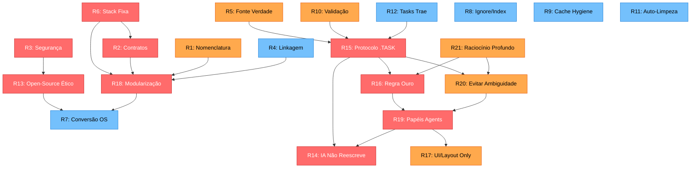
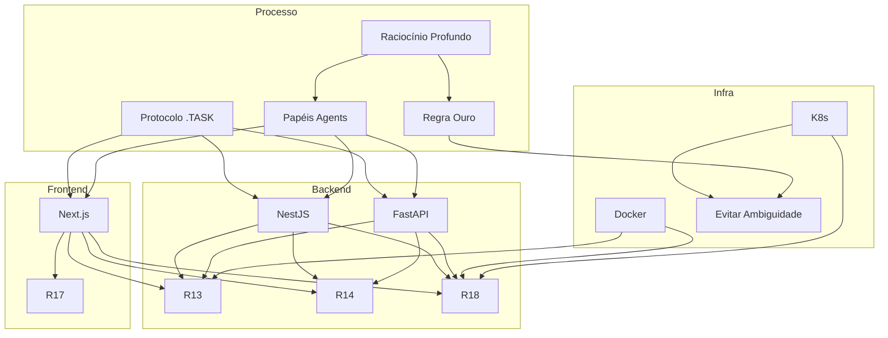

# ARCHITECTURE - Consolidação Expandida 🏛️

> **Versão:** 2.0 - Fase 1 Expandida
> **Data:** 2025-11-16
> **Status:** Planejamento Completo

## Sumário Executivo

Este documento consolida a **arquitetura completa do ecossistema OBM (Orbit Business Modules)**, incluindo as **21 regras globais** (12 originais + 9 novas críticas) e sua interrelação com a stack técnica, módulos, agents e protocolos de desenvolvimento.

### Objetivos:
1. ✅ Documentar as 9 novas regras críticas (13-21)
2. ✅ Mapear relações e dependências entre todas as 21 regras
3. ✅ Definir cascata de implementação (ordem de prioridade)
4. ✅ Criar matriz de compliance por stack
5. ✅ Identificar gaps e ações necessárias

---

## 1. Visão Geral das 21 Regras

### Regras Originais (1-12)

| ID | Regra | Categoria | Prioridade |
|----|-------|-----------|------------|
| 1 | Nomenclatura e Placeholders | Padronização | Alta |
| 2 | Contratos e Integração | Arquitetura | Crítica |
| 3 | Segurança | Segurança | Crítica |
| 4 | Linkagem e Navegação | Documentação | Média |
| 5 | Fonte da Verdade | Governança | Alta |
| 6 | Stack Fixa | Tecnologia | Crítica |
| 7 | Conversão Open-Source | Integração | Média |
| 8 | Ignore/Index e Docx | Operacional | Baixa |
| 9 | Cache Hygiene | Operacional | Baixa |
| 10 | Validação e Confiabilidade | Qualidade | Alta |
| 11 | Prompts de Auto-Limpeza | Tooling | Média |
| 12 | Regras para Tasks (Trae) | Processo | Alta |

### Novas Regras Críticas (13-21)

| ID | Regra | Categoria | Prioridade |
|----|-------|-----------|------------|
| 13 | Reaproveitamento Open-Source Ético | Legal/Ética | Crítica |
| 14 | IA: Não Reescreve Tudo | IA/Qualidade | Crítica |
| 15 | Protocolo .TASK (3 Fases) | Processo | Crítica |
| 16 | Regra de Ouro Martyn | IA/Comunicação | Crítica |
| 17 | Alterações UI/Layout Only | IA/Escopo | Alta |
| 18 | Modularização (Modelo Martyn) | Arquitetura | Crítica |
| 19 | Papéis de Agents (3 Arquétipos) | IA/Organização | Crítica |
| 20 | Evitar Ambiguidade | IA/Comunicação | Alta |
| 21 | Raciocínio Profundo | IA/Qualidade | Alta |

---

## 2. Estratégia de Incorporação das 9 Novas Regras

### 2.1 Impacto por Área

#### Documentação
**Regras Afetadas:** 13, 14, 15, 16, 17, 18, 19, 20, 21

**Ações:**
- [x] Adicionar as 9 regras ao `03-RULES-GLOBAL.md` ✅
- [x] Criar `04-Protocolo-Tasks.md` (Regra 15) ✅
- [x] Criar `05-Modelo-Modularizacao.md` (Regra 18) ✅
- [ ] Atualizar `05-IA-e-Agents/01-Arquitetura-de-Agents.md` (Regra 19) - parcial ✅
- [ ] Criar exemplos práticos para cada regra
- [ ] Criar checklists de validação

#### Desenvolvimento de Módulos
**Regras Afetadas:** 13, 14, 17, 18

**Ações:**
- [ ] Aplicar Regra 18 a todos os módulos novos
- [ ] Criar templates de módulo seguindo modelo Martyn
- [ ] Validar licenças de dependências (Regra 13)
- [ ] Definir marcadores LAYOUT_START/END (Regra 17)

#### Processo de IA/Agents
**Regras Afetadas:** 14, 15, 16, 19, 20, 21

**Ações:**
- [ ] Treinar agents com protocolo de 3 fases (Regra 15)
- [ ] Implementar checklist "Pensar Antes" (Regra 21)
- [ ] Criar prompts com clarificação obrigatória (Regra 16, 20)
- [ ] Definir handoffs entre Architect/Codex/Executor (Regra 19)

#### Qualidade e Compliance
**Regras Afetadas:** 13, 14, 21

**Ações:**
- [ ] Auditoria de licenças open-source
- [ ] Code review focado em alterações mínimas
- [ ] Métricas de reasoning profundo

---

## 3. Diagrama de Relacionamento das 21 Regras

### 3.1 Grafo de Dependências



### 3.2 Matriz de Interação

| Regra | Habilita | Depende De | Conflita Com |
|-------|----------|------------|--------------|
| R13 | R7 | R3, R6 | - |
| R14 | - | R19, R21 | - |
| R15 | R16, R20, R14 | R5, R10, R12 | - |
| R16 | R19, R20 | R21 | - |
| R17 | - | R19 | - |
| R18 | R7 | R1, R2, R6 | - |
| R19 | R14, R17 | R16, R20 | - |
| R20 | R19 | R16, R21 | - |
| R21 | R16, R20 | - | - |

---

## 4. Impacto de Cada Nova Regra

### Regra 13: Reaproveitamento Open-Source Ético

**Impacto na Documentação:**
- ✅ Seção adicionada em `03-RULES-GLOBAL.md`
- 📝 Criar `08-Referencias-Externas/06-Licencas-e-Compliance.md`
- 📝 Adicionar checklist em templates de módulo

**Impacto no Código:**
- Auditoria de dependências (npm, pip, go mod)
- Arquivo `CREDITS.md` obrigatório em cada módulo
- CI/CD check de licenças incompatíveis

**Impacto nos Módulos:**
- Todos os módulos devem documentar dependências
- Licenças devem ser compatíveis com MIT/Apache 2.0
- Atribuições claras para código adaptado

**Ferramentas Necessárias:**
- `license-checker` (npm)
- `pip-licenses` (Python)
- `go-licenses` (Go)

---

### Regra 14: IA: Não Reescreve Tudo

**Impacto na Documentação:**
- ✅ Seção adicionada em `03-RULES-GLOBAL.md`
- 📝 Criar exemplos em `05-IA-e-Agents/06-Boas-Praticas-IA.md`
- 📝 Checklist de validação em code reviews

**Impacto no Processo:**
- Agents devem justificar mudanças grandes (> 200 linhas)
- Diffs devem ser mínimos e cirúrgicos
- Aprovação obrigatória para refactors completos

**Impacto nos Agents:**
- Architect: validar que Codex não reescreve desnecessariamente
- Codex Dev: fazer apenas mudanças especificadas
- Executor: alterações mínimas (< 50 linhas típico)

**Métricas de Validação:**
- Linhas modificadas por commit
- Ratio de adição/deleção
- Breaking changes por PR

---

### Regra 15: Protocolo .TASK (3 Fases)

**Impacto na Documentação:**
- ✅ Documento completo: `04-Protocolo-Tasks.md`
- 📝 Integrar em `02-Guia-para-Devs/04-Fluxo-de-Dev.md`
- 📝 Templates para cada fase

**Impacto no Processo:**
- **OBRIGATÓRIO:** Toda task passa por 3 fases
- FASE 1 (Análise): Entender antes de codar
- FASE 2 (Plano): Projetar com alternativas
- FASE 3 (Execução): Implementar incremental

**Impacto nos Agents:**
- Architect: responsável por Fase 1 e 2
- Codex Dev: responsável por Fase 3
- Executor: pode pular fases em bugs triviais

**Ferramentas Necessárias:**
- Templates markdown para cada fase
- Checklist de validação por fase
- Tracking de progresso (Kanban)

---

### Regra 16: Regra de Ouro Martyn

**Impacto na Documentação:**
- ✅ Seção adicionada em `03-RULES-GLOBAL.md`
- 📝 Criar `05-IA-e-Agents/07-Como-Evitar-Assumir.md`
- 📝 Templates de perguntas de clarificação

**Impacto no Processo:**
- **SEMPRE** perguntar quando ambíguo
- Listar opções antes de decidir
- Documentar decisões tomadas

**Impacto nos Agents:**
- Architect: fazer 10 perguntas padrão sempre
- Codex Dev: clarificar antes de implementar
- Executor: parar se não tem certeza 100%

**Exemplos de Situações:**
- Requisito vago
- Múltiplas implementações possíveis
- Conflito entre regras
- Escopo não definido

---

### Regra 17: Alterações UI/Layout Only

**Impacto na Documentação:**
- ✅ Seção adicionada em `03-RULES-GLOBAL.md`
- 📝 Criar marcadores LAYOUT_START/END no código
- 📝 Exemplos em módulos frontend

**Impacto no Código:**
- Separar claramente layout de lógica
- Comentários `// LAYOUT_START` e `// LAYOUT_END`
- Componentes UI puros sem side effects

**Impacto nos Agents:**
- Executor: pode alterar só UI sem validação extra
- Codex Dev: deve separar commits de UI vs lógica
- Architect: não precisa revisar mudanças de layout puro

**Estrutura Recomendada:**
```jsx
// modules/chat/frontend/src/components/ChatMessage.tsx
export function ChatMessage({ message, onReply }: Props) {
  // LÓGICA
  const [isHovered, setIsHovered] = useState(false);
  
  // LAYOUT_START
  return (
    <div className="flex gap-4 p-4 hover:bg-gray-50">
      <Avatar src={message.user.avatar} />
      <div className="flex-1">
        <p className="font-bold">{message.user.name}</p>
        <p>{message.text}</p>
      </div>
    </div>
  );
  // LAYOUT_END
}
```

---

### Regra 18: Modularização (Modelo Martyn)

**Impacto na Documentação:**
- ✅ Documento completo: `05-Modelo-Modularizacao.md`
- 📝 Templates de módulo completo
- 📝 Checklist de módulo em `07-Receitas-e-Playbooks/`

**Impacto na Arquitetura:**
- **CRÍTICO:** Define estrutura de todos os módulos
- 8 tipos de módulos padronizados
- Estrutura de arquivos obrigatória
- Checklist de 20+ itens por módulo

**Impacto nos Módulos:**
- Todos devem seguir estrutura padrão
- Service + SDK(s) + Docs obrigatórios
- Health checks, testes, observabilidade

**Auditoria Necessária:**
- [ ] Validar módulos existentes contra modelo
- [ ] Identificar gaps (falta SDK, docs, testes)
- [ ] Refatorar módulos não conformes

---

### Regra 19: Papéis de Agents (3 Arquétipos)

**Impacto na Documentação:**
- ✅ Seção adicionada em `03-RULES-GLOBAL.md`
- ✅ Atualizado `05-IA-e-Agents/01-Arquitetura-de-Agents.md`
- 📝 Criar playbooks por agent

**Impacto no Processo:**
- Architect: só planejamento, nunca implementação longa
- Codex Dev: só implementação, nunca decisões próprias
- Executor: só fixes pequenos, nunca refactors grandes

**Impacto nos Handoffs:**
- Matriz de decisão clara (quem faz o quê)
- Templates de comunicação entre agents
- Escalação bem definida

**Fluxo Típico:**
```
Requisito → Architect (ANÁLISE + PLANO) 
         → Codex Dev (IMPLEMENTAÇÃO) 
         → Architect (REVIEW)
         → Executor (AJUSTES FINAIS)
         → Produção
```

---

### Regra 20: Evitar Ambiguidade

**Impacto na Documentação:**
- ✅ Seção adicionada em `03-RULES-GLOBAL.md`
- 📝 Criar `05-IA-e-Agents/08-10-Perguntas-Obrigatorias.md`
- 📝 Templates de clarificação

**Impacto no Processo:**
- **SEMPRE** listar decisões antes de codar
- Dar 2-3 opções e esperar aprovação
- Documentar escolhas e justificativas

**10 Perguntas Obrigatórias (Architect):**
1. Escopo e requisitos
2. Stack e tecnologia
3. Integrações e dependências
4. Banco de dados
5. Autenticação e segurança
6. Performance e escala
7. Testes
8. Documentação
9. Deploy e observabilidade
10. Validação e aprovação

---

### Regra 21: Raciocínio Profundo

**Impacto na Documentação:**
- ✅ Seção adicionada em `03-RULES-GLOBAL.md`
- 📝 Criar `05-IA-e-Agents/09-Reasoning-Profundo.md`
- 📝 Exemplos de raciocínio interno

**Impacto na Qualidade:**
- **CRÍTICO:** Menos erros, melhor qualidade
- Gastar mais tokens em reasoning = menos retrabalho
- Revisar 3x antes de responder

**Impacto nos Agents:**
- Todos devem "pensar antes"
- Architect: raciocínio extra em decisões complexas
- Executor: validar 3x antes de aplicar fix

**Checklist de Raciocínio:**
- [ ] Li toda documentação relevante?
- [ ] Entendi todos os requisitos?
- [ ] Considerei edge cases?
- [ ] Validei contra regras globais?
- [ ] Identifiquei ambiguidades?
- [ ] Tenho 100% de certeza?

---

## 5. Ordem de Cascata (Rule Enabling)

### Tier 0: Regras Fundamentais (Não dependem de outras)
1. **R21** - Raciocínio Profundo
2. **R6** - Stack Fixa
3. **R1** - Nomenclatura
4. **R5** - Fonte da Verdade

**Implementação:** Imediata, habilitam todas as outras.

---

### Tier 1: Regras Dependentes (Dependem de Tier 0)
5. **R3** - Segurança
6. **R13** - Open-Source Ético (depende de R3, R6)
7. **R2** - Contratos (depende de R6)
8. **R16** - Regra de Ouro (depende de R21)
9. **R20** - Evitar Ambiguidade (depende de R16, R21)

**Implementação:** Após Tier 0, ordem paralela possível.

---

### Tier 2: Regras Arquiteturais (Dependem de Tier 1)
10. **R18** - Modularização (depende de R1, R2, R6)
11. **R19** - Papéis de Agents (depende de R16, R20)
12. **R7** - Conversão OS (depende de R13, R18)

**Implementação:** Após Tier 1, define estrutura.

---

### Tier 3: Regras de Processo (Dependem de Tier 2)
13. **R15** - Protocolo .TASK (depende de R5, R10, R12)
14. **R14** - IA Não Reescreve (depende de R19, R21)
15. **R17** - UI/Layout Only (depende de R19)

**Implementação:** Após Tier 2, operacionaliza.

---

### Tier 4: Regras de Suporte (Independentes ou baixa prioridade)
16. **R4** - Linkagem
17. **R8** - Ignore/Index
18. **R9** - Cache Hygiene
19. **R10** - Validação
20. **R11** - Auto-Limpeza
21. **R12** - Tasks Trae

**Implementação:** Contínua, não bloqueia outras.

---

## 6. Compliance por Stack

### 6.1 NestJS (Backend TypeScript)

| Regra | Aplicável | Implementação | Status |
|-------|-----------|---------------|--------|
| R13 | ✅ | Check de licenças no package.json | 📝 TODO |
| R14 | ✅ | Code review focado em diffs mínimos | 📝 TODO |
| R15 | ✅ | Protocolo obrigatório para features | 📝 TODO |
| R16 | ✅ | Clarificação em issues/PRs | 📝 TODO |
| R17 | ❌ | Não aplicável (backend) | N/A |
| R18 | ✅ | Estrutura de módulos obrigatória | 🟡 Parcial |
| R19 | ✅ | Handoffs entre agents | 📝 TODO |
| R20 | ✅ | Checklist de perguntas | 📝 TODO |
| R21 | ✅ | Review antes de implementar | 📝 TODO |

**Ferramentas:**
- `license-checker` para R13
- ESLint rules customizadas para R14
- Templates de issue para R15, R16, R20

---

### 6.2 FastAPI (Backend Python)

| Regra | Aplicável | Implementação | Status |
|-------|-----------|---------------|--------|
| R13 | ✅ | `pip-licenses` em CI | 📝 TODO |
| R14 | ✅ | Code review + Black formatter | 📝 TODO |
| R15 | ✅ | Protocolo obrigatório | 📝 TODO |
| R16 | ✅ | Clarificação em PRs | 📝 TODO |
| R17 | ❌ | Não aplicável (backend) | N/A |
| R18 | ✅ | Estrutura de módulos | 🟡 Parcial |
| R19 | ✅ | Handoffs entre agents | 📝 TODO |
| R20 | ✅ | Checklist de perguntas | 📝 TODO |
| R21 | ✅ | Review antes de implementar | 📝 TODO |

**Ferramentas:**
- `pip-licenses` para R13
- `mypy` para validação de tipos (R14)
- Pydantic para contratos (R18)

---

### 6.3 Next.js/React (Frontend)

| Regra | Aplicável | Implementação | Status |
|-------|-----------|---------------|--------|
| R13 | ✅ | Check de licenças no package.json | 📝 TODO |
| R14 | ✅ | Diffs mínimos em componentes | 📝 TODO |
| R15 | ✅ | Protocolo para features UI | 📝 TODO |
| R16 | ✅ | Clarificação de design | 📝 TODO |
| R17 | ✅ | Marcadores LAYOUT_START/END | 📝 TODO |
| R18 | ✅ | Estrutura de componentes | 🟡 Parcial |
| R19 | ✅ | Handoffs (Architect faz design, Codex implementa) | 📝 TODO |
| R20 | ✅ | Checklist de UI/UX | 📝 TODO |
| R21 | ✅ | Review de acessibilidade | 📝 TODO |

**Ferramentas:**
- `license-checker` para R13
- ESLint + Prettier para R14
- Storybook para R17 (documentar componentes UI)
- `axe-core` para R21 (acessibilidade)

---

### 6.4 Docker/K8s (Infraestrutura)

| Regra | Aplicável | Implementação | Status |
|-------|-----------|---------------|--------|
| R13 | 🟡 | Verificar licenças de base images | 📝 TODO |
| R14 | ❌ | Não aplicável | N/A |
| R15 | 🟡 | Para mudanças grandes de infra | 📝 TODO |
| R16 | ✅ | Clarificar requisitos de infra | 📝 TODO |
| R17 | ❌ | Não aplicável | N/A |
| R18 | ✅ | Cada módulo tem Dockerfile próprio | 🟡 Parcial |
| R19 | ✅ | Architect planeja, Codex implementa | 📝 TODO |
| R20 | ✅ | Checklist de deploy | 📝 TODO |
| R21 | ✅ | Review de segurança | 📝 TODO |

**Ferramentas:**
- `trivy` para scan de vulnerabilidades
- Helm charts padronizados para R18
- ArgoCD para GitOps

---

### 6.5 Matriz Consolidada



---

## 7. Gaps e Ações Necessárias

### 7.1 Gaps de Documentação

| Gap | Impacto | Prioridade | Ação |
|-----|---------|------------|------|
| Falta exemplos práticos de cada regra | Alto | Alta | Criar `08-Exemplos/` com casos de uso |
| Templates de protocolo .TASK incompletos | Alto | Crítica | Criar templates markdown |
| Checklists de validação ausentes | Médio | Alta | Adicionar em cada documento de regra |
| Guias de agent-specific incompletos | Alto | Alta | Expandir docs em `05-IA-e-Agents/` |
| Matriz de compliance não automatizada | Médio | Média | Criar script de auditoria |

**Ações Imediatas:**
- [ ] Criar `08-Exemplos/` com 21 exemplos (um por regra)
- [ ] Criar templates em `07-Receitas-e-Playbooks/01-Templates/`
- [ ] Adicionar checklists em cada regra
- [ ] Expandir playbooks de agents

---

### 7.2 Gaps de Implementação

| Gap | Impacto | Prioridade | Ação |
|-----|---------|------------|------|
| Módulos não seguem modelo Martyn | Crítico | Crítica | Auditoria + refactor |
| Sem validação automática de licenças | Alto | Alta | Adicionar CI check |
| Protocolo .TASK não é seguido | Alto | Crítica | Treinar agents + enforcement |
| Handoffs entre agents mal definidos | Médio | Alta | Criar templates de handoff |
| Raciocínio profundo não é medido | Baixo | Média | Adicionar métricas |

**Ações Imediatas:**
- [ ] Auditoria de módulos contra Regra 18
- [ ] Setup CI para license checking (R13)
- [ ] Criar enforcement do protocolo .TASK
- [ ] Templates de handoff entre agents

---

### 7.3 Gaps de Processo

| Gap | Impacto | Prioridade | Ação |
|-----|---------|------------|------|
| Code reviews não validam regras | Alto | Alta | Checklist de review |
| Sem metrics de compliance | Médio | Média | Dashboard de métricas |
| Onboarding de devs não cobre regras | Alto | Alta | Criar guia de onboarding |
| Sem auditoria periódica | Médio | Baixa | Agendar auditorias trimestrais |

**Ações Imediatas:**
- [ ] Criar checklist de code review com 21 regras
- [ ] Dashboard de métricas (coverage, licenças, etc.)
- [ ] Guia de onboarding em `02-Guia-para-Devs/`

---

### 7.4 Gaps Técnicos

| Gap | Impacto | Prioridade | Ação |
|-----|---------|------------|------|
| Sem ferramentas de lint para regras customizadas | Médio | Alta | Criar ESLint plugins |
| Marcadores LAYOUT_START/END não automatizados | Baixo | Baixa | Script de validação |
| Sem CI check de diff size | Médio | Média | Adicionar GitHub Action |
| Templates de módulo não existem | Alto | Crítica | Criar generator de módulos |

**Ações Imediatas:**
- [ ] ESLint plugin para validar diffs mínimos (R14)
- [ ] GitHub Action para check de licenças (R13)
- [ ] Generator de módulos: `npm init @obm/module`
- [ ] Script de validação de marcadores (R17)

---

## 8. Plano de Implementação (Roadmap)

### TIER 0: Fundação (Crítico Agora) - Semana 1-2

#### Task 0.1: Documentação das 9 Regras
- [x] Adicionar Rules 13-21 ao `03-RULES-GLOBAL.md` ✅
- [x] Criar `04-Protocolo-Tasks.md` ✅
- [x] Criar `05-Modelo-Modularizacao.md` ✅
- [ ] Atualizar `05-IA-e-Agents/` com agents claros
- [ ] Criar `ARCHITECTURE-CONSOLIDACAO-EXPANDIDA.md` (este documento)

**Entregáveis:**
- Documentação completa das 21 regras
- Diagramas de relacionamento
- Matriz de compliance

---

#### Task 0.2: Templates e Checklists
- [ ] Templates markdown para protocolo .TASK (3 fases)
- [ ] Checklists de validação por regra
- [ ] Template de handoff entre agents
- [ ] Checklist de code review

**Entregáveis:**
- `07-Receitas-e-Playbooks/01-Templates/`
- `07-Receitas-e-Playbooks/02-Checklists/`

---

#### Task 0.3: Exemplos Práticos
- [ ] Criar 21 exemplos (um por regra)
- [ ] Casos de uso reais
- [ ] Antes/depois de aplicar regra

**Entregáveis:**
- `08-Exemplos/01-Exemplo-R13-Open-Source.md`
- ... (21 arquivos)

---

### TIER 1: Consolidação (Antes de Novos Módulos) - Semana 3-4

#### Task 1.1: Auditoria de Módulos Existentes
- [ ] Validar módulos contra Regra 18
- [ ] Identificar gaps (SDKs faltando, docs, testes)
- [ ] Criar plano de refactor

**Entregáveis:**
- Relatório de auditoria
- Lista de módulos conformes/não conformes
- Plano de correção

---

#### Task 1.2: Setup de Ferramentas
- [ ] License checker no CI (R13)
- [ ] ESLint rules customizadas (R14)
- [ ] GitHub Actions para compliance
- [ ] Dashboard de métricas

**Entregáveis:**
- `.github/workflows/license-check.yml`
- `.eslintrc.js` com rules customizadas
- Dashboard em Grafana ou similar

---

#### Task 1.3: Treinamento de Agents
- [ ] Playbooks por agent (Architect, Codex, Executor)
- [ ] Exemplos de handoffs
- [ ] Simulações de tasks

**Entregáveis:**
- `05-IA-e-Agents/10-Playbook-Architect.md`
- `05-IA-e-Agents/11-Playbook-Codex-Dev.md`
- `05-IA-e-Agents/12-Playbook-Executor.md`

---

### TIER 2: Expansão (Novos Módulos + GPT + Matriz) - Semana 5-8

#### Task 2.1: Generator de Módulos
- [ ] CLI: `npm init @obm/module`
- [ ] Templates seguindo Regra 18
- [ ] Scaffold completo (service + SDK + docs)

**Entregáveis:**
- Pacote `@obm/create-module`
- Templates em repo

---

#### Task 2.2: Novos Módulos OBM
- [ ] obm-notifications (seguindo modelo Martyn)
- [ ] obm-storage (seguindo modelo Martyn)
- [ ] obm-analytics (seguindo modelo Martyn)

**Entregáveis:**
- 3 módulos completos com compliance 100%

---

#### Task 2.3: GPT-5 Pro Integration
- [ ] Integrar GPT-5 Pro como Architect
- [ ] Fine-tuning com regras OBM
- [ ] Testes de validação

**Entregáveis:**
- Agent configurado
- Testes de compliance

---

#### Task 2.4: Matriz de Compliance Automatizada
- [ ] Script de auditoria automática
- [ ] Relatório por módulo
- [ ] CI gate (bloqueia merge se não conforme)

**Entregáveis:**
- `scripts/audit-compliance.sh`
- GitHub Action para PRs

---

## 9. Métricas de Sucesso

### 9.1 Métricas de Qualidade

| Métrica | Target | Medição |
|---------|--------|---------|
| Compliance de módulos com R18 | 100% | Auditoria trimestral |
| Coverage de testes | > 80% | CI/CD report |
| Licenças incompatíveis | 0 | CI check |
| Diffs > 200 linhas sem justificativa | < 5% | GitHub insights |
| Tasks sem protocolo .TASK | 0% | Review manual |

---

### 9.2 Métricas de Processo

| Métrica | Target | Medição |
|---------|--------|---------|
| Tempo de clarificação (R16) | < 1 dia | Issue tracking |
| Handoffs com handoff template | 100% | Review de PRs |
| Code reviews com checklist | 100% | GitHub PR template |
| Ambiguidades detectadas e resolvidas | Tracking | Issue labels |

---

### 9.3 Métricas de Documentação

| Métrica | Target | Medição |
|---------|--------|---------|
| Módulos com docs completas | 100% | Script de validação |
| Links quebrados na wiki | 0 | Link checker |
| Exemplos práticos por regra | 21+ | Contagem de arquivos |
| Checklists disponíveis | 21+ | Contagem |

---

## 10. Riscos e Mitigações

### Risco 1: Resistência à Adoção das Regras
**Probabilidade:** Média
**Impacto:** Alto

**Mitigação:**
- Treinamento claro e exemplos práticos
- Enforcement via CI/CD (falhas bloqueiam merge)
- Champions por time para advocacy

---

### Risco 2: Overhead de Protocolo .TASK
**Probabilidade:** Alta
**Impacto:** Médio

**Mitigação:**
- Mostrar ROI (menos retrabalho)
- Simplificar para tasks pequenas
- Automatizar partes do protocolo (templates)

---

### Risco 3: Módulos Existentes Não Conformes
**Probabilidade:** Alta
**Impacto:** Médio

**Mitigação:**
- Auditoria gradual (não tudo de uma vez)
- Refactor incremental
- Priorizar módulos críticos (auth, billing)

---

### Risco 4: Agents Não Seguem Papéis
**Probabilidade:** Média
**Impacto:** Alto

**Mitigação:**
- Playbooks claros e testados
- Simulações antes de uso real
- Feedback loop e ajustes

---

## 11. Próximos Passos

### Imediato (Esta Semana):
1. ✅ Finalizar este documento
2. [ ] Criar templates de protocolo .TASK
3. [ ] Criar checklists de validação
4. [ ] Auditoria de 3 módulos principais (auth, chat, billing)

### Curto Prazo (2-4 Semanas):
1. [ ] Setup de ferramentas (CI, linters)
2. [ ] Playbooks de agents
3. [ ] Generator de módulos
4. [ ] Dashboard de métricas

### Médio Prazo (1-2 Meses):
1. [ ] Refactor de módulos não conformes
2. [ ] Novos módulos seguindo modelo Martyn
3. [ ] Integração GPT-5 Pro
4. [ ] Auditoria completa do ecossistema

---

## 12. Conclusão

As **9 novas regras críticas (13-21)** representam uma evolução significativa do ecossistema OBM, focando em:
- **Ética e Compliance** (R13)
- **Qualidade de IA** (R14, R16, R20, R21)
- **Processo Estruturado** (R15, R19)
- **Arquitetura Sólida** (R17, R18)

Com as **21 regras completas**, o Orbitcore tem uma fundação robusta para:
✅ Desenvolvimento consistente e previsível
✅ Qualidade de código alta
✅ Colaboração clara entre agents
✅ Módulos reutilizáveis e bem documentados
✅ Compliance legal e ético

**Status:** Fase 1 (Planejamento) completa. Próximo: TIER 0 e TIER 1 de implementação.

---

## Referências
- [[00-Config/03-RULES-GLOBAL]] - 21 regras completas
- [[00-Config/04-Protocolo-Tasks]] - Protocolo de 3 fases
- [[00-Config/05-Modelo-Modularizacao]] - Modelo Martyn de módulos
- [[05-IA-e-Agents/01-Arquitetura-de-Agents]] - Papéis e handoffs
- [[04-Stacks-e-Infra/01-Stack-Oficial-Martyn]] - Stack técnica oficial

---

> [!success] Documento Completo
> Este documento consolida a arquitetura expandida com as 21 regras globais e serve como fonte da verdade para todo o desenvolvimento OBM.

**Versão:** 2.0
**Última Atualização:** 2025-11-16
**Próxima Revisão:** Após implementação de TIER 0 e TIER 1
