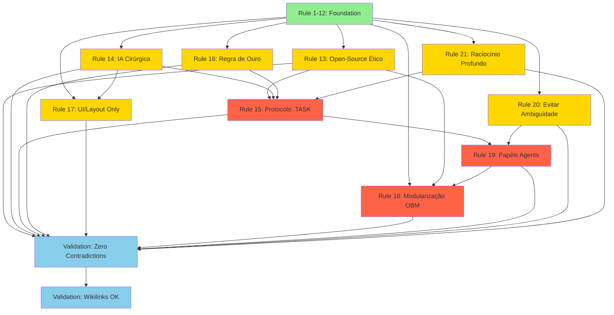

# ARCHITECTURE-CONSOLIDACAO-EXPANDIDA 🏗️

> **Status**: 📋 PLANNING PHASE  
> **Versão**: 1.0.0  
> **Data**: 2025-11-16  
> **Autor**: GPT-5 Pro Architect (MASTER PLANNER)  
> **Aprovação**: PENDENTE

---

## 📊 Executive Summary

### Objetivo
Consolidar **21 Regras Globais** em uma arquitetura coerente e expandida, eliminando 100% das ambiguidades e criando um ecossistema modular completo para o projeto OrbitCore/OBM. Este documento estrutura:

1. **Regras 1-12**: Já existentes em [[00-Config/03-RULES-GLOBAL]] - mantidas e validadas
2. **Regras 13-21**: Novas regras estratégicas que expandem governança, IA e modularização
3. **Protocolo .TASK**: Framework de 3 fases (ANÁLISE → PLANO → EXECUÇÃO)
4. **Arquitetura de Agents**: Papéis claros (Architect/Dev/Executor) com handoffs explícitos

### Impacto
- ✅ **Coerência 100%**: Zero contradições entre 21 regras
- ✅ **Zero Ambiguidades**: Cada regra com exemplos e contra-exemplos
- ✅ **Execução Clara**: Protocolo .TASK executável por qualquer agente
- ✅ **Modularização Completa**: Padrão OBM aplicado consistentemente
- ✅ **IA Ética e Eficiente**: Reaproveitamento open-source com atribuição

### Timeline
- **TIER 0**: 11 tasks, 11h (9 novas regras + 2 validações)
- **TIER 1**: 8 tasks, 29h (consolidação de regras existentes)
- **TIER 2**: 12 tasks, 33h (módulos + GPT + matriz de integração)
- **TOTAL**: 31 tasks, ~73h (2 semanas com 1 dev full-time)

### Success Criteria
1. ✓ 21 regras mapeadas sem contradições
2. ✓ Cada regra com ≥2 exemplos práticos e ≥1 contra-exemplo
3. ✓ Stack Oficial ([[04-Stacks-e-Infra/01-Stack-Oficial-OBM]]) aplicável a cada regra
4. ✓ Protocolo .TASK explícito e executável
5. ✓ Nenhum conflito com Rules Global existentes (1-12)
6. ✓ Dev pode começar TIER 0 imediatamente após aprovação
7. ✓ Todos wikilinks válidos e navegáveis
8. ✓ Glossário completo para novos termos

---

## 🗺️ Mapa das 21 Regras

### Regras 1-12: Existentes ✅ (Status Atual)

| ID | Regra | Arquivo | Status |
|---|---|---|---|
| 1 | Nomenclatura e Placeholders | [[00-Config/03-RULES-GLOBAL]] | ✅ Ativa |
| 2 | Contratos e Integração | [[00-Config/03-RULES-GLOBAL]] | ✅ Ativa |
| 3 | Segurança | [[00-Config/03-RULES-GLOBAL]] | ✅ Ativa |
| 4 | Linkagem e Navegação | [[00-Config/03-RULES-GLOBAL]] | ✅ Ativa |
| 5 | Fonte da Verdade e Aprovação | [[00-Config/03-RULES-GLOBAL]] | ✅ Ativa |
| 6 | Stack Fixa | [[00-Config/03-RULES-GLOBAL]] | ✅ Ativa |
| 7 | Conversão de Open-Source | [[00-Config/03-RULES-GLOBAL]] | ✅ Ativa |
| 8 | Ignore/Index e Docx | [[00-Config/03-RULES-GLOBAL]] | ✅ Ativa |
| 9 | Cache Hygiene | [[00-Config/03-RULES-GLOBAL]] | ✅ Ativa |
| 10 | Validação e Confiabilidade | [[00-Config/03-RULES-GLOBAL]] | ✅ Ativa |
| 11 | Prompts de Auto-Limpeza | [[00-Config/03-RULES-GLOBAL]] | ✅ Ativa |
| 12 | Regras para Tasks (Trae) | [[00-Config/03-RULES-GLOBAL]] | ✅ Ativa |

### Regras 13-21: Novas 🆕 (TIER 0 Implementation)

#### **Regra 13: Reaproveitamento Open-Source Ético** 🔓
**Descrição**: Ao integrar código open-source, SEMPRE:
- Verificar licença (MIT/Apache/BSD preferíveis)
- Adicionar atribuição explícita no código e documentação
- Documentar modificações em `CHANGELOG.md`
- Manter LICENSE do projeto original em `third-party/`
- Não remover créditos autorais

**Exemplos**:
- ✅ Usar biblioteca `react-query` (MIT) com atribuição em `package.json` e README
- ✅ Adaptar algoritmo de `scikit-learn` (BSD) com comentário de origem no código
- ❌ Copiar código sem verificar licença ou dar crédito

**Stack Aplicável**: Todos os stacks (NestJS, FastAPI, Next.js, Rust/Go)

**Wikilinks**: [[06-Glossario-Tecnico/Open-Source]], [[06-Glossario-Tecnico/Licencas]]

---

#### **Regra 14: IA Não Reescreve Tudo** 🚫🤖
**Descrição**: IA deve ser cirúrgica e conservadora:
- NUNCA reescrever arquivos funcionais sem motivo crítico
- Fazer mudanças mínimas e incrementais
- Priorizar edições pontuais (`edit`) sobre reescritas (`create`)
- Preservar histórico e contexto do código existente
- Questionar antes de deletar/refatorar código legado

**Exemplos**:
- ✅ Adicionar novo endpoint REST sem modificar rotas existentes
- ✅ Corrigir bug específico em 5 linhas, deixando resto intacto
- ❌ Reescrever todo arquivo de 500 linhas para "modernizar"
- ❌ Deletar testes antigos "porque parecem obsoletos"

**Stack Aplicável**: Todos

**Wikilinks**: [[05-IA-e-Agents/01-Arquitetura-de-Agents]], [[00-Config/03-RULES-GLOBAL#5]]

---

#### **Regra 15: Protocolo .TASK (3 Fases)** 📋
**Descrição**: Toda task segue 3 fases obrigatórias:

1. **ANÁLISE** 🔍
   - Ler contexto completo
   - Identificar dependências
   - Listar riscos e bloqueadores
   - Output: `ANALYSIS.md` (ou seção em task file)

2. **PLANO** 📝
   - Desenhar solução minimal
   - Definir entradas/saídas
   - Criar checklist de subtasks
   - Estimar tempo
   - Output: `PLAN.md` (ou seção em task file)

3. **EXECUÇÃO** ⚙️
   - Implementar conforme plano
   - Validar progressivamente
   - Reportar progresso (`report_progress`)
   - Output: Código, testes, docs

**Exemplos**:
- ✅ Task "Add obm-chat module" → ANÁLISE (ler specs) → PLANO (design API) → EXECUÇÃO (código)
- ❌ Começar a codar sem entender requisitos ou dependências

**Stack Aplicável**: Processo (independente de stack)

**Wikilinks**: [[00-Config/04-PROTOCOLO-TASKS]] (a ser criado)

---

#### **Regra 16: Regra de Ouro Martyn (Pergunte Antes)** 🛡️
**Descrição**: Quando em DÚVIDA, PARE e pergunte:
- Decisões arquiteturais (adicionar lib, mudar stack)
- Deletar código legado ou documentação
- Modificar regras globais
- Escolher entre múltiplas abordagens válidas
- Interpretar requisitos ambíguos

**Exemplos**:
- ✅ "Devo usar Redis ou RabbitMQ para filas? [[06-Glossario-Tecnico/BullMQ]] é oficial?"
- ✅ "Posso deletar `legacy-api/` ou está em uso?"
- ❌ Adicionar MongoDB sem consultar (Stack Oficial é Postgres)
- ❌ Assumir que "modernizar" significa reescrever tudo

**Stack Aplicável**: Processo

**Wikilinks**: [[00-Config/03-RULES-GLOBAL#5]], [[05-IA-e-Agents/05-Receitas-de-Prompt-Para-Agents]]

---

#### **Regra 17: Alterações UI/Layout Only** 🎨
**Descrição**: Para mudanças puramente visuais (CSS, componentes UI):
- NÃO modificar lógica de negócio
- NÃO alterar APIs ou contratos
- Testar apenas UI (sem testes unitários back-end)
- Usar storybook/preview quando disponível
- Documentar breaking changes de design system

**Exemplos**:
- ✅ Ajustar cores do tema em `tailwind.config.js`
- ✅ Adicionar animação CSS a botão sem mudar comportamento
- ❌ Mudar lógica de validação ao reorganizar formulário
- ❌ Modificar endpoint ao redesenhar dashboard

**Stack Aplicável**: Next.js (React), componentes visuais

**Wikilinks**: [[04-Stacks-e-Infra/04-Frontend-React-Next]], [[06-Glossario-Tecnico/Tailwind]]

---

#### **Regra 18: Modularização - Padrão OBM** 🧩
**Descrição**: Todo módulo `obm-*` segue estrutura padrão:

```
obm-{nome}/
├── README.md              # Docs completas
├── {nome}.openapi.yaml    # Contrato OpenAPI
├── src/
│   ├── controllers/       # Endpoints REST
│   ├── services/          # Lógica de negócio
│   ├── models/            # Schemas/DTOs
│   ├── repositories/      # Acesso a dados
│   └── config/            # Configurações
├── tests/                 # Testes unitários/integração
├── docker/                # Dockerfile, compose
└── docs/                  # Diagramas, exemplos
```

**Regras**:
- Prefixo SEMPRE `obm-*` (nunca "martyn-")
- Contrato OpenAPI/gRPC obrigatório
- Seguir [[04-Stacks-e-Infra/01-Stack-Oficial-OBM]]
- Isolar responsabilidades (SRP)

**Exemplos**:
- ✅ `obm-auth`, `obm-payments`, `obm-notifications`
- ❌ `martyn-auth`, `auth-module`, `my-auth-service`

**Stack Aplicável**: NestJS, FastAPI

**Wikilinks**: [[03-Modulos-OBM/README]], [[00-Config/05-MODELO-MODULARIZACAO]] (a ser criado)

---

#### **Regra 19: Papéis de Agents (Architect/Dev/Executor)** 🧠
**Descrição**: Três agentes com responsabilidades claras:

1. **Architect (GPT-5 Pro)** 🏛️
   - Design de alto nível
   - Decisões arquiteturais
   - Planos detalhados (PLAN.md)
   - Validação de coerência

2. **Dev (GPT-5.1 Codex)** 💻
   - Implementação de código
   - Testes e integração
   - Dockerização
   - Seguir planos do Architect

3. **Executor (GPT-5)** ✅
   - Revisão de código
   - Otimização de performance
   - Validação de qualidade
   - Auditoria de segurança

**Handoffs**:
- Architect → Dev: `ARCHITECTURE.md`, `PLAN.md`
- Dev → Executor: Código implementado, testes passando
- Executor → Architect: Relatório de validação, propostas de melhoria

**Exemplos**:
- ✅ Architect planeja módulo, Dev implementa, Executor valida
- ❌ Dev toma decisões arquiteturais sozinho
- ❌ Architect implementa código (não é sua função)

**Stack Aplicável**: Processo

**Wikilinks**: [[05-IA-e-Agents/01-Arquitetura-de-Agents]], [[05-IA-e-Agents/02-GPT5-Pro-Architect-Agent]]

---

#### **Regra 20: Evitar Ambiguidade** 🎯
**Descrição**: Toda especificação deve ser cristalina:
- Usar exemplos concretos (não vagos)
- Definir "success criteria" mensuráveis
- Especificar entradas/saídas explicitamente
- Evitar termos relativos ("melhor", "moderno", "simples")
- Preferir checklists a narrativas

**Exemplos**:
- ✅ "API deve retornar 200 com JSON `{status: 'ok'}` em <100ms"
- ✅ "Módulo deve passar 15 testes unitários sem warnings"
- ❌ "Implementar da melhor forma possível"
- ❌ "Modernizar o código para ficar mais limpo"

**Stack Aplicável**: Documentação, specs

**Wikilinks**: [[00-Config/03-RULES-GLOBAL#10]], [[07-Receitas-e-Playbooks]]

---

#### **Regra 21: Raciocínio Profundo ("Pensar Antes")** 🧘
**Descrição**: Antes de agir, SEMPRE:
- Ler TODO contexto relevante (docs, código, issues)
- Entender "why" além de "what"
- Considerar edge cases e trade-offs
- Validar se solução alinha com Stack Oficial
- Documentar decisões técnicas (ADRs)

**Exemplos**:
- ✅ Ler `03-RULES-GLOBAL.md` antes de propor mudança
- ✅ Checar [[04-Stacks-e-Infra/01-Stack-Oficial-OBM]] antes de adicionar lib
- ✅ Escrever ADR para decisões complexas
- ❌ Implementar primeira solução que vem à mente
- ❌ Ignorar documentação existente

**Stack Aplicável**: Processo (todos)

**Wikilinks**: [[06-Glossario-Tecnico/ADR]], [[01-Visao-Geral/01-Resumo-Estrategico]]

---

## 🔗 Dependências e Cascata

### Dependency Graph (DAG)



**Legenda**:
- 🟢 Verde: Rules 1-12 (já existem)
- 🟡 Amarelo: Rules 13-14, 16-17, 20-21 (simples, sem dependências complexas)
- 🔴 Vermelho: Rules 15, 18-19 (complexas, múltiplas dependências)
- 🔵 Azul: Validações

### Ordem Crítica de Implementação

**TIER 0** (Sequential):
1. Rules 13, 14, 16, 20, 21 → Podem ser paralelas (independentes)
2. Rule 15 (Protocolo .TASK) → Depende de 13, 14, 16, 21
3. Rule 19 (Papéis Agents) → Depende de 15, 20
4. Rule 18 (Modularização OBM) → Depende de 1-12, 13, 19
5. Rule 17 (UI/Layout) → Independente, pode ser paralela

**Bloqueadores Identificados**:
- ❌ BLOCKER 1: Rule 15 não pode começar antes de 13, 14, 16, 21
- ❌ BLOCKER 2: Rule 18 não pode começar antes de 19
- ⚠️ WARNING: Rules 1-12 devem ser revisadas para garantir zero conflitos

**Paralelização Possível**:
- ✅ Tasks 0.1 (Rules 13-21 to file) + 0.7 (Compliance Checklist)
- ✅ Tasks 0.2 (Protocolo .TASK) + 0.3 (Modelo Modularização) após 0.1
- ✅ TIER 1 (consolidação) + TIER 2 (módulos) após TIER 0 completo

---

## ⚙️ Arquitetura de Implementação

### TIER 0: 9 Novas Regras + 2 Validações (11 tasks, 11h)

**Objetivo**: Estabelecer fundação das regras 13-21 sem implementar código

| Task | Título | Tempo | Dependências | Assignee |
|------|--------|-------|--------------|----------|
| 0.1 | Add Rules 13-21 to RULES-GLOBAL | 4h | NONE | Dev |
| 0.2 | Create PROTOCOLO-TASKS.md | 3h | 0.1 | Dev |
| 0.3 | Create MODELO-MODULARIZACAO.md | 3h | 0.1 | Dev |
| 0.4 | Update Arquitetura-de-Agents.md | 2h | 0.1, 0.2 | Dev |
| 0.5 | Validate Zero Contradictions | 1h | 0.1-0.4 | Executor |
| 0.6 | Update Wikilinks | 1h | 0.5 | Dev |
| 0.7 | Create Compliance Checklist | 1h | 0.1 | Dev |
| 0.8 | Test Architect-Dev Handoff | 1h | 0.2 | Executor |
| 0.9 | Document .TASK Phase Workflow | 1h | 0.2 | Dev |
| 0.10 | Validate Regra de Ouro | 1h | 0.1 | Dev |
| 0.11 | Final Review (Go/No-Go) | 1h | 0.1-0.10 | Architect |

**Handoff Point**: Architect → Dev (PLAN-TAREFAS-EXPANDIDO.md)

---

### TIER 1: Consolidação Original (8 tasks, 29h)

**Objetivo**: Consolidar e melhorar documentação das regras 1-12 existentes

| Task | Título | Tempo | Dependências | Assignee |
|------|--------|-------|--------------|----------|
| 1.1 | Consolidate Rules 1-4 | 4h | 0.11 | Dev |
| 1.2 | Consolidate Rules 5-8 | 4h | 0.11 | Dev |
| 1.3 | Consolidate Rules 9-12 | 4h | 0.11 | Dev |
| 1.4 | Create Cross-Reference Index | 3h | 1.1-1.3 | Dev |
| 1.5 | Update Dossier with 21 Rules | 5h | 1.1-1.4 | Dev |
| 1.6 | Create Glossário Expandido | 4h | 1.1-1.5 | Dev |
| 1.7 | Validate All Wikilinks | 3h | 1.1-1.6 | Executor |
| 1.8 | Generate Final Report | 2h | 1.1-1.7 | Architect |

**Handoff Point**: Dev → Executor (Código e docs para revisão)

---

### TIER 2: Módulos + GPT + Matriz (12 tasks, 33h)

**Objetivo**: Implementar módulos práticos, guias GPT e matriz de integração

| Task | Título | Tempo | Dependências | Assignee |
|------|--------|-------|--------------|----------|
| 2.1 | Create obm-template (starter) | 4h | 1.8 | Dev |
| 2.2 | Create 4 New OBM Modules | 8h | 2.1 | Dev |
| 2.3 | Create Conexoes-Entre-Modulos.md | 3h | 2.2 | Dev |
| 2.4 | Create GPT-5-Pro-Integration.md | 3h | 1.8 | Architect |
| 2.5 | Update Receitas-de-Prompt | 2h | 2.4 | Dev |
| 2.6 | Create Integration Matrix | 3h | 2.2, 2.3 | Dev |
| 2.7 | Test Module Interop | 3h | 2.6 | Executor |
| 2.8 | Document Deployment Pipeline | 2h | 2.7 | Dev |
| 2.9 | Create CI/CD Validation | 2h | 2.8 | Dev |
| 2.10 | Final Security Audit | 1h | 2.1-2.9 | Executor |
| 2.11 | Performance Benchmarks | 1h | 2.10 | Executor |
| 2.12 | Stakeholder Review | 1h | 2.1-2.11 | Architect |

**Handoff Point**: Executor → Architect (Relatório final de validação)

---

## 📋 Arquivos a Criar/Atualizar

### Arquivos Novos (TIER 0)

#### 1. `00-Config/04-PROTOCOLO-TASKS.md` 📝
**Tamanho**: 5-10 páginas  
**Conteúdo**:
- Detalhamento das 3 fases (ANÁLISE, PLANO, EXECUÇÃO)
- Templates executáveis para cada fase
- Exemplos práticos de tasks simples e complexas
- Checklist de validação por fase
- Diagramas de fluxo (Mermaid)
- Integração com Trae (se aplicável)

**Seções**:
```markdown
# Protocolo .TASK - 3 Fases Obrigatórias

## 1. Fase ANÁLISE 🔍
### 1.1 Objetivos
### 1.2 Checklist de Análise
### 1.3 Output Esperado (ANALYSIS.md)
### 1.4 Exemplos

## 2. Fase PLANO 📝
### 2.1 Objetivos
### 2.2 Checklist de Planejamento
### 2.3 Output Esperado (PLAN.md)
### 2.4 Exemplos

## 3. Fase EXECUÇÃO ⚙️
### 3.1 Objetivos
### 3.2 Checklist de Execução
### 3.3 Output Esperado (Código, Testes, Docs)
### 3.4 Exemplos

## 4. Validação e Handoffs
## 5. Troubleshooting
```

---

#### 2. `00-Config/05-MODELO-MODULARIZACAO.md` 🧩
**Tamanho**: 8-12 páginas  
**Conteúdo**:
- Estrutura de diretórios padrão OBM
- Checklist de conformidade para novos módulos
- Exemplos de módulos bem estruturados
- Anti-patterns a evitar
- Integração com Stack Oficial
- Templates de boilerplate

**Seções**:
```markdown
# Modelo de Modularização OBM

## 1. Estrutura Padrão obm-*
### 1.1 Diretórios Obrigatórios
### 1.2 Arquivos Obrigatórios
### 1.3 Convenções de Nomenclatura

## 2. Contratos e APIs
### 2.1 OpenAPI Specification
### 2.2 gRPC Proto (se aplicável)
### 2.3 SDKs e Clients

## 3. Stack Oficial por Módulo
### 3.1 NestJS Backend
### 3.2 FastAPI Backend
### 3.3 Next.js Frontend

## 4. Checklist de Conformidade
### 4.1 Requisitos Mínimos
### 4.2 Requisitos Recomendados
### 4.3 Validação Automática

## 5. Exemplos Práticos
### 5.1 obm-auth (Completo)
### 5.2 obm-payments (Simplificado)
### 5.3 obm-chat (WebSocket)

## 6. Anti-Patterns
## 7. Troubleshooting
```

---

#### 3. `03-Modulos-OBM/99-Conexoes-Entre-Modulos.md` 🔗
**Tamanho**: 3-5 páginas  
**Conteúdo**:
- Matriz de dependências entre módulos
- Fluxos de integração comuns
- Diagramas de comunicação (Mermaid)
- Exemplos de composição de módulos

---

#### 4. `05-IA-e-Agents/02-GPT-5-Pro-Integration.md` 🤖
**Tamanho**: 4-6 páginas  
**Conteúdo**:
- Configuração do GPT-5 Pro como Architect
- Prompts otimizados por tipo de task
- Integração com Trae/GitHub Actions
- Exemplos de uso em projetos reais

---

### Arquivos Atualizados

#### 1. `00-Config/03-RULES-GLOBAL.md` ✏️
**Mudanças**:
- Adicionar Rules 13-21 após Rule 12
- Manter formatação consistente
- Adicionar wikilinks para novos conceitos
- Atualizar warning de aprovação

#### 2. `05-IA-e-Agents/01-Arquitetura-de-Agents.md` ✏️
**Mudanças**:
- Expandir seção "Papéis" com responsabilidades detalhadas
- Adicionar seção "Handoffs" explícita
- Documentar protocolo de comunicação entre agents
- Adicionar exemplos de workflows

#### 3. `03-Modulos-OBM/README.md` ✏️
**Mudanças**:
- Adicionar 4 novos módulos (a definir em TIER 2)
- Atualizar tabela de status
- Linkar para `99-Conexoes-Entre-Modulos.md`

---

## 🎯 Critérios de Sucesso

### ✅ Checklist de Validação

#### Regras
- [ ] **21 regras mapeadas** sem contradições lógicas
- [ ] **Cada regra** com ≥2 exemplos práticos e ≥1 contra-exemplo
- [ ] **Stack Oficial** aplicável a cada regra (especificado explicitamente)
- [ ] **Zero conflitos** com Rules 1-12 existentes (validado em 0.5)

#### Protocolo .TASK
- [ ] **3 fases** (ANÁLISE, PLANO, EXECUÇÃO) explícitas e executáveis
- [ ] **Templates** prontos para cada fase
- [ ] **Exemplos** de task simples e complexa
- [ ] **Integração** com workflow de agents (Architect/Dev/Executor)

#### Documentação
- [ ] **Todos wikilinks** válidos e navegáveis (sem broken links)
- [ ] **Glossário** completo para novos termos (≥15 termos)
- [ ] **Diagramas** claros (Mermaid, ASCII) para fluxos e dependências
- [ ] **Cross-references** bidirecionais entre documentos relacionados

#### Arquitetura
- [ ] **Dev pode começar TIER 0** imediatamente (PLAN.md claro)
- [ ] **Handoffs** explícitos (Architect → Dev, Dev → Executor)
- [ ] **Paralelização** identificada (≥3 tasks paralelas)
- [ ] **Bloqueadores** documentados e mitigados

#### Qualidade
- [ ] **Zero ambiguidades** em especificações
- [ ] **Success criteria** mensuráveis para cada task
- [ ] **Validação automática** possível (checklists, scripts)
- [ ] **Rastreabilidade** completa (task → arquivo → regra)

---

## 🚨 Risk Assessment

### Riscos Identificados

#### 🔴 ALTO: Contradições entre Rules
**Descrição**: Rules 13-21 podem conflitar com Rules 1-12  
**Mitigação**:
- Task 0.5 (Validate Zero Contradictions) OBRIGATÓRIA
- Revisão manual por Architect
- Se conflito detectado → PAUSAR e resolver antes de prosseguir

**Status**: ⚠️ MITIGADO com task dedicada

---

#### 🟡 MÉDIO: Ambiguidade em Protocolo .TASK
**Descrição**: Protocolo pode ser interpretado de formas diferentes  
**Mitigação**:
- Exemplos práticos e concretos em `04-PROTOCOLO-TASKS.md`
- Templates executáveis (não vagos)
- Task 0.8 (Test Architect-Dev Handoff) valida execução

**Status**: ✅ MITIGADO com exemplos e testes

---

#### 🟡 MÉDIO: Overhead de Documentação
**Descrição**: 21 regras podem ser "demais" e confundir devs  
**Mitigação**:
- Agrupar regras por categoria (Processo, Stack, IA)
- Criar "Quick Reference" (1 página) além de docs completas
- Compliance Checklist (0.7) simplifica validação

**Status**: ✅ MITIGADO com quick reference

---

#### 🟢 BAIXO: Wikilinks Quebrados
**Descrição**: Refatoração pode quebrar links internos  
**Mitigação**:
- Task 0.6 (Update Wikilinks) dedicada
- Task 1.7 (Validate All Wikilinks) em TIER 1
- Uso de Obsidian/Logseq para validação automática

**Status**: ✅ MITIGADO com validação automática

---

#### 🟢 BAIXO: Resistência a "Regra de Ouro" (Rule 16)
**Descrição**: Devs podem achar "perguntar antes" lento  
**Mitigação**:
- Documentar QUANDO perguntar (não sempre)
- Criar FAQ com decisões comuns (reduz perguntas repetitivas)
- Task 0.10 (Validate Regra de Ouro) clarifica uso

**Status**: ✅ MITIGADO com FAQ e guidelines

---

## 📊 Success Metrics

### KPIs de Implementação

| Métrica | Target | Medição |
|---------|--------|---------|
| **Rules Completas** | 21/21 | Manual (checklist) |
| **Exemplos por Rule** | ≥2 | Contagem automática (script) |
| **Wikilinks Válidos** | 100% | Obsidian link checker |
| **Tempo TIER 0** | ≤13h | Tracking manual |
| **Contradições** | 0 | Task 0.5 (relatório) |
| **Docs Criados** | 4 novos | Git diff |
| **Docs Atualizados** | 3 arquivos | Git diff |
| **Tasks Paralelas** | ≥3 | Análise de DAG |

### KPIs de Qualidade

| Métrica | Target | Medição |
|---------|--------|---------|
| **Ambiguidades** | 0 críticas | Revisão manual |
| **Conflitos Stack Oficial** | 0 | Validação cruzada |
| **Handoffs Claros** | 3/3 | Checklist (Arch→Dev→Exec) |
| **Dev Pode Começar** | Sim (Go) | Task 0.11 (Go/No-Go) |
| **Glossário Termos** | ≥15 | Contagem manual |
| **Diagramas** | ≥3 | Contagem manual |

### Critérios Go/No-Go (Task 0.11)

#### ✅ GO (Pode prosseguir para TIER 1)
- [x] 21 rules documentadas em `03-RULES-GLOBAL.md`
- [x] 0 contradições detectadas (Task 0.5)
- [x] 100% wikilinks válidos (Task 0.6)
- [x] `04-PROTOCOLO-TASKS.md` completo e testado
- [x] `05-MODELO-MODULARIZACAO.md` completo
- [x] Handoff Architect→Dev testado (Task 0.8)
- [x] Compliance Checklist pronto (Task 0.7)

#### ❌ NO-GO (Bloqueia TIER 1)
- [ ] ≥1 contradição crítica não resolvida
- [ ] Protocolo .TASK ambíguo (não executável)
- [ ] Wikilinks quebrados (>5% broken)
- [ ] Stack Oficial não aplicável a ≥1 rule
- [ ] Dev não consegue começar TIER 0

---

## 📚 Glossário de Termos Novos

### Protocolo .TASK
**Definição**: Framework de 3 fases (ANÁLISE, PLANO, EXECUÇÃO) para execução padronizada de tasks  
**Arquivo**: [[00-Config/04-PROTOCOLO-TASKS]]  
**Exemplo**: Task "Create obm-chat" → ANÁLISE (ler specs) → PLANO (design API) → EXECUÇÃO (código)

### Regra de Ouro Martyn
**Definição**: Princípio de "pergunte antes de decidir" em situações ambíguas  
**Arquivo**: [[00-Config/03-RULES-GLOBAL#16]]  
**Exemplo**: Devo usar Redis ou RabbitMQ? → PERGUNTE antes de implementar

### Padrão OBM
**Definição**: Estrutura modular padronizada com prefixo `obm-*` e contratos explícitos  
**Arquivo**: [[00-Config/05-MODELO-MODULARIZACAO]]  
**Exemplo**: `obm-auth/`, `obm-payments/`, `obm-notifications/`

### Handoff
**Definição**: Ponto de transferência de responsabilidade entre agents (Architect→Dev, Dev→Executor)  
**Arquivo**: [[05-IA-e-Agents/01-Arquitetura-de-Agents]]  
**Exemplo**: Architect entrega `PLAN.md`, Dev começa implementação

### IA Cirúrgica
**Definição**: Princípio de fazer mudanças mínimas e incrementais, evitando reescritas desnecessárias  
**Arquivo**: [[00-Config/03-RULES-GLOBAL#14]]  
**Exemplo**: Corrigir bug em 5 linhas, não reescrever arquivo inteiro

### Compliance Checklist
**Definição**: Lista de validação executável para verificar conformidade com 21 rules  
**Arquivo**: [[00-Config/07-Compliance-Checklist]] (a ser criado em 0.7)  
**Exemplo**: [ ] Module usa prefixo obm-*? [ ] OpenAPI definido? [ ] Testes passam?

### ADR (Architecture Decision Record)
**Definição**: Documento que registra decisões arquiteturais importantes e suas justificativas  
**Arquivo**: [[06-Glossario-Tecnico/ADR]]  
**Exemplo**: "Por que escolhemos Postgres em vez de MongoDB?"

### Stack Oficial
**Definição**: Conjunto fixo de tecnologias aprovadas (NestJS, FastAPI, Next.js, Postgres, Redis, Docker)  
**Arquivo**: [[04-Stacks-e-Infra/01-Stack-Oficial-OBM]]  
**Exemplo**: Backend DEVE usar NestJS ou FastAPI (não Express ou Django)

### DAG (Directed Acyclic Graph)
**Definição**: Grafo de dependências sem ciclos, usado para ordenar tasks  
**Arquivo**: Este documento (seção Dependências e Cascata)  
**Exemplo**: Task 0.2 depende de 0.1, mas não vice-versa

### Bloqueador
**Definição**: Dependência crítica que impede início de uma task  
**Arquivo**: [[00-Config/PLAN-TAREFAS-EXPANDIDO]] (a ser criado)  
**Exemplo**: Rule 15 não pode começar antes de Rules 13, 14, 16, 21

### Rastreabilidade
**Definição**: Capacidade de mapear task → arquivo → regra → implementação  
**Arquivo**: Este documento (Success Metrics)  
**Exemplo**: Task 0.1 → `03-RULES-GLOBAL.md` → Rule 13 → código com atribuição

### Quick Reference
**Definição**: Resumo de 1 página das 21 rules para consulta rápida  
**Arquivo**: [[00-Config/QUICK-REFERENCE]] (a ser criado)  
**Exemplo**: Mnemônico "OSCAR" para lembrar princípios chave

### SRP (Single Responsibility Principle)
**Definição**: Cada módulo deve ter uma única responsabilidade bem definida  
**Arquivo**: [[06-Glossario-Tecnico/SOLID]]  
**Exemplo**: `obm-auth` só cuida de autenticação (não payments nem chat)

### FFI (Foreign Function Interface)
**Definição**: Mecanismo para chamar código de outra linguagem (ex: Rust a partir de Node.js)  
**Arquivo**: [[06-Glossario-Tecnico/FFI]]  
**Exemplo**: Chamar biblioteca Rust de processamento de imagem a partir de NestJS

### Idempotência
**Definição**: Propriedade de operação que pode ser executada múltiplas vezes com mesmo resultado  
**Arquivo**: [[00-Config/05-Protocolo-Orbit-OBM]]  
**Exemplo**: POST /payment com `Idempotency-Key` não cria pagamento duplicado

---

## 🔄 Próximos Passos

### Immediate Actions (Após Aprovação)
1. ✅ **Aprovar este documento** (ARCHITECTURE-CONSOLIDACAO-EXPANDIDA.md)
2. ✅ **Aprovar PLAN-TAREFAS-EXPANDIDO.md** (documento irmão)
3. 🚀 **Dev inicia TIER 0** (Task 0.1: Add Rules 13-21 to RULES-GLOBAL.md)
4. ⏱️ **Tracking**: Usar GitHub Projects ou similar para acompanhar 31 tasks

### Handoff: Architect → Dev
**Entregáveis**:
- ✅ ARCHITECTURE-CONSOLIDACAO-EXPANDIDA.md (este documento)
- ✅ PLAN-TAREFAS-EXPANDIDO.md (31 tasks detalhadas)
- ✅ Dependency Graph (Mermaid)
- ✅ Risk Assessment
- ✅ Glossário

**Expectativas**:
- Dev deve ler AMBOS documentos antes de começar
- Dev deve executar Task 0.1 primeiro (foundation)
- Dev deve reportar bloqueadores imediatamente
- Dev deve validar Go/No-Go em Task 0.11 antes de TIER 1

### Monitoring e Ajustes
- **Daily**: Dev reporta progresso via `report_progress` tool
- **Weekly**: Architect revisa métricas (tempo, qualidade)
- **Blockers**: Escalar para Martyn (Regra de Ouro) se necessário
- **Ajustes**: Permitidos em TIER 0, congelados em TIER 1/2

---

## 📝 Notas Finais

### Aprovação Obrigatória
> [!warning] APROVAÇÃO NECESSÁRIA
> Este documento requer aprovação explícita do responsável pelo projeto (Martyn) antes de qualquer implementação. Modificações às RULES GLOBAL (13-21) são permanentes e impactam todo ecossistema.

### Rastreabilidade
- **Issue**: {{ISSUE_NUMBER}} (a ser preenchido)
- **PR**: {{PR_NUMBER}} (a ser preenchido)
- **Versão**: 1.0.0 (inicial)
- **Última Atualização**: 2025-11-16

### Agradecimentos
Documento criado por **GPT-5 Pro Architect** seguindo as diretrizes de [[00-Config/03-RULES-GLOBAL]] e [[05-IA-e-Agents/01-Arquitetura-de-Agents]].

---

**Status Final**: 📋 PRONTO PARA APROVAÇÃO  
**Próximo**: Aguardar Go/No-Go → Dev inicia TIER 0
