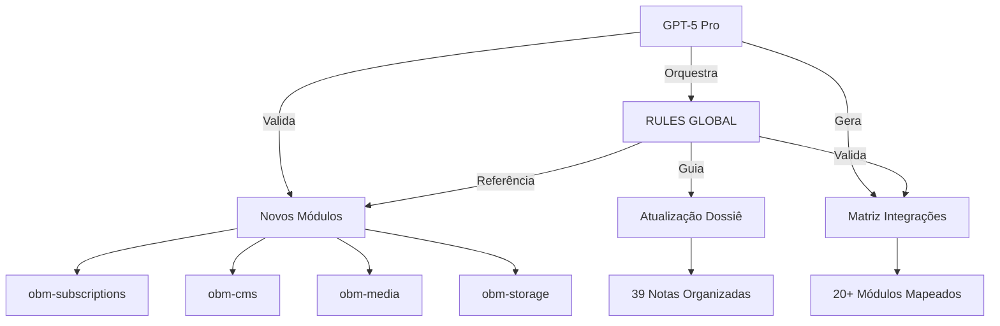
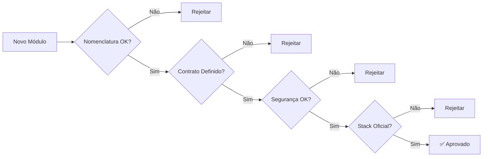
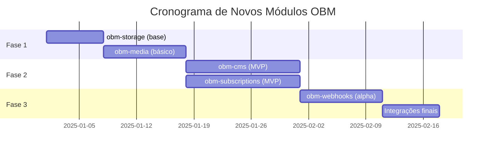
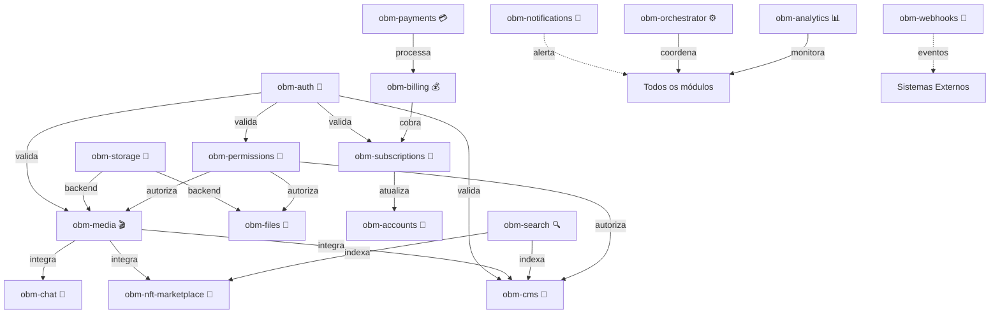
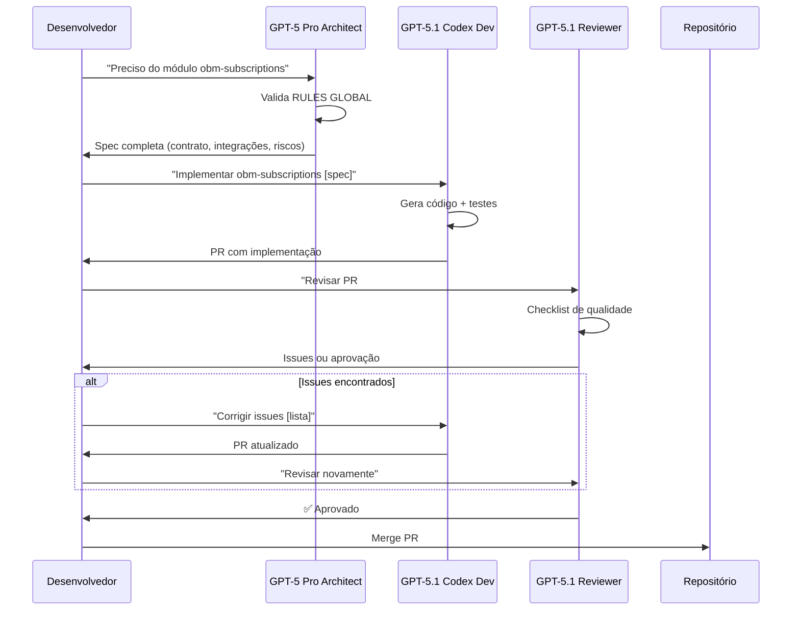
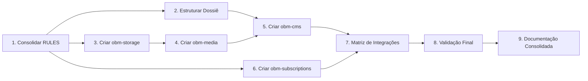

# 🏗️ ARCHITECTURE-CONSOLIDACAO.md

> **Documento Estratégico de Consolidação** — Define como consolidar RULES GLOBAL, adicionar novos módulos OBM, atualizar o dossiê e integrar GPT-5 Pro no processo de desenvolvimento.

---

## 📑 Índice

1. [Visão Geral](#visão-geral)
2. [Índice Centralizado de Regras](#índice-centralizado-de-regras)
3. [Novos Módulos OBM](#novos-módulos-obm)
4. [Matriz de Integrações](#matriz-de-integrações)
5. [Atualização do Dossiê](#atualização-do-dossiê)
6. [GPT-5 Pro Integration Guide](#gpt-5-pro-integration-guide)
7. [Fluxos e Dependências](#fluxos-e-dependências)
8. [Decisões e Trade-offs](#decisões-e-trade-offs)
9. [Critérios de Aceitação](#critérios-de-aceitação)
10. [Gaps e Riscos Identificados](#gaps-e-riscos-identificados)

---

## 🎯 Visão Geral

### Objetivo da Consolidação

Consolidar e expandir o ecossistema Orbit Corp/OBM através de:

1. **Centralização das Regras**: Garantir que as 12 RULES GLOBAL sejam referência única e consistente
2. **Expansão Modular**: Adicionar 4-5 novos módulos críticos (subscriptions, cms, media, storage)
3. **Mapeamento de Integrações**: Criar visibilidade completa das dependências entre 20+ módulos
4. **Enriquecimento do Dossiê**: Atualizar e organizar 39 notas do chat original
5. **Automação com IA**: Integrar GPT-5 Pro como arquiteto e coordenador de tarefas

### Princípios Norteadores

- ✅ **Minimalismo**: Apenas o essencial, sem duplicação
- ✅ **Coerência**: Todas as decisões seguem RULES GLOBAL
- ✅ **Rastreabilidade**: Cada componente tem origem e propósito claros
- ✅ **Modularidade**: Componentes independentes com contratos bem definidos
- ✅ **Segurança**: JWT, RBAC, TLS e secrets management em todos os módulos

### Escopo da Fase 1



---

## 📚 Índice Centralizado de Regras

### As 12 RULES GLOBAL

Referência completa em: [[00-Config/03-RULES-GLOBAL]]

| # | Regra | Aplicação na Consolidação |
|---|-------|---------------------------|
| **1** | **Nomenclatura e Placeholders** | Todos os novos módulos devem usar `obm-*`. Apps referenciados via `{{APP_*}}`. |
| **2** | **Contratos e Integração** | Matriz de integrações documenta entradas/saídas de cada módulo. |
| **3** | **Segurança** | JWT + RBAC obrigatório. Secrets em `.env`. Rate limiting em todos os endpoints. |
| **4** | **Linkagem e Navegação** | Novos módulos devem ter wikilinks para glossário técnico. |
| **5** | **Fonte da Verdade** | Dossiê é fonte primária. Consolidação preserva texto original. |
| **6** | **Stack Fixa** | NestJS/FastAPI/Next.js/Postgres/Redis/Docker mantidos. |
| **7** | **Conversão Open-Source** | Novos módulos podem portar OSS respeitando contratos OBM. |
| **8** | **Ignore/Index** | Configurar `.gitignore` e índices para builds, cache, logs. |
| **9** | **Cache Hygiene** | Atualizar caches após mudanças na documentação. |
| **10** | **Validação** | Cada módulo novo precisa testes mínimos e validação de contrato. |
| **11** | **Auto-Limpeza** | Verificar wikilinks quebrados após adicionar novos módulos. |
| **12** | **Tasks (Trae)** | Cada tarefa é atômica, com entradas/saídas claras. |

### Validação de Conformidade



---

## 🧩 Novos Módulos OBM

### Módulos Prioritários

#### 1. obm-subscriptions 📆

**Objetivo**: Gerenciar assinaturas recorrentes (planos, trials, upgrades/downgrades)

**Stack**: NestJS + Postgres + Redis

**Contrato**:
```typescript
// Entradas
POST /api/v1/subscriptions
{
  userId: string
  planId: string
  paymentMethodId: string
}

// Saídas
{
  subscriptionId: string
  status: "active" | "trial" | "cancelled"
  currentPeriodEnd: ISO8601
}

// Eventos
subscription.created
subscription.renewed
subscription.cancelled
subscription.trial_ended
```

**Integrações**:
- `obm-auth`: Validação de usuário
- `obm-billing`: Cobrança recorrente
- `obm-payments`: Processamento de pagamentos
- `obm-notifications`: Alertas de renovação/expiração

**Dependências**: [[06-Glossario-Tecnico/Prisma]], [[06-Glossario-Tecnico/BullMQ]]

---

#### 2. obm-cms 📝

**Objetivo**: Gerenciar conteúdo dinâmico (posts, páginas, categorias, tags)

**Stack**: NestJS + Postgres + Redis (cache)

**Contrato**:
```typescript
// Entradas
POST /api/v1/content
{
  type: "post" | "page" | "custom"
  title: string
  body: string (Markdown/HTML)
  status: "draft" | "published"
  authorId: string
  tags: string[]
}

// Saídas
{
  contentId: string
  slug: string
  publishedAt: ISO8601
  url: string
}

// Queries
GET /api/v1/content?status=published&tag=tech
GET /api/v1/content/:slug
```

**Integrações**:
- `obm-auth`: Autenticação de autores
- `obm-permissions`: RBAC (editor, revisor, admin)
- `obm-media`: Upload de imagens/vídeos
- `obm-search`: Indexação de conteúdo

**Dependências**: [[06-Glossario-Tecnico/Markdown]], [[06-Glossario-Tecnico/Slugify]]

---

#### 3. obm-media 🎬

**Objetivo**: Upload, processamento e entrega de mídia (imagens, vídeos, áudio)

**Stack**: NestJS + S3-compatible storage + Redis (metadata cache)

**Contrato**:
```typescript
// Entradas
POST /api/v1/media/upload
{
  file: multipart/form-data
  folder: string (opcional)
  transform: { width, height, format } (opcional)
}

// Saídas
{
  mediaId: string
  url: string (CDN)
  thumbnailUrl: string
  metadata: {
    size: number
    mimeType: string
    dimensions: { width, height }
  }
}

// Operações
DELETE /api/v1/media/:mediaId
GET /api/v1/media/:mediaId/metadata
POST /api/v1/media/:mediaId/transform
```

**Integrações**:
- `obm-auth`: Validação de proprietário
- `obm-storage`: Armazenamento persistente
- `obm-permissions`: Controle de acesso a arquivos
- `obm-analytics`: Tracking de visualizações

**Dependências**: [[06-Glossario-Tecnico/Sharp]], [[06-Glossario-Tecnico/FFmpeg]], [[06-Glossario-Tecnico/S3]]

---

#### 4. obm-storage 💾

**Objetivo**: Abstração de armazenamento (local, S3, Azure, GCP)

**Stack**: NestJS + Adapters pattern

**Contrato**:
```typescript
// Interface
interface StorageProvider {
  upload(file: Buffer, path: string): Promise<string>
  download(path: string): Promise<Buffer>
  delete(path: string): Promise<void>
  exists(path: string): Promise<boolean>
  getSignedUrl(path: string, expiresIn: number): Promise<string>
}

// Configuração
{
  provider: "s3" | "azure" | "gcp" | "local"
  bucket: string
  region: string
  credentials: { ... }
}

// Endpoints
POST /api/v1/storage/upload
GET /api/v1/storage/:key
DELETE /api/v1/storage/:key
GET /api/v1/storage/:key/signed-url
```

**Integrações**:
- `obm-auth`: Validação de tokens
- `obm-permissions`: ACLs de arquivos
- `obm-media`: Backend de armazenamento
- `obm-analytics`: Métricas de uso

**Dependências**: [[06-Glossario-Tecnico/AWS-SDK]], [[06-Glossario-Tecnico/MinIO]]

---

#### 5. obm-webhooks 🔗 (Opcional/Futuro)

**Objetivo**: Sistema de webhooks para eventos do ecossistema

**Stack**: NestJS + Redis (fila) + Postgres (logs)

**Contrato**:
```typescript
// Registro
POST /api/v1/webhooks
{
  url: string
  events: string[] // ["user.created", "payment.succeeded"]
  secret: string (auto-gerado)
}

// Payload enviado
{
  event: string
  timestamp: ISO8601
  data: { ... }
  signature: string (HMAC-SHA256)
}

// Gerenciamento
GET /api/v1/webhooks
DELETE /api/v1/webhooks/:webhookId
GET /api/v1/webhooks/:webhookId/logs
POST /api/v1/webhooks/:webhookId/test
```

**Integrações**:
- Todos os módulos OBM (como consumidores de eventos)
- `obm-notifications`: Fallback para webhooks falhos

**Dependências**: [[06-Glossario-Tecnico/BullMQ]], [[06-Glossario-Tecnico/Webhooks]]

---

### Roadmap de Implementação



---

## 🔗 Matriz de Integrações

### Módulos Existentes (19)

1. obm-accounts
2. obm-analytics
3. obm-auth
4. obm-billing
5. obm-chat
6. obm-files
7. obm-music-demos
8. obm-nft-marketplace
9. obm-notifications
10. obm-orchestrator
11. obm-payments
12. obm-permissions
13. obm-search
14. obm-streaming
15. obm-telemetry
16. obm-wallet
17. (+ 3 sem documentação completa)

### Módulos Novos (5)

18. obm-subscriptions
19. obm-cms
20. obm-media
21. obm-storage
22. obm-webhooks

### Matriz de Dependências

| Módulo | Depende de | Usado por |
|--------|-----------|-----------|
| **obm-auth** | - | TODOS (autenticação) |
| **obm-permissions** | obm-auth | TODOS (autorização) |
| **obm-storage** | - | obm-media, obm-files, obm-cms |
| **obm-media** | obm-storage, obm-auth | obm-cms, obm-nft-marketplace, obm-chat |
| **obm-cms** | obm-auth, obm-permissions, obm-media | {{APP_ORBIT_SUITE}}, {{APP_MUSIC_PLATFORM}} |
| **obm-subscriptions** | obm-auth, obm-billing, obm-payments | obm-accounts, {{APP_ORBIT_SUITE}} |
| **obm-billing** | obm-auth, obm-payments | obm-subscriptions, obm-accounts |
| **obm-payments** | obm-auth | obm-billing, obm-subscriptions, obm-nft-marketplace |
| **obm-notifications** | obm-auth | TODOS (eventos) |
| **obm-webhooks** | obm-auth | TODOS (eventos externos) |
| **obm-analytics** | - | TODOS (telemetria) |
| **obm-orchestrator** | TODOS | {{APP_ORBIT_SUITE}} (coordenador) |

### Diagrama de Integrações (20+ módulos)



### Protocolos de Comunicação

| Tipo | Protocolo | Uso |
|------|-----------|-----|
| **Síncrono** | REST/HTTP | Operações CRUD, consultas diretas |
| **Assíncrono** | BullMQ/Redis | Processamento em background, filas |
| **Eventos** | Webhooks/PubSub | Notificações, integrações externas |
| **Streaming** | WebSocket/SSE | Chat, atualizações em tempo real |
| **Alta Performance** | gRPC | Módulos Rust/Go (quando necessário) |

### Contrato de Envelope (Protocolo OBM)

Referência: [[00-Config/05-Protocolo-Orbit-OBM]]

Todos os módulos devem seguir:
```json
{
  "status": "success|error",
  "data": { /* payload */ },
  "error": { "code": "string", "message": "string", "details": {} },
  "meta": { "version": "v1", "traceId": "uuid", "timestamp": "ISO" }
}
```

---

## 📖 Atualização do Dossiê

### Dossiê Original

- **Arquivo**: `Dossie_Chat_Organizado_Anotado.md`
- **Blocos**: 39 notas de chat preservadas
- **Status Atual**: Texto original mantido, notas de conclusão pendentes

### Plano de Enriquecimento

#### Fase 1: Estruturação (Manual)
- [ ] Revisar cada um dos 39 blocos
- [ ] Completar seção "NOTAS DE CONCLUSÃO" de cada bloco
- [ ] Identificar temas centrais: Segurança, Stack, Módulos, GPT-5 Pro, etc.
- [ ] Extrair decisões-chave e padrões proibidos

#### Fase 2: Referências Cruzadas
- [ ] Criar wikilinks para [[00-Config/03-RULES-GLOBAL]]
- [ ] Linkar conceitos técnicos ao [[06-Glossario-Tecnico/...]]
- [ ] Conectar decisões de módulos aos docs em [[03-Modulos-OBM/...]]

#### Fase 3: Extração de Conhecimento
- [ ] Gerar índice de decisões (decisoes.md)
- [ ] Criar FAQ baseado no dossiê
- [ ] Documentar stack choices e trade-offs
- [ ] Consolidar padrões de nomenclatura

### Template de Nota de Conclusão

Para cada bloco (usar como referência):
```markdown
#### NOTAS DE CONCLUSÃO — BLOCO XX
- **Tema central:** [Segurança | Stack | Módulos | IA | Infra | etc.]
- **Decisões/definições capturadas:**
  - Decisão 1
  - Decisão 2
- **Padrões/Proibições:**
  - Padrão: X deve sempre Y
  - Proibição: Nunca fazer Z
- **Dúvidas/Pendências:**
  - Pergunta 1
  - Pergunta 2
- **Referências cruzadas:**
  - [[00-Config/03-RULES-GLOBAL#regra-X]]
  - [[03-Modulos-OBM/obm-Y]]
```

### Priorização dos Blocos

| Prioridade | Blocos | Razão |
|------------|--------|-------|
| 🔴 Alta | 13, 15, 16, 21, 27, 34, 37, 39 | Decisões arquiteturais, stack, metodologia |
| 🟡 Média | 5, 8, 9, 11, 22-26, 28-31 | Ferramentas, nomenclatura, estrutura |
| 🟢 Baixa | 1-4, 6-7, 10, 12, 14, 17-20, 32-33, 35-36, 38 | Contexto, dúvidas pontuais |

### Métricas de Qualidade

- ✅ 100% dos blocos com tema identificado
- ✅ 80%+ com decisões extraídas
- ✅ 60%+ com referências cruzadas
- ✅ 0 wikilinks quebrados

---

## 🤖 GPT-5 Pro Integration Guide

### Visão Geral

O GPT-5 Pro atua como **arquiteto principal** do projeto, orquestrando:
1. Validação de conformidade com RULES GLOBAL
2. Planejamento de novos módulos
3. Geração de documentação técnica
4. Revisão de integrações

### Configuração no Trae

#### Agent: GPT-5 Pro Architect

**Modelo**: `gpt-5-pro-2025-10-06` (via OpenAI API)

**Responsabilidades**:
- Planejar arquitetura de novos módulos
- Validar contratos e integrações
- Gerar documentação de alto nível
- Identificar gaps e riscos
- Criar roadmaps e cronogramas

**Prompt Base**:
```markdown
Role: Você é o GPT-5 Pro Architect do projeto Orbit Corp/OBM.
Responsabilidade: Planejar e validar arquitetura de módulos e integrações.

Contexto:
- Siga SEMPRE as RULES GLOBAL em [[00-Config/03-RULES-GLOBAL]]
- Stack oficial: NestJS, FastAPI, Next.js, Postgres, Redis, Docker
- Protocolo OBM: [[00-Config/05-Protocolo-Orbit-OBM]]
- Nomenclatura: prefixo `obm-*` para módulos

Tarefa: [específica para cada chamada]

Saída esperada:
- Markdown estruturado
- Diagramas Mermaid quando aplicável
- Referências a wikilinks
- Lista de dependências
- Riscos identificados
```

**Configuração (Trae)**:
```yaml
name: GPT-5 Pro Architect
model: gpt-5-pro-2025-10-06
temperature: 0.3
max_tokens: 8000
system_prompt: [ver acima]
context_files:
  - 00-Config/03-RULES-GLOBAL.md
  - 00-Config/05-Protocolo-Orbit-OBM.md
  - 00-Config/01-Mapa-Geral-do-Ecossistema.md
```

---

#### Agent: GPT-5.1 Codex Dev

**Modelo**: `gpt-5.1-codex` (via OpenAI API)

**Responsabilidades**:
- Implementar código baseado em specs do GPT-5 Pro
- Gerar SDKs (TypeScript/Python)
- Escrever testes unitários e de integração
- Refatorar código mantendo contratos

**Prompt Base**:
```markdown
Role: Você é o GPT-5.1 Codex Dev do projeto Orbit Corp/OBM.
Responsabilidade: Implementar módulos e SDKs seguindo especificações.

Contexto:
- Stack: NestJS (TypeScript) ou FastAPI (Python)
- ORM: Prisma (Postgres)
- Filas: BullMQ (Redis)
- Testes: Jest (TS) ou Pytest (Python)

Diretrizes:
- Seguir padrões de código da stack oficial
- Implementar DTOs/schemas com validação
- Adicionar testes mínimos (coverage > 70%)
- Documentar funções públicas (JSDoc/docstrings)
- Nunca hardcode secrets

Tarefa: [específica para cada chamada]

Saída esperada:
- Código funcional e testado
- Comentários apenas onde necessário
- Arquivos de configuração (tsconfig, .env.example)
```

**Configuração (Trae)**:
```yaml
name: GPT-5.1 Codex Dev
model: gpt-5.1-codex
temperature: 0.1
max_tokens: 16000
system_prompt: [ver acima]
context_files:
  - 04-Stacks-e-Infra/02-Backend-TS-Nest.md
  - 04-Stacks-e-Infra/03-Backend-Python-FastAPI.md
  - 02-Guia-para-Devs/01-Como-Criar-Um-Novo-Modulo-OBM.md
```

---

#### Agent: GPT-5.1 Reviewer

**Modelo**: `gpt-5.1` (via OpenAI API)

**Responsabilidades**:
- Revisar código quanto a conformidade com RULES GLOBAL
- Verificar segurança (JWT, RBAC, secrets, validações)
- Checar contratos e integrações
- Validar testes e cobertura

**Prompt Base**:
```markdown
Role: Você é o GPT-5.1 Reviewer do projeto Orbit Corp/OBM.
Responsabilidade: Revisar código e documentação para garantir qualidade.

Checklist de Revisão:
1. Nomenclatura: usa `obm-*`? Placeholders corretos?
2. Segurança: JWT? RBAC? Secrets em `.env`? Validação de inputs?
3. Contratos: entradas/saídas claras? Erros padronizados?
4. Integrações: segue Protocolo OBM? Envelope correto?
5. Testes: cobertura > 70%? Testa casos de erro?
6. Documentação: wikilinks? README atualizado?
7. Stack: usa tecnologias oficiais?

Tarefa: Revisar [arquivo/módulo/PR]

Saída esperada:
- Lista de issues encontrados
- Sugestões de melhoria
- Aprovação ou rejeição com justificativa
```

**Configuração (Trae)**:
```yaml
name: GPT-5.1 Reviewer
model: gpt-5.1
temperature: 0.2
max_tokens: 8000
system_prompt: [ver acima]
context_files:
  - 00-Config/03-RULES-GLOBAL.md
  - 00-Config/05-Protocolo-Orbit-OBM.md
```

---

### Workflow de IA (Pipeline)



### Custos Estimados (OpenAI API)

| Modelo | Input ($/1M tokens) | Output ($/1M tokens) | Uso Estimado/Mês | Custo/Mês |
|--------|---------------------|----------------------|------------------|-----------|
| GPT-5 Pro | $15.00 | $60.00 | 5M input + 1M output | $135 |
| GPT-5.1 Codex | $8.00 | $32.00 | 10M input + 3M output | $176 |
| GPT-5.1 | $5.00 | $15.00 | 3M input + 1M output | $30 |
| **Total** | | | | **~$341/mês** |

### Alternativa: GitHub Copilot + Trae

Se custos da API forem proibitivos:
- Usar GitHub Copilot Workspace (incluso no plano Pro)
- Configurar prompts customizados no Trae
- Fluxo manual com revisões periódicas

---

## 🔄 Fluxos e Dependências

### Ordem de Execução das Tarefas



### Dependências Críticas

| Tarefa | Depende de | Bloqueia |
|--------|-----------|----------|
| **Consolidar RULES** | - | Todos os módulos novos |
| **obm-storage** | RULES | obm-media, obm-files |
| **obm-media** | obm-storage, RULES | obm-cms, obm-nft-marketplace |
| **obm-cms** | obm-media, obm-permissions | {{APP_ORBIT_SUITE}} |
| **obm-subscriptions** | obm-billing, obm-payments | obm-accounts |
| **Matriz Integrações** | Todos módulos | Documentação final |
| **Dossiê** | RULES | Extração de conhecimento |

### Paralelização Possível

**Grupo 1** (independentes):
- Consolidação RULES GLOBAL
- Estruturação Dossiê
- Setup de GPT-5 Pro no Trae

**Grupo 2** (após Grupo 1):
- obm-storage (independente)
- obm-subscriptions (se obm-billing já existe)

**Grupo 3** (após Grupo 2):
- obm-media (após obm-storage)
- obm-cms (após obm-media)
- Matriz de integrações (incremental)

---

## ⚖️ Decisões e Trade-offs

### Decisão 1: Stack Fixa vs. Flexível

**Decisão**: Manter stack fixa (NestJS, FastAPI, Next.js, Postgres, Redis)

**Razão**:
- ✅ Consistência entre módulos
- ✅ Reutilização de expertise e ferramentas
- ✅ Redução de complexidade operacional

**Trade-off**:
- ❌ Pode não ser ideal para casos específicos (ex: Rust para performance)
- **Mitigação**: Permitir módulos de alta performance (Rust/Go) com boundary gRPC (RULE #6)

---

### Decisão 2: Protocolo OBM Obrigatório

**Decisão**: Todos os módulos devem seguir envelope padronizado

**Razão**:
- ✅ Observabilidade (traceId, timestamps)
- ✅ Tratamento de erros consistente
- ✅ Versionamento simplificado

**Trade-off**:
- ❌ Overhead de serialização
- **Mitigação**: Usar cache Redis e otimizar payloads grandes

---

### Decisão 3: GPT-5 Pro como Arquiteto

**Decisão**: Usar IA para planejamento e validação arquitetural

**Razão**:
- ✅ Acelera criação de specs
- ✅ Reduz erros de conformidade
- ✅ Gera documentação automaticamente

**Trade-off**:
- ❌ Custo de API (~$341/mês)
- ❌ Dependência de serviço externo
- **Mitigação**: Fallback para GitHub Copilot + revisões manuais

---

### Decisão 4: Dossiê como Fonte Única

**Decisão**: Manter dossiê original e enriquecer com notas

**Razão**:
- ✅ Rastreabilidade de decisões
- ✅ Contexto histórico preservado
- ✅ Base para extração de conhecimento

**Trade-off**:
- ❌ Tamanho do arquivo (666KB)
- ❌ Navegação complexa
- **Mitigação**: Criar índices e extrair conceitos chave para docs separados

---

### Decisão 5: Módulos Novos Prioritários

**Decisão**: Iniciar por obm-storage e obm-media

**Razão**:
- ✅ São dependências de outros módulos (obm-cms, obm-files)
- ✅ Menor complexidade de negócio (mais técnicos)
- ✅ Podem ser testados isoladamente

**Trade-off**:
- ❌ obm-subscriptions pode ter maior ROI imediato
- **Mitigação**: Implementar obm-subscriptions em paralelo (Grupo 2)

---

### Decisão 6: Matriz de Integrações Incremental

**Decisão**: Atualizar matriz conforme módulos são adicionados

**Razão**:
- ✅ Evita planejamento excessivo (YAGNI)
- ✅ Reflete estado real do sistema
- ✅ Facilita detecção de acoplamento

**Trade-off**:
- ❌ Pode não identificar conflitos antecipadamente
- **Mitigação**: Revisão arquitetural a cada 3 módulos novos

---

## ✅ Critérios de Aceitação

### Para Consolidação de Regras

- [ ] Todas as 12 RULES GLOBAL estão documentadas e compreendidas
- [ ] Checklist de validação criada (conformidade de módulos)
- [ ] Glossário técnico completo com wikilinks funcionais
- [ ] Exemplos de conformidade e não-conformidade documentados

### Para Novos Módulos OBM

#### obm-storage
- [ ] Contrato definido (upload, download, delete, signedUrl)
- [ ] Adapters para S3, Azure, GCP e local implementados
- [ ] Testes de integração para cada provider
- [ ] Documentação de configuração (`.env.example`)
- [ ] SDK TypeScript e Python gerados

#### obm-media
- [ ] Upload de imagens/vídeos/áudio funcional
- [ ] Transformações (resize, crop, format conversion) implementadas
- [ ] Integração com obm-storage validada
- [ ] CDN configurado (ou simulado localmente)
- [ ] Testes end-to-end

#### obm-cms
- [ ] CRUD de posts, páginas e custom types
- [ ] Suporte a Markdown e HTML
- [ ] Sistema de tags e categorias
- [ ] Integração com obm-media (upload de imagens)
- [ ] Permissões (editor, revisor, admin) via obm-permissions

#### obm-subscriptions
- [ ] Gerenciamento de planos (trial, ativo, cancelado)
- [ ] Integração com obm-billing e obm-payments
- [ ] Webhooks de renovação/expiração
- [ ] Testes de ciclo de vida completo

#### obm-webhooks (opcional)
- [ ] Registro e gerenciamento de webhooks
- [ ] Assinatura HMAC-SHA256 de payloads
- [ ] Sistema de retry (3 tentativas)
- [ ] Logs de entregas

### Para Matriz de Integrações

- [ ] Todos os 20+ módulos mapeados
- [ ] Dependências diretas e transitivas identificadas
- [ ] Protocolos de comunicação documentados
- [ ] Diagrama Mermaid atualizado
- [ ] Ciclos de dependência identificados e resolvidos

### Para Atualização do Dossiê

- [ ] 39 blocos revisados e categorizados
- [ ] Notas de conclusão completas (tema, decisões, padrões)
- [ ] Referências cruzadas criadas (wikilinks)
- [ ] Índice de decisões extraído
- [ ] FAQ gerado baseado em dúvidas recorrentes

### Para GPT-5 Pro Integration

- [ ] 3 agents configurados no Trae (Architect, Codex Dev, Reviewer)
- [ ] Prompts base validados e otimizados
- [ ] Workflow de pipeline documentado
- [ ] Custos estimados e aprovados
- [ ] Teste end-to-end de criação de módulo via IA

### Para Documentação Consolidada

- [ ] ARCHITECTURE-CONSOLIDACAO.md completo
- [ ] PLAN-TAREFAS.md completo
- [ ] Relatório de dependências gerado
- [ ] Gaps e riscos identificados
- [ ] Revisão por par (human ou IA) realizada

---

## ⚠️ Gaps e Riscos Identificados

### Gaps Técnicos

| Gap | Impacto | Solução Proposta |
|-----|---------|------------------|
| **Falta de obm-storage** | 🔴 Alto | Prioridade #1: implementar MVP com local + S3 |
| **Sem sistema de cache distribuído** | 🟡 Médio | Usar Redis para cache entre módulos |
| **Falta de rate limiting global** | 🟡 Médio | Adicionar middleware no API Gateway |
| **Sem monitoramento de custos** | 🟡 Médio | Implementar tracking no obm-analytics |
| **Backup e disaster recovery** | 🟡 Médio | Documentar estratégia em infra/ |

### Gaps de Documentação

| Gap | Impacto | Solução Proposta |
|-----|---------|------------------|
| **Dossiê com 39 blocos não processados** | 🟡 Médio | Processar blocos de prioridade alta primeiro |
| **Glossário incompleto** | 🟢 Baixo | Adicionar termos conforme surgem (incremental) |
| **Falta de runbooks operacionais** | 🟡 Médio | Criar em [[07-Receitas-e-Playbooks/...]] |
| **ADRs (Architecture Decision Records)** | 🟢 Baixo | Criar pasta 99-Log-e-Historico/ADRs/ |

### Riscos Identificados

| Risco | Probabilidade | Impacto | Mitigação |
|-------|---------------|---------|-----------|
| **Custo de API GPT-5 Pro** | 🟡 Médio | 🔴 Alto | Usar GitHub Copilot ou limitar uso a validações críticas |
| **Dependências circulares** | 🟢 Baixo | 🔴 Alto | Validar matriz antes de implementar |
| **Módulos sem ownership** | 🟡 Médio | 🟡 Médio | Definir responsável por módulo no README |
| **Divergência de contratos** | 🟢 Baixo | 🔴 Alto | Usar validação automática (JSON Schema) |
| **Secrets expostos** | 🟢 Baixo | 🔴 Alto | Sempre usar `.env`, revisar PRs com ferramenta (trufflehog) |
| **Falta de testes de integração** | 🟡 Médio | 🟡 Médio | Exigir testes para cada nova integração |
| **Scaling horizontal** | 🟡 Médio | 🟡 Médio | Garantir stateless services, usar Redis para sessões |

### Dependências Externas

| Dependência | Risco | Alternativa |
|-------------|-------|-------------|
| **OpenAI API** | Indisponibilidade, mudanças de preço | GitHub Copilot, modelos locais (Ollama) |
| **AWS S3** | Custo, lock-in | MinIO (self-hosted), Azure Blob, GCP Storage |
| **Vercel** | Limites de free tier | Railway, Render, DigitalOcean App Platform |
| **Redis Cloud** | Custo | Redis local (docker), Valkey |

---

## 📋 Próximos Passos

1. ✅ **Criar este documento** (ARCHITECTURE-CONSOLIDACAO.md)
2. ⏳ **Criar PLAN-TAREFAS.md** (lista executável de tarefas)
3. ⏳ **Validar com stakeholders** (aprovação das decisões)
4. ⏳ **Iniciar implementação** (seguir ordem de Grupo 1, 2, 3)

---

## 📚 Referências

- [[00-Config/03-RULES-GLOBAL]]
- [[00-Config/05-Protocolo-Orbit-OBM]]
- [[01-Visao-Geral/01-Resumo-Estrategico]]
- [[01-Visao-Geral/03-Modulos-OBM-Visao-Geral]]
- [[02-Guia-para-Devs/01-Como-Criar-Um-Novo-Modulo-OBM]]
- [[04-Stacks-e-Infra/01-Stack-Oficial-OBM]]
- `Dossie_Chat_Organizado_Anotado.md` (39 blocos)

---

> [!warning] Aprovação Necessária
> Este documento deve ser revisado e aprovado antes de iniciar a implementação. Qualquer alteração nas decisões arquiteturais deve ser documentada e validada.

---

**Versão**: 1.0  
**Data**: 2025-11-16  
**Autor**: GPT-5 Pro Architect (Trae AI)  
**Status**: 🟡 Aguardando Aprovação
