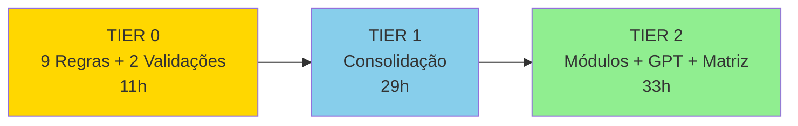

# PLAN-TAREFAS-EXPANDIDO 📋

> **Status**: 📋 PLANNING PHASE  
> **Versão**: 1.0.0  
> **Data**: 2025-11-16  
> **Total Tasks**: 31 (TIER 0: 11, TIER 1: 8, TIER 2: 12)  
> **Tempo Total Estimado**: ~73h (2 semanas, 1 dev full-time)

---

## 📊 Visão Geral

### Estrutura de TIERs



### Legenda de Status
- 📋 **Planejado**: Task definida, aguardando início
- ⏳ **Em Progresso**: Task sendo executada
- ✅ **Completo**: Task validada e aprovada
- ❌ **Bloqueado**: Dependências não atendidas
- ⚠️ **Atenção**: Requer decisão ou input

---

## 🎯 TIER 0: 9 Novas Regras + 2 Validações

**Objetivo**: Estabelecer fundação das regras 13-21 sem implementar código  
**Tempo Total**: 11h  
**Assignee Principal**: Dev  
**Status**: 📋 Planejado

---

### Task 0.1: Add Rules 13-21 to 03-RULES-GLOBAL.md 📝

#### Objetivo
Adicionar as 9 novas regras (13-21) ao arquivo `00-Config/03-RULES-GLOBAL.md`, mantendo formatação e coerência com regras 1-12 existentes.

#### Entradas
- **Rules 13-21**: Textos completos de [[00-Config/ARCHITECTURE-CONSOLIDACAO-EXPANDIDA#Regras 13-21]]
- **Arquivo existente**: `00-Config/03-RULES-GLOBAL.md` (regras 1-12)
- **Formatação padrão**: Markdown com emojis, wikilinks, exemplos

#### Saídas
- **03-RULES-GLOBAL.md** atualizado com:
  - Rules 13-21 após Rule 12
  - Cada regra com descrição, ≥2 exemplos práticos, ≥1 contra-exemplo
  - Wikilinks para [[06-Glossario-Tecnico/*]] onde aplicável
  - Seção "Stack Aplicável" em cada regra
  - Formatação consistente com Rules 1-12

#### Validação
- [ ] 21 regras visíveis no arquivo (contagem manual)
- [ ] Cada regra 13-21 com ≥2 exemplos e ≥1 contra-exemplo
- [ ] Wikilinks válidos (usar `[[` sintaxe correta)
- [ ] Formatação Markdown sem erros (lint)
- [ ] Warning de aprovação atualizado no final

#### Tempo Estimado
**4h** (1h por 2-3 regras, incluindo exemplos e formatação)

#### Dependências
**NONE** (task inicial, pode começar imediatamente)

#### Assignee
**Dev** (GPT-5.1 Codex)

#### Notas
- Seguir EXATAMENTE formatação das regras 1-12
- Não modificar regras 1-12 (apenas adicionar 13-21)
- Se dúvida em exemplos, invocar **Rule 16 (Regra de Ouro)** e perguntar
- Priorizar clareza sobre brevidade

---

### Task 0.2: Create 00-Config/04-PROTOCOLO-TASKS.md 📚

#### Objetivo
Criar documento completo (5-10 páginas) especificando o Protocolo .TASK com 3 fases obrigatórias: ANÁLISE, PLANO, EXECUÇÃO.

#### Entradas
- **Descrição do protocolo**: [[00-Config/ARCHITECTURE-CONSOLIDACAO-EXPANDIDA#Regra 15]]
- **Estrutura sugerida**: Seções em ARCHITECTURE-CONSOLIDACAO-EXPANDIDA.md
- **Exemplos de tasks**: Issues GitHub, histórico de tasks Trae

#### Saídas
- **04-PROTOCOLO-TASKS.md** com:
  - 5-10 páginas completas
  - 3 fases detalhadas (ANÁLISE, PLANO, EXECUÇÃO)
  - Templates executáveis para cada fase
  - ≥2 exemplos práticos (task simples e complexa)
  - Diagramas de fluxo (Mermaid)
  - Checklist de validação por fase
  - Integração com [[05-IA-e-Agents/06-Tarefas-Trae-e-Parallelismo]]

#### Validação
- [ ] Documento com 5-10 páginas (contagem de palavras ≥2000)
- [ ] 3 fases explícitas e executáveis
- [ ] ≥2 exemplos completos (código/estrutura de exemplo)
- [ ] ≥2 diagramas Mermaid (fluxo ANÁLISE→PLANO→EXECUÇÃO)
- [ ] Wikilinks válidos para agents, rules, glossário
- [ ] Dev consegue usar templates imediatamente (teste em 0.8)

#### Tempo Estimado
**3h** (1h por fase + exemplos e diagramas)

#### Dependências
- **0.1** (Rules 13-21 devem estar em RULES-GLOBAL.md)

#### Assignee
**Dev** (GPT-5.1 Codex)

#### Notas
- Protocolo deve ser CLARO e EXECUTÁVEL (não vago)
- Templates devem ser copy-paste ready
- Se fase não ficar clara, adicionar mais exemplos (não teoria)
- Referenciar [[00-Config/03-RULES-GLOBAL#12]] (Tasks Trae)

---

### Task 0.3: Create 00-Config/05-MODELO-MODULARIZACAO.md 🧩

#### Objetivo
Criar documento completo (8-12 páginas) especificando o padrão de modularização OBM com estrutura, checklist e exemplos.

#### Entradas
- **Descrição do padrão OBM**: [[00-Config/ARCHITECTURE-CONSOLIDACAO-EXPANDIDA#Regra 18]]
- **Estrutura de diretórios**: Template em ARCHITECTURE-CONSOLIDACAO-EXPANDIDA.md
- **Módulos existentes**: [[03-Modulos-OBM/README]], `obm-auth.md`, `obm-payments.md`
- **Stack Oficial**: [[04-Stacks-e-Infra/01-Stack-Oficial-OBM]]

#### Saídas
- **05-MODELO-MODULARIZACAO.md** com:
  - 8-12 páginas completas
  - Estrutura de diretórios padrão (`obm-*/`)
  - Checklist de conformidade (≥15 itens)
  - ≥3 exemplos completos (obm-auth, obm-payments, obm-chat)
  - Seção de anti-patterns (o que NÃO fazer)
  - Integração com Stack Oficial (NestJS, FastAPI, Next.js)
  - Templates de boilerplate (OpenAPI, README, package.json)
  - Troubleshooting comum

#### Validação
- [ ] Documento com 8-12 páginas (contagem de palavras ≥3500)
- [ ] Estrutura de diretórios clara e completa
- [ ] Checklist com ≥15 itens executáveis
- [ ] ≥3 exemplos práticos de módulos
- [ ] ≥5 anti-patterns documentados
- [ ] 100% compatível com Stack Oficial
- [ ] Wikilinks válidos para módulos, stacks, glossário

#### Tempo Estimado
**3h** (1h estrutura + 1h exemplos + 1h checklist e anti-patterns)

#### Dependências
- **0.1** (Rules 13-21 devem estar documentadas)

#### Assignee
**Dev** (GPT-5.1 Codex)

#### Notas
- Checklist deve ser copy-paste ready para validação de módulos
- Exemplos devem mostrar código real (não pseudocódigo)
- Anti-patterns críticos: prefixo errado, sem OpenAPI, sem testes
- Referenciar [[00-Config/03-RULES-GLOBAL#1]] (Nomenclatura)
- Referenciar [[00-Config/03-RULES-GLOBAL#6]] (Stack Fixa)

---

### Task 0.4: Update 05-IA-e-Agents/01-Arquitetura-de-Agents.md 🤖

#### Objetivo
Atualizar arquivo existente para incluir papéis detalhados (Architect/Dev/Executor), responsabilidades e handoffs explícitos.

#### Entradas
- **Arquivo existente**: `05-IA-e-Agents/01-Arquitetura-de-Agents.md` (versão atual)
- **Descrição de papéis**: [[00-Config/ARCHITECTURE-CONSOLIDACAO-EXPANDIDA#Regra 19]]
- **Protocolo .TASK**: `00-Config/04-PROTOCOLO-TASKS.md` (Task 0.2)

#### Saídas
- **01-Arquitetura-de-Agents.md** atualizado com:
  - Seção "Papéis" expandida (3-4 parágrafos por agent)
  - Seção "Responsabilidades" (lista de ≥5 itens por agent)
  - Seção "Handoffs" explícita (Architect→Dev, Dev→Executor)
  - Exemplos de workflows (≥2 cenários)
  - Integração com Protocolo .TASK
  - Diagramas de comunicação (Mermaid)
  - Wikilinks para agents individuais (02, 03, 04)

#### Validação
- [ ] 3 agents documentados (Architect, Dev, Executor)
- [ ] Cada agent com ≥5 responsabilidades claras
- [ ] Handoffs explícitos (o que passa, quando, como)
- [ ] ≥2 exemplos de workflows
- [ ] ≥1 diagrama Mermaid (fluxo de comunicação)
- [ ] Wikilinks válidos para agents e protocolo
- [ ] Coerente com [[05-IA-e-Agents/02-GPT5-Pro-Architect-Agent]]

#### Tempo Estimado
**2h** (1h papéis e responsabilidades + 1h handoffs e exemplos)

#### Dependências
- **0.1** (Rules 13-21 documentadas)
- **0.2** (Protocolo .TASK criado)

#### Assignee
**Dev** (GPT-5.1 Codex)

#### Notas
- Não deletar conteúdo existente (apenas expandir)
- Handoffs devem ser CLAROS (não "passar artefatos" - especificar quais)
- Exemplos devem mostrar interação real (não teórica)
- Referenciar [[00-Config/03-RULES-GLOBAL#16]] (Regra de Ouro)

---

### Task 0.5: Validate Zero Contradictions ✅

#### Objetivo
Validar que Rules 13-21 NÃO conflitam com Rules 1-12 nem entre si. Produzir relatório de validação.

#### Entradas
- **Rules 13-21**: `00-Config/03-RULES-GLOBAL.md` (Task 0.1)
- **Rules 1-12**: `00-Config/03-RULES-GLOBAL.md` (existentes)
- **Protocolo .TASK**: `00-Config/04-PROTOCOLO-TASKS.md` (Task 0.2)
- **Modelo Modularização**: `00-Config/05-MODELO-MODULARIZACAO.md` (Task 0.3)

#### Saídas
- **VALIDATION-REPORT.md** (temporário, em `/tmp/`) com:
  - Lista de 21 regras analisadas
  - Matriz de compatibilidade (21x21)
  - Conflitos detectados (se houver)
  - Recomendações de resolução
  - Status: GO/NO-GO

#### Validação
- [ ] 21 regras analisadas (100%)
- [ ] Matriz de compatibilidade completa
- [ ] 0 conflitos críticos detectados (GO) OU
- [ ] Conflitos documentados com solução proposta (NO-GO temporário)
- [ ] Relatório claro e executável
- [ ] Recomendações específicas (não vagas)

#### Tempo Estimado
**1h** (análise manual + criação de relatório)

#### Dependências
- **0.1** (Rules 13-21 adicionadas)
- **0.2** (Protocolo .TASK criado)
- **0.3** (Modelo Modularização criado)
- **0.4** (Arquitetura Agents atualizada)

#### Assignee
**Executor** (GPT-5)

#### Notas
- Se conflito detectado → PAUSAR e escalar para Architect
- Conflitos menores (ex: wording) → propor ajuste e continuar
- Conflitos críticos (ex: Stack Oficial incompatível) → NO-GO imediato
- Usar matriz booleana ou checklist (não narrativa longa)
- Referenciar [[00-Config/03-RULES-GLOBAL#5]] (Fonte da Verdade)

---

### Task 0.6: Update Wikilinks (Cross-references) 🔗

#### Objetivo
Atualizar todos wikilinks em arquivos criados/atualizados no TIER 0 para garantir navegação bidirecional.

#### Entradas
- **Arquivos do TIER 0**: 03-RULES-GLOBAL.md, 04-PROTOCOLO-TASKS.md, 05-MODELO-MODULARIZACAO.md, 01-Arquitetura-de-Agents.md
- **Glossário existente**: `06-Glossario-Tecnico/*`
- **Task 0.5**: Relatório de validação (sem conflitos)

#### Saídas
- **Wikilinks atualizados** em todos arquivos TIER 0
- **Cross-references bidirecionais** (se A → B, então B → A)
- **Glossário atualizado** (novos termos adicionados)
- **Lista de broken links** (se houver)

#### Validação
- [ ] 100% wikilinks válidos (sem `[[broken]]`)
- [ ] Cross-references bidirecionais verificados (≥10 pares)
- [ ] Novos termos adicionados ao glossário (≥5)
- [ ] Obsidian/Logseq valida links sem erros
- [ ] Relatório de broken links vazio

#### Tempo Estimado
**1h** (verificação automática + ajustes manuais)

#### Dependências
- **0.5** (Validação Zero Contradictions completa)

#### Assignee
**Dev** (GPT-5.1 Codex)

#### Notas
- Usar ferramenta de validação (Obsidian, script custom)
- Priorizar wikilinks críticos (Rules, Stack Oficial, Agents)
- Se termo não existe no glossário → criar entrada básica
- Referenciar [[00-Config/03-RULES-GLOBAL#4]] (Linkagem e Navegação)

---

### Task 0.7: Create Compliance Checklist ✔️

#### Objetivo
Criar checklist executável para validar conformidade de qualquer módulo, doc ou task com as 21 Rules.

#### Entradas
- **Rules 1-21**: `00-Config/03-RULES-GLOBAL.md` (Task 0.1)
- **Modelo Modularização**: `00-Config/05-MODELO-MODULARIZACAO.md` (Task 0.3)

#### Saídas
- **00-Config/07-Compliance-Checklist.md** com:
  - Checklist geral (≥30 itens) aplicável a qualquer entregável
  - Checklist por tipo (módulo, doc, task)
  - Priorização (crítico, recomendado, opcional)
  - Scoring system (0-100%)
  - Exemplos de uso

#### Validação
- [ ] Checklist com ≥30 itens executáveis
- [ ] Itens agrupados por categoria (Rules, Stack, Docs, Tests)
- [ ] Priorização clara (crítico vs opcional)
- [ ] Scoring system funcional (ex: 25/30 = 83%)
- [ ] ≥2 exemplos de uso (módulo OK, módulo NOK)
- [ ] Wikilinks para Rules e Modelo Modularização

#### Tempo Estimado
**1h** (criação de checklist + exemplos)

#### Dependências
- **0.1** (Rules 13-21 documentadas)

#### Assignee
**Dev** (GPT-5.1 Codex)

#### Notas
- Checklist deve ser copy-paste ready (formato Markdown checkbox)
- Itens críticos devem ser OBRIGATÓRIOS (ex: prefixo `obm-*`)
- Exemplos devem mostrar uso real (não teórico)
- Referenciar [[00-Config/03-RULES-GLOBAL#10]] (Validação e Confiabilidade)

---

### Task 0.8: Test Architect-Dev Handoff Protocol 🔄

#### Objetivo
Simular handoff Architect→Dev usando ARCHITECTURE-CONSOLIDACAO-EXPANDIDA.md e validar que Dev consegue começar trabalho.

#### Entradas
- **ARCHITECTURE-CONSOLIDACAO-EXPANDIDA.md**: Este documento
- **PLAN-TAREFAS-EXPANDIDO.md**: Lista de 31 tasks
- **Protocolo .TASK**: `00-Config/04-PROTOCOLO-TASKS.md` (Task 0.2)

#### Saídas
- **Handoff Test Report** (temporário, em `/tmp/`) com:
  - Status: SUCCESS/FAILURE
  - Checklist de entregáveis recebidos
  - Clareza dos documentos (escala 1-5)
  - Bloqueadores identificados (se houver)
  - Recomendações de melhoria

#### Validação
- [ ] Dev recebe 2 documentos (ARCHITECTURE, PLAN)
- [ ] Dev entende objetivo do TIER 0 (sim/não)
- [ ] Dev consegue começar Task 0.1 (sem perguntas)
- [ ] Dev sabe a quem escalar dúvidas (Architect)
- [ ] Protocolo .TASK é executável (testado em exemplo)
- [ ] Status: SUCCESS (GO para continuar)

#### Tempo Estimado
**1h** (leitura + simulação + relatório)

#### Dependências
- **0.2** (Protocolo .TASK criado)

#### Assignee
**Executor** (GPT-5)

#### Notas
- Simular como se fosse Dev "frio" (sem contexto prévio)
- Se FAILURE → identificar gaps e pausar para correção
- Teste deve ser realista (não teórico)
- Referenciar [[00-Config/ARCHITECTURE-CONSOLIDACAO-EXPANDIDA#Handoff]]

---

### Task 0.9: Document .TASK Phase Workflow 📊

#### Objetivo
Criar workflow visual explícito mostrando fluxo ANÁLISE→PLANO→EXECUÇÃO com pontos de decisão.

#### Entradas
- **Protocolo .TASK**: `00-Config/04-PROTOCOLO-TASKS.md` (Task 0.2)
- **Exemplos de tasks**: TIER 0 tasks (0.1-0.11)

#### Saídas
- **Seção "Workflow" adicionada a 04-PROTOCOLO-TASKS.md** com:
  - Diagrama Mermaid (fluxo completo)
  - Pontos de decisão (Go/No-Go, Bloqueios)
  - Entradas/saídas por fase
  - Exemplo walkthrough (task real do TIER 0)

#### Validação
- [ ] Diagrama Mermaid funcional (renderiza corretamente)
- [ ] 3 fases visíveis (ANÁLISE, PLANO, EXECUÇÃO)
- [ ] ≥2 pontos de decisão (ex: "Análise OK?" → sim/não)
- [ ] Exemplo walkthrough completo (≥1 task do TIER 0)
- [ ] Integrado ao arquivo 04-PROTOCOLO-TASKS.md

#### Tempo Estimado
**1h** (criação de diagrama + exemplo walkthrough)

#### Dependências
- **0.2** (Protocolo .TASK criado)

#### Assignee
**Dev** (GPT-5.1 Codex)

#### Notas
- Diagrama deve ser VISUAL e CLARO (não complexo)
- Pontos de decisão devem ser explícitos (não implícitos)
- Exemplo walkthrough deve usar Task 0.1 ou similar
- Referenciar [[00-Config/03-RULES-GLOBAL#15]] (Protocolo .TASK)

---

### Task 0.10: Validate Regra de Ouro Implementation 🛡️

#### Objetivo
Criar guia de implementação para Rule 16 (Regra de Ouro Martyn) especificando QUANDO perguntar antes de agir.

#### Entradas
- **Rule 16**: [[00-Config/03-RULES-GLOBAL#16]] (Task 0.1)
- **Exemplos de decisões**: Histórico de issues, PRs, tasks

#### Saídas
- **Seção "Regra de Ouro - Quando Usar" adicionada a 03-RULES-GLOBAL.md** com:
  - Lista de situações obrigatórias (≥5 cenários)
  - Lista de situações opcionais (≥3 cenários)
  - FAQ com decisões comuns (≥10 perguntas/respostas)
  - Flowchart de decisão (Mermaid)
  - Exemplos práticos (sim/não)

#### Validação
- [ ] ≥5 situações obrigatórias documentadas
- [ ] ≥3 situações opcionais documentadas
- [ ] FAQ com ≥10 Q&A práticos
- [ ] Flowchart funcional (renderiza)
- [ ] ≥3 exemplos práticos (quando perguntar, quando não)
- [ ] Claro quando invocar regra de ouro

#### Tempo Estimado
**1h** (lista de situações + FAQ + flowchart)

#### Dependências
- **0.1** (Rules 13-21 adicionadas)

#### Assignee
**Dev** (GPT-5.1 Codex)

#### Notas
- Situações obrigatórias: decisões arquiteturais, deletar código, modificar rules
- Situações opcionais: refatoração menor, ajustes de UI
- FAQ deve reduzir perguntas repetitivas (eficiência)
- Referenciar [[00-Config/03-RULES-GLOBAL#5]] (Fonte da Verdade)

---

### Task 0.11: Final Review (21 Rules Complete) 🎯

#### Objetivo
Revisão final do TIER 0 por Architect, validando todos critérios Go/No-Go para liberar TIER 1.

#### Entradas
- **Todos artefatos TIER 0**: Tasks 0.1-0.10 completas
- **Critérios Go/No-Go**: [[00-Config/ARCHITECTURE-CONSOLIDACAO-EXPANDIDA#Success Criteria]]

#### Saídas
- **TIER-0-FINAL-REPORT.md** (temporário, em `/tmp/`) com:
  - Status: GO/NO-GO
  - Checklist de critérios (todos ✅ ou ❌)
  - Métricas de qualidade (KPIs)
  - Recomendações para TIER 1
  - Decisão final: Prosseguir ou Bloquear

#### Validação
- [ ] 21 rules documentadas em 03-RULES-GLOBAL.md ✅
- [ ] 0 contradições detectadas (Task 0.5) ✅
- [ ] 100% wikilinks válidos (Task 0.6) ✅
- [ ] 04-PROTOCOLO-TASKS.md completo e testado ✅
- [ ] 05-MODELO-MODULARIZACAO.md completo ✅
- [ ] Handoff testado (Task 0.8) ✅
- [ ] Compliance Checklist pronto (Task 0.7) ✅
- [ ] Status: **GO** (libera TIER 1)

#### Tempo Estimado
**1h** (revisão + relatório + decisão)

#### Dependências
- **0.1-0.10** (todas tasks TIER 0 completas)

#### Assignee
**Architect** (GPT-5 Pro)

#### Notas
- Se NO-GO → identificar bloqueadores e corrigir antes de TIER 1
- Se GO → Dev pode começar TIER 1 imediatamente
- Relatório deve ser CONCISO (1-2 páginas)
- Referenciar [[00-Config/ARCHITECTURE-CONSOLIDACAO-EXPANDIDA#Success Metrics]]

---

## 🔄 TIER 1: Consolidação Original

**Objetivo**: Consolidar e melhorar documentação das regras 1-12 existentes  
**Tempo Total**: 29h  
**Assignee Principal**: Dev  
**Status**: 📋 Planejado (aguarda TIER 0)

---

### Task 1.1: Consolidate Rules 1-4 📚

#### Objetivo
Consolidar e expandir Rules 1-4 (Nomenclatura, Contratos, Segurança, Linkagem) com exemplos e wikilinks atualizados.

#### Entradas
- **Rules 1-4**: `00-Config/03-RULES-GLOBAL.md` (existentes)
- **Stack Oficial**: [[04-Stacks-e-Infra/01-Stack-Oficial-OBM]]
- **Glossário**: [[06-Glossario-Tecnico/*]]

#### Saídas
- **Rules 1-4 expandidas** com:
  - ≥2 exemplos práticos por regra (novos ou melhorados)
  - ≥1 contra-exemplo por regra
  - Wikilinks atualizados para glossário e stacks
  - Seção "Stack Aplicável" adicionada (se não houver)
  - Referências cruzadas para Rules 13-21 (se aplicável)

#### Validação
- [ ] Rules 1-4 com ≥2 exemplos cada
- [ ] Wikilinks válidos (100%)
- [ ] Formatação consistente
- [ ] Nenhuma contradição com Rules 13-21

#### Tempo Estimado
**4h** (1h por regra)

#### Dependências
- **0.11** (TIER 0 completo, GO para TIER 1)

#### Assignee
**Dev** (GPT-5.1 Codex)

#### Notas
- Não deletar conteúdo existente (apenas melhorar)
- Adicionar exemplos do ecossistema OBM real (obm-auth, obm-payments)
- Referenciar [[00-Config/03-RULES-GLOBAL#14]] (IA Cirúrgica)

---

### Task 1.2: Consolidate Rules 5-8 📚

#### Objetivo
Consolidar e expandir Rules 5-8 (Fonte da Verdade, Stack Fixa, Conversão Open-Source, Ignore/Index).

#### Entradas
- **Rules 5-8**: `00-Config/03-RULES-GLOBAL.md` (existentes)
- **Stack Oficial**: [[04-Stacks-e-Infra/01-Stack-Oficial-OBM]]
- **Rule 13**: Open-Source Ético (referência cruzada)

#### Saídas
- **Rules 5-8 expandidas** (mesmo padrão de 1.1)

#### Validação
- [ ] Rules 5-8 com ≥2 exemplos cada
- [ ] Wikilinks válidos (100%)
- [ ] Referência cruzada com Rule 13 (Open-Source Ético)
- [ ] Nenhuma contradição

#### Tempo Estimado
**4h** (1h por regra)

#### Dependências
- **0.11** (TIER 0 completo)

#### Assignee
**Dev** (GPT-5.1 Codex)

---

### Task 1.3: Consolidate Rules 9-12 📚

#### Objetivo
Consolidar e expandir Rules 9-12 (Cache Hygiene, Validação, Auto-Limpeza, Tasks Trae).

#### Entradas
- **Rules 9-12**: `00-Config/03-RULES-GLOBAL.md` (existentes)
- **Protocolo .TASK**: [[00-Config/04-PROTOCOLO-TASKS]] (Task 0.2)
- **Rule 15**: Protocolo .TASK (referência cruzada)

#### Saídas
- **Rules 9-12 expandidas** (mesmo padrão de 1.1)

#### Validação
- [ ] Rules 9-12 com ≥2 exemplos cada
- [ ] Wikilinks válidos (100%)
- [ ] Referência cruzada com Rule 15 (Protocolo .TASK)
- [ ] Nenhuma contradição

#### Tempo Estimado
**4h** (1h por regra)

#### Dependências
- **0.11** (TIER 0 completo)

#### Assignee
**Dev** (GPT-5.1 Codex)

---

### Task 1.4: Create Cross-Reference Index 🗂️

#### Objetivo
Criar índice de referências cruzadas mostrando relações entre as 21 rules e outros documentos.

#### Entradas
- **Rules 1-21**: `00-Config/03-RULES-GLOBAL.md` (consolidadas)
- **Todos arquivos 00-Config**: Protocolo, Modularização, etc.

#### Saídas
- **00-Config/08-Cross-Reference-Index.md** com:
  - Matriz de referências (21 rules vs documentos)
  - Lista de dependências entre rules
  - Índice alfabético de conceitos
  - Wikilinks bidirecionais

#### Validação
- [ ] Matriz completa (21 rules vs ≥10 documentos)
- [ ] Índice alfabético com ≥30 conceitos
- [ ] 100% wikilinks válidos
- [ ] Navegação bidirecional funcional

#### Tempo Estimado
**3h** (criação de matriz + índice)

#### Dependências
- **1.1-1.3** (Rules 1-12 consolidadas)

#### Assignee
**Dev** (GPT-5.1 Codex)

---

### Task 1.5: Update Dossier with 21 Rules 📖

#### Objetivo
Atualizar [[Dossie_Chat_Organizado_Anotado.md]] com referências às 21 rules e integração completa.

#### Entradas
- **Dossier existente**: `Dossie_Chat_Organizado_Anotado.md`
- **Rules 1-21**: Consolidadas em TIER 0/1

#### Saídas
- **Dossier atualizado** com:
  - Seção "21 Rules Global" (resumo)
  - Wikilinks para cada rule
  - Exemplos de aplicação das rules no histórico
  - Cross-references para protocolo, modularização

#### Validação
- [ ] Seção "21 Rules Global" adicionada
- [ ] Wikilinks para todas 21 rules
- [ ] ≥3 exemplos de aplicação
- [ ] Coerente com conteúdo existente

#### Tempo Estimado
**5h** (leitura do dossier + atualização + exemplos)

#### Dependências
- **1.1-1.4** (Rules consolidadas + índice)

#### Assignee
**Dev** (GPT-5.1 Codex)

---

### Task 1.6: Create Glossário Expandido 📚

#### Objetivo
Expandir [[06-Glossario-Tecnico/*]] com novos termos das Rules 13-21 e Protocolo .TASK.

#### Entradas
- **Glossário existente**: `06-Glossario-Tecnico/*`
- **Novos termos**: Lista em [[00-Config/ARCHITECTURE-CONSOLIDACAO-EXPANDIDA#Glossário]]

#### Saídas
- **≥15 novos termos** adicionados ao glossário:
  - Protocolo .TASK
  - Regra de Ouro Martyn
  - Padrão OBM
  - Handoff
  - IA Cirúrgica
  - ADR
  - DAG
  - Bloqueador
  - Rastreabilidade
  - Quick Reference
  - SRP
  - FFI
  - Idempotência
  - Compliance Checklist
  - Stack Oficial

#### Validação
- [ ] ≥15 novos termos adicionados
- [ ] Cada termo com definição, exemplo, wikilinks
- [ ] Wikilinks bidirecionais (termo ↔ rules)
- [ ] Formatação consistente com glossário existente

#### Tempo Estimado
**4h** (1-2h por 5 termos)

#### Dependências
- **1.1-1.5** (Rules consolidadas + dossier atualizado)

#### Assignee
**Dev** (GPT-5.1 Codex)

---

### Task 1.7: Validate All Wikilinks ✅

#### Objetivo
Validar TODOS wikilinks em documentação (00-Config, 05-IA-e-Agents, 03-Modulos-OBM) após TIER 0+1.

#### Entradas
- **Todos arquivos atualizados**: TIER 0 + TIER 1
- **Ferramenta de validação**: Obsidian, script custom

#### Saídas
- **Relatório de validação** com:
  - Total de wikilinks verificados
  - Broken links (se houver)
  - Cross-references bidirecionais verificados
  - Status: PASS/FAIL

#### Validação
- [ ] 100% wikilinks válidos (0 broken)
- [ ] Cross-references bidirecionais OK
- [ ] Relatório gerado
- [ ] Status: PASS

#### Tempo Estimado
**3h** (validação automática + correções manuais)

#### Dependências
- **1.1-1.6** (Todos updates de TIER 1 completos)

#### Assignee
**Executor** (GPT-5)

---

### Task 1.8: Generate Final Report 📊

#### Objetivo
Gerar relatório final do TIER 1 com métricas, aprendizados e recomendações para TIER 2.

#### Entradas
- **Todos artefatos TIER 1**: Tasks 1.1-1.7 completas
- **Métricas**: [[00-Config/ARCHITECTURE-CONSOLIDACAO-EXPANDIDA#Success Metrics]]

#### Saídas
- **TIER-1-FINAL-REPORT.md** com:
  - Status: COMPLETE/INCOMPLETE
  - Métricas de qualidade (KPIs)
  - Aprendizados e best practices
  - Recomendações para TIER 2
  - Decisão final: Prosseguir

#### Validação
- [ ] Relatório completo (≥3 páginas)
- [ ] Todas métricas mensuradas
- [ ] ≥3 aprendizados documentados
- [ ] Recomendações específicas para TIER 2
- [ ] Status: COMPLETE

#### Tempo Estimado
**2h** (análise + relatório)

#### Dependências
- **1.1-1.7** (Todas tasks TIER 1 completas)

#### Assignee
**Architect** (GPT-5 Pro)

---

## 🚀 TIER 2: Módulos + GPT + Matriz

**Objetivo**: Implementar módulos práticos, guias GPT e matriz de integração  
**Tempo Total**: 33h  
**Assignee Principal**: Dev + Executor  
**Status**: 📋 Planejado (aguarda TIER 1)

---

### Task 2.1: Create obm-template (Starter) 🧩

#### Objetivo
Criar módulo template `obm-template` como boilerplate para novos módulos OBM.

#### Entradas
- **Modelo Modularização**: [[00-Config/05-MODELO-MODULARIZACAO]] (Task 0.3)
- **Stack Oficial**: [[04-Stacks-e-Infra/01-Stack-Oficial-OBM]]
- **Módulos existentes**: obm-auth, obm-payments (referência)

#### Saídas
- **03-Modulos-OBM/obm-template/** com:
  - Estrutura de diretórios completa
  - README.md template
  - OpenAPI spec template
  - package.json / requirements.txt templates
  - Dockerfile template
  - docker-compose.yml template
  - Tests templates (unit, integration)
  - CI/CD template (.github/workflows)

#### Validação
- [ ] Estrutura completa (≥10 arquivos)
- [ ] Templates copy-paste ready
- [ ] 100% compatível com Stack Oficial
- [ ] Compliance Checklist passa (Task 0.7)
- [ ] Documentação clara (README com ≥500 palavras)

#### Tempo Estimado
**4h** (criação de estrutura + templates + docs)

#### Dependências
- **1.8** (TIER 1 completo)

#### Assignee
**Dev** (GPT-5.1 Codex)

---

### Task 2.2: Create 4 New OBM Modules 🧩

#### Objetivo
Criar 4 novos módulos OBM usando obm-template como base.

**Módulos sugeridos**:
1. **obm-webhooks**: Gerenciamento de webhooks
2. **obm-audit**: Auditoria e logs de sistema
3. **obm-scheduler**: Agendamento de tarefas (cron)
4. **obm-config**: Gerenciamento centralizado de configs

#### Entradas
- **obm-template**: Task 2.1
- **Modelo Modularização**: [[00-Config/05-MODELO-MODULARIZACAO]]

#### Saídas
- **4 novos módulos** em `03-Modulos-OBM/`:
  - obm-webhooks/
  - obm-audit/
  - obm-scheduler/
  - obm-config/
- Cada módulo com estrutura completa (template + customizações)
- OpenAPI specs customizadas
- READMEs específicos

#### Validação
- [ ] 4 módulos criados
- [ ] Cada módulo com estrutura completa
- [ ] OpenAPI specs válidas (validator)
- [ ] READMEs com ≥500 palavras cada
- [ ] Compliance Checklist passa para todos

#### Tempo Estimado
**8h** (2h por módulo)

#### Dependências
- **2.1** (obm-template criado)

#### Assignee
**Dev** (GPT-5.1 Codex)

---

### Task 2.3: Create Conexoes-Entre-Modulos.md 🔗

#### Objetivo
Criar documento mostrando conexões e integrações entre módulos OBM.

#### Entradas
- **Módulos existentes**: obm-auth, obm-payments, obm-chat, etc.
- **Novos módulos**: obm-webhooks, obm-audit, obm-scheduler, obm-config

#### Saídas
- **03-Modulos-OBM/99-Conexoes-Entre-Modulos.md** com:
  - Matriz de dependências (módulo x módulo)
  - Diagramas de integração (Mermaid)
  - Fluxos comuns (≥3 cenários)
  - Exemplos de composição

#### Validação
- [ ] Matriz completa (≥15 módulos)
- [ ] ≥3 diagramas Mermaid
- [ ] ≥3 fluxos documentados
- [ ] ≥2 exemplos de composição

#### Tempo Estimado
**3h** (análise + matriz + diagramas)

#### Dependências
- **2.2** (4 novos módulos criados)

#### Assignee
**Dev** (GPT-5.1 Codex)

---

### Task 2.4: Create GPT-5-Pro-Integration.md 🤖

#### Objetivo
Criar guia de integração do GPT-5 Pro como Architect Agent no ecossistema.

#### Entradas
- **Arquitetura de Agents**: [[05-IA-e-Agents/01-Arquitetura-de-Agents]] (Task 0.4)
- **Rules 1-21**: Consolidadas
- **Protocolo .TASK**: [[00-Config/04-PROTOCOLO-TASKS]]

#### Saídas
- **05-IA-e-Agents/02-GPT-5-Pro-Integration.md** com:
  - Configuração do GPT-5 Pro
  - Prompts otimizados (≥5 templates)
  - Integração com Trae/GitHub Actions
  - Exemplos de uso em projetos reais
  - Troubleshooting comum

#### Validação
- [ ] Documento completo (4-6 páginas)
- [ ] ≥5 prompts otimizados
- [ ] ≥2 exemplos práticos
- [ ] Integração Trae/GitHub documentada
- [ ] Troubleshooting com ≥5 problemas comuns

#### Tempo Estimado
**3h** (criação de guia + prompts + exemplos)

#### Dependências
- **1.8** (TIER 1 completo)

#### Assignee
**Architect** (GPT-5 Pro)

---

### Task 2.5: Update Receitas-de-Prompt 📝

#### Objetivo
Atualizar [[05-IA-e-Agents/05-Receitas-de-Prompt-Para-Agents]] com novos prompts das Rules 13-21.

#### Entradas
- **Receitas existentes**: `05-IA-e-Agents/05-Receitas-de-Prompt-Para-Agents.md`
- **Rules 13-21**: Consolidadas
- **GPT-5-Pro-Integration**: Task 2.4

#### Saídas
- **05-Receitas-de-Prompt-Para-Agents.md** atualizado com:
  - ≥5 novas receitas (Rules 13-21)
  - Prompts para Protocolo .TASK
  - Prompts para Regra de Ouro
  - Exemplos práticos

#### Validação
- [ ] ≥5 novas receitas adicionadas
- [ ] Receitas testadas (funcionam)
- [ ] Exemplos com output esperado
- [ ] Wikilinks válidos

#### Tempo Estimado
**2h** (criação de receitas + testes)

#### Dependências
- **2.4** (GPT-5-Pro-Integration criado)

#### Assignee
**Dev** (GPT-5.1 Codex)

---

### Task 2.6: Create Integration Matrix 📊

#### Objetivo
Criar matriz de integração mostrando compatibilidade entre módulos, stacks e features.

#### Entradas
- **Módulos**: Todos (existentes + novos)
- **Stacks**: [[04-Stacks-e-Infra/01-Stack-Oficial-OBM]]
- **Conexões**: [[03-Modulos-OBM/99-Conexoes-Entre-Modulos]] (Task 2.3)

#### Saídas
- **00-Config/09-Integration-Matrix.md** com:
  - Matriz módulo x stack (compatibilidade)
  - Matriz módulo x feature (suporte)
  - Matriz módulo x módulo (integração)
  - Legenda e notas

#### Validação
- [ ] 3 matrizes completas
- [ ] Legenda clara
- [ ] ≥15 módulos mapeados
- [ ] 100% compatibilidade com Stack Oficial

#### Tempo Estimado
**3h** (criação de matrizes + análise)

#### Dependências
- **2.2** (4 novos módulos criados)
- **2.3** (Conexões documentadas)

#### Assignee
**Dev** (GPT-5.1 Codex)

---

### Task 2.7: Test Module Interop ✅

#### Objetivo
Testar interoperabilidade entre módulos OBM (autenticação, comunicação, erros).

#### Entradas
- **Módulos**: Todos (existentes + novos)
- **Protocolo Orbit OBM**: [[00-Config/05-Protocolo-Orbit-OBM]]

#### Saídas
- **Relatório de testes** com:
  - Cenários testados (≥5)
  - Resultados (PASS/FAIL)
  - Issues identificados
  - Recomendações de correção

#### Validação
- [ ] ≥5 cenários testados
- [ ] Todos cenários PASS OU issues documentados
- [ ] Relatório claro e executável
- [ ] Recomendações específicas

#### Tempo Estimado
**3h** (setup + testes + relatório)

#### Dependências
- **2.6** (Integration Matrix criada)

#### Assignee
**Executor** (GPT-5)

---

### Task 2.8: Document Deployment Pipeline 🚀

#### Objetivo
Documentar pipeline de deploy para módulos OBM (Docker, CI/CD, observability).

#### Entradas
- **Stack Oficial**: [[04-Stacks-e-Infra/01-Stack-Oficial-OBM]]
- **CI/CD existente**: [[04-Stacks-e-Infra/08-CI-CD-Pipeline]]

#### Saídas
- **07-Receitas-e-Playbooks/Deploy-OBM-Modules.md** com:
  - Pipeline step-by-step
  - Docker/Docker Compose configs
  - CI/CD configs (GitHub Actions)
  - Observabilidade (logs, metrics)
  - Troubleshooting

#### Validação
- [ ] Pipeline completo documentado
- [ ] ≥2 exemplos práticos
- [ ] CI/CD configs prontos (copy-paste)
- [ ] Observabilidade integrada
- [ ] Troubleshooting com ≥5 problemas comuns

#### Tempo Estimado
**2h** (documentação + configs)

#### Dependências
- **2.7** (Testes de interop completos)

#### Assignee
**Dev** (GPT-5.1 Codex)

---

### Task 2.9: Create CI/CD Validation ✅

#### Objetivo
Criar scripts de validação automática para CI/CD (compliance, testes, security).

#### Entradas
- **Compliance Checklist**: [[00-Config/07-Compliance-Checklist]] (Task 0.7)
- **Pipeline**: [[07-Receitas-e-Playbooks/Deploy-OBM-Modules]] (Task 2.8)

#### Saídas
- **scripts/validate-compliance.sh** (ou Python)
- **scripts/run-tests.sh**
- **scripts/security-scan.sh**
- **.github/workflows/compliance-check.yml**

#### Validação
- [ ] 3 scripts funcionais
- [ ] GitHub Actions workflow funcional
- [ ] Scripts testados em ≥1 módulo
- [ ] Documentação de uso

#### Tempo Estimado
**2h** (criação de scripts + workflow)

#### Dependências
- **2.8** (Pipeline documentado)

#### Assignee
**Dev** (GPT-5.1 Codex)

---

### Task 2.10: Final Security Audit 🔒

#### Objetivo
Auditoria de segurança final dos módulos e documentação criados no TIER 2.

#### Entradas
- **Módulos**: Todos (existentes + novos)
- **Rules de Segurança**: [[00-Config/03-RULES-GLOBAL#3]]
- **Protocolo Orbit OBM**: [[00-Config/05-Protocolo-Orbit-OBM]]

#### Saídas
- **Relatório de auditoria** com:
  - Checklist de segurança (≥20 itens)
  - Vulnerabilidades identificadas (se houver)
  - Recomendações de correção
  - Status: PASS/FAIL

#### Validação
- [ ] Checklist completo (≥20 itens)
- [ ] 0 vulnerabilidades críticas OU documentadas com correção
- [ ] Relatório claro
- [ ] Status: PASS

#### Tempo Estimado
**1h** (auditoria + relatório)

#### Dependências
- **2.1-2.9** (Todos artefatos TIER 2)

#### Assignee
**Executor** (GPT-5)

---

### Task 2.11: Performance Benchmarks ⚡

#### Objetivo
Realizar benchmarks de performance dos módulos OBM (latência, throughput, recursos).

#### Entradas
- **Módulos**: Todos (existentes + novos)
- **Stack Oficial**: [[04-Stacks-e-Infra/01-Stack-Oficial-OBM]]

#### Saídas
- **Relatório de benchmarks** com:
  - Métricas por módulo (latência, throughput, CPU, RAM)
  - Comparações (baseline vs atual)
  - Gargalos identificados
  - Recomendações de otimização

#### Validação
- [ ] ≥4 módulos testados
- [ ] Métricas completas (latência, throughput, recursos)
- [ ] Gargalos identificados (se houver)
- [ ] Recomendações específicas

#### Tempo Estimado
**1h** (setup + testes + análise)

#### Dependências
- **2.10** (Security Audit completo)

#### Assignee
**Executor** (GPT-5)

---

### Task 2.12: Stakeholder Review 🎯

#### Objetivo
Revisão final por Architect e stakeholder (Martyn) para aprovação do projeto completo.

#### Entradas
- **Todos artefatos**: TIER 0 + TIER 1 + TIER 2
- **Métricas**: Success Metrics atingidos
- **Relatórios**: Validação, Auditoria, Benchmarks

#### Saídas
- **PROJECT-FINAL-REPORT.md** com:
  - Status: COMPLETE
  - Resumo executivo
  - Métricas finais (KPIs)
  - Aprendizados e best practices
  - Próximos passos (roadmap)

#### Validação
- [ ] Todos TIERs completos (0, 1, 2)
- [ ] Success Criteria atingidos (100%)
- [ ] 0 bloqueadores críticos
- [ ] Aprovação de Martyn (stakeholder)
- [ ] Status: APPROVED

#### Tempo Estimado
**1h** (revisão + relatório + aprovação)

#### Dependências
- **2.1-2.11** (Todas tasks TIER 2 completas)

#### Assignee
**Architect** (GPT-5 Pro)

---

## 📊 Resumo de TIERs

### TIER 0: Foundation (11h)
```
0.1 → 0.2 → 0.5 → 0.6 → 0.11
      ↓     ↑
0.3 → 0.4 → ↑
      
0.7, 0.8, 0.9, 0.10 (paralelos)
```

### TIER 1: Consolidation (29h)
```
0.11 → 1.1, 1.2, 1.3 (paralelos) → 1.4 → 1.5 → 1.6 → 1.7 → 1.8
```

### TIER 2: Implementation (33h)
```
1.8 → 2.1 → 2.2 → 2.3 → 2.6 → 2.7 → 2.8 → 2.9 → 2.10 → 2.11 → 2.12
      ↓
1.8 → 2.4 → 2.5
```

---

## 📈 Tracking e Métricas

### Tracking Template

| Task | Status | Assignee | Tempo Estimado | Tempo Real | Bloqueadores |
|------|--------|----------|----------------|------------|--------------|
| 0.1 | 📋 | Dev | 4h | - | - |
| 0.2 | 📋 | Dev | 3h | - | 0.1 |
| ... | ... | ... | ... | ... | ... |

### KPIs de Progresso

- **Tasks Completas**: 0/31 (0%)
- **Tempo Gasto**: 0h/73h (0%)
- **Bloqueadores Ativos**: 0
- **Riscos Críticos**: 0

### Alertas

- ⚠️ **WARNING**: Se task leva >150% do tempo estimado → escalar
- ❌ **BLOCKER**: Se dependência não atende → pausar e resolver
- 🔴 **CRITICAL**: Se contradição detectada → STOP e escalar para Architect

---

## 🎯 Próximos Passos

### Immediate Actions (Após Aprovação)
1. ✅ Dev lê ambos documentos (ARCHITECTURE + PLAN)
2. ✅ Dev inicia Task 0.1 (Add Rules 13-21 to RULES-GLOBAL.md)
3. ⏱️ Dev reporta progresso diariamente via `report_progress`
4. 🚨 Dev escala bloqueadores imediatamente (Regra de Ouro)

### Handoff Protocol
- **Architect → Dev**: ARCHITECTURE.md + PLAN.md (agora)
- **Dev → Executor**: Código implementado + testes (após cada TIER)
- **Executor → Architect**: Relatórios de validação (após cada TIER)

---

## 📝 Notas Finais

### Aprovação Obrigatória
> [!warning] APROVAÇÃO NECESSÁRIA
> Este plano requer aprovação explícita do responsável pelo projeto (Martyn) antes de qualquer implementação.

### Rastreabilidade
- **Issue**: {{ISSUE_NUMBER}} (a ser preenchido)
- **PR**: {{PR_NUMBER}} (a ser preenchido)
- **Versão**: 1.0.0 (inicial)
- **Última Atualização**: 2025-11-16

### Referências
- [[00-Config/ARCHITECTURE-CONSOLIDACAO-EXPANDIDA]] (documento irmão)
- [[00-Config/03-RULES-GLOBAL]] (regras 1-12 existentes)
- [[00-Config/04-PROTOCOLO-TASKS]] (a ser criado em 0.2)
- [[00-Config/05-MODELO-MODULARIZACAO]] (a ser criado em 0.3)

---

**Status Final**: 📋 PRONTO PARA APROVAÇÃO  
**Total Tasks**: 31 (TIER 0: 11, TIER 1: 8, TIER 2: 12)  
**Tempo Total**: ~73h (2 semanas)  
**Próximo**: Dev inicia Task 0.1 após aprovação
