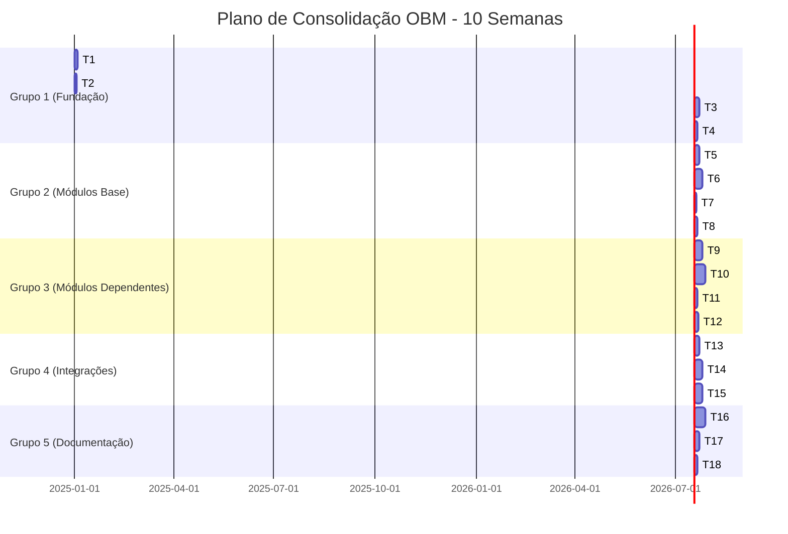

# 📋 PLAN-TAREFAS.md

> **Plano Executável de Tarefas** — Lista ordenada de tarefas para consolidação de RULES GLOBAL, criação de novos módulos OBM e atualização do dossiê.

---

## 📑 Índice

1. [Como Usar Este Plano](#como-usar-este-plano)
2. [Visão Geral](#visão-geral)
3. [Grupos de Tarefas](#grupos-de-tarefas)
4. [Tarefas Detalhadas](#tarefas-detalhadas)
5. [Estimativas Consolidadas](#estimativas-consolidadas)
6. [Métricas de Progresso](#métricas-de-progresso)

---

## 🎯 Como Usar Este Plano

### Para Desenvolvedores

1. **Siga a ordem**: As tarefas estão ordenadas por dependências
2. **Verifique pré-requisitos**: Cada tarefa lista suas dependências
3. **Marque conclusão**: Atualize checkboxes ao completar
4. **Reporte issues**: Documente desvios e bloqueios em [[99-Log-e-Historico/...]]

### Para Gerentes de Projeto

1. **Acompanhe progresso**: Use seção [Métricas de Progresso](#métricas-de-progresso)
2. **Ajuste prioridades**: Tarefas marcadas 🔴 são críticas
3. **Gerencie riscos**: Consulte [[00-Config/ARCHITECTURE-CONSOLIDACAO#gaps-e-riscos-identificados]]

### Para IA Agents (Trae)

1. **Tarefas atômicas**: Cada task é independente e executável
2. **Context files**: Listados em cada tarefa
3. **Validação**: Sempre verificar critérios de aceitação

---

## 📊 Visão Geral

### Estatísticas

- **Total de tarefas**: 30
- **Tarefas críticas** (🔴): 8
- **Tarefas importantes** (🟡): 14
- **Tarefas opcionais** (🟢): 8
- **Duração estimada**: 8-10 semanas

### Roadmap Visual

---

## 🗂️ Grupos de Tarefas

### Grupo 1: Fundação (Semana 1-2)
**Objetivo**: Estabelecer base arquitetural e configurar ferramentas

- T1: Consolidar e Validar RULES GLOBAL
- T2: Configurar GPT-5 Pro no Trae
- T3: Estruturar Dossiê (Prioridade Alta)
- T4: Completar Glossário Técnico
- T5: Criar Template de Módulo OBM

**Status**: ⏳ Pendente  
**Bloqueadores**: Nenhum  
**Saída**: Infraestrutura de documentação pronta

---

### Grupo 2: Módulos Base (Semana 2-4)
**Objetivo**: Implementar módulos fundamentais sem dependências complexas

- T6: Implementar obm-storage (MVP)
- T7: Implementar obm-subscriptions (MVP)
- T8: Testes e Documentação obm-storage
- T9: Testes e Documentação obm-subscriptions

**Status**: ⏳ Pendente  
**Bloqueadores**: Grupo 1 (T1)  
**Saída**: 2 módulos funcionais e testados

---

### Grupo 3: Módulos Dependentes (Semana 4-7)
**Objetivo**: Implementar módulos que dependem de Grupo 2

- T10: Implementar obm-media (MVP)
- T11: Implementar obm-cms (MVP)
- T12: Testes e Documentação obm-media
- T13: Testes e Documentação obm-cms
- T14: Implementar obm-webhooks (Opcional)

**Status**: ⏳ Pendente  
**Bloqueadores**: Grupo 2 (T6, T8)  
**Saída**: 2-3 módulos funcionais e testados

---

### Grupo 4: Integrações e SDKs (Semana 7-9)
**Objetivo**: Conectar módulos e gerar SDKs

- T15: Criar Matriz de Integrações Completa
- T16: Gerar SDKs TypeScript (todos módulos)
- T17: Gerar SDKs Python (todos módulos)
- T18: Testes de Integração End-to-End
- T19: Configurar API Gateway (Opcional)

**Status**: ⏳ Pendente  
**Bloqueadores**: Grupo 3  
**Saída**: Ecossistema integrado com SDKs

---

### Grupo 5: Documentação e Validação (Semana 9-10)
**Objetivo**: Consolidar documentação e validar entrega

- T20: Enriquecer Dossiê (39 blocos)
- T21: Criar Runbooks Operacionais
- T22: Validar RULES GLOBAL em Todos Módulos
- T23: Gerar Relatório de Dependências
- T24: Revisão e Aprovação Final

**Status**: ⏳ Pendente  
**Bloqueadores**: Grupos 1-4  
**Saída**: Documentação completa e aprovada

---

## 📝 Tarefas Detalhadas

---

### 🔴 T1: Consolidar e Validar RULES GLOBAL

**Prioridade**: 🔴 Crítica  
**Grupo**: 1 (Fundação)  
**Estimativa**: 3 dias  
**Responsável**: Arquiteto + IA (GPT-5 Pro)

#### Objetivo
Garantir que as 12 RULES GLOBAL estão completas, compreendidas e servirão como referência única para todos os módulos.

#### Entradas
- [[00-Config/03-RULES-GLOBAL]] (versão atual)
- `Dossie_Chat_Organizado_Anotado.md` (contexto de decisões)
- Feedback de desenvolvedores (se houver)

#### Tarefas
- [ ] Revisar cada uma das 12 regras para clareza
- [ ] Adicionar exemplos práticos de conformidade/não-conformidade
- [ ] Criar checklist de validação automática
- [ ] Documentar exceções permitidas (se houver)
- [ ] Linkar para glossário técnico todos os termos
- [ ] Adicionar seção "Como Aplicar" para cada regra

#### Saídas
- [ ] `03-RULES-GLOBAL.md` atualizado
- [ ] `RULES-CHECKLIST.md` (checklist de validação)
- [ ] Exemplos em `07-Receitas-e-Playbooks/RULES-Examples.md`

#### Validação
- [ ] Todas as 12 regras têm exemplo prático
- [ ] Checklist testado em 2 módulos existentes
- [ ] Zero wikilinks quebrados
- [ ] Revisão aprovada por stakeholder

#### Dependências
- Nenhuma (primeira tarefa)

#### Riscos
- ⚠️ Regras ambíguas podem causar retrabalho futuro
- **Mitigação**: Validar com exemplos reais de módulos existentes

---

### 🟡 T2: Configurar GPT-5 Pro no Trae

**Prioridade**: 🟡 Importante  
**Grupo**: 1 (Fundação)  
**Estimativa**: 2 dias  
**Responsável**: DevOps + Arquiteto

#### Objetivo
Configurar 3 agents IA no Trae (Architect, Codex Dev, Reviewer) para automatizar planejamento e implementação.

#### Entradas
- [[00-Config/ARCHITECTURE-CONSOLIDACAO#gpt-5-pro-integration-guide]]
- Credenciais OpenAI API
- Trae instalado e configurado

#### Tarefas
- [ ] Criar conta OpenAI e gerar API key
- [ ] Configurar agent "GPT-5 Pro Architect" no Trae
- [ ] Configurar agent "GPT-5.1 Codex Dev" no Trae
- [ ] Configurar agent "GPT-5.1 Reviewer" no Trae
- [ ] Testar cada agent com tarefa simples
- [ ] Documentar custo real vs. estimado

#### Saídas
- [ ] `.trae/agents/gpt-5-pro-architect.yaml`
- [ ] `.trae/agents/gpt-5-1-codex-dev.yaml`
- [ ] `.trae/agents/gpt-5-1-reviewer.yaml`
- [ ] `00-Config/GPT-5-Pro-Setup.md` (guia de configuração)

#### Validação
- [ ] 3 agents respondendo corretamente
- [ ] Teste end-to-end: criar spec de módulo simples
- [ ] Custo registrado e dentro do budget

#### Dependências
- T1 (RULES GLOBAL para usar como contexto)

#### Riscos
- ⚠️ Custo de API pode exceder budget
- **Mitigação**: Monitorar gastos semanalmente; fallback para GitHub Copilot

---

### 🟡 T3: Estruturar Dossiê (Prioridade Alta)

**Prioridade**: 🟡 Importante  
**Grupo**: 1 (Fundação)  
**Estimativa**: 5 dias  
**Responsável**: Arquiteto

#### Objetivo
Processar os 39 blocos do dossiê, priorizando blocos críticos para extração de decisões arquiteturais.

#### Entradas
- `Dossie_Chat_Organizado_Anotado.md` (39 blocos)
- [[00-Config/ARCHITECTURE-CONSOLIDACAO#atualização-do-dossiê]]

#### Tarefas
- [ ] Revisar blocos de prioridade 🔴 Alta (8 blocos): 13, 15, 16, 21, 27, 34, 37, 39
- [ ] Completar "NOTAS DE CONCLUSÃO" para cada bloco alta prioridade
- [ ] Identificar tema central, decisões, padrões e proibições
- [ ] Criar wikilinks para RULES GLOBAL e Glossário
- [ ] Extrair decisões-chave para documento separado

#### Saídas
- [ ] Dossiê com notas completas nos 8 blocos prioritários
- [ ] `00-Config/Decisoes-Arquiteturais.md` (extrato)
- [ ] `00-Config/FAQ-Dossiê.md` (perguntas recorrentes)

#### Validação
- [ ] 8 blocos com notas completas e validadas
- [ ] Pelo menos 15 decisões extraídas
- [ ] FAQ com 10+ perguntas e respostas
- [ ] Zero wikilinks quebrados

#### Dependências
- T1 (RULES GLOBAL para referências cruzadas)

#### Riscos
- ⚠️ Blocos podem ter informações contraditórias
- **Mitigação**: Marcar conflitos para resolução com stakeholder

---

### 🟢 T4: Completar Glossário Técnico

**Prioridade**: 🟢 Desejável  
**Grupo**: 1 (Fundação)  
**Estimativa**: 3 dias  
**Responsável**: Tech Writer + IA

#### Objetivo
Garantir que todos os termos técnicos usados na documentação têm entrada no glossário.

#### Entradas
- `06-Glossario-Tecnico/` (arquivos existentes)
- Lista de termos referenciados em wikilinks

#### Tarefas
- [ ] Escanear todos `.md` e listar termos sem definição
- [ ] Criar entradas faltantes (ex: Slugify, Sharp, FFmpeg, MinIO)
- [ ] Padronizar formato: Definição, Uso no OBM, Referências, Links
- [ ] Adicionar exemplos de código quando aplicável

#### Saídas
- [ ] Novos arquivos em `06-Glossario-Tecnico/`
- [ ] `06-Glossario-Tecnico/INDEX.md` (lista completa)

#### Validação
- [ ] Zero wikilinks quebrados em toda documentação
- [ ] Pelo menos 50 termos no glossário
- [ ] Cada termo com pelo menos 3 linhas de conteúdo

#### Dependências
- T1 (RULES GLOBAL menciona termos)

#### Riscos
- ⚠️ Glossário pode crescer demais
- **Mitigação**: Focar em termos realmente usados (não teóricos)

---

### 🟢 T5: Criar Template de Módulo OBM

**Prioridade**: 🟢 Desejável  
**Grupo**: 1 (Fundação)  
**Estimativa**: 2 dias  
**Responsável**: Arquiteto + Dev

#### Objetivo
Criar template reutilizável para acelerar criação de novos módulos OBM.

#### Entradas
- [[02-Guia-para-Devs/01-Como-Criar-Um-Novo-Modulo-OBM]]
- Estrutura de módulos existentes (ex: obm-auth)

#### Tarefas
- [ ] Criar estrutura de pastas padrão
- [ ] Template de `README.md` para módulos
- [ ] Template de `CONTRATO.md` (entradas/saídas/erros)
- [ ] Boilerplate NestJS (controller, service, dto)
- [ ] Boilerplate FastAPI (router, schema, service)
- [ ] Template de testes (Jest/Pytest)
- [ ] `.env.example` padrão

#### Saídas
- [ ] `_starters/obm-module-template/` (estrutura completa)
- [ ] `02-Guia-para-Devs/08-Usar-Template-Modulo.md`

#### Validação
- [ ] Template usado para criar módulo dummy (obm-example)
- [ ] Módulo criado com template passa em linter
- [ ] Testes padrão executam com sucesso

#### Dependências
- T1 (RULES GLOBAL define padrões)

#### Riscos
- ⚠️ Template pode ficar desatualizado
- **Mitigação**: Versionar template e atualizar a cada 3 módulos novos

---

### 🔴 T6: Implementar obm-storage (MVP)

**Prioridade**: 🔴 Crítica  
**Grupo**: 2 (Módulos Base)  
**Estimativa**: 5 dias  
**Responsável**: Backend Dev + IA (Codex Dev)

#### Objetivo
Criar módulo de abstração de armazenamento (local, S3) como fundação para obm-media e obm-files.

#### Entradas
- [[00-Config/ARCHITECTURE-CONSOLIDACAO#4-obm-storage]]
- Template de módulo (T5)
- [[04-Stacks-e-Infra/02-Backend-TS-Nest]]

#### Tarefas
- [ ] Setup projeto NestJS com Prisma
- [ ] Implementar interface `StorageProvider`
- [ ] Implementar adapter `LocalStorageProvider`
- [ ] Implementar adapter `S3StorageProvider`
- [ ] Endpoints: upload, download, delete, exists, getSignedUrl
- [ ] DTOs com validação (class-validator)
- [ ] Configuração via `.env` (provider, bucket, credentials)
- [ ] Logging e tratamento de erros
- [ ] Documentação inline (JSDoc)

#### Saídas
- [ ] `platform/modules/storage/service/` (código NestJS)
- [ ] `platform/modules/storage/docs/README.md`
- [ ] `platform/modules/storage/docs/CONTRATO.md`
- [ ] `.env.example` com todas as variáveis

#### Validação
- [ ] Upload de arquivo (local) funciona
- [ ] Upload de arquivo (S3) funciona com MinIO local
- [ ] Signed URL gerado e validado
- [ ] Erros padronizados retornados corretamente
- [ ] Linter passa sem warnings
- [ ] Build executa com sucesso

#### Dependências
- T1 (RULES GLOBAL)
- T5 (Template de módulo)

#### Riscos
- ⚠️ Configuração S3 pode ser complexa
- **Mitigação**: Usar MinIO local para testes; documentar setup detalhadamente

---

### 🔴 T7: Implementar obm-subscriptions (MVP)

**Prioridade**: 🔴 Crítica  
**Grupo**: 2 (Módulos Base)  
**Estimativa**: 7 dias  
**Responsável**: Backend Dev + IA (Codex Dev)

#### Objetivo
Criar módulo de gerenciamento de assinaturas recorrentes (planos, trials, renovações).

#### Entradas
- [[00-Config/ARCHITECTURE-CONSOLIDACAO#1-obm-subscriptions]]
- Template de módulo (T5)
- [[03-Modulos-OBM/obm-billing]] (para integração)
- [[03-Modulos-OBM/obm-payments]] (para integração)

#### Tarefas
- [ ] Setup projeto NestJS com Prisma
- [ ] Schema Prisma: Subscription, Plan, SubscriptionEvent
- [ ] Endpoints: create, cancel, renew, upgrade/downgrade
- [ ] Lógica de trials (7/14/30 dias)
- [ ] Integração com obm-billing (criar cobrança recorrente)
- [ ] Integração com obm-payments (processar pagamento)
- [ ] Eventos via BullMQ: subscription.created, renewed, cancelled, trial_ended
- [ ] Webhooks para expiração (job agendado)
- [ ] DTOs e validação

#### Saídas
- [ ] `platform/modules/subscriptions/service/` (código NestJS)
- [ ] `platform/modules/subscriptions/docs/README.md`
- [ ] `platform/modules/subscriptions/docs/CONTRATO.md`
- [ ] Schema Prisma documentado

#### Validação
- [ ] Criar subscription com trial funciona
- [ ] Renovação automática dispara webhook
- [ ] Cancelamento atualiza status corretamente
- [ ] Upgrade de plano preserva período de cobrança
- [ ] Integração com obm-billing testada (mock se billing não existir)
- [ ] Eventos BullMQ enviados corretamente

#### Dependências
- T1 (RULES GLOBAL)
- T5 (Template de módulo)
- obm-billing e obm-payments devem existir (ou criar mocks)

#### Riscos
- ⚠️ Lógica de billing é complexa
- **Mitigação**: Começar com trial simples; adicionar complexidade incremental

---

### 🟡 T8: Testes e Documentação obm-storage

**Prioridade**: 🟡 Importante  
**Grupo**: 2 (Módulos Base)  
**Estimativa**: 2 dias  
**Responsável**: QA + Backend Dev

#### Objetivo
Garantir qualidade e documentação completa do obm-storage.

#### Entradas
- Código de T6 (obm-storage)
- [[02-Guia-para-Devs/07-Templates-Testes-SDKs-Modulos]]

#### Tarefas
- [ ] Testes unitários: cada adapter isoladamente (Jest)
- [ ] Testes de integração: upload/download/delete end-to-end
- [ ] Testes de erro: credenciais inválidas, arquivo não existe
- [ ] Documentar configuração (local + S3/MinIO)
- [ ] Adicionar exemplos de uso no README
- [ ] Gerar cobertura de testes (>70%)

#### Saídas
- [ ] `platform/modules/storage/service/src/**/*.spec.ts`
- [ ] Relatório de cobertura (coverage/)
- [ ] `platform/modules/storage/docs/SETUP.md`
- [ ] `platform/modules/storage/docs/EXAMPLES.md`

#### Validação
- [ ] Cobertura de testes >70%
- [ ] Todos os testes passam (local + CI)
- [ ] Documentação revisada e aprovada
- [ ] Setup seguido por dev externo (peer review)

#### Dependências
- T6 (obm-storage implementado)

#### Riscos
- ⚠️ Testes de S3 podem ser flaky
- **Mitigação**: Usar MinIO containerizado para testes determinísticos

---

### 🟡 T9: Testes e Documentação obm-subscriptions

**Prioridade**: 🟡 Importante  
**Grupo**: 2 (Módulos Base)  
**Estimativa**: 3 dias  
**Responsável**: QA + Backend Dev

#### Objetivo
Garantir qualidade e documentação completa do obm-subscriptions.

#### Entradas
- Código de T7 (obm-subscriptions)
- [[02-Guia-para-Devs/07-Templates-Testes-SDKs-Modulos]]

#### Tarefas
- [ ] Testes unitários: lógica de negócio (service)
- [ ] Testes de integração: criar/renovar/cancelar subscription
- [ ] Testes de jobs agendados: expiração de trial
- [ ] Mock de obm-billing e obm-payments
- [ ] Documentar fluxos (trial → ativo → cancelado)
- [ ] Adicionar diagramas de sequência (Mermaid)
- [ ] Gerar cobertura de testes (>70%)

#### Saídas
- [ ] `platform/modules/subscriptions/service/src/**/*.spec.ts`
- [ ] Relatório de cobertura (coverage/)
- [ ] `platform/modules/subscriptions/docs/FLUXOS.md`
- [ ] Diagramas em `platform/modules/subscriptions/docs/`

#### Validação
- [ ] Cobertura de testes >70%
- [ ] Todos os testes passam (local + CI)
- [ ] Fluxos documentados e validados
- [ ] Peer review aprovado

#### Dependências
- T7 (obm-subscriptions implementado)

#### Riscos
- ⚠️ Mocks de billing/payments podem não refletir realidade
- **Mitigação**: Validar com testes de integração reais após billing/payments estarem disponíveis

---

### 🔴 T10: Implementar obm-media (MVP)

**Prioridade**: 🔴 Crítica  
**Grupo**: 3 (Módulos Dependentes)  
**Estimativa**: 7 dias  
**Responsável**: Backend Dev + IA (Codex Dev)

#### Objetivo
Criar módulo de upload, processamento e entrega de mídia (imagens, vídeos, áudio).

#### Entradas
- [[00-Config/ARCHITECTURE-CONSOLIDACAO#3-obm-media]]
- Template de módulo (T5)
- obm-storage (T6) para backend

#### Tarefas
- [ ] Setup projeto NestJS com Prisma
- [ ] Schema Prisma: Media, MediaTransform
- [ ] Endpoint: upload com multipart/form-data
- [ ] Integração com obm-storage para persistência
- [ ] Processamento de imagens: resize, crop, format (Sharp)
- [ ] Geração de thumbnails automática
- [ ] Metadata extraction (dimensions, size, mimeType)
- [ ] Endpoints: download, delete, transform
- [ ] CDN simulation (ou integração com CloudFlare)
- [ ] Validação de tipos MIME permitidos

#### Saídas
- [ ] `platform/modules/media/service/` (código NestJS)
- [ ] `platform/modules/media/docs/README.md`
- [ ] `platform/modules/media/docs/CONTRATO.md`
- [ ] Exemplos de transformações

#### Validação
- [ ] Upload de imagem funciona e retorna URL
- [ ] Thumbnail gerado automaticamente
- [ ] Transformação (resize) funciona
- [ ] Metadata extraída corretamente
- [ ] Integração com obm-storage validada
- [ ] Tipos MIME não permitidos rejeitados

#### Dependências
- T6 (obm-storage)
- T8 (testes obm-storage passando)

#### Riscos
- ⚠️ Processamento de vídeo é CPU-intensivo
- **Mitigação**: MVP foca em imagens; vídeo em fase futura

---

### 🟡 T11: Implementar obm-cms (MVP)

**Prioridade**: 🟡 Importante  
**Grupo**: 3 (Módulos Dependentes)  
**Estimativa**: 10 dias  
**Responsável**: Backend Dev + Frontend Dev + IA

#### Objetivo
Criar sistema de gerenciamento de conteúdo (posts, páginas, categorias, tags).

#### Entradas
- [[00-Config/ARCHITECTURE-CONSOLIDACAO#2-obm-cms]]
- Template de módulo (T5)
- obm-media (T10) para upload de imagens
- obm-permissions para RBAC

#### Tarefas
- [ ] Setup projeto NestJS com Prisma
- [ ] Schema Prisma: Content, Category, Tag, ContentRevision
- [ ] Endpoints: CRUD de content (post, page, custom)
- [ ] Suporte a Markdown e HTML (sanitização)
- [ ] Sistema de slugs únicos (slugify)
- [ ] Versionamento de conteúdo (revisions)
- [ ] Integração com obm-media (upload inline)
- [ ] Integração com obm-permissions (editor, revisor, admin)
- [ ] Queries: filtro por status, tag, categoria
- [ ] Paginação e ordenação

#### Saídas
- [ ] `platform/modules/cms/service/` (código NestJS)
- [ ] `platform/modules/cms/docs/README.md`
- [ ] `platform/modules/cms/docs/CONTRATO.md`
- [ ] Admin UI (opcional, Next.js)

#### Validação
- [ ] CRUD completo funciona
- [ ] Markdown renderizado corretamente (sem XSS)
- [ ] Slugs únicos gerados automaticamente
- [ ] Permissões (editor não pode publicar) funcionam
- [ ] Integração com obm-media validada
- [ ] Queries e filtros retornam dados corretos

#### Dependências
- T10 (obm-media)
- obm-permissions deve existir

#### Riscos
- ⚠️ CMS pode crescer em escopo rapidamente
- **Mitigação**: MVP com features mínimas; roadmap para v2

---

### 🟡 T12: Testes e Documentação obm-media

**Prioridade**: 🟡 Importante  
**Grupo**: 3 (Módulos Dependentes)  
**Estimativa**: 3 dias  
**Responsável**: QA + Backend Dev

#### Objetivo
Garantir qualidade e documentação completa do obm-media.

#### Entradas
- Código de T10 (obm-media)

#### Tarefas
- [ ] Testes unitários: processamento de imagens
- [ ] Testes de integração: upload → storage → download
- [ ] Testes de transformação: resize, crop, format
- [ ] Testes de erro: arquivo muito grande, tipo não suportado
- [ ] Documentar tipos MIME suportados
- [ ] Exemplos de uso (upload, transform, delete)
- [ ] Gerar cobertura de testes (>70%)

#### Saídas
- [ ] `platform/modules/media/service/src/**/*.spec.ts`
- [ ] Relatório de cobertura
- [ ] `platform/modules/media/docs/MIME-TYPES.md`
- [ ] `platform/modules/media/docs/EXAMPLES.md`

#### Validação
- [ ] Cobertura >70%
- [ ] Todos os testes passam
- [ ] Documentação completa e revisada

#### Dependências
- T10 (obm-media implementado)

---

### 🟡 T13: Testes e Documentação obm-cms

**Prioridade**: 🟡 Importante  
**Grupo**: 3 (Módulos Dependentes)  
**Estimativa**: 4 dias  
**Responsável**: QA + Backend Dev

#### Objetivo
Garantir qualidade e documentação completa do obm-cms.

#### Entradas
- Código de T11 (obm-cms)

#### Tarefas
- [ ] Testes unitários: validação, slugify, sanitização
- [ ] Testes de integração: CRUD completo
- [ ] Testes de permissões: editor vs. admin
- [ ] Testes de versionamento (revisions)
- [ ] Documentar fluxo editorial (draft → review → published)
- [ ] Exemplos de uso (criar post com imagem)
- [ ] Gerar cobertura de testes (>70%)

#### Saídas
- [ ] `platform/modules/cms/service/src/**/*.spec.ts`
- [ ] Relatório de cobertura
- [ ] `platform/modules/cms/docs/EDITORIAL-FLOW.md`
- [ ] `platform/modules/cms/docs/EXAMPLES.md`

#### Validação
- [ ] Cobertura >70%
- [ ] Todos os testes passam
- [ ] Fluxo editorial validado end-to-end

#### Dependências
- T11 (obm-cms implementado)

---

### 🟢 T14: Implementar obm-webhooks (Opcional)

**Prioridade**: 🟢 Desejável  
**Grupo**: 3 (Módulos Dependentes)  
**Estimativa**: 5 dias  
**Responsável**: Backend Dev + IA (Codex Dev)

#### Objetivo
Criar sistema de webhooks para eventos do ecossistema OBM.

#### Entradas
- [[00-Config/ARCHITECTURE-CONSOLIDACAO#5-obm-webhooks]]
- Template de módulo (T5)

#### Tarefas
- [ ] Setup projeto NestJS com Prisma
- [ ] Schema: Webhook, WebhookLog, WebhookEvent
- [ ] Endpoints: register, delete, list, test
- [ ] Assinatura HMAC-SHA256 de payloads
- [ ] Sistema de retry (3 tentativas com backoff)
- [ ] Logging de entregas (success/failure)
- [ ] Worker BullMQ para envios assíncronos
- [ ] Integração com módulos como consumidores de eventos

#### Saídas
- [ ] `platform/modules/webhooks/service/`
- [ ] `platform/modules/webhooks/docs/README.md`
- [ ] `platform/modules/webhooks/docs/CONTRATO.md`

#### Validação
- [ ] Registro de webhook funciona
- [ ] Payload assinado corretamente (HMAC)
- [ ] Retry em caso de falha funciona
- [ ] Logs de entregas registrados

#### Dependências
- T1 (RULES GLOBAL)
- Opcional: outros módulos para gerar eventos

---

### 🔴 T15: Criar Matriz de Integrações Completa

**Prioridade**: 🔴 Crítica  
**Grupo**: 4 (Integrações e SDKs)  
**Estimativa**: 5 dias  
**Responsável**: Arquiteto + IA (GPT-5 Pro)

#### Objetivo
Mapear todas as dependências entre 20+ módulos OBM e validar ausência de ciclos.

#### Entradas
- Todos os módulos implementados (Grupos 2 e 3)
- [[00-Config/ARCHITECTURE-CONSOLIDACAO#matriz-de-integrações]]

#### Tarefas
- [ ] Listar todos os módulos (existentes + novos)
- [ ] Para cada módulo, identificar dependências diretas
- [ ] Criar tabela: Módulo | Depende de | Usado por
- [ ] Gerar diagrama Mermaid de integrações
- [ ] Detectar ciclos de dependência (se houver)
- [ ] Documentar protocolos de comunicação (REST, BullMQ, gRPC)
- [ ] Validar conformidade com Protocolo OBM

#### Saídas
- [ ] `00-Config/MATRIZ-INTEGRACOES.md`
- [ ] Diagrama atualizado em ARCHITECTURE-CONSOLIDACAO.md
- [ ] Relatório de ciclos (se houver)

#### Validação
- [ ] 20+ módulos mapeados
- [ ] Zero ciclos de dependência
- [ ] Diagrama renderiza corretamente
- [ ] Aprovado por arquiteto

#### Dependências
- T6, T7, T10, T11 (módulos implementados)

#### Riscos
- ⚠️ Ciclos de dependência podem exigir refatoração
- **Mitigação**: Detectar cedo; resolver com event-driven architecture

---

### 🟡 T16: Gerar SDKs TypeScript (todos módulos)

**Prioridade**: 🟡 Importante  
**Grupo**: 4 (Integrações e SDKs)  
**Estimativa**: 7 dias  
**Responsável**: Backend Dev + IA (Codex Dev)

#### Objetivo
Criar SDKs TypeScript para facilitar integração com módulos OBM.

#### Entradas
- Contratos de todos os módulos (CONTRATO.md)
- [[02-Guia-para-Devs/05-Templates-SDK-TS-Python]]

#### Tarefas
- [ ] Definir estrutura padrão de SDK (client, types, errors)
- [ ] Gerar SDK para obm-storage
- [ ] Gerar SDK para obm-media
- [ ] Gerar SDK para obm-cms
- [ ] Gerar SDK para obm-subscriptions
- [ ] Gerar SDK para módulos existentes (auth, payments, etc.)
- [ ] Adicionar tipagem TypeScript forte
- [ ] Testes unitários para cada SDK
- [ ] Documentar instalação e uso

#### Saídas
- [ ] `platform/modules/{module}/sdk-js/` para cada módulo
- [ ] `package.json` para publicação npm (escopo @obm)
- [ ] `README.md` com exemplos

#### Validação
- [ ] SDKs instalam sem erros (npm install)
- [ ] Tipagem TypeScript funciona (IntelliSense)
- [ ] Testes de SDK passam
- [ ] Exemplo de uso validado

#### Dependências
- T6, T7, T10, T11 (módulos implementados)

#### Riscos
- ⚠️ Manter SDKs sincronizados com APIs
- **Mitigação**: Gerar SDKs automaticamente de OpenAPI specs

---

### 🟡 T17: Gerar SDKs Python (todos módulos)

**Prioridade**: 🟡 Importante  
**Grupo**: 4 (Integrações e SDKs)  
**Estimativa**: 7 dias  
**Responsável**: Backend Dev + IA (Codex Dev)

#### Objetivo
Criar SDKs Python para facilitar integração com módulos OBM (especialmente para FastAPI services).

#### Entradas
- Contratos de todos os módulos (CONTRATO.md)
- [[02-Guia-para-Devs/05-Templates-SDK-TS-Python]]

#### Tarefas
- [ ] Definir estrutura padrão de SDK (client, models, exceptions)
- [ ] Gerar SDK para obm-storage
- [ ] Gerar SDK para obm-media
- [ ] Gerar SDK para obm-cms
- [ ] Gerar SDK para obm-subscriptions
- [ ] Gerar SDK para módulos existentes
- [ ] Adicionar type hints (PEP 484)
- [ ] Testes unitários com Pytest
- [ ] Documentar instalação e uso

#### Saídas
- [ ] `platform/modules/{module}/sdk-py/` para cada módulo
- [ ] `setup.py` para publicação PyPI (namespace obm)
- [ ] `README.md` com exemplos

#### Validação
- [ ] SDKs instalam sem erros (pip install)
- [ ] Type hints funcionam (mypy)
- [ ] Testes de SDK passam
- [ ] Exemplo de uso validado

#### Dependências
- T6, T7, T10, T11 (módulos implementados)

#### Riscos
- ⚠️ Python tem menos ferramentas de geração automática
- **Mitigação**: Usar dataclass-wizard ou pydantic para models

---

### 🟡 T18: Testes de Integração End-to-End

**Prioridade**: 🟡 Importante  
**Grupo**: 4 (Integrações e SDKs)  
**Estimativa**: 5 dias  
**Responsável**: QA + Backend Dev

#### Objetivo
Validar fluxos completos entre múltiplos módulos.

#### Entradas
- Todos os módulos implementados
- SDKs TypeScript e Python (T16, T17)

#### Tarefas
- [ ] Fluxo 1: Criar usuário → Criar subscription → Cobrar (auth + subscriptions + billing)
- [ ] Fluxo 2: Upload imagem → Criar post → Publicar (media + cms)
- [ ] Fluxo 3: Renovação de subscription → Notificação (subscriptions + notifications)
- [ ] Fluxo 4: Webhook externo → Processamento → Storage (webhooks + storage)
- [ ] Configurar ambiente de teste isolado (Docker Compose)
- [ ] Automatizar testes E2E (Playwright ou Cypress)
- [ ] Documentar setup de ambiente de teste

#### Saídas
- [ ] `tests/e2e/` (testes end-to-end)
- [ ] `infra/compose.e2e.yml` (ambiente de teste)
- [ ] `tests/e2e/README.md`

#### Validação
- [ ] 4 fluxos E2E passam
- [ ] Ambiente de teste sobe sem erros
- [ ] CI/CD executa testes automaticamente

#### Dependências
- T6, T7, T10, T11 (módulos)
- T16, T17 (SDKs)

---

### 🟢 T19: Configurar API Gateway (Opcional)

**Prioridade**: 🟢 Desejável  
**Grupo**: 4 (Integrações e SDKs)  
**Estimativa**: 5 dias  
**Responsável**: DevOps + Backend Dev

#### Objetivo
Centralizar entrada de requisições e aplicar rate limiting, autenticação e roteamento.

#### Entradas
- [[01-Visao-Geral/04-Arquitetura-de-Repositorio]] (estrutura de gateway)
- Todos os módulos implementados

#### Tarefas
- [ ] Setup NestJS como API Gateway (ou Kong/Traefik)
- [ ] Configurar rotas para todos os módulos
- [ ] Implementar middleware de autenticação (JWT)
- [ ] Implementar rate limiting global
- [ ] Configurar CORS
- [ ] Adicionar logging centralizado (Winston)
- [ ] Healthcheck de todos os módulos
- [ ] Documentar configuração

#### Saídas
- [ ] `platform/core/gateway-api/`
- [ ] `infra/compose.gateway.yml`
- [ ] `platform/core/gateway-api/README.md`

#### Validação
- [ ] Requisições roteadas corretamente
- [ ] Rate limiting funciona
- [ ] Healthcheck retorna status de todos os módulos

#### Dependências
- T6, T7, T10, T11 (módulos)

---

### 🟡 T20: Enriquecer Dossiê (39 blocos)

**Prioridade**: 🟡 Importante  
**Grupo**: 5 (Documentação e Validação)  
**Estimativa**: 10 dias  
**Responsável**: Arquiteto + Tech Writer

#### Objetivo
Completar processamento de todos os 39 blocos do dossiê com notas de conclusão.

#### Entradas
- `Dossie_Chat_Organizado_Anotado.md`
- T3 (8 blocos prioritários já processados)

#### Tarefas
- [ ] Processar blocos de prioridade 🟡 Média (restantes)
- [ ] Processar blocos de prioridade 🟢 Baixa (restantes)
- [ ] Completar "NOTAS DE CONCLUSÃO" para todos
- [ ] Criar índice de decisões consolidado
- [ ] Gerar FAQ completo
- [ ] Criar cronologia de decisões

#### Saídas
- [ ] Dossiê 100% processado
- [ ] `00-Config/Decisoes-Arquiteturais.md` (completo)
- [ ] `00-Config/FAQ-Completo.md`
- [ ] `00-Config/Cronologia-Decisoes.md`

#### Validação
- [ ] 39/39 blocos com notas completas
- [ ] Pelo menos 50 decisões extraídas
- [ ] FAQ com 30+ entradas
- [ ] Cronologia com eventos-chave identificados

#### Dependências
- T3 (blocos prioritários)

---

### 🟢 T21: Criar Runbooks Operacionais

**Prioridade**: 🟢 Desejável  
**Grupo**: 5 (Documentação e Validação)  
**Estimativa**: 5 dias  
**Responsável**: DevOps + Arquiteto

#### Objetivo
Documentar procedimentos operacionais para cenários comuns.

#### Entradas
- Todos os módulos implementados
- [[04-Stacks-e-Infra/09-Observabilidade]]

#### Tarefas
- [ ] Runbook: Deploy de novo módulo
- [ ] Runbook: Rollback de módulo
- [ ] Runbook: Debug de falha de integração
- [ ] Runbook: Renovação de certificados TLS
- [ ] Runbook: Backup e restore de Postgres
- [ ] Runbook: Scaling horizontal de módulo
- [ ] Runbook: Atualização de secrets
- [ ] Runbook: Incident response (módulo down)

#### Saídas
- [ ] `07-Receitas-e-Playbooks/Runbook-Deploy.md`
- [ ] `07-Receitas-e-Playbooks/Runbook-Rollback.md`
- [ ] `07-Receitas-e-Playbooks/Runbook-Debug.md`
- [ ] (outros runbooks)

#### Validação
- [ ] 8 runbooks criados
- [ ] Cada runbook testado em cenário real
- [ ] Aprovado por DevOps

#### Dependências
- T6, T7, T10, T11 (módulos)

---

### 🔴 T22: Validar RULES GLOBAL em Todos Módulos

**Prioridade**: 🔴 Crítica  
**Grupo**: 5 (Documentação e Validação)  
**Estimativa**: 3 dias  
**Responsável**: Arquiteto + IA (Reviewer)

#### Objetivo
Garantir que todos os módulos seguem as 12 RULES GLOBAL.

#### Entradas
- RULES-CHECKLIST.md (de T1)
- Todos os módulos implementados

#### Tarefas
- [ ] Aplicar checklist em obm-storage
- [ ] Aplicar checklist em obm-media
- [ ] Aplicar checklist em obm-cms
- [ ] Aplicar checklist em obm-subscriptions
- [ ] Aplicar checklist em módulos existentes (amostra)
- [ ] Documentar não-conformidades encontradas
- [ ] Corrigir ou justificar desvios

#### Saídas
- [ ] `00-Config/CONFORMIDADE-REPORT.md`
- [ ] Issues abertas para correções (se houver)

#### Validação
- [ ] 100% dos novos módulos validados
- [ ] Pelo menos 50% dos módulos existentes validados
- [ ] Não-conformidades corrigidas ou justificadas

#### Dependências
- T1 (RULES e checklist)
- T6, T7, T10, T11 (módulos)

---

### 🟡 T23: Gerar Relatório de Dependências

**Prioridade**: 🟡 Importante  
**Grupo**: 5 (Documentação e Validação)  
**Estimativa**: 2 dias  
**Responsável**: Arquiteto + IA (GPT-5 Pro)

#### Objetivo
Criar visualização completa de dependências (técnicas, negócio, dados).

#### Entradas
- Matriz de Integrações (T15)
- Código de todos os módulos

#### Tarefas
- [ ] Listar dependências técnicas (packages/libs)
- [ ] Mapear dependências de negócio (módulo A requer módulo B)
- [ ] Identificar dependências de dados (schemas compartilhados)
- [ ] Gerar gráfico de dependências (Graphviz ou Mermaid)
- [ ] Calcular "blast radius" (impacto de quebrar módulo)
- [ ] Sugerir refatorações para reduzir acoplamento

#### Saídas
- [ ] `00-Config/RELATORIO-DEPENDENCIAS.md`
- [ ] Gráfico visual de dependências
- [ ] Sugestões de refatoração

#### Validação
- [ ] Relatório completo e preciso
- [ ] Gráfico renderiza corretamente
- [ ] Sugestões validadas por arquiteto

#### Dependências
- T15 (Matriz de Integrações)

---

### 🔴 T24: Revisão e Aprovação Final

**Prioridade**: 🔴 Crítica  
**Grupo**: 5 (Documentação e Validação)  
**Estimativa**: 3 dias  
**Responsável**: Stakeholder + Arquiteto

#### Objetivo
Validar entrega completa e aprovar para produção.

#### Entradas
- Todas as tarefas anteriores concluídas
- [[00-Config/ARCHITECTURE-CONSOLIDACAO#critérios-de-aceitação]]

#### Tarefas
- [ ] Revisar ARCHITECTURE-CONSOLIDACAO.md
- [ ] Revisar PLAN-TAREFAS.md (este documento)
- [ ] Validar todos os critérios de aceitação
- [ ] Executar testes E2E completos
- [ ] Revisar documentação (completude e qualidade)
- [ ] Aprovar ou solicitar correções
- [ ] Documentar lições aprendidas

#### Saídas
- [ ] Documento de aprovação
- [ ] `99-Log-e-Historico/Retrospectiva-Consolidacao.md`
- [ ] Roadmap de melhorias futuras

#### Validação
- [ ] Todos os critérios de aceitação atendidos
- [ ] Aprovação formal registrada
- [ ] Lições documentadas

#### Dependências
- T1-T23 (todas as tarefas anteriores)

---

### Tarefas Adicionais (Backlog Futuro)

#### T25: Migrar Módulos Existentes para Protocolo OBM
**Estimativa**: 15 dias  
**Prioridade**: 🟡 Importante (Fase 2)

#### T26: Implementar obm-search (Elasticsearch)
**Estimativa**: 10 dias  
**Prioridade**: 🟡 Importante (Fase 2)

#### T27: Adicionar GraphQL Gateway
**Estimativa**: 7 dias  
**Prioridade**: 🟢 Desejável (Fase 3)

#### T28: Criar Admin Dashboard (Next.js)
**Estimativa**: 20 dias  
**Prioridade**: 🟡 Importante (Fase 3)

#### T29: Implementar Multi-tenancy
**Estimativa**: 15 dias  
**Prioridade**: 🟡 Importante (Fase 4)

#### T30: Adicionar Feature Flags (LaunchDarkly ou similar)
**Estimativa**: 5 dias  
**Prioridade**: 🟢 Desejável (Fase 4)

---

## ⏱️ Estimativas Consolidadas

### Por Grupo

| Grupo | Tarefas | Duração | Status |
|-------|---------|---------|--------|
| **Grupo 1: Fundação** | T1-T5 | 2 semanas | ⏳ Pendente |
| **Grupo 2: Módulos Base** | T6-T9 | 2 semanas | ⏳ Pendente |
| **Grupo 3: Módulos Dependentes** | T10-T14 | 3 semanas | ⏳ Pendente |
| **Grupo 4: Integrações** | T15-T19 | 2 semanas | ⏳ Pendente |
| **Grupo 5: Documentação** | T20-T24 | 2 semanas | ⏳ Pendente |
| **TOTAL** | 24 tarefas | **10-11 semanas** | ⏳ Pendente |

### Por Prioridade

| Prioridade | Tarefas | Duração Total |
|------------|---------|---------------|
| 🔴 Crítica | T1, T6, T7, T10, T15, T22, T24 | ~35 dias |
| 🟡 Importante | T2, T3, T8, T9, T11, T12, T13, T16, T17, T18, T20, T23 | ~70 dias |
| 🟢 Desejável | T4, T5, T14, T19, T21 | ~20 dias |

### Por Responsável (Aproximado)

| Responsável | Tarefas | Carga |
|-------------|---------|-------|
| **Arquiteto** | T1, T3, T15, T20, T22, T23, T24 | Alta |
| **Backend Dev** | T6, T7, T8, T9, T10, T11, T12, T13, T16, T17, T18 | Muito Alta |
| **IA (GPT-5 Pro)** | T2, T6, T7, T10, T11, T15, T23 | Alta |
| **QA** | T8, T9, T12, T13, T18 | Média |
| **Tech Writer** | T4, T20, T21 | Média |
| **DevOps** | T2, T19, T21 | Média |

---

## 📊 Métricas de Progresso

### Checklist Geral

#### Grupo 1: Fundação
- [ ] T1: RULES GLOBAL consolidadas
- [ ] T2: GPT-5 Pro configurado
- [ ] T3: Dossiê estruturado (prioridade alta)
- [ ] T4: Glossário completo
- [ ] T5: Template de módulo criado

#### Grupo 2: Módulos Base
- [ ] T6: obm-storage implementado
- [ ] T7: obm-subscriptions implementado
- [ ] T8: obm-storage testado e documentado
- [ ] T9: obm-subscriptions testado e documentado

#### Grupo 3: Módulos Dependentes
- [ ] T10: obm-media implementado
- [ ] T11: obm-cms implementado
- [ ] T12: obm-media testado e documentado
- [ ] T13: obm-cms testado e documentado
- [ ] T14: obm-webhooks implementado (opcional)

#### Grupo 4: Integrações
- [ ] T15: Matriz de integrações criada
- [ ] T16: SDKs TypeScript gerados
- [ ] T17: SDKs Python gerados
- [ ] T18: Testes E2E passando
- [ ] T19: API Gateway configurado (opcional)

#### Grupo 5: Documentação
- [ ] T20: Dossiê enriquecido (39 blocos)
- [ ] T21: Runbooks criados
- [ ] T22: RULES validadas em todos os módulos
- [ ] T23: Relatório de dependências gerado
- [ ] T24: Revisão e aprovação final

### Métricas de Qualidade

| Métrica | Meta | Atual | Status |
|---------|------|-------|--------|
| **Cobertura de Testes** | >70% | 0% | ⏳ |
| **Módulos Implementados** | 5 | 0 | ⏳ |
| **Módulos Testados** | 5 | 0 | ⏳ |
| **Blocos Dossiê Processados** | 39 | 0 | ⏳ |
| **SDKs Gerados** | 10 (5 TS + 5 Py) | 0 | ⏳ |
| **Wikilinks Quebrados** | 0 | ? | ⏳ |
| **RULES Validadas** | 12 | 0 | ⏳ |
| **Runbooks Criados** | 8 | 0 | ⏳ |

### Velocidade (atualizar semanalmente)

| Semana | Tarefas Concluídas | Tarefas Pendentes | % Completo |
|--------|-------------------|-------------------|------------|
| 1 | 0 | 24 | 0% |
| 2 | - | - | -% |
| 3 | - | - | -% |
| ... | ... | ... | ... |

---

## 🎯 Marcos (Milestones)

| Marco | Critério | Data Estimada |
|-------|----------|---------------|
| **M1: Fundação Completa** | Grupo 1 concluído (T1-T5) | Semana 2 |
| **M2: Módulos Base Prontos** | Grupo 2 concluído (T6-T9) | Semana 4 |
| **M3: Módulos Dependentes Prontos** | Grupo 3 concluído (T10-T14) | Semana 7 |
| **M4: Ecossistema Integrado** | Grupo 4 concluído (T15-T19) | Semana 9 |
| **M5: Entrega Final** | Grupo 5 concluído (T20-T24) | Semana 11 |

---

## 🚨 Gestão de Riscos

### Riscos Identificados por Tarefa

| Tarefa | Risco | Probabilidade | Impacto | Mitigação |
|--------|-------|---------------|---------|-----------|
| T2 | Custo GPT-5 Pro > budget | 🟡 Médio | 🔴 Alto | Monitorar gastos; fallback GitHub Copilot |
| T6 | Configuração S3 complexa | 🟢 Baixo | 🟡 Médio | Usar MinIO local; documentar setup |
| T7 | Lógica de billing complexa | 🟡 Médio | 🔴 Alto | Começar simples; iterar |
| T10 | Processamento vídeo CPU-intensivo | 🟡 Médio | 🟡 Médio | MVP sem vídeo; adicionar depois |
| T11 | CMS escopo creep | 🔴 Alto | 🔴 Alto | MVP mínimo; roadmap v2 |
| T15 | Ciclos de dependência | 🟡 Médio | 🔴 Alto | Validar cedo; usar event-driven |
| T18 | Testes E2E flaky | 🟡 Médio | 🟡 Médio | Usar Docker para isolamento |
| T20 | Dossiê com conflitos | 🟡 Médio | 🟡 Médio | Marcar para resolução com stakeholder |

### Ações Preventivas

1. **Revisões frequentes**: A cada 3 tarefas concluídas, revisar progresso
2. **Sincronização**: Daily standup (async via Slack/Trae)
3. **Documentação contínua**: Não deixar para o final
4. **Testes contínuos**: Não acumular débito de testes
5. **Comunicação de bloqueios**: Reportar imediatamente

---

## 📚 Referências

- [[00-Config/ARCHITECTURE-CONSOLIDACAO]]
- [[00-Config/03-RULES-GLOBAL]]
- [[00-Config/05-Protocolo-Orbit-OBM]]
- [[02-Guia-para-Devs/01-Como-Criar-Um-Novo-Modulo-OBM]]
- [[04-Stacks-e-Infra/01-Stack-Oficial-OBM]]

---

> [!tip] Como Reportar Progresso
> Atualize este documento semanalmente:
> 1. Marque tarefas concluídas (checkboxes)
> 2. Atualize métricas de progresso
> 3. Documente bloqueios e riscos novos
> 4. Ajuste estimativas se necessário

---

**Versão**: 1.0  
**Data**: 2025-11-16  
**Autor**: GPT-5 Pro Architect (Trae AI)  
**Status**: 🟡 Pronto para Execução
