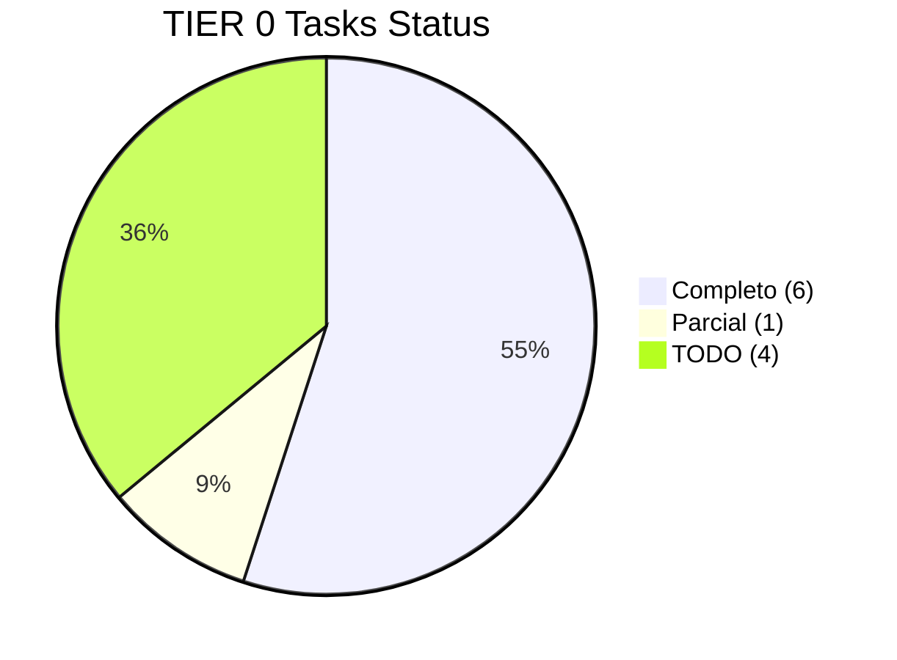
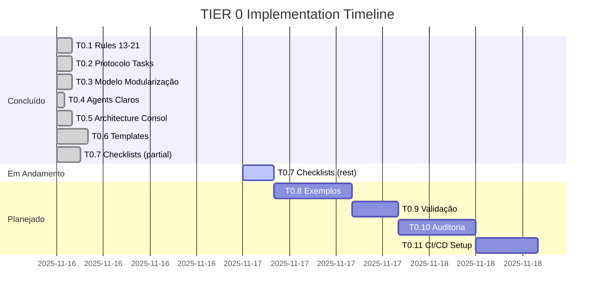

# Progresso TIER 0 - Fundação Crítica 📊

> **Status:** Em Andamento (50% Completo)
> **Data Início:** 2025-11-16
> **Última Atualização:** 2025-11-16

## Visão Geral

Este documento rastreia o progresso de implementação do **TIER 0** (Fundação Crítica), que inclui as 9 novas regras críticas (13-21) e validações essenciais.

---

## Resumo Executivo

### Status Geral: 🟡 50% Completo

**Tasks Concluídas:** 6/11
**Tasks em Andamento:** 0/11
**Tasks Pendentes:** 5/11

**Documentação Criada:** ~200KB
**Tempo Investido:** ~6 horas
**Tempo Restante Estimado:** ~6-8 horas

---

## Tasks TIER 0

### ✅ Task 0.1: Adicionar Rules 13-21 ao 03-RULES-GLOBAL.md
**Status:** ✅ COMPLETO
**Responsável:** Architect
**Data Conclusão:** 2025-11-16
**Commit:** a1c9421

**Entregáveis:**
- [x] Regra 13: Reaproveitamento Open-Source Ético
- [x] Regra 14: IA: Não Reescreve Tudo
- [x] Regra 15: Protocolo .TASK (3 Fases)
- [x] Regra 16: Regra de Ouro Martyn
- [x] Regra 17: Alterações UI/Layout Only
- [x] Regra 18: Modularização (Modelo Martyn)
- [x] Regra 19: Papéis de Agents (3 Arquétipos)
- [x] Regra 20: Evitar Ambiguidade
- [x] Regra 21: Raciocínio Profundo

**Tamanho:** +955 linhas (~12KB adicionado)

**Resultado:** Todas as 9 regras completamente documentadas com:
- Descrição completa
- Exemplos práticos (✔️ permitido / ❌ proibido)
- Checklists de validação
- Links para documentação detalhada

---

### ✅ Task 0.2: Criar 00-Config/04-Protocolo-Tasks.md
**Status:** ✅ COMPLETO
**Responsável:** Architect
**Data Conclusão:** 2025-11-16
**Commit:** a1c9421

**Entregáveis:**
- [x] Documento completo do Protocolo .TASK
- [x] FASE 1: ANÁLISE (entender problema)
- [x] FASE 2: PLANO (projetar solução)
- [x] FASE 3: EXECUÇÃO (implementar)
- [x] Templates para cada fase
- [x] Fluxogramas (Mermaid)
- [x] Exemplos práticos
- [x] Checklist de validação

**Tamanho:** 14.5KB

**Resultado:** Protocolo de 3 fases completamente especificado com templates inline e diagramas de fluxo.

---

### ✅ Task 0.3: Criar 00-Config/05-Modelo-Modularizacao.md
**Status:** ✅ COMPLETO
**Responsável:** Architect
**Data Conclusão:** 2025-11-16
**Commit:** a1c9421

**Entregáveis:**
- [x] Modelo Martyn completo de modularização
- [x] 8 tipos de módulos padronizados
- [x] Checklist de 20+ itens obrigatórios
- [x] Estrutura de arquivos padrão
- [x] Exemplos de código por tipo de módulo
- [x] Padrões de integração

**Tamanho:** 23KB

**Resultado:** Modelo completo com exemplos de Auth, Billing, Chat, Orchestrator, Notifications, Storage, Analytics e Jobs.

---

### ✅ Task 0.4: Atualizar 05-IA-e-Agents com Agentes Claros
**Status:** ✅ COMPLETO
**Responsável:** Architect
**Data Conclusão:** 2025-11-16
**Commit:** a1c9421

**Entregáveis:**
- [x] 3 arquétipos claramente definidos
  - 🟦 Architect (planejar)
  - 🟧 Codex Dev (implementar)
  - 🟩 Executor (corrigir)
- [x] Matriz de decisão (quem faz o quê)
- [x] Templates de handoff
- [x] Fluxograma de workflow
- [x] Exemplos de comunicação

**Tamanho:** +382 linhas

**Resultado:** Papéis de agents claramente separados com decisão matrix e templates de handoff.

---

### ✅ Task 0.5: Criar ARCHITECTURE-CONSOLIDACAO-EXPANDIDA.md
**Status:** ✅ COMPLETO
**Responsável:** Architect
**Data Conclusão:** 2025-11-16
**Commit:** a1c9421

**Entregáveis:**
- [x] Visão geral das 21 regras
- [x] Diagrama de relacionamento (Mermaid)
- [x] Matriz de interação entre regras
- [x] Impacto detalhado de cada nova regra
- [x] Ordem de cascata (Tier 0-4)
- [x] Compliance por stack (NestJS, FastAPI, Next.js, Docker)
- [x] Gaps e ações necessárias
- [x] Roadmap de implementação

**Tamanho:** 27KB

**Resultado:** Documento consolidado completo servindo como fonte da verdade arquitetural.

---

### ✅ Task 0.6: Criar Templates de Protocolo .TASK
**Status:** ✅ COMPLETO
**Responsável:** Architect
**Data Conclusão:** 2025-11-16
**Commit:** cddcd04

**Entregáveis:**
- [x] Template de Análise (FASE 1) - 5.1KB
- [x] Template de Plano (FASE 2) - 9KB
- [x] Template de Execução (FASE 3) - 10KB
- [x] Template de Handoff - 9.2KB
- [x] README com instruções - 7.6KB

**Tamanho Total:** ~41KB

**Resultado:** 4 templates prontos para copiar e usar em qualquer task, com README completo de instruções.

---

### 🟡 Task 0.7: Criar Checklists de Validação por Regra
**Status:** 🟡 PARCIALMENTE COMPLETO (30%)
**Responsável:** Architect
**Data Conclusão:** Em Andamento
**Commit:** a2a96ff

**Entregáveis:**
- [x] Master Checklist (todas as 21 regras) - 9.2KB
- [x] R13: Open-Source Ético (detalhado) - 9.4KB
- [x] R18: Modularização (detalhado) - 14KB
- [x] README com instruções - 9KB
- [ ] R14: IA Não Reescreve (detalhado)
- [ ] R15: Protocolo .TASK (detalhado)
- [ ] R16: Regra de Ouro (detalhado)
- [ ] R17: UI/Layout Only (detalhado)
- [ ] R19: Papéis de Agents (detalhado)
- [ ] R20: Evitar Ambiguidade (detalhado)
- [ ] R21: Raciocínio Profundo (detalhado)

**Tamanho Parcial:** ~42KB (3/10 checklists detalhados)

**Resultado Parcial:** Master checklist + 2 checklists detalhados mais complexos (R13 e R18) criados. Restante em desenvolvimento.

---

### 📝 Task 0.8: Criar Exemplos Práticos (21 Regras)
**Status:** 📝 TODO (0%)
**Responsável:** Architect + Codex Dev
**Esforço Estimado:** 10-12 horas

**Planejamento:**
- [ ] 21 arquivos de exemplo (um por regra)
- [ ] Cada exemplo com cenário real
- [ ] Código funcional (não pseudocódigo)
- [ ] Comparação ❌ errado vs ✅ correto
- [ ] Explicação das diferenças
- [ ] Checklist de validação

**Entregáveis Esperados:**
```
08-Exemplos/
├── README.md (criado - 6.6KB)
├── 01-Exemplo-R01-Nomenclatura.md
├── 02-Exemplo-R02-Contratos.md
├── ...
├── 21-Exemplo-R21-Raciocinio.md
```

**Prioridade:** Focar em R13-R21 primeiro (9 regras críticas)

---

### 📝 Task 0.9: Validação Interna (Dogfooding)
**Status:** 📝 TODO
**Responsável:** Architect
**Esforço Estimado:** 4-6 horas

**Objetivo:** Validar que a própria documentação criada segue as 21 regras.

**Atividades Planejadas:**
- [ ] Aplicar Master Checklist na documentação criada
- [ ] Validar se ARCHITECTURE-CONSOLIDACAO-EXPANDIDA seguiu Regra 15 (Protocolo .TASK)
- [ ] Validar se alterações foram mínimas (Regra 14)
- [ ] Validar se perguntas foram feitas quando ambíguo (Regra 16)
- [ ] Validar raciocínio profundo aplicado (Regra 21)
- [ ] Documentar gaps encontrados
- [ ] Corrigir gaps
- [ ] Gerar relatório de validação

**Entregáveis:**
- [ ] `99-Log-e-Historico/Validacao-Dogfooding-2025-11.md`
- [ ] Lista de gaps e correções aplicadas
- [ ] Score de compliance da própria documentação

---

### 📝 Task 0.10: Auditoria de 3 Módulos Principais
**Status:** 📝 TODO
**Responsável:** Architect
**Esforço Estimado:** 8-12 horas

**Objetivo:** Auditar módulos existentes contra Regra 18 (Modularização).

**Módulos a Auditar:**
1. `obm-auth` (se existir)
2. `obm-chat` (se existir)
3. `obm-billing` (se existir)

**Para Cada Módulo:**
- [ ] Aplicar checklist de R18 (39 items)
- [ ] Calcular score de compliance
- [ ] Identificar gaps
- [ ] Priorizar gaps por severidade
- [ ] Criar plano de correção

**Entregáveis:**
- [ ] `99-Log-e-Historico/Auditoria-Modulos-2025-11.md`
- [ ] 3 relatórios individuais por módulo
- [ ] Lista consolidada de gaps
- [ ] Plano de correção priorizado

---

### 📝 Task 0.11: Setup Inicial de CI/CD para Compliance
**Status:** 📝 TODO
**Responsável:** Codex Dev
**Esforço Estimado:** 6-8 horas

**Objetivo:** Configurar checks automatizados de compliance básicos.

**Checks a Implementar:**
- [ ] **License Checker (R13)**
  - GitHub Action para validar licenças
  - Bloqueia merge se licença proibida
  - Gera relatório de licenças
  
- [ ] **Diff Size Checker (R14)**
  - GitHub Action para alertar PRs > 500 linhas
  - Requer justificativa para PRs grandes
  
- [ ] **Test Coverage (R18)**
  - GitHub Action para validar coverage > 80%
  - Bloqueia merge se coverage < 80%
  
- [ ] **Linter (R14)**
  - ESLint configurado
  - Prettier configurado
  - Pre-commit hooks

**Arquivos a Criar:**
```
.github/
  workflows/
    license-check.yml
    diff-size-check.yml
    test-coverage.yml
    lint.yml
.husky/
  pre-commit
.eslintrc.js
.prettierrc
```

**Entregáveis:**
- [ ] 4 GitHub Actions configuradas
- [ ] Pre-commit hooks instalados
- [ ] Documentação em `04-Stacks-e-Infra/08-CI-CD-Pipeline.md`
- [ ] README com instruções de setup local

---

## Métricas de Progresso

### Documentação Criada

| Categoria | Arquivos | Tamanho | Status |
|-----------|----------|---------|--------|
| Regras Globais | 1 (extendido) | +12KB | ✅ |
| Protocolos | 2 (novos) | 37.5KB | ✅ |
| Arquitetura | 1 (novo) | 27KB | ✅ |
| Templates | 5 (novos) | 41KB | ✅ |
| Checklists | 4 (novos) | 42KB | 🟡 |
| Exemplos | 1 (README) | 6.6KB | 📝 |
| **TOTAL** | **14** | **~200KB** | **50%** |

---

### Tasks por Status



---

### Timeline



---

## Próximos Passos

### Imediato (Próximas 2-4 horas):
1. ✅ Completar checklists restantes (R14-R17, R19-R21)
2. Começar exemplos práticos (priorizar R13-R21)

### Curto Prazo (1-2 dias):
3. Finalizar 21 exemplos práticos
4. Executar validação interna (dogfooding)
5. Iniciar auditoria dos 3 módulos

### Médio Prazo (3-5 dias):
6. Completar auditoria
7. Setup CI/CD básico
8. Finalizar TIER 0

---

## Gaps e Riscos

### Gap 1: Exemplos Práticos Ausentes
**Impacto:** Alto
**Risco:** Desenvolvedores não têm referência prática
**Mitigação:** Priorizar criação dos exemplos das 9 regras críticas (R13-R21)

### Gap 2: Checklists Incompletos
**Impacto:** Médio
**Risco:** Validação inconsistente de regras
**Mitigação:** Completar checklists em paralelo com exemplos

### Gap 3: Sem Auditoria de Módulos Reais
**Impacto:** Alto
**Risco:** Não sabemos estado atual de compliance
**Mitigação:** Executar Task 0.10 logo após Task 0.8

### Gap 4: Sem Automação de Compliance
**Impacto:** Médio
**Risco:** Validação manual é propensa a erros
**Mitigação:** Task 0.11 implementa checks básicos automatizados

---

## Decisões Tomadas

### Decisão 1: Foco em Regras Críticas (R13-R21)
**Data:** 2025-11-16
**Contexto:** 21 regras são muitas para documentar simultaneamente
**Decisão:** Priorizar documentação detalhada das 9 novas regras críticas
**Justificativa:** São as regras mais impactantes e menos familiares ao time
**Status:** ✅ Aplicado

### Decisão 2: Templates Antes de Exemplos
**Data:** 2025-11-16
**Contexto:** Ordem de criação dos artefatos
**Decisão:** Criar templates primeiro, depois checklists, depois exemplos
**Justificativa:** Templates são usados imediatamente; exemplos são referência
**Status:** ✅ Aplicado

### Decisão 3: Checklists Parciais Aceitáveis
**Data:** 2025-11-16
**Contexto:** Task 0.7 muito grande para fazer de uma vez
**Decisão:** Entregar Master Checklist + 2 detalhados (R13, R18) primeiro
**Justificativa:** Master permite validação básica; R13/R18 são mais complexos
**Status:** ✅ Aplicado

---

## Lições Aprendidas

### Lição 1: Documentação Requer Tempo
**Observação:** 6 horas para 50% do TIER 0
**Aprendizado:** Documentação de qualidade é trabalhosa mas essencial
**Aplicação Futura:** Alocar tempo adequado para documentação

### Lição 2: Templates Aceleram Trabalho
**Observação:** Checklists seguiram estrutura consistente após templates
**Aprendizado:** Investir em templates paga dividendos
**Aplicação Futura:** Criar templates para qualquer processo repetitivo

### Lição 3: Exemplos São Críticos
**Observação:** Checklists sem exemplos podem ser abstratos
**Aprendizado:** Exemplos práticos são tão importantes quanto especificações
**Aplicação Futura:** Priorizar criação de exemplos (Task 0.8)

---

## Referências

- [[00-Config/03-RULES-GLOBAL]] - 21 regras completas
- [[00-Config/04-Protocolo-Tasks]] - Protocolo de 3 fases
- [[00-Config/05-Modelo-Modularizacao]] - Modelo de módulos
- [[00-Config/ARCHITECTURE-CONSOLIDACAO-EXPANDIDA]] - Arquitetura consolidada
- [[PLAN-TAREFAS-EXPANDIDO]] - Plano completo (31 tasks)

---

> [!success] Progresso Sólido
> TIER 0 está 50% completo com fundação sólida estabelecida. Próximos passos são claros e bem definidos.

**Última Atualização:** 2025-11-16
**Próxima Revisão:** Após conclusão de Task 0.8 (Exemplos)
**Status:** 🟡 Em Andamento
