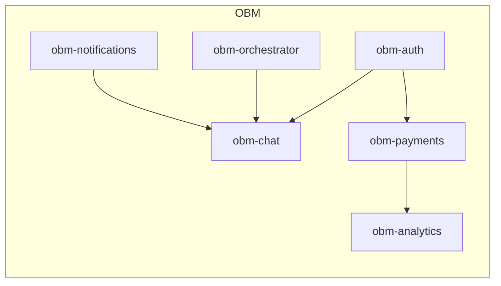

P# Módulos OBM – Visão Geral 🧩

## Padrão de Módulo
- Contrato: entradas, saídas, erros padronizados, APIs/SDKs.
- Conexão com core `{{APP_ORBIT_SUITE}}` via `REST`/`SDK`/fila.

## Lista de Módulos
- [[03-Modulos-OBM/obm-auth]] 🔐
- [[03-Modulos-OBM/obm-chat]] 💬
- [[03-Modulos-OBM/obm-orchestrator]] ⚙️
- [[03-Modulos-OBM/obm-payments]] 💰
- [[03-Modulos-OBM/obm-notifications]] 🔔
- [[03-Modulos-OBM/obm-analytics]] 📊
- [[03-Modulos-OBM/obm-nft-marketplace]] 🧩
- [[03-Modulos-OBM/obm-streaming]] 🎵
- [[03-Modulos-OBM/obm-billing]] 💵
- [[03-Modulos-OBM/obm-permissions]] 🛡️
 - [[03-Modulos-OBM/obm-search]] 🔎
 - [[03-Modulos-OBM/obm-files]] 🗂️
 - [[03-Modulos-OBM/obm-telemetry]] 📡
 - [[03-Modulos-OBM/obm-wallet]] 💼
 - [[03-Modulos-OBM/obm-accounts]] 👤
 - [[03-Modulos-OBM/obm-music-demos]] 🎵

