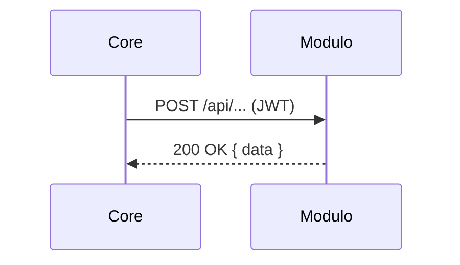

# Como Conectar Um Módulo ao Core ⚙️

## Modos de Conexão
- REST: interoperabilidade entre linguagens.
- SDK/Package: mesma linguagem para integração direta.
- Fila/Eventos: comunicação assíncrona.

## Checklist
- Defina base URL e autenticação (JWT).
- Padronize formatos de request/response.
- Documente códigos de erro e retries.

