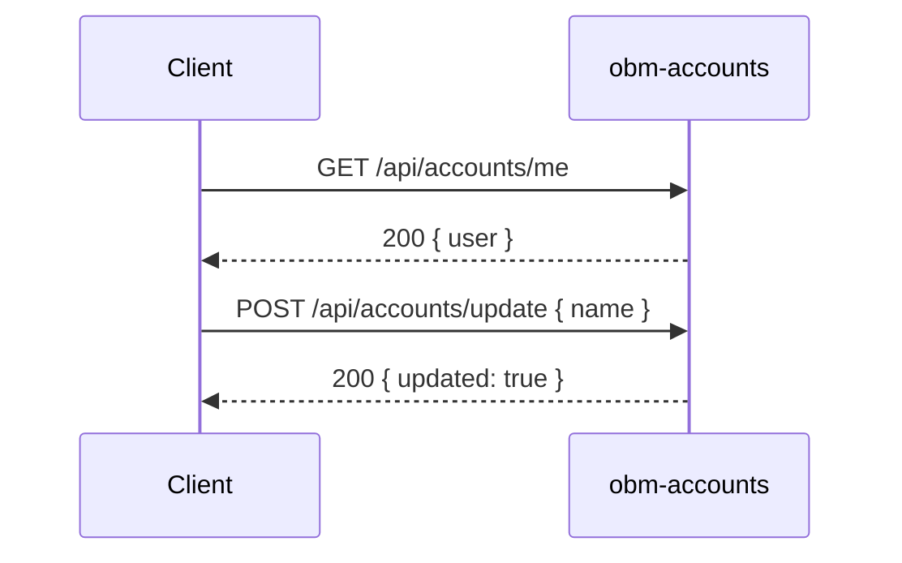

# obm-accounts 👤

## 1. Objetivo do módulo
- Gestão de contas e perfis.
- Preferências e privacidade.

## 2. Contrato com o core (`{{APP_ORBIT_SUITE}}`)

### 2.1. APIs REST
- `GET /api/accounts/me`
- `POST /api/accounts/update`
- `GET /api/accounts/preferences`

### 2.2. SDK
```ts
import { Accounts } from "@obm/accounts-sdk";
const me = await Accounts.getMe();
```

## 3. Configuração
- `.env`: `DB_URL`, `PREFERENCES_SOURCE`.

## 4. Fluxos principais
- Perfil, atualização, preferências.

## 4.1. Contrato de API – Exemplos
> Segue [[00-Config/05-Protocolo-Orbit-OBM]].

### Me
Request: `GET /api/accounts/me`
Response (200):
```json
{ "status": "success", "data": { "user": { "id": "u_123", "email": "user@example.com", "name": "User" } }, "meta": { "version": "v1", "traceId": "uuid", "timestamp": "..." } }
```

### Update
Request:
```json
{ "name": "New Name" }
```
Response (200):
```json
{ "status": "success", "data": { "updated": true }, "meta": { "version": "v1", "traceId": "uuid", "timestamp": "..." } }
```

### Preferences
Request: `GET /api/accounts/preferences`
Response (200):
```json
{ "status": "success", "data": { "locale": "pt-BR", "timezone": "America/Sao_Paulo" }, "meta": { "version": "v1", "traceId": "uuid", "timestamp": "..." } }
```

## 5. Checklists
- PII e privacidade, auditoria, integração com `obm-auth` e `obm-permissions`.
## 4.2. Diagrama de Sequência


## Referências
- [[00-Config/05-Protocolo-Orbit-OBM]]
