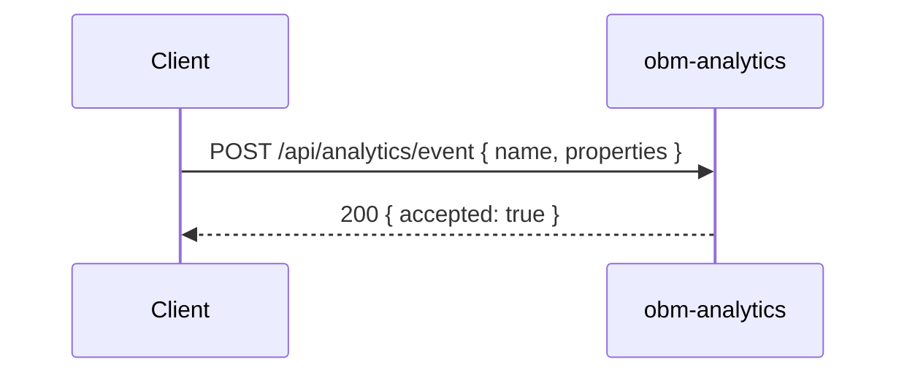

# obm-analytics 📊

## 1. Objetivo do módulo
- Coleta e análise de métricas.
- Dashboards e relatórios.

## 2. Contrato com o core (`{{APP_ORBIT_SUITE}}`)

### 2.1. APIs REST
- `POST /api/analytics/event`
- `GET /api/analytics/dashboard`

### 2.2. SDK
```ts
import { Analytics } from "@obm/analytics-sdk";
await Analytics.track({ name: "payment.succeeded", properties });
```

## 3. Configuração
- `.env`: `DB_URL`, `RETENTION_POLICY`, `ANONYMIZE`.

## 4. Fluxos principais
- Tracking, agregação, visualização.

## 4.1. Contrato de API – Exemplos
> Segue [[00-Config/05-Protocolo-Orbit-OBM]].

### Track Event
Request:
```json
{ "name": "payment.succeeded", "properties": { "amount": 1990, "currency": "BRL" }, "userId": "u_123", "timestamp": "2025-11-15T12:00:00Z" }
```
Response (200):
```json
{ "status": "success", "data": { "accepted": true }, "meta": { "version": "v1", "traceId": "uuid", "timestamp": "..." } }
```

### Dashboard
Request: `GET /api/analytics/dashboard?from=2025-11-01&to=2025-11-15&granularity=day`
Response (200):
```json
{ "status": "success", "data": { "series": [{ "date": "2025-11-15", "value": 42 }] }, "meta": { "version": "v1", "traceId": "uuid", "timestamp": "..." } }
```

## 5. Checklists
- Privacidade, anonimização, desempenho.
## 4.2. Diagrama de Sequência


## Referências
- [[00-Config/05-Protocolo-Orbit-OBM]]