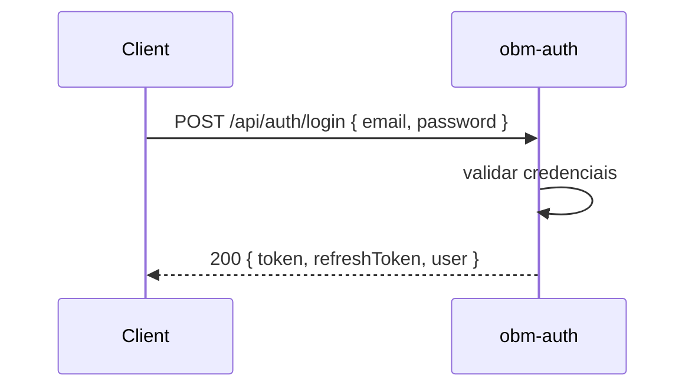

# obm-auth 🔐

## 1. Objetivo do módulo
- Autenticação de usuários.
- Emissão e validação de tokens [[Glossario-Tecnico/JWT]].
- Gerenciar roles ([[Glossario-Tecnico/RBAC]]).

## 2. Contrato com o core (`{{APP_ORBIT_SUITE}}`)

### 2.1. APIs REST
- `POST /api/auth/login`
- `POST /api/auth/register`
- `GET /api/auth/me`
- `POST /api/auth/refresh`

> [!warning] Protocolo
> Padronizar request/response e códigos de erro conforme protocolo do ecossistema.

### 2.2. SDK (TypeScript)
```ts
import { AuthClient } from "@obm/auth-sdk";
const auth = new AuthClient({ baseUrl: "https://auth.example.com" });
const result = await auth.login(email, password);
```

## 3. Configuração
- Variáveis `.env`: `JWT_SECRET`, `JWT_EXPIRES_IN`, `DB_URL`.
- Padrão de `config.json` se aplicável.

## 4. Fluxos principais
- Fluxo de login, registro e recuperação de senha.

## 4.1. Contrato de API – Exemplos
> Segue [[00-Config/05-Protocolo-Orbit-OBM]] (envelope `status/data/error/meta`).

### Login
Request:
```json
{
  "email": "user@example.com",
  "password": "secret"
}
```
Response (200):
```json
{
  "status": "success",
  "data": {
    "token": "jwt.token.here",
    "refreshToken": "refresh.token.here",
    "expiresIn": 86400,
    "user": { "id": "u_123", "email": "user@example.com", "roles": ["user"] }
  },
  "meta": { "version": "v1", "traceId": "uuid", "timestamp": "2025-11-15T12:00:00Z" }
}
```
Error (401):
```json
{
  "status": "error",
  "error": { "code": "AUTH_INVALID_CREDENTIALS", "message": "Invalid credentials" },
  "meta": { "version": "v1", "traceId": "uuid", "timestamp": "2025-11-15T12:00:00Z" }
}
```

### Register
Request:
```json
{ "email": "new@example.com", "password": "secret", "name": "New User" }
```
Response (201):
```json
{ "status": "success", "data": { "user": { "id": "u_124", "email": "new@example.com" } }, "meta": { "version": "v1", "traceId": "uuid", "timestamp": "..." } }
```

### Me
Request: Header `Authorization: Bearer <token>`
Response (200):
```json
{ "status": "success", "data": { "user": { "id": "u_123", "email": "user@example.com", "roles": ["user"] } }, "meta": { "version": "v1", "traceId": "uuid", "timestamp": "..." } }
```

### Refresh
Request:
```json
{ "refreshToken": "refresh.token.here" }
```
Response (200):
```json
{ "status": "success", "data": { "token": "new.jwt", "expiresIn": 86400 }, "meta": { "version": "v1", "traceId": "uuid", "timestamp": "..." } }
```

## 5. Checklists
> [!tip] Ao criar `obm-auth`:
> - Defina domínio e contrato de API.
> - Escreva exemplos de uso e testes mínimos.
> - Documente segurança (JWT, RBAC, rate limit).

## 6. Prompts para IA
- "Crie um middleware de autenticação JWT para `obm-auth` usando `JWT_SECRET` e expiração de 24h."

## 7. Integração de Frontend (Next.js)
- Libs recomendadas: `NextAuth` ou `Lucia` integradas a [[03-Modulos-OBM/obm-auth]].
- Fluxos: login, refresh e roles via [[06-Glossario-Tecnico/JWT]] e [[06-Glossario-Tecnico/RBAC]].
- Seguir [[00-Config/05-Protocolo-Orbit-OBM]] para respostas e erros padronizados.
## 4.2. Diagrama de Sequência – Login

