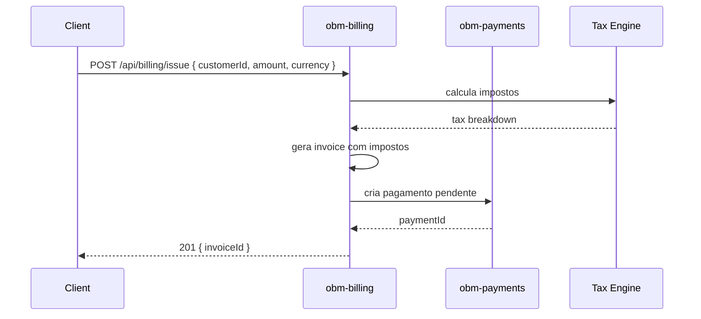
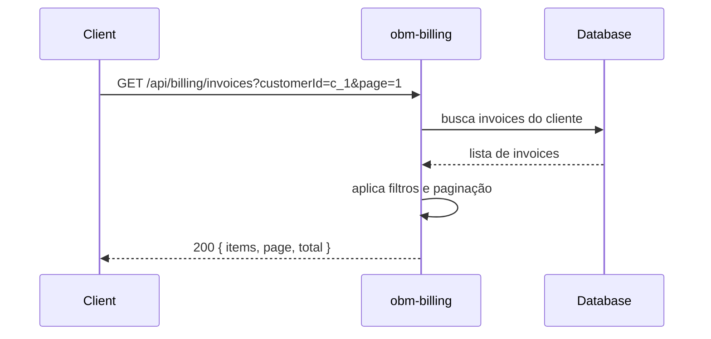
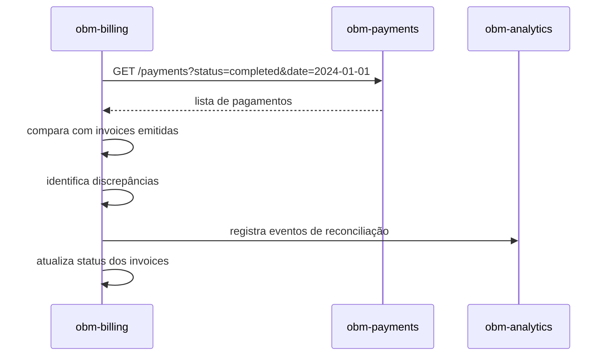

# obm-billing 💵

## 1. Objetivo do módulo
- Faturamento, invoices, planos e impostos.
- Integração com `obm-payments`.

## 2. Contrato com o core (`{{APP_ORBIT_SUITE}}`)

### 2.1. APIs REST
- `GET /api/billing/invoices`
- `POST /api/billing/issue`
- `GET /api/billing/plans`

## 4.1. Contrato de API – Exemplos
> Segue [[00-Config/05-Protocolo-Orbit-OBM]].

### Issue Invoice
Request:
```json
{ "customerId": "c_1", "amount": 1000, "currency": "BRL" }
```
Response (201):
```json
{ "status": "success", "data": { "invoiceId": "inv_1" }, "meta": { "version": "v1", "traceId": "uuid", "timestamp": "..." } }
```

### Invoices
Request: `GET /api/billing/invoices?customerId=c_1&page=1&pageSize=20`
Response (200):
```json
{ "status": "success", "data": { "items": [{ "id": "inv_1" }], "page": 1, "pageSize": 20, "total": 1 }, "meta": { "version": "v1", "traceId": "uuid", "timestamp": "..." } }
```

## 4.2. Integração
- Integrar [[03-Modulos-OBM/obm-payments]] e conciliar estados.

### 4.3. Diagrama de Sequência – Issue Invoice


### 4.4. Diagrama de Sequência – List Invoices


### 4.5. Diagrama de Sequência – Reconciliation


### 2.2. SDK
```ts
import { Billing } from "@obm/billing-sdk";
await Billing.issue({ customerId, amount, currency });
```

## 3. Configuração
- `.env`: `BILLING_PROVIDER_URL`, `TAX_RULES`.

## 4. Fluxos principais
- Emissão de invoice, plano/assinatura, reconciliação.

## 5. Checklists
- Consistência fiscal, reconciliação com pagamentos, auditoria.