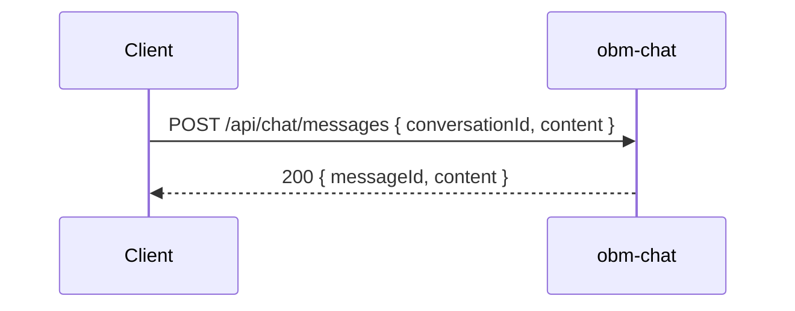

# obm-chat 💬

## 1. Objetivo do módulo
- Mensageria em tempo real.
- Histórico de conversas e canais.
- Integração com notificações.

## 2. Contrato com o core (`{{APP_ORBIT_SUITE}}`)

### 2.1. APIs REST
- `GET /api/chat/conversations`
- `POST /api/chat/messages`
- `GET /api/chat/channels`

### 2.2. SDK (TypeScript)
```ts
import { ChatClient } from "@obm/chat-sdk";
const chat = new ChatClient({ baseUrl: "https://chat.example.com" });
await chat.sendMessage(channelId, content);
```

## 3. Configuração
- `.env`: `DB_URL`, `REDIS_URL`, `RATE_LIMITS`.

## 4. Fluxos principais
- Criar conversa, enviar mensagem, listar canais.

## 4.1. Contrato de API – Exemplos
> Segue [[00-Config/05-Protocolo-Orbit-OBM]].

### Listar Conversas
Request: `GET /api/chat/conversations?page=1&pageSize=20`
Response (200):
```json
{ "status": "success", "data": { "items": [{ "id": "conv_1", "title": "Geral" }], "page": 1, "pageSize": 20, "total": 1 }, "meta": { "version": "v1", "traceId": "uuid", "timestamp": "..." } }
```

### Enviar Mensagem
Request:
```json
{ "conversationId": "conv_1", "content": "Olá", "idempotencyKey": "idem-uuid" }
```
Response (200):
```json
{ "status": "success", "data": { "messageId": "msg_123", "content": "Olá", "authorId": "u_123" }, "meta": { "version": "v1", "traceId": "uuid", "timestamp": "..." } }
```
Error (403):
```json
{ "status": "error", "error": { "code": "AUTH_FORBIDDEN", "message": "Not allowed in this channel." }, "meta": { "version": "v1", "traceId": "uuid", "timestamp": "..." } }
```

### Listar Canais
Request: `GET /api/chat/channels`
Response (200):
```json
{ "status": "success", "data": { "items": [{ "id": "channel_1", "name": "Geral" }] }, "meta": { "version": "v1", "traceId": "uuid", "timestamp": "..." } }
```

## 5. Checklists
- Contrato de API, testes, segurança (autorização por canal/role), rate limits.
## 4.2. Diagrama de Sequência


## Referências
- [[00-Config/05-Protocolo-Orbit-OBM]]