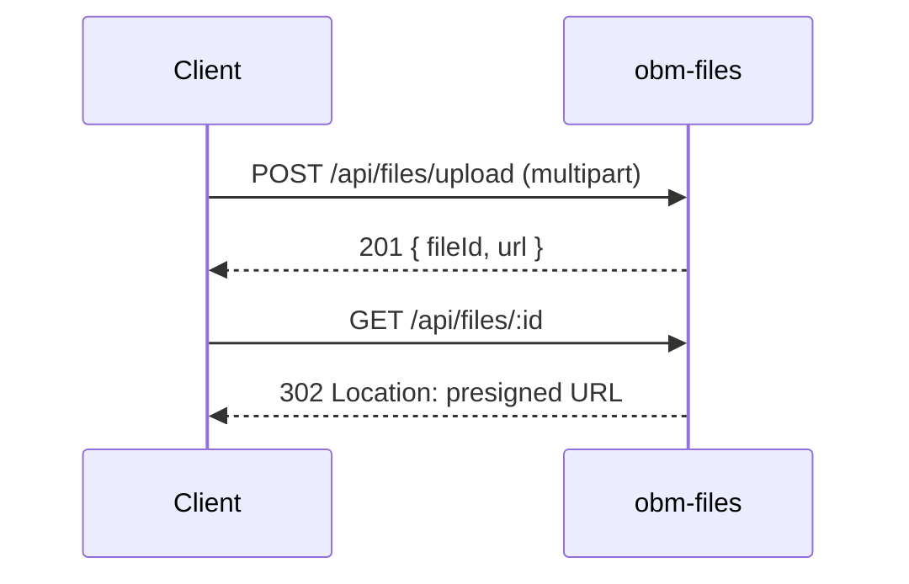

# obm-files 🗂️

## 1. Objetivo do módulo
- Armazenamento e distribuição de arquivos.
- Upload, download e gerenciamento de metadados.

## 2. Contrato com o core (`{{APP_ORBIT_SUITE}}`)

### 2.1. APIs REST
- `POST /api/files/upload`
- `GET /api/files/:id`
- `DELETE /api/files/:id`

### 2.2. SDK
```ts
import { Files } from "@obm/files-sdk";
await Files.upload({ file, metadata });
```

## 3. Configuração
- `.env`: `STORAGE_PROVIDER_URL`, `BUCKET_NAME`, `CDN_URL`.

## 4. Fluxos principais
- Upload, download, thumbnails e ACLs.

## 4.1. Contrato de API – Exemplos
> Segue [[00-Config/05-Protocolo-Orbit-OBM]] e [[06-Glossario-Tecnico/S3-Storage]].

### Upload
Request (multipart): `POST /api/files/upload`
Meta JSON:
```json
{ "metadata": { "ownerId": "u_123", "tags": ["demo"] } }
```
Response (201):
```json
{ "status": "success", "data": { "fileId": "f_123", "url": "https://cdn/..." }, "meta": { "version": "v1", "traceId": "uuid", "timestamp": "..." } }
```

### Download
Request: `GET /api/files/f_123`
Response (302): Presigned URL
Headers: `Location: https://cdn/...`

## 5. Checklists
- Autorização, verificação de vírus, quotas, logs.
## 4.2. Diagrama de Sequência


## Referências
- [[00-Config/05-Protocolo-Orbit-OBM]]
