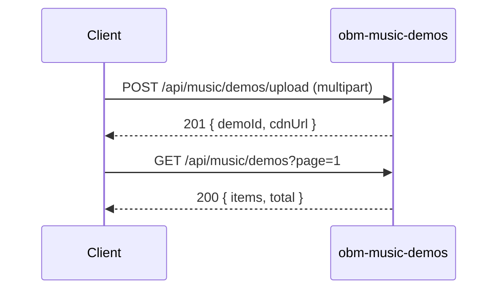

# obm-music-demos 🎵

## 1. Objetivo do módulo
- Gestão de demos musicais (upload, listagem, compartilhamento).
- Integração com streaming e analytics.

## 2. Contrato com o core (`{{APP_ORBIT_SUITE}}`)

### 2.1. APIs REST
- `GET /api/music/demos`
- `POST /api/music/demos/upload`
- `GET /api/music/demos/:id`

### 2.2. SDK
```ts
import { MusicDemos } from "@obm/music-demos-sdk";
await MusicDemos.list({ page });
```

## 3. Configuração
- `.env`: `STORAGE_PROVIDER_URL`, `CDN_URL`.

## 4. Fluxos principais
- Upload, tag, compartilhar; integração com `obm-streaming`.

## 4.1. Contrato de API – Exemplos
> Segue [[00-Config/05-Protocolo-Orbit-OBM]].

### List
Request: `GET /api/music/demos?page=1&pageSize=20`
Response (200):
```json
{ "status": "success", "data": { "items": [{ "id": "d_1", "title": "Demo" }], "page": 1, "pageSize": 20, "total": 1 }, "meta": { "version": "v1", "traceId": "uuid", "timestamp": "..." } }
```

### Upload
Request (multipart) + meta JSON
Response (201):
```json
{ "status": "success", "data": { "demoId": "d_1", "cdnUrl": "https://cdn/..." }, "meta": { "version": "v1", "traceId": "uuid", "timestamp": "..." } }
```

### Get
Request: `GET /api/music/demos/d_1`
Response (200):
```json
{ "status": "success", "data": { "id": "d_1", "title": "Demo", "artist": "User" }, "meta": { "version": "v1", "traceId": "uuid", "timestamp": "..." } }
```

## 5. Checklists
- Direitos autorais, moderação de conteúdo, telemetria de uso.
## 4.2. Diagrama de Sequência


## Referências
- [[00-Config/05-Protocolo-Orbit-OBM]]
