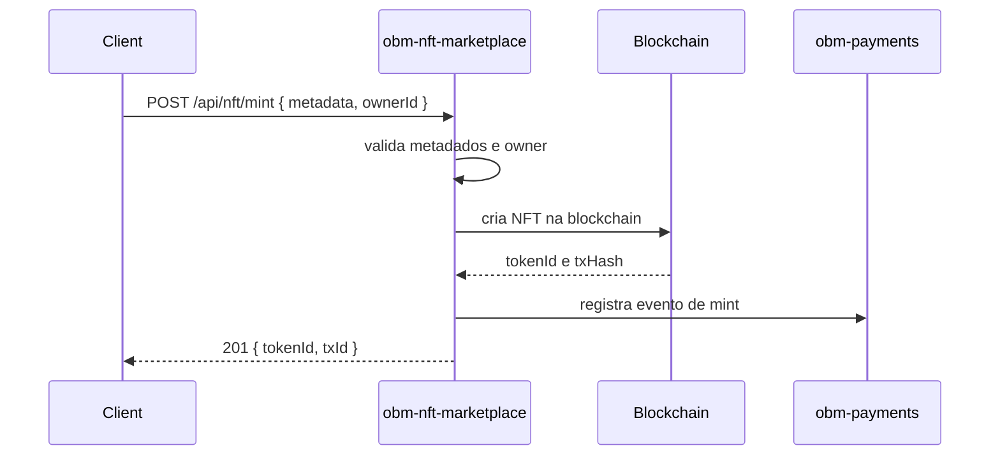
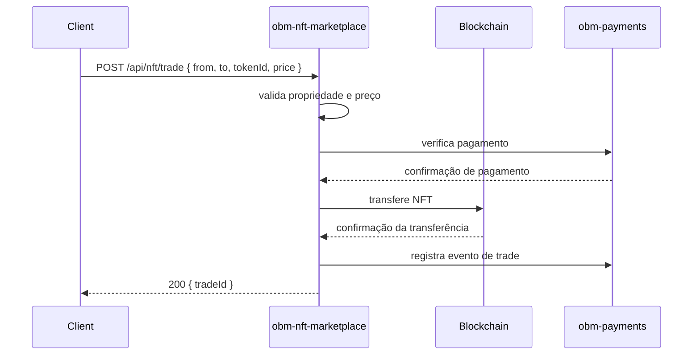
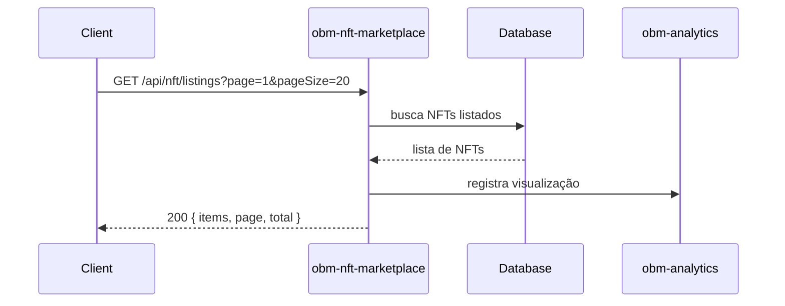

# obm-nft-marketplace 🧩

## 1. Objetivo do módulo
- Listagem, mint e negociação de NFTs.
- Integração com pagamentos e analytics.

## 2. Contrato com o core (`{{APP_ORBIT_SUITE}}`)

### 2.1. APIs REST
- `POST /api/nft/mint`
- `GET /api/nft/listings`
- `POST /api/nft/trade`

## 4.1. Contrato de API – Exemplos
> Segue [[00-Config/05-Protocolo-Orbit-OBM]].

### Mint
Request:
```json
{ "metadata": { "name": "Art" }, "ownerId": "u_1" }
```
Response (201):
```json
{ "status": "success", "data": { "tokenId": "nft_1", "txId": "tx_1" }, "meta": { "version": "v1", "traceId": "uuid", "timestamp": "..." } }
```

### Listings
Request: `GET /api/nft/listings?page=1&pageSize=20`
Response (200):
```json
{ "status": "success", "data": { "items": [{ "tokenId": "nft_1", "price": "1.00" }], "page": 1, "pageSize": 20, "total": 1 }, "meta": { "version": "v1", "traceId": "uuid", "timestamp": "..." } }
```

### Trade
Request:
```json
{ "from": "u_1", "to": "u_2", "tokenId": "nft_1", "price": "1.00", "idempotencyKey": "idem-uuid" }
```
Response (200):
```json
{ "status": "success", "data": { "tradeId": "tr_1" }, "meta": { "version": "v1", "traceId": "uuid", "timestamp": "..." } }
```

## 4.2. Reconciliação
- Integrar [[03-Modulos-OBM/obm-payments]] e registrar eventos.

### 4.3. Diagrama de Sequência – Mint


### 4.4. Diagrama de Sequência – Trade


### 4.5. Diagrama de Sequência – Listings


### 2.2. SDK
```ts
import { NFT } from "@obm/nft-sdk";
await NFT.mint({ metadata, ownerId });
```

## 3. Configuração
- `.env`: `CHAIN_PROVIDER_URL`, `WALLET_PROVIDER`, `PAYMENTS_PROVIDER_KEY`.

## 4. Fluxos principais
- Mint, listagem, negociação e reconciliação.

## 5. Checklists
- Segurança: assinaturas, prevenção de fraude.
- Integração com `obm-payments` e `obm-analytics`.