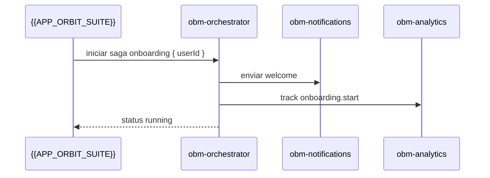

# obm-orchestrator ⚙️

## 1. Objetivo do módulo
- Orquestrar fluxos entre módulos OBM via eventos/filas.
- Encaminhar comandos e coordenar sagas.

## 2. Contrato com o core (`{{APP_ORBIT_SUITE}}`)

### 2.1. Eventos/Fila
- `user.created` → notificar `obm-notifications`.
- `payment.succeeded` → atualizar `obm-analytics`.

### 2.2. SDK
```ts
import { Orchestrator } from "@obm/orchestrator-sdk";
await Orchestrator.emit("user.created", payload);
```

## 3. Configuração
- `.env`: `REDIS_URL`, `QUEUE_PREFIX`, `RETRY_POLICY`.

## 4. Fluxos principais
- Coordenação de processos e compensações.

## 4.1. Contrato de API/Evento – Exemplos
> Segue [[00-Config/05-Protocolo-Orbit-OBM]]. Eventos devem ser idempotentes.

### Emitir Evento
Request:
```json
{ "type": "user.created", "data": { "userId": "u_123" }, "idempotencyKey": "idem-uuid" }
```
Response (200):
```json
{ "status": "success", "data": { "queued": true }, "meta": { "version": "v1", "traceId": "uuid", "timestamp": "..." } }
```

### Iniciar Saga
Request:
```json
{ "saga": "onboarding", "context": { "userId": "u_123" }, "idempotencyKey": "idem-uuid" }
```
Response (202):
```json
{ "status": "success", "data": { "sagaId": "saga_1", "status": "running" }, "meta": { "version": "v1", "traceId": "uuid", "timestamp": "..." } }
```

### Compensação
Request:
```json
{ "sagaId": "saga_1", "step": "notify", "action": "compensate" }
```
Response (200):
```json
{ "status": "success", "data": { "compensated": true }, "meta": { "version": "v1", "traceId": "uuid", "timestamp": "..." } }
```

## 5. Checklists
- Idempotência, reprocessamento, observabilidade.
## 4.2. Diagrama de Sequência – Saga

