# obm-payments 💰

## 1. Objetivo do módulo
- Processamento de pagamentos e assinaturas.
- Integração com provedores externos.

## 2. Contrato com o core (`{{APP_ORBIT_SUITE}}`)

### 2.1. APIs REST
- `POST /api/payments/charge`
- `POST /api/payments/webhook`
- `GET /api/payments/subscriptions`

### 2.2. SDK
```ts
import { Payments } from "@obm/payments-sdk";
await Payments.charge({ amount, currency, customerId });
```

## 3. Configuração
- `.env`: `PAYMENTS_PROVIDER_KEY`, `WEBHOOK_SECRET`.

## 4. Fluxos principais
- Cobranças, webhooks, gestão de planos.

## 4.1. Contrato de API – Exemplos
> Segue [[00-Config/05-Protocolo-Orbit-OBM]] e [[06-Glossario-Tecnico/Webhooks]].

### Charge
Request:
```json
{
  "amount": 1990,
  "currency": "BRL",
  "customerId": "c_123",
  "methodId": "card_456",
  "idempotencyKey": "idem-uuid"
}
```
Response (200):
```json
{
  "status": "success",
  "data": { "chargeId": "ch_789", "status": "succeeded", "receiptUrl": "https://..." },
  "meta": { "version": "v1", "traceId": "uuid", "timestamp": "..." }
}
```
Error (422):
```json
{ "status": "error", "error": { "code": "VALIDATION_ERROR", "message": "Invalid card." }, "meta": { "version": "v1", "traceId": "uuid", "timestamp": "..." } }
```

### Webhook
Headers: `X-Signature: hmac-sha256`, `X-Event-Id: evt_123`
Body:
```json
{ "type": "payment.succeeded", "data": { "chargeId": "ch_789", "amount": 1990, "currency": "BRL" } }
```
Response (200):
```json
{ "status": "success", "data": { "processed": true }, "meta": { "version": "v1", "traceId": "uuid", "timestamp": "..." } }
```

### Subscriptions
Request: `GET /api/payments/subscriptions?customerId=c_123&page=1&pageSize=20`
Response (200):
```json
{ "status": "success", "data": { "items": [{ "id": "sub_1", "plan": "pro" }], "page": 1, "pageSize": 20, "total": 1 }, "meta": { "version": "v1", "traceId": "uuid", "timestamp": "..." } }
```

## 5. Checklists
- Segurança em webhooks, reconciliação, testes de integração.
 - Seguir [[00-Config/05-Protocolo-Orbit-OBM]] para envelope e erros.
 - Verificar assinaturas e replay: [[06-Glossario-Tecnico/Webhooks]].
## 4.2. Diagrama de Sequência – Charge + Webhook

```mermaid
sequenceDiagram
  participant C as Client
  participant P as obm-payments
  participant Prov as Provider
  participant Orch as obm-orchestrator
  participant Ana as obm-analytics
  C->>P: POST /api/payments/charge
  P->>Prov: criar cobrança
  Prov-->>P: status succeeded
  Prov-->>P: POST /api/payments/webhook
  P->>Orch: emit payment.succeeded
  P->>Ana: track event
  P-->>C: 200 { chargeId, status }
```

