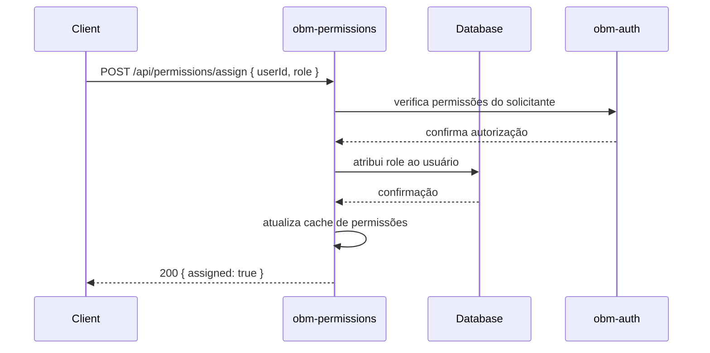
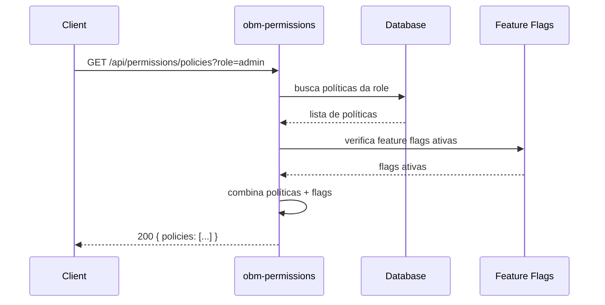
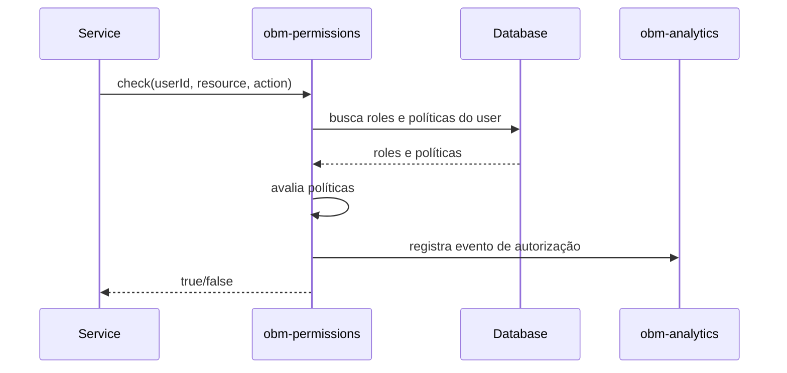

# obm-permissions 🛡️

## 1. Objetivo do módulo
- Gestão de roles e permissões (RBAC).
- Feature flags e políticas.

## 2. Contrato com o core (`{{APP_ORBIT_SUITE}}`)

### 2.1. APIs REST
- `GET /api/permissions/roles`
- `POST /api/permissions/assign`
- `GET /api/permissions/policies`

## 4.1. Contrato de API – Exemplos
> Segue [[00-Config/05-Protocolo-Orbit-OBM]].

### Roles
Request: `GET /api/permissions/roles`
Response (200):
```json
{ "status": "success", "data": { "roles": ["user", "admin"] }, "meta": { "version": "v1", "traceId": "uuid", "timestamp": "..." } }
```

### Assign
Request:
```json
{ "userId": "u_1", "role": "admin", "idempotencyKey": "idem-uuid" }
```
Response (200):
```json
{ "status": "success", "data": { "assigned": true }, "meta": { "version": "v1", "traceId": "uuid", "timestamp": "..." } }
```

### Policies
Request: `GET /api/permissions/policies?role=admin`
Response (200):
```json
{ "status": "success", "data": { "policies": [{ "resource": "orders", "action": "read" }] }, "meta": { "version": "v1", "traceId": "uuid", "timestamp": "..." } }
```

## 4.2. Testes RBAC
- Cobrir guards e escopos em endpoints críticos.

### 4.3. Diagrama de Sequência – Assign Role


### 4.4. Diagrama de Sequência – Check Policy


### 4.5. Diagrama de Sequência – Authorization Check


### 2.2. SDK
```ts
import { Permissions } from "@obm/permissions-sdk";
await Permissions.assign({ userId, role });
```

## 3. Configuração
- `.env`: `RBAC_MODEL`, `FEATURE_FLAGS_SOURCE`.

## 4. Fluxos principais
- Atribuição de roles, verificação de políticas, flags dinâmicas.

## 5. Checklists
- Integração com [[03-Modulos-OBM/obm-auth]], auditoria e testes de autorização.