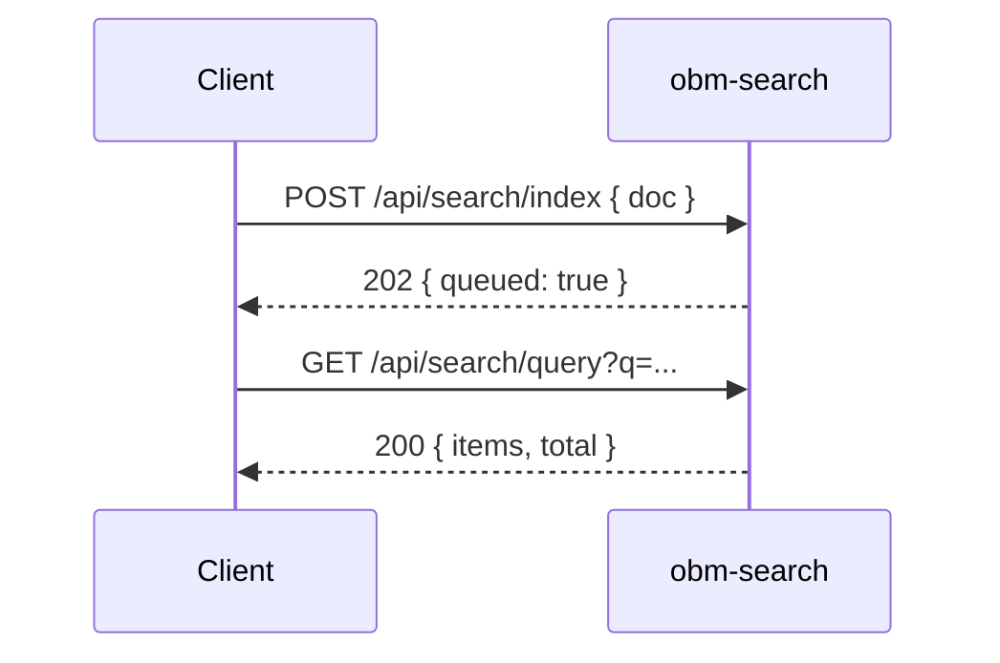

# obm-search 🔎

## 1. Objetivo do módulo
- Indexação e busca de conteúdo.
- Relevância, filtros e paginação.

## 2. Contrato com o core (`{{APP_ORBIT_SUITE}}`)

### 2.1. APIs REST
- `POST /api/search/index`
- `GET /api/search/query`
- `DELETE /api/search/index/:id`

### 2.2. SDK
```ts
import { Search } from "@obm/search-sdk";
await Search.query({ q, filters, page });
```

## 3. Configuração
- `.env`: `SEARCH_PROVIDER_URL`, `INDEX_NAME`.

## 4. Fluxos principais
- Indexar, consultar, atualizar relevância.

## 4.1. Contrato de API – Exemplos
> Segue [[00-Config/05-Protocolo-Orbit-OBM]] e [[06-Glossario-Tecnico/FTS-Elasticsearch]].

### Indexar
Request:
```json
{ "id": "doc_1", "title": "Teste", "content": "Lorem ipsum", "tags": ["demo"], "lang": "pt" }
```
Response (202):
```json
{ "status": "success", "data": { "queued": true }, "meta": { "version": "v1", "traceId": "uuid", "timestamp": "..." } }
```

### Consultar
Request: `GET /api/search/query?q=Lorem&filters=tag:demo&page=1&pageSize=10`
Response (200):
```json
{ "status": "success", "data": { "items": [{ "id": "doc_1", "score": 0.91 }], "page": 1, "pageSize": 10, "total": 1 }, "meta": { "version": "v1", "traceId": "uuid", "timestamp": "..." } }
```

## 5. Checklists
- Relevância, paginação, segurança (escopo por usuário), observabilidade.
## 4.2. Diagrama de Sequência


## Referências
- [[00-Config/05-Protocolo-Orbit-OBM]]
