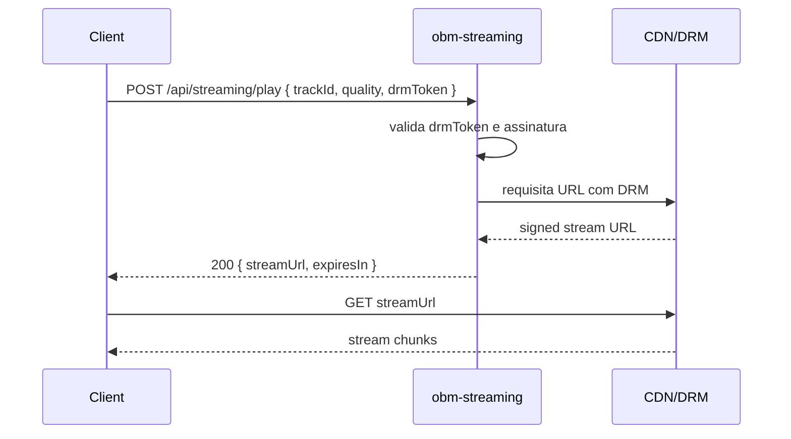
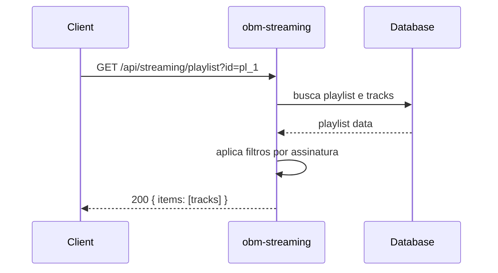
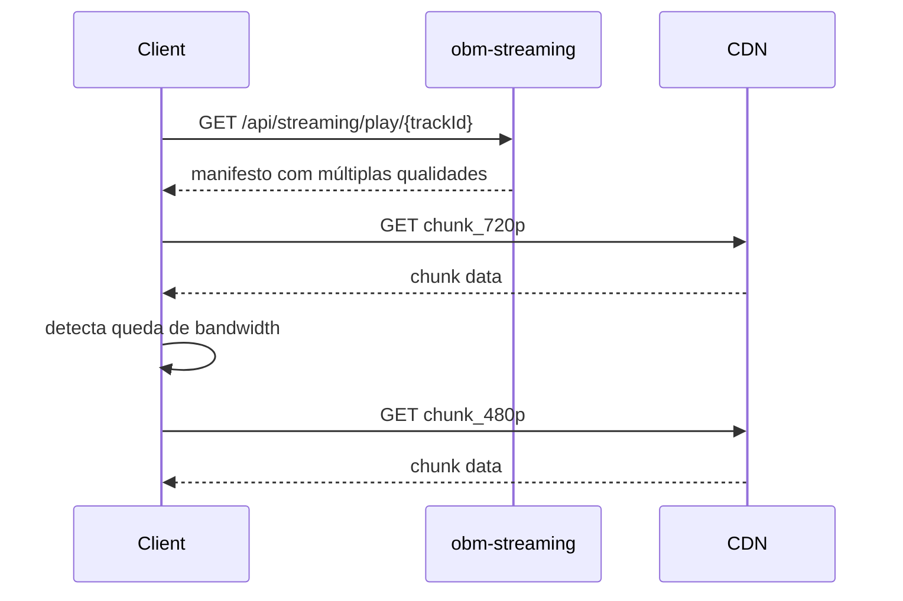

# obm-streaming 🎵

## 1. Objetivo do módulo
- Streaming de áudio/vídeo sob demanda.
- DRM, playlists e qualidade adaptativa.

## 2. Contrato com o core (`{{APP_ORBIT_SUITE}}`)

### 2.1. APIs REST
- `GET /api/streaming/tracks`
- `POST /api/streaming/play`
- `GET /api/streaming/playlist`

## 4.1. Contrato de API – Exemplos
> Segue [[00-Config/05-Protocolo-Orbit-OBM]].

### Play
Request:
```json
{ "trackId": "t_1", "quality": "auto", "drmToken": "..." }
```
Response (200):
```json
{ "status": "success", "data": { "streamUrl": "https://cdn/...", "expiresIn": 300 }, "meta": { "version": "v1", "traceId": "uuid", "timestamp": "..." } }
```

### Playlist
Request: `GET /api/streaming/playlist?id=pl_1`
Response (200):
```json
{ "status": "success", "data": { "items": [{ "id": "t_1" }] }, "meta": { "version": "v1", "traceId": "uuid", "timestamp": "..." } }
```

## 4.2. DRM
- Token de acesso curto; verificação no edge.
- Preferir padrões interoperáveis; logs e métricas de acesso.

## 4.3. Diagrama de Sequência – Play


### 4.4. Diagrama de Sequência – Playlist


### 4.5. Diagrama de Sequência – Qualidade Adaptativa


### 2.2. SDK
```ts
import { Streaming } from "@obm/streaming-sdk";
await Streaming.play({ trackId, quality });
```

## 3. Configuração
- `.env`: `CDN_URL`, `DRM_PROVIDER`, `ANALYTICS_URL`.

## 4. Fluxos principais
- Playback, playlist, coleta de telemetry.

## 5. Checklists
- Autorização por assinatura, limites de bitrate, integração com `obm-analytics`.