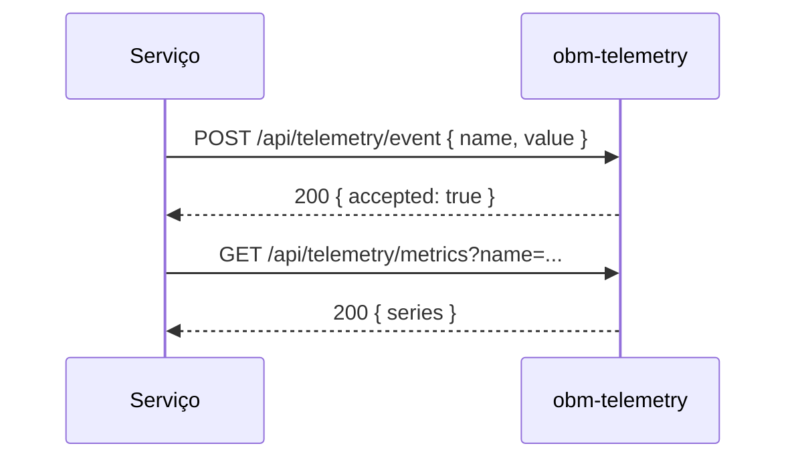

# obm-telemetry 📡

## 1. Objetivo do módulo
- Coleta de eventos e métricas operacionais.
- Agregação, dashboards e alertas.

## 2. Contrato com o core (`{{APP_ORBIT_SUITE}}`)

### 2.1. APIs REST
- `POST /api/telemetry/event`
- `GET /api/telemetry/metrics`

### 2.2. SDK
```ts
import { Telemetry } from "@obm/telemetry-sdk";
await Telemetry.track({ name, properties });
```

## 3. Configuração
- `.env`: `TELEMETRY_DB_URL`, `SAMPLING_RATE`, `RETENTION_POLICY`.

## 4. Fluxos principais
- Ingestão, agregação, visualização e alertas.

## 4.1. Contrato de API – Exemplos
> Segue [[00-Config/05-Protocolo-Orbit-OBM]].

### Ingestão de Evento
Request:
```json
{ "name": "cpu.usage", "value": 0.73, "labels": { "host": "api-1" }, "timestamp": "2025-11-15T12:00:00Z" }
```
Response (200):
```json
{ "status": "success", "data": { "accepted": true }, "meta": { "version": "v1", "traceId": "uuid", "timestamp": "..." } }
```

### Métricas
Request: `GET /api/telemetry/metrics?name=cpu.usage&from=...&to=...&granularity=minute`
Response (200):
```json
{ "status": "success", "data": { "series": [{ "timestamp": "2025-11-15T12:00:00Z", "value": 0.73 }] }, "meta": { "version": "v1", "traceId": "uuid", "timestamp": "..." } }
```

## 5. Checklists
- Privacidade/anonimização, sampling, performance e retenção.
## 4.2. Diagrama de Sequência


## Referências
- [[00-Config/05-Protocolo-Orbit-OBM]]
