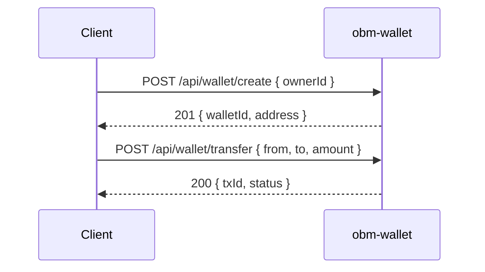

# obm-wallet 💼

## 1. Objetivo do módulo
- Carteiras digitais e operações (criar, assinar, transferir).
- Integração com pagamentos e NFTs.

## 2. Contrato com o core (`{{APP_ORBIT_SUITE}}`)

### 2.1. APIs REST
- `POST /api/wallet/create`
- `POST /api/wallet/transfer`
- `GET /api/wallet/balance`

### 2.2. SDK
```ts
import { Wallet } from "@obm/wallet-sdk";
await Wallet.transfer({ from, to, amount });
```

## 3. Configuração
- `.env`: `CHAIN_PROVIDER_URL`, `WALLET_PROVIDER`, `WEBHOOK_SECRET`.

## 4. Fluxos principais
- Criação, assinatura e transferência.

## 4.1. Contrato de API – Exemplos
> Segue [[00-Config/05-Protocolo-Orbit-OBM]].

### Create
Request:
```json
{ "ownerId": "u_123" }
```
Response (201):
```json
{ "status": "success", "data": { "walletId": "w_1", "address": "0x..." }, "meta": { "version": "v1", "traceId": "uuid", "timestamp": "..." } }
```

### Transfer
Request:
```json
{ "from": "w_1", "to": "w_2", "amount": "10.0", "asset": "NATIVE", "idempotencyKey": "idem-uuid" }
```
Response (200):
```json
{ "status": "success", "data": { "txId": "tx_123", "status": "submitted" }, "meta": { "version": "v1", "traceId": "uuid", "timestamp": "..." } }
```

### Balance
Request: `GET /api/wallet/balance?walletId=w_1`
Response (200):
```json
{ "status": "success", "data": { "balances": [{ "asset": "NATIVE", "amount": "42.0" }] }, "meta": { "version": "v1", "traceId": "uuid", "timestamp": "..." } }
```

## 5. Checklists
- Segurança (chaves), compliance, integração com `obm-nft-marketplace` e `obm-payments`.
## 4.2. Diagrama de Sequência


## Referências
- [[00-Config/05-Protocolo-Orbit-OBM]]
