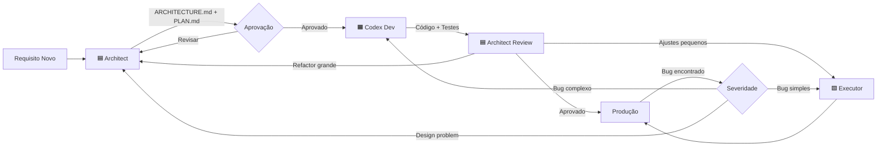

# Arquitetura de Agents 🧠

> [!info] Referência Completa
> Ver [[00-Config/03-RULES-GLOBAL#19. Papéis de Agents (3 Arquétipos)]] para detalhes completos.

## Visão Geral
Sistema de **3 agentes especializados** com responsabilidades claramente definidas e separadas.

## 🟦 Architect (GPT-5 Pro)
### Responsabilidades:
- **Planejar** arquitetura modular e contratos
- **Especificar** APIs, SDKs e integrações
- **Validar** qualidade e compliance com regras
- **Criar** documentos de design (ARCHITECTURE.md, PLAN.md)
- **NUNCA** gerar código de implementação longo

### Entregáveis:
- `ARCHITECTURE.md` - Visão arquitetural completa
- `PLAN.md` - Plano de implementação detalhado
- Diagramas (Mermaid)
- RFCs e especificações técnicas
- Validações e code reviews

### Quando Chamar:
- Novo módulo ou feature complexa
- Decisões arquiteturais importantes
- Refatorações grandes (> 500 linhas)
- Validação de design antes da implementação
- Review de código implementado

### Exemplo de Prompt:
```markdown
@Architect Preciso de um módulo de notificações OBM.

Requisitos:
- Suportar Email, SMS, Push notifications
- Integração com Twilio e SendGrid
- Fila de retry para falhas
- Templates personalizáveis

Gere ARCHITECTURE.md e PLAN.md.
```

---

## 🟧 Codex Dev (GPT-5.1)
### Responsabilidades:
- **Implementar** código seguindo plano aprovado
- **Gerar** boilerplate e scaffolding
- **Integrar** dependências e módulos
- **Criar** testes (unit, integration)
- **SEM** tomar decisões arquiteturais próprias

### Entregáveis:
- Código funcional (TypeScript, Python, etc.)
- Testes unitários e de integração
- Configurações (Dockerfile, package.json, docker-compose)
- README técnico
- Migrations de banco de dados

### Quando Chamar:
- Após Architect aprovar PLAN.md
- Implementação de novas features
- Criação de novos componentes/módulos
- Setup de infraestrutura (Docker, CI/CD)
- Integração entre módulos

### Exemplo de Prompt:
```markdown
@CodexDev Implemente o plano em PLAN.md para módulo de notificações.

Siga especificações em ARCHITECTURE.md.
Stack: NestJS + BullMQ + Redis + SendGrid

Gere:
- Código completo do serviço
- Testes unitários e integração
- Dockerfile e docker-compose
- README com instruções
```

---

## 🟩 Executor (GPT-5)
### Responsabilidades:
- **Corrigir** bugs pontuais
- **Otimizar** performance
- **Aplicar** patches de segurança
- **Ajustar** configurações
- **Manter** estrutura intacta (alterações mínimas)

### Entregáveis:
- Diffs mínimos (< 50 linhas típico)
- Hotfixes
- Atualizações de dependências
- Ajustes de configuração
- Correções de testes quebrados

### Quando Chamar:
- Bugs reportados em código existente
- Código quebrado após merge/rebase
- Atualizações de segurança
- Refactors pequenos (< 50 linhas)
- Ajustes de configuração (env vars, timeout, etc.)
- Typos e correções de documentação

### Exemplo de Prompt:
```markdown
@Executor Corrigir bug no AuthService.

Erro: JWT expira em 1h, deveria ser 24h.
Arquivo: modules/auth/service/src/auth.service.ts
Linha: ~45

Altere apenas o valor de expiresIn.
```

---

## Handoffs e Fluxo de Trabalho

### Fluxo Típico de Desenvolvimento:



### Matriz de Decisão:

| Situação | Architect | Codex Dev | Executor |
|----------|-----------|-----------|----------|
| Novo módulo | ✅ Planejar | ✅ Implementar | ❌ |
| Nova feature grande | ✅ Especificar | ✅ Implementar | 🟡 Polir |
| Bug simples (< 10 linhas) | ❌ | ❌ | ✅ Corrigir |
| Bug complexo (> 50 linhas) | 🟡 Revisar | ✅ Implementar fix | ❌ |
| Refactor grande | ✅ Planejar | ✅ Executar | ❌ |
| Refactor pequeno | ❌ | ❌ | ✅ Aplicar |
| Ajuste de config | ❌ | ❌ | ✅ Aplicar |
| Code review | ✅ Validar | 🟡 Ajustar | 🟡 Ajustar |
| Atualizar dependências | ❌ | 🟡 Major updates | ✅ Patch updates |
| Documentação | ✅ Arquitetural | 🟡 Técnica | ✅ Correções |

**Legenda:**
- ✅ Responsável primário
- 🟡 Responsável secundário (suporte)
- ❌ Não envolver

---

## Exemplo de Workflow Completo

### Cenário: Adicionar autenticação OAuth ao módulo Auth

#### Fase 1: Planejamento (Architect)
```markdown
@Architect Especificar integração OAuth (Google + GitHub) no módulo obm-auth.

Requisitos:
- Manter JWT existente
- Merge de contas por email
- Suportar múltiplos providers

Output esperado: ARCHITECTURE.md, PLAN.md
```

**Architect entrega:**
- `ARCHITECTURE-oauth.md` - Design da solução
- `PLAN-oauth.md` - Passos de implementação
- Diagramas de fluxo OAuth
- Decisões sobre merge de contas

#### Fase 2: Implementação (Codex Dev)
```markdown
@CodexDev Implementar PLAN-oauth.md usando NestJS + Passport.

Stack: 
- NestJS com @nestjs/passport
- passport-google-oauth20
- passport-github2

Gere código completo, testes, e configuração Docker.
```

**Codex Dev entrega:**
- Código implementado (`oauth.strategy.ts`, controller, etc.)
- Testes unitários e E2E
- Dockerfile atualizado
- README com instruções

#### Fase 3: Refinamento (Executor)
```markdown
@Executor Ajustar timeout de OAuth de 30s para 60s.

Arquivo: modules/auth/service/src/strategies/oauth.strategy.ts
Parâmetro: timeout

Motivo: Requests falhando em conexões lentas.
```

**Executor entrega:**
- Diff de 2 linhas alterando timeout
- Commit: `fix(auth): increase OAuth timeout to 60s`

#### Fase 4: Validação Final (Architect)
```markdown
@Architect Revisar implementação OAuth contra ARCHITECTURE-oauth.md.

Validar:
- Contratos da API
- Tratamento de erros
- Segurança (secrets, validation)
- Testes coverage
```

**Architect entrega:**
- Aprovação ou lista de ajustes necessários
- Validação de compliance com regras OBM

---

## Regras de Handoff

### Architect → Codex Dev
**Requisitos:**
- [ ] ARCHITECTURE.md completo e aprovado
- [ ] PLAN.md com passos claros
- [ ] Decisões técnicas documentadas
- [ ] Checklist de implementação
- [ ] Critérios de aceitação definidos

### Codex Dev → Architect
**Requisitos:**
- [ ] Código implementado conforme plano
- [ ] Testes passando (min 80% coverage)
- [ ] Build sem erros
- [ ] Documentação atualizada
- [ ] Pronto para review

### Architect → Executor
**Requisitos:**
- [ ] Issue bem definida (arquivo, linha, problema)
- [ ] Solução clara (o que mudar)
- [ ] Escopo pequeno (< 50 linhas)
- [ ] Não requer decisões arquiteturais

### Executor → Codex Dev (escalação)
**Quando:**
- Problema mais complexo que esperado (> 50 linhas)
- Requer mudança arquitetural
- Afeta múltiplos módulos
- Não há solução óbvia

---

## Comunicação Entre Agents

### Template de Handoff (Architect → Codex Dev):
```markdown
## Handoff: [Nome da Task]

### Contexto:
[Resumo do requisito e decisões tomadas]

### Entregáveis Prontos:
- [x] ARCHITECTURE.md em `/docs/architecture/oauth.md`
- [x] PLAN.md em `/docs/plans/oauth-implementation.md`
- [x] Diagramas em `/docs/diagrams/oauth-flow.mermaid`

### Stack Técnica:
- NestJS 10.x
- Passport + passport-google-oauth20
- Redis para cache de tokens

### Checklist de Implementação:
- [ ] Criar `oauth.strategy.ts`
- [ ] Atualizar `auth.controller.ts`
- [ ] Adicionar testes
- [ ] Atualizar documentação

### Critérios de Aceitação:
1. Login com Google funciona
2. Login com GitHub funciona
3. Contas são mergeadas por email
4. Testes com 90%+ coverage

### Pontos de Atenção:
⚠️ Validar redirect_uri em diferentes ambientes
⚠️ Rate limiting nas rotas OAuth

Pronto para implementação. @CodexDev pode prosseguir.
```

### Template de Bug Report (Any → Executor):
```markdown
## Bug: [Descrição Curta]

### Descrição:
[O que está acontecendo de errado]

### Localização:
- Arquivo: `path/to/file.ts`
- Linha: ~45
- Função: `generateToken()`

### Comportamento Esperado:
[O que deveria acontecer]

### Comportamento Atual:
[O que está acontecendo]

### Solução Proposta:
[Como corrigir - ser específico]

### Impacto:
- Severidade: Baixa / Média / Alta
- Afeta: [módulos/funcionalidades]

Pronto para correção. @Executor pode aplicar fix.
```

---

## Boas Práticas

### DO ✅
- Sempre definir responsável primário para cada task
- Documentar decisões importantes
- Fazer handoffs com contexto completo
- Validar entregáveis antes de handoff
- Escalar quando tarefa sai do escopo
- Usar templates de comunicação

### DON'T ❌
- Pular etapas do workflow
- Fazer handoff com requisitos incompletos
- Misturar responsabilidades (Architect codando, Executor planejando)
- Ignorar matriz de decisão
- Escalar desnecessariamente
- Comunicação vaga ou ambígua

---

## Ferramentas e Artefatos

### Arquivos Esperados em Handoffs:
- `ARCHITECTURE.md` - Design e visão arquitetural
- `PLAN.md` - Plano de implementação passo a passo
- `REVIEW.md` - Feedback de code review
- Diagramas (Mermaid, PlantUML)
- Checklists de validação

### Localização Padrão:
```
docs/
  architecture/
    [module-name]-architecture.md
  plans/
    [module-name]-plan.md
  reviews/
    [review-date]-review.md
  diagrams/
    [diagram-name].mermaid
```

---

## Referências
- [[00-Config/03-RULES-GLOBAL#19]] - Regra completa de papéis de agents
- [[00-Config/04-Protocolo-Tasks]] - Protocolo de 3 fases
- [[05-IA-e-Agents/02-GPT5-Pro-Architect-Agent]] - Detalhes do Architect
- [[05-IA-e-Agents/03-GPT5-1-Codex-Dev-Agent]] - Detalhes do Codex Dev
- [[05-IA-e-Agents/04-GPT5-Executor-Agent]] - Detalhes do Executor