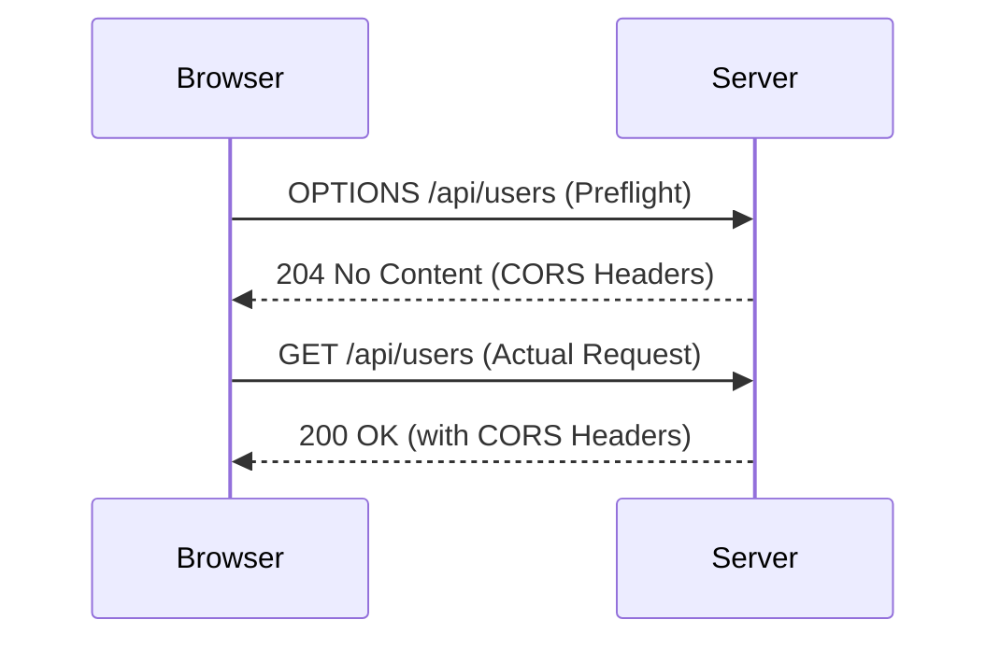
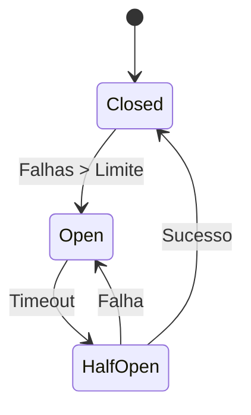

# Glossário Técnico - CORS, Rate-Limit, Circuit-Breaker 🔒

## CORS (Cross-Origin Resource Sharing)

### Conceito
CORS é um mecanismo que permite que recursos restritos em uma página web sejam solicitados de outro domínio fora do domínio do qual o recurso foi servido.

### Headers Principais
```http
# Requisição de exemplo
Origin: https://app.orbitbm.com
Access-Control-Request-Method: POST
Access-Control-Request-Headers: Content-Type, Authorization

# Resposta do servidor
Access-Control-Allow-Origin: https://app.orbitbm.com
Access-Control-Allow-Methods: GET, POST, PUT, DELETE, OPTIONS
Access-Control-Allow-Headers: Content-Type, Authorization
Access-Control-Allow-Credentials: true
Access-Control-Max-Age: 86400
```

### Configuração no NestJS
```typescript
// main.ts
app.enableCors({
  origin: [
    'https://app.orbitbm.com',
    'https://admin.orbitbm.com',
    'http://localhost:3000'
  ],
  methods: ['GET', 'POST', 'PUT', 'DELETE', 'OPTIONS'],
  allowedHeaders: ['Content-Type', 'Authorization', 'X-Orbit-Trace-Id'],
  credentials: true,
  maxAge: 86400,
  preflightContinue: false,
  optionsSuccessStatus: 204
});
```

### Fluxo de Requisição CORS


## Rate Limiting

### Conceito
Rate limiting é uma técnica usada para controlar a taxa de requisições que um usuário pode fazer para uma API dentro de um período de tempo específico.

### Algoritmos Comuns

#### 1. Token Bucket
```typescript
class TokenBucket {
  private tokens: number;
  private lastRefill: number;
  
  constructor(
    private capacity: number,
    private refillRate: number
  ) {
    this.tokens = capacity;
    this.lastRefill = Date.now();
  }
  
  consume(tokens: number = 1): boolean {
    this.refill();
    if (this.tokens >= tokens) {
      this.tokens -= tokens;
      return true;
    }
    return false;
  }
  
  private refill(): void {
    const now = Date.now();
    const tokensToAdd = Math.floor(
      (now - this.lastRefill) / 1000 * this.refillRate
    );
    this.tokens = Math.min(this.capacity, this.tokens + tokensToAdd);
    this.lastRefill = now;
  }
}
```

#### 2. Sliding Window
```typescript
class SlidingWindow {
  private requests: number[] = [];
  
  constructor(
    private windowSizeMs: number,
    private maxRequests: number
  ) {}
  
  isAllowed(): boolean {
    const now = Date.now();
    this.requests = this.requests.filter(
      timestamp => now - timestamp < this.windowSizeMs
    );
    
    if (this.requests.length < this.maxRequests) {
      this.requests.push(now);
      return true;
    }
    
    return false;
  }
}
```

### Implementação com Redis
```typescript
// rate-limit.middleware.ts
import { Injectable, NestMiddleware } from '@nestjs/common';
import { RedisService } from './redis.service';

@Injectable()
export class RateLimitMiddleware implements NestMiddleware {
  constructor(private redisService: RedisService) {}
  
  async use(req: Request, res: Response, next: Function) {
    const key = `rate_limit:${req.ip}:${req.route?.path}`;
    const limit = 100; // 100 requisições
    const window = 60; // por minuto
    
    const current = await this.redisService.incr(key);
    if (current === 1) {
      await this.redisService.expire(key, window);
    }
    
    if (current > limit) {
      res.status(429).json({
        status: 'error',
        error: {
          code: 'RATE_LIMIT_EXCEEDED',
          message: 'Too many requests'
        },
        meta: {
          limit,
          window,
          retryAfter: await this.redisService.ttl(key)
        }
      });
      return;
    }
    
    // Adicionar headers informativos
    res.setHeader('X-RateLimit-Limit', limit);
    res.setHeader('X-RateLimit-Remaining', limit - current);
    res.setHeader('X-RateLimit-Reset', Date.now() + (window * 1000));
    
    next();
  }
}
```

### Headers de Rate Limit
```http
X-RateLimit-Limit: 100
X-RateLimit-Remaining: 87
X-RateLimit-Reset: 1640995200000
X-RateLimit-Reset-After: 45
Retry-After: 45
```

## Circuit Breaker

### Conceito
Circuit Breaker é um padrão de design usado para detectar falhas e encapsular a lógica de prevenção de falhas que podem afetar a estabilidade do sistema.

### Estados do Circuit Breaker


### Implementação
```typescript
// circuit-breaker.service.ts
enum CircuitState {
  CLOSED = 'closed',
  OPEN = 'open',
  HALF_OPEN = 'half_open'
}

interface CircuitBreakerOptions {
  failureThreshold: number;
  resetTimeout: number;
  monitoringPeriod: number;
}

export class CircuitBreaker {
  private state = CircuitState.CLOSED;
  private failures = 0;
  private lastFailureTime = 0;
  private successes = 0;
  
  constructor(
    private name: string,
    private options: CircuitBreakerOptions
  ) {}
  
  async execute<T>(operation: () => Promise<T>): Promise<T> {
    if (this.state === CircuitState.OPEN) {
      if (Date.now() - this.lastFailureTime > this.options.resetTimeout) {
        this.state = CircuitState.HALF_OPEN;
      } else {
        throw new Error(`Circuit breaker ${this.name} is OPEN`);
      }
    }
    
    try {
      const result = await operation();
      this.onSuccess();
      return result;
    } catch (error) {
      this.onFailure();
      throw error;
    }
  }
  
  private onSuccess(): void {
    this.failures = 0;
    
    if (this.state === CircuitState.HALF_OPEN) {
      this.successes++;
      if (this.successes >= 3) { // Número configurável
        this.state = CircuitState.CLOSED;
        this.successes = 0;
      }
    }
  }
  
  private onFailure(): void {
    this.failures++;
    this.lastFailureTime = Date.now();
    
    if (this.failures >= this.options.failureThreshold) {
      this.state = CircuitState.OPEN;
      console.error(`Circuit breaker ${this.name} opened due to ${this.failures} failures`);
    }
  }
  
  getState(): CircuitState {
    return this.state;
  }
  
  getMetrics() {
    return {
      state: this.state,
      failures: this.failures,
      successes: this.successes,
      lastFailureTime: this.lastFailureTime
    };
  }
}
```

### Uso com Decorator
```typescript
// circuit-breaker.decorator.ts
export function CircuitBreakerDecorator(options: CircuitBreakerOptions) {
  const circuitBreakers = new Map<string, CircuitBreaker>();
  
  return function (target: any, propertyKey: string, descriptor: PropertyDescriptor) {
    const originalMethod = descriptor.value;
    const className = target.constructor.name;
    const breakerName = `${className}.${propertyKey}`;
    
    if (!circuitBreakers.has(breakerName)) {
      circuitBreakers.set(breakerName, new CircuitBreaker(breakerName, options));
    }
    
    descriptor.value = async function (...args: any[]) {
      const breaker = circuitBreakers.get(breakerName)!;
      return breaker.execute(() => originalMethod.apply(this, args));
    };
    
    return descriptor;
  };
}

// Exemplo de uso
@Injectable()
export class PaymentService {
  @CircuitBreakerDecorator({
    failureThreshold: 5,
    resetTimeout: 30000,
    monitoringPeriod: 60000
  })
  async processPayment(paymentData: any): Promise<PaymentResult> {
    // Lógica de pagamento que pode falhar
    return await this.stripeService.createPayment(paymentData);
  }
}
```

### Monitoramento
```typescript
// circuit-breaker.monitor.ts
@Injectable()
export class CircuitBreakerMonitor {
  private metrics: Map<string, any[]> = new Map();
  
  collectMetrics(name: string, metrics: any): void {
    if (!this.metrics.has(name)) {
      this.metrics.set(name, []);
    }
    
    const metricsArray = this.metrics.get(name)!;
    metricsArray.push({
      timestamp: Date.now(),
      ...metrics
    });
    
    // Manter apenas últimas 1000 métricas
    if (metricsArray.length > 1000) {
      metricsArray.shift();
    }
  }
  
  getMetrics(name?: string) {
    if (name) {
      return this.metrics.get(name) || [];
    }
    
    return Object.fromEntries(this.metrics);
  }
  
  getAlerts(): any[] {
    const alerts = [];
    
    for (const [name, metrics] of this.metrics) {
      const latest = metrics[metrics.length - 1];
      if (latest && latest.state === 'open') {
        alerts.push({
          name,
          type: 'CIRCUIT_BREAKER_OPEN',
          severity: 'high',
          timestamp: latest.timestamp,
          message: `Circuit breaker ${name} is OPEN`
        });
      }
    }
    
    return alerts;
  }
}
```

## Integração entre os Três Conceitos

```typescript
// resilient-api.service.ts
@Injectable()
export class ResilientApiService {
  constructor(
    private circuitBreaker: CircuitBreaker,
    private rateLimiter: RateLimitMiddleware,
    private corsMiddleware: CorsMiddleware
  ) {}
  
  @Get('/api/external-service')
  async callExternalService(@Req() req: Request, @Res() res: Response) {
    try {
      // 1. Verificar CORS
      this.corsMiddleware.handle(req, res);
      
      // 2. Verificar rate limit
      const allowed = await this.rateLimiter.isAllowed(req.ip);
      if (!allowed) {
        return res.status(429).json({
          error: 'Rate limit exceeded',
          retryAfter: 60
        });
      }
      
      // 3. Executar com circuit breaker
      const result = await this.circuitBreaker.execute(async () => {
        return await this.externalApi.call();
      });
      
      res.json({ data: result });
    } catch (error) {
      if (error.message.includes('Circuit breaker')) {
        res.status(503).json({
          error: 'Service temporarily unavailable',
          retryAfter: 30
        });
      } else {
        res.status(500).json({ error: 'Internal server error' });
      }
    }
  }
}
```

## Melhores Práticas

### CORS
1. **Sempre especifique origins permitidos** - Evite usar `*`
2. **Use credenciais com cuidado** - Apenas quando necessário
3. **Configure max-age adequado** - Reduza preflight requests
4. **Documente suas políticas CORS** - Facilite debugging

### Rate Limiting
1. **Seja transparente** - Sempre retorne headers informativos
2. **Use diferentes limites por endpoint** - APIs críticas podem ter limites diferentes
3. **Implemente rate limiting distribuído** - Use Redis para múltiplas instâncias
4. **Forneça formas de aumentar limites** - API keys premium, etc.

### Circuit Breaker
1. **Configure timeouts adequados** - Baseado em métricas reais
2. **Monitore constantemente** - Use dashboards e alertas
3. **Teste seus circuit breakers** - Simule falhas regularmente
4. **Use fallback strategies** - Retorne dados cacheados ou defaults

## Troubleshooting

### Problemas CORS
```bash
# Verificar headers da resposta
curl -I -X OPTIONS https://api.orbitbm.com/api/users \
  -H "Origin: https://app.orbitbm.com" \
  -H "Access-Control-Request-Method: POST"

# Testar preflight
curl -X OPTIONS https://api.orbitbm.com/api/users \
  -H "Origin: https://app.orbitbm.com" \
  -H "Access-Control-Request-Method: POST" \
  -H "Access-Control-Request-Headers: Content-Type"
```

### Problemas Rate Limit
```bash
# Verificar limites atuais
curl -I https://api.orbitbm.com/api/users \
  -H "Authorization: Bearer SEU_TOKEN"

# Analisar logs Redis
redis-cli MONITOR | grep rate_limit
```

### Problemas Circuit Breaker
```bash
# Verificar status dos circuit breakers
curl https://api.orbitbm.com/health/circuit-breakers

# Forçar abertura de circuito (dev only)
curl -X POST https://api.orbitbm.com/debug/force-circuit-open \
  -H "Content-Type: application/json" \
  -d '{"service": "payment-service"}'
```

---
**Referências**: [[00-Config/05-Protocolo-Orbit-OBM]] | [[04-Stacks-e-Infra/09-Observabilidade]] | [[00-Config/07-Catalogo-de-Erros]]