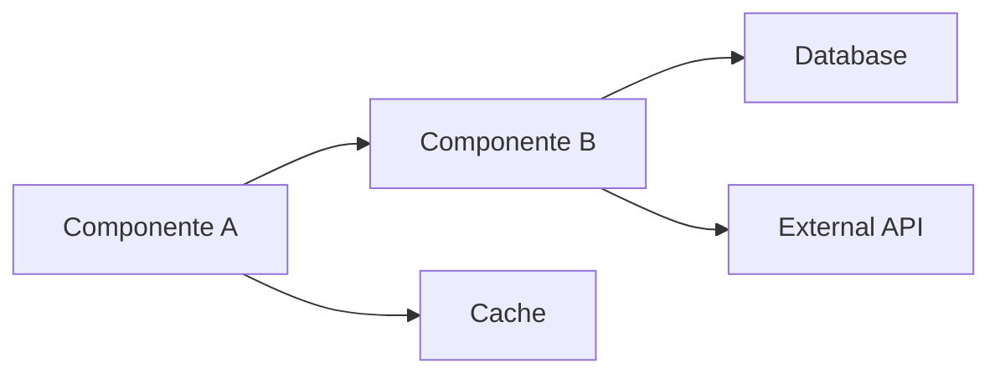
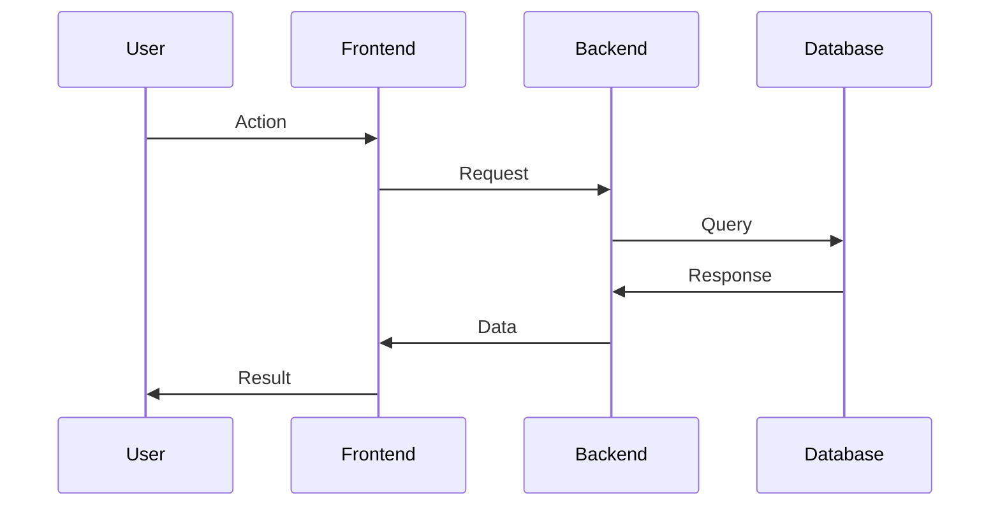

# TASK [ID] - PLANO

> **Fase:** 2/3 - PLANO
> **Objetivo:** Projetar solução com alternativas
> **Proibido:** Implementar sem aprovação

---

## 1. Contexto (da FASE 1 - ANÁLISE)

**Requisito:** [Resumo do que foi analisado]

**Arquivos principais:**
- [Lista dos arquivos que serão modificados/criados]

**Complexidade:** [Baixa/Média/Alta]

---

## 2. Abordagens Consideradas

### Opção A: [Nome Descritivo da Abordagem]

**Descrição:**
[Explicação detalhada de como seria implementado]

**Prós:**
- ✅ [Vantagem 1]
- ✅ [Vantagem 2]
- ✅ [Vantagem 3]

**Contras:**
- ❌ [Desvantagem 1]
- ❌ [Desvantagem 2]

**Esforço Estimado:** X horas/dias
**Risco:** Baixo/Médio/Alto
**Manutenibilidade:** Alta/Média/Baixa

---

### Opção B: [Nome Descritivo da Abordagem]

**Descrição:**
[Explicação detalhada de como seria implementado]

**Prós:**
- ✅ [Vantagem 1]
- ✅ [Vantagem 2]
- ✅ [Vantagem 3]

**Contras:**
- ❌ [Desvantagem 1]
- ❌ [Desvantagem 2]

**Esforço Estimado:** X horas/dias
**Risco:** Baixo/Médio/Alto
**Manutenibilidade:** Alta/Média/Baixa

---

### Opção C: [Nome Descritivo da Abordagem] (Se aplicável)

**Descrição:**
[Explicação detalhada de como seria implementado]

**Prós:**
- ✅ [Vantagem 1]
- ✅ [Vantagem 2]

**Contras:**
- ❌ [Desvantagem 1]
- ❌ [Desvantagem 2]

**Esforço Estimado:** X horas/dias
**Risco:** Baixo/Médio/Alto
**Manutenibilidade:** Alta/Média/Baixa

---

## 3. Recomendação

**Abordagem Escolhida:** Opção [A/B/C]

**Justificativa:**
[Por que esta é a melhor opção considerando prós/contras, esforço, risco e requisitos]

**Trade-offs Aceitos:**
- [Trade-off 1 e por que é aceitável]
- [Trade-off 2 e por que é aceitável]

---

## 4. Arquitetura Proposta

### Diagrama de Alto Nível



### Fluxo de Dados



### Componentes Principais

#### Componente 1: [Nome]
- **Responsabilidade:** [O que faz]
- **Tecnologia:** [Stack usado]
- **Interfaces:** [APIs expostas]

#### Componente 2: [Nome]
- **Responsabilidade:** [O que faz]
- **Tecnologia:** [Stack usado]
- **Interfaces:** [APIs expostas]

---

## 5. Estrutura de Arquivos

### Arquivos a Criar:
```
modules/
  [module-name]/
    service/
      src/
        controllers/
          [name].controller.ts          # NOVO
        services/
          [name].service.ts              # NOVO
        dto/
          [name].dto.ts                  # NOVO
        entities/
          [name].entity.ts               # NOVO
    tests/
      unit/
        [name].service.spec.ts           # NOVO
      integration/
        [name].e2e.spec.ts               # NOVO
    docs/
      [feature].md                       # NOVO
```

### Arquivos a Modificar:
```
modules/
  [module-name]/
    service/
      src/
        app.module.ts                    # MODIFICAR - registrar novo módulo
        [existing].controller.ts         # MODIFICAR - adicionar rota
```

---

## 6. Decisões Técnicas

| Decisão | Opção Escolhida | Alternativas Consideradas | Justificativa |
|---------|-----------------|---------------------------|---------------|
| Biblioteca OAuth | passport-google-oauth20 | Custom, Auth0 | Integração nativa NestJS, bem documentado |
| Storage de tokens | Redis (TTL 1h) | In-memory, Database | Performance + expiração automática |
| Validação de input | class-validator | Joi, Yup | Padrão NestJS, decorators TypeScript |
| Testes | Jest + Supertest | Mocha, Ava | Já configurado no projeto |

---

## 7. Modelo de Dados

### Entidades:

#### Entity: [Nome]
```typescript
@Entity('[table_name]')
export class [Name] {
  @PrimaryGeneratedColumn('uuid')
  id: string;

  @Column()
  field1: string;

  @Column({ nullable: true })
  field2?: string;

  @CreateDateColumn()
  createdAt: Date;

  @UpdateDateColumn()
  updatedAt: Date;
}
```

### Migrações:
- [ ] Migration: `create_[table_name]_table`
- [ ] Migration: `add_[field]_to_[table]`

---

## 8. APIs e Contratos

### Endpoints Novos:

#### POST /[resource]
**Descrição:** [O que faz]

**Request:**
```typescript
{
  "field1": "value",
  "field2": "value"
}
```

**Response (200):**
```typescript
{
  "id": "uuid",
  "field1": "value",
  "createdAt": "2025-11-16T00:00:00Z"
}
```

**Errors:**
- `400` - Bad Request (validação falhou)
- `401` - Unauthorized (não autenticado)
- `409` - Conflict (já existe)

---

#### GET /[resource]/:id
**Descrição:** [O que faz]

**Response (200):**
```typescript
{
  "id": "uuid",
  "field1": "value",
  "createdAt": "2025-11-16T00:00:00Z"
}
```

**Errors:**
- `404` - Not Found

---

### Endpoints Modificados:

#### PATCH /[existing-resource]/:id
**Mudança:** [O que muda no comportamento]

**Breaking Change:** Sim/Não
**Versão:** [Se breaking, qual nova versão]

---

## 9. Checklist de Implementação

### Fase 3.1: Setup e Scaffolding (X horas)
- [ ] Criar estrutura de arquivos
- [ ] Configurar módulo no `app.module.ts`
- [ ] Criar entidades Prisma/TypeORM
- [ ] Gerar migrations

### Fase 3.2: Implementação Core (Y horas)
- [ ] Implementar controller com rotas
- [ ] Implementar service com lógica de negócio
- [ ] Implementar repository/DAO
- [ ] Criar DTOs de validação
- [ ] Implementar tratamento de erros

### Fase 3.3: Integrações (Z horas)
- [ ] Integrar com [serviço externo]
- [ ] Configurar [biblioteca]
- [ ] Implementar cache (se aplicável)
- [ ] Configurar fila (se aplicável)

### Fase 3.4: Testes (W horas)
- [ ] Testes unitários (service)
- [ ] Testes unitários (controller)
- [ ] Testes de integração (E2E)
- [ ] Mocks de dependências externas
- [ ] Coverage > 80%

### Fase 3.5: Documentação (K horas)
- [ ] Atualizar README do módulo
- [ ] Documentar endpoints (OpenAPI/Swagger)
- [ ] Exemplos de uso
- [ ] Atualizar CHANGELOG

### Fase 3.6: Validação Final (L horas)
- [ ] Code review
- [ ] Lint passing (ESLint)
- [ ] Build sem erros
- [ ] Testes passando
- [ ] Deployment em staging

**Total Estimado:** [Soma de todas as fases] horas

---

## 10. Configurações Necessárias

### Variáveis de Ambiente (.env.example):
```bash
# [Feature Name]
FEATURE_API_KEY=your_api_key_here
FEATURE_API_URL=https://api.service.com
FEATURE_TIMEOUT=5000
```

### Secrets (não committar):
- [ ] `FEATURE_API_KEY` - Obter com [responsável]
- [ ] `FEATURE_SECRET` - Obter com [responsável]

---

## 11. Pontos de Atenção

### ⚠️ Cuidado com:
1. **[Ponto de atenção 1]**
   - Risco: [Descrição]
   - Validação: [Como garantir que não ocorra]

2. **[Ponto de atenção 2]**
   - Risco: [Descrição]
   - Validação: [Como garantir que não ocorra]

### 🔒 Segurança:
- [ ] Validar todos os inputs
- [ ] Rate limiting implementado
- [ ] Secrets nunca hardcoded
- [ ] HTTPS em produção
- [ ] CORS configurado corretamente

### 📊 Performance:
- [ ] Queries otimizadas (índices)
- [ ] Cache implementado (se aplicável)
- [ ] Paginação em listagens
- [ ] Timeout configurado

---

## 12. Critérios de Aceitação

### Funcional:
- [ ] [Critério 1 - O que deve funcionar]
- [ ] [Critério 2 - Comportamento esperado]
- [ ] [Critério 3 - Edge cases cobertos]

### Qualidade:
- [ ] Testes > 80% coverage
- [ ] Lint sem erros
- [ ] Build sem warnings
- [ ] Documentação completa

### Performance:
- [ ] Response time < [X]ms (p95)
- [ ] Throughput > [Y] req/s
- [ ] Sem memory leaks

### Segurança:
- [ ] Inputs validados
- [ ] Rate limiting ativo
- [ ] Logs não expõem dados sensíveis

---

## 13. Plano de Rollback

**Se algo der errado:**
1. [Passo 1 para reverter]
2. [Passo 2 para reverter]
3. [Passo 3 para reverter]

**Indicadores de falha:**
- [Métrica ou comportamento que indica problema]
- [Como monitorar]

---

## 14. Aprovação e Próximos Passos

**Este plano requer aprovação de:**
- [ ] Tech Lead / Architect
- [ ] Product Owner (se houver mudança de comportamento)
- [ ] Security Team (se houver mudança de segurança)

**Após aprovação:**
→ Avançar para FASE 3 (EXECUÇÃO)

**Aguardando:**
- [ ] Aprovação do plano
- [ ] Credenciais de serviços externos (se aplicável)
- [ ] Provisioning de infraestrutura (se aplicável)

---

## Checklist de Plano Completo

- [ ] Pelo menos 2 abordagens consideradas
- [ ] Recomendação clara com justificativa
- [ ] Diagramas de arquitetura (Mermaid)
- [ ] Estrutura de arquivos detalhada
- [ ] Decisões técnicas documentadas
- [ ] Modelo de dados especificado
- [ ] APIs/contratos definidos
- [ ] Checklist de implementação completo
- [ ] Pontos de atenção identificados
- [ ] Critérios de aceitação claros
- [ ] Plano de rollback definido

---

> [!success] Plano Completo
> Este plano está pronto para aprovação. Após aprovação, Codex Dev pode executar FASE 3.

**Data:** [YYYY-MM-DD]
**Responsável:** [Nome do Agent - Architect]
**Revisores:** [Nomes dos stakeholders]
**Versão:** 1.0
