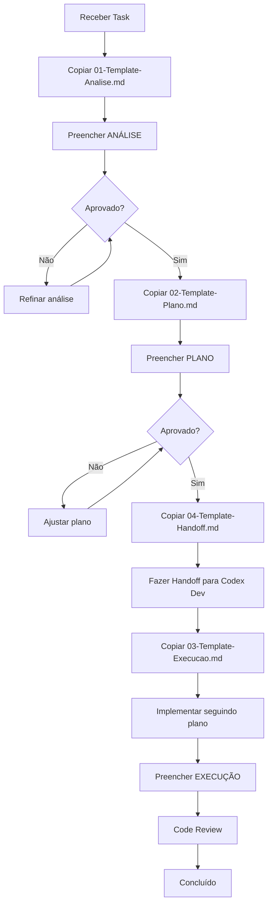

# Templates de Protocolo .TASK 📋

> **Versão:** 1.0
> **Data:** 2025-11-16
> **Baseado em:** [[00-Config/04-Protocolo-Tasks]]

## Visão Geral

Este diretório contém **templates prontos para uso** para cada fase do Protocolo .TASK e para handoffs entre agents.

## Templates Disponíveis

### 1. Template de Análise (FASE 1)
**Arquivo:** `01-Template-Analise.md`
**Quando usar:** Início de qualquer task, antes de gerar código
**Responsável:** Architect ou Codex Dev

**Contém:**
- Resumo da solicitação
- Arquivos afetados
- Módulos envolvidos
- Dependências externas
- Riscos identificados
- Perguntas de clarificação
- Estimativa de complexidade
- Bloqueadores
- Compliance com regras

---

### 2. Template de Plano (FASE 2)
**Arquivo:** `02-Template-Plano.md`
**Quando usar:** Após análise aprovada, antes de implementar
**Responsável:** Architect

**Contém:**
- Abordagens consideradas (2-3 opções)
- Recomendação com justificativa
- Arquitetura proposta (diagramas Mermaid)
- Estrutura de arquivos
- Decisões técnicas
- Modelo de dados
- APIs e contratos
- Checklist de implementação
- Pontos de atenção
- Critérios de aceitação

---

### 3. Template de Execução (FASE 3)
**Arquivo:** `03-Template-Execucao.md`
**Quando usar:** Após plano aprovado, durante implementação
**Responsável:** Codex Dev ou Executor

**Contém:**
- Referência ao plano aprovado
- Progresso da implementação (checklist)
- Commits realizados
- Testes executados
- Linter e build
- Problemas encontrados
- Documentação atualizada
- Validação de compliance
- Deployment
- Métricas de qualidade
- Code review
- Checklist final

---

### 4. Template de Handoff
**Arquivo:** `04-Template-Handoff.md`
**Quando usar:** Ao passar task de um agent para outro
**Responsável:** Agent de origem (ex: Architect → Codex Dev)

**Contém:**
- Contexto e objetivo
- Entregáveis prontos
- Decisões tomadas
- Stack técnica definida
- Dependências e pré-requisitos
- Checklist de implementação
- Arquivos a criar/modificar
- Contratos de API
- Pontos de atenção críticos
- Critérios de aceitação
- Riscos e mitigações
- Recursos e referências
- Próximos passos
- Validação de handoff

---

## Como Usar os Templates

### Passo 1: Copiar Template
```bash
cp 07-Receitas-e-Playbooks/01-Templates/01-Template-Analise.md \
   docs/tasks/TASK-123-ANALISE.md
```

### Passo 2: Preencher Informações
- Substitua `[placeholders]` com informações reais
- Remova seções não aplicáveis (marque como "N/A" se preferir manter estrutura)
- Adicione seções extras se necessário

### Passo 3: Revisar
- Verifique se todas as seções obrigatórias estão preenchidas
- Valide contra checklist do template
- Solicite review se necessário

### Passo 4: Armazenar
- Salve em `docs/tasks/TASK-[ID]-[FASE].md`
- Ou em local apropriado do módulo

---

## Exemplo de Workflow Completo



---

## Boas Práticas

### DO ✅
- **Use os templates como base** - Eles foram desenhados seguindo as 21 regras OBM
- **Customize quando necessário** - Adicione seções específicas do seu módulo
- **Preencha todos os campos** - Mesmo que seja "N/A", documente
- **Seja específico** - Evite descrições vagas
- **Inclua exemplos** - Código, diagramas, screenshots
- **Valide compliance** - Use checklists de regras

### DON'T ❌
- **Não pule fases** - Protocolo .TASK é obrigatório
- **Não deixe placeholders** - [PREENCHA TUDO]
- **Não assuma** - Se ambíguo, pergunte (Regra 16)
- **Não ignore checklists** - Eles garantem qualidade
- **Não modifique templates** - Copie e customize

---

## Seções Obrigatórias vs Opcionais

### ANÁLISE (FASE 1):
**Obrigatórias:**
- Resumo da solicitação
- Arquivos afetados
- Perguntas de clarificação
- Estimativa de complexidade

**Opcionais:**
- Módulos envolvidos (se não houver)
- Bloqueadores (se não houver)

---

### PLANO (FASE 2):
**Obrigatórias:**
- Abordagens consideradas (mín. 2)
- Recomendação
- Arquitetura proposta
- Checklist de implementação
- Critérios de aceitação

**Opcionais:**
- Opção C (se 2 opções forem suficientes)
- Modelo de dados (se não houver DB)

---

### EXECUÇÃO (FASE 3):
**Obrigatórias:**
- Progresso da implementação
- Commits realizados
- Testes executados
- Documentação atualizada
- Checklist final

**Opcionais:**
- Testes de performance (se não for requisito)
- Retrospectiva (recomendada mas opcional)

---

### HANDOFF:
**Obrigatórias:**
- Contexto e objetivo
- Entregáveis prontos
- Decisões tomadas
- Checklist de implementação
- Critérios de aceitação

**Opcionais:**
- P&R (se não houver perguntas antecipadas)
- Apêndice de comandos (se não for útil)

---

## Integração com Ferramentas

### Obsidian
Templates são compatíveis com wikilinks:
```markdown
[[00-Config/03-RULES-GLOBAL]]
[[05-IA-e-Agents/01-Arquitetura-de-Agents]]
```

### VS Code
Use snippets para inserir templates rapidamente:
```json
{
  "OBM Task Analysis": {
    "prefix": "obm-analysis",
    "body": [
      "# TASK $1 - ANÁLISE",
      "",
      "> **Fase:** 1/3 - ANÁLISE",
      "..."
    ]
  }
}
```

### Git
Crie aliases para facilitar:
```bash
git config alias.task-start '!cp 07-Receitas-e-Playbooks/01-Templates/01-Template-Analise.md docs/tasks/TASK-$1-ANALISE.md'
```

---

## Validação de Templates

### Checklist de Template Preenchido:

#### ANÁLISE:
- [ ] Resumo claro da solicitação
- [ ] Arquivos afetados listados
- [ ] Perguntas formuladas
- [ ] Estimativa presente
- [ ] Nenhum placeholder `[...]` restante

#### PLANO:
- [ ] Mínimo 2 opções consideradas
- [ ] Recomendação clara
- [ ] Diagramas incluídos
- [ ] Checklist de implementação completo
- [ ] Nenhum placeholder `[...]` restante

#### EXECUÇÃO:
- [ ] Progresso atualizado
- [ ] Commits documentados
- [ ] Testes executados
- [ ] Compliance validado
- [ ] Nenhum placeholder `[...]` restante

#### HANDOFF:
- [ ] Contexto claro
- [ ] Decisões documentadas
- [ ] Checklist completo
- [ ] Critérios de aceitação definidos
- [ ] Nenhum placeholder `[...]` restante

---

## Suporte e Melhorias

### Problemas com Templates:
Se encontrar problemas ou tiver sugestões:
1. Abra issue no repositório
2. Tag: `templates`, `documentation`
3. Descreva o problema/sugestão

### Contribuindo:
Para propor melhorias nos templates:
1. Crie PR com mudanças propostas
2. Justifique as mudanças
3. Atualize este README se necessário

---

## Referências

- [[00-Config/04-Protocolo-Tasks]] - Protocolo completo de 3 fases
- [[00-Config/03-RULES-GLOBAL]] - 21 regras para compliance
- [[05-IA-e-Agents/01-Arquitetura-de-Agents]] - Papéis e responsabilidades
- [[PLAN-TAREFAS-EXPANDIDO]] - Plano de implementação

---

## Changelog de Templates

### v1.0 (2025-11-16)
- ✅ Template de Análise (FASE 1)
- ✅ Template de Plano (FASE 2)
- ✅ Template de Execução (FASE 3)
- ✅ Template de Handoff
- ✅ README com instruções

### Próximas Versões:
- [ ] Template de Retrospectiva
- [ ] Template de Post-Mortem
- [ ] Template de RFC (Request for Comments)

---

> [!tip] Dica
> Mantenha templates preenchidos como exemplos para futuras tasks similares!

**Versão:** 1.0
**Última Atualização:** 2025-11-16
**Mantido por:** Architect Team
