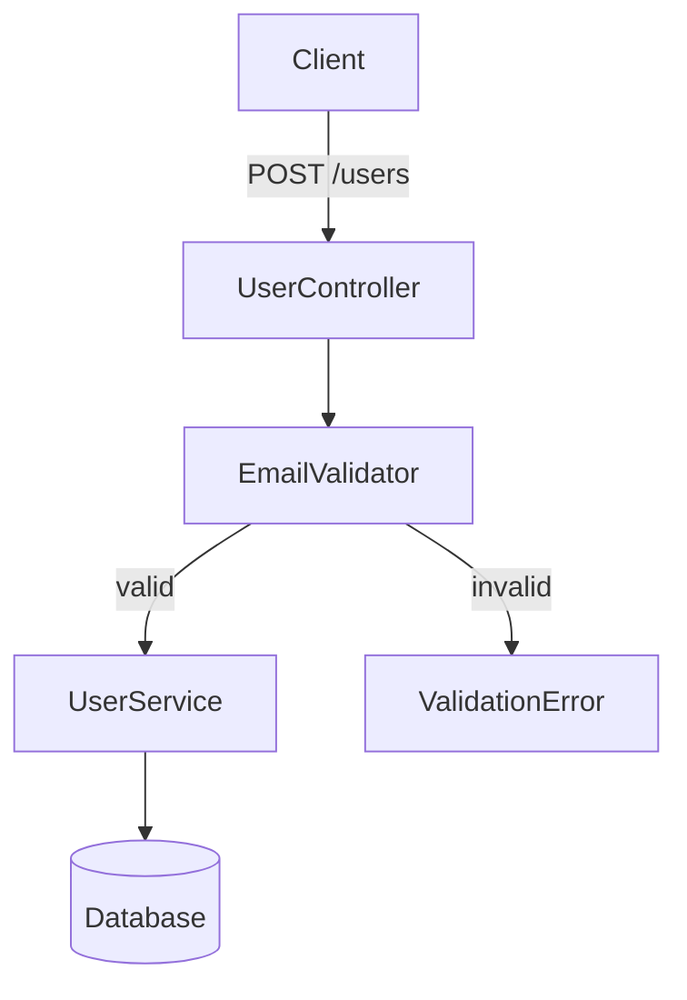
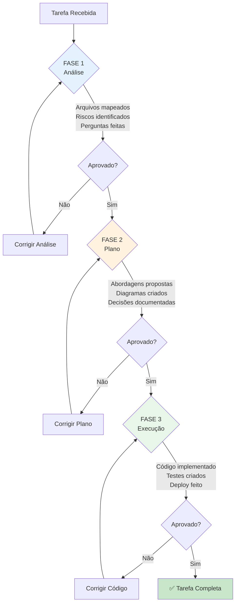

# Checklist: R15 - Protocolo .TASK (3 Fases)

**Regra:** Toda tarefa DEVE seguir o protocolo de 3 fases: ANÁLISE → PLANO → EXECUÇÃO. Pular fases é proibido.

**Versão:** 1.0  
**Última atualização:** 2025-11-16

---

## 📋 Checklist Completo

### FASE 1: ANÁLISE (❌ ZERO CÓDIGO)

#### 1.1 Entendimento do Problema
- [ ] Requisito original foi lido e compreendido?
- [ ] Escopo está claro (o que fazer e o que NÃO fazer)?
- [ ] Critérios de sucesso estão definidos?
- [ ] Stakeholders identificados?

#### 1.2 Mapeamento de Arquivos
- [ ] Todos os arquivos afetados foram listados?
- [ ] Arquivos existentes vs. novos identificados?
- [ ] Dependências entre arquivos mapeadas?
- [ ] Arquivos de teste correspondentes identificados?

**Template:**
```markdown
## Arquivos Afetados

### A Modificar
- [ ] `src/services/user.service.ts` (adicionar validação)
- [ ] `src/dto/user.dto.ts` (novo campo email)

### A Criar
- [ ] `src/validators/email.validator.ts` (nova validação)
- [ ] `tests/validators/email.validator.spec.ts` (testes)

### Dependências
- user.service.ts → email.validator.ts
- user.dto.ts → (usado por user.service.ts)
```

#### 1.3 Identificação de Módulos
- [ ] Módulos envolvidos listados?
- [ ] Responsável por cada módulo identificado?
- [ ] Dependências inter-módulos mapeadas?
- [ ] Possíveis conflitos identificados?

#### 1.4 Dependências Externas
- [ ] Bibliotecas externas necessárias listadas?
- [ ] Licenças verificadas (R13)?
- [ ] Versões compatíveis checadas?
- [ ] Alternativas avaliadas?

#### 1.5 Identificação de Riscos
- [ ] Riscos técnicos listados (mínimo 3)?
- [ ] Riscos de negócio identificados?
- [ ] Riscos de segurança avaliados?
- [ ] Mitigações propostas para cada risco?

**Template de Riscos:**
```markdown
| Risco | Probabilidade | Impacto | Mitigação |
|-------|---------------|---------|-----------|
| Breaking change na API | Média | Alto | Versionar API (v1 → v2) |
| Performance degradada | Baixa | Médio | Benchmarks antes/depois |
| Dados inconsistentes | Alta | Alto | Migração + validação |
```

#### 1.6 Perguntas de Clarificação
- [ ] Todas as ambiguidades identificadas?
- [ ] Perguntas formuladas claramente (R16, R20)?
- [ ] Opções de solução apresentadas?
- [ ] Decisões pendentes documentadas?

**Mínimo 5 perguntas obrigatórias:**
1. Qual o comportamento esperado se [cenário edge]?
2. Devemos manter compatibilidade com [versão anterior]?
3. Como lidar com [dados existentes]?
4. Qual a prioridade: [performance vs. simplicidade]?
5. Há restrições de [tempo/orçamento/tecnologia]?

#### 1.7 Estimativa de Complexidade
- [ ] Complexidade técnica avaliada (1-10)?
- [ ] Esforço estimado (horas)?
- [ ] Dependências críticas identificadas?
- [ ] Possíveis bloqueadores listados?

**Escala de Complexidade:**
- 1-3: Simples (< 4h, 1 arquivo, sem riscos)
- 4-6: Média (4-16h, 2-5 arquivos, riscos baixos)
- 7-8: Alta (16-40h, 6-15 arquivos, riscos médios)
- 9-10: Crítica (> 40h, > 15 arquivos, riscos altos)

#### 1.8 Validação de Compliance (21 Regras)
- [ ] R13: Licenças verificadas?
- [ ] R14: Alterações serão mínimas?
- [ ] R15: Protocolo sendo seguido? ✅ (você está aqui)
- [ ] R16: Ambiguidades resolvidas?
- [ ] R17: UI/lógica separados (se aplicável)?
- [ ] R18: Módulo segue padrão?
- [ ] R19: Agente correto para a tarefa?
- [ ] R20: Todas as decisões documentadas?
- [ ] R21: Raciocínio profundo aplicado?
- [ ] R1-R12: Outras regras relevantes checadas?

#### 1.9 Entregável FASE 1
- [ ] Documento de Análise criado (Template-Analise.md)?
- [ ] Todos os itens acima preenchidos?
- [ ] Nenhuma linha de código foi escrita? ✅
- [ ] Aprovação para prosseguir para FASE 2 obtida?

---

### FASE 2: PLANO (⚠️ DIAGRAMS ONLY)

#### 2.1 Abordagens Alternativas
- [ ] Mínimo 2 abordagens diferentes propostas?
- [ ] Prós e contras de cada abordagem listados?
- [ ] Recomendação clara com justificativa?
- [ ] Trade-offs explicitados?

**Template:**
```markdown
## Opção A: Validação no DTO
**Prós:** Centralizado, reutilizável
**Contras:** Acoplado ao framework
**Esforço:** 4h

## Opção B: Middleware customizado
**Prós:** Flexível, testável
**Contras:** Mais código
**Esforço:** 6h

## Opção C: Library externa (class-validator)
**Prós:** Battle-tested, features extras
**Contras:** Dependência externa
**Esforço:** 2h

## Recomendação: Opção C
**Justificativa:** Reduz esforço, amplamente usado, bem mantido
```

#### 2.2 Diagrama de Arquitetura
- [ ] Diagrama criado (Mermaid ou draw.io)?
- [ ] Componentes claramente identificados?
- [ ] Fluxo de dados documentado?
- [ ] Integrações externas marcadas?

**Exemplo Mermaid:**


#### 2.3 Estrutura de Arquivos
- [ ] Estrutura de diretórios definida?
- [ ] Nomenclatura padronizada?
- [ ] Localização de testes especificada?
- [ ] Configurações necessárias listadas?

#### 2.4 Decisões Técnicas
- [ ] Stack tecnológica confirmada?
- [ ] Bibliotecas específicas escolhidas?
- [ ] Padrões de código definidos?
- [ ] Naming conventions acordadas?

**Matriz de Decisões:**
| Decisão | Opção Escolhida | Alternativas | Justificativa |
|---------|-----------------|--------------|---------------|
| Validação | class-validator | Joi, Zod | Integração NestJS |
| Storage | Redis | Memcached | Suporte a TTL |

#### 2.5 Modelo de Dados
- [ ] Schema de dados definido?
- [ ] Tipos TypeScript especificados?
- [ ] Validações de campo documentadas?
- [ ] Migrações necessárias identificadas?

#### 2.6 Contratos de API
- [ ] Endpoints definidos (método + path)?
- [ ] Request/Response schemas documentados?
- [ ] Códigos de erro especificados?
- [ ] Exemplos de uso fornecidos?

**Exemplo:**
```typescript
/**
 * POST /api/v1/users
 * 
 * Request:
 * {
 *   "name": "John Doe",
 *   "email": "john@example.com"
 * }
 * 
 * Response 201:
 * {
 *   "id": "uuid",
 *   "name": "John Doe",
 *   "email": "john@example.com",
 *   "createdAt": "2025-01-01T00:00:00Z"
 * }
 * 
 * Response 400:
 * {
 *   "error": "ValidationError",
 *   "message": "Invalid email format"
 * }
 */
```

#### 2.7 Checklist de Implementação
- [ ] Tarefas divididas em passos atômicos?
- [ ] Ordem de implementação definida?
- [ ] Dependências entre tarefas mapeadas?
- [ ] Critérios de validação por passo?

**Exemplo:**
```markdown
## Checklist de Implementação

### 1. Setup (30min)
- [ ] Instalar class-validator
- [ ] Configurar tsconfig para decorators
- [ ] Atualizar package.json

### 2. Validador (1h)
- [ ] Criar EmailValidator
- [ ] Adicionar testes unitários
- [ ] Documentar uso

### 3. Integração (1h)
- [ ] Aplicar no UserDTO
- [ ] Testar integração
- [ ] Atualizar docs da API

### 4. Deploy (30min)
- [ ] Criar migration (se necessário)
- [ ] Atualizar README
- [ ] Merge para main
```

#### 2.8 Configurações Necessárias
- [ ] Variáveis de ambiente listadas?
- [ ] Valores padrão especificados?
- [ ] Secrets identificados?
- [ ] Documentação de configuração criada?

#### 2.9 Pontos de Atenção Críticos
- [ ] Breaking changes identificados?
- [ ] Performance considerations documentados?
- [ ] Security concerns levantados?
- [ ] Rollback plan definido?

#### 2.10 Critérios de Aceitação
- [ ] Critérios funcionais definidos (mínimo 5)?
- [ ] Critérios não-funcionais definidos?
- [ ] Testes de aceitação especificados?
- [ ] Métricas de sucesso estabelecidas?

**Exemplo:**
```markdown
## Critérios de Aceitação

### Funcionais
- [ ] Sistema aceita email válido (john@example.com)
- [ ] Sistema rejeita email inválido (john@)
- [ ] Mensagem de erro clara para usuário
- [ ] Email salvo em lowercase no banco

### Não-Funcionais
- [ ] Validação < 10ms (p95)
- [ ] 100% de cobertura de testes
- [ ] Zero breaking changes
```

#### 2.11 Plano de Rollback
- [ ] Estratégia de rollback definida?
- [ ] Scripts de rollback preparados?
- [ ] Dados podem ser revertidos?
- [ ] Tempo de rollback estimado?

#### 2.12 Entregável FASE 2
- [ ] Documento de Plano criado (Template-Plano.md)?
- [ ] Diagramas criados e validados?
- [ ] Decisões técnicas documentadas?
- [ ] Nenhuma linha de código de produção escrita? ✅
- [ ] Aprovação para prosseguir para FASE 3 obtida?

---

### FASE 3: EXECUÇÃO (✅ CODE NOW)

#### 3.1 Setup Inicial
- [ ] Branch criada (feature/task-name)?
- [ ] Dependências instaladas?
- [ ] Ambiente de desenvolvimento configurado?
- [ ] Tests podem rodar?

#### 3.2 Implementação por Etapa
- [ ] Cada item do checklist FASE 2 implementado?
- [ ] Commits atômicos por tarefa?
- [ ] Mensagens de commit descritivas?
- [ ] Código segue padrões do projeto?

**Convenção de Commits:**
```
feat(user): add email validation with class-validator
fix(user): handle null email in validator
test(user): add email validation test cases
docs(user): update API docs with email validation
```

#### 3.3 Testes
- [ ] Testes unitários criados para cada função?
- [ ] Testes de integração criados?
- [ ] Todos os testes passam?
- [ ] Cobertura ≥ 80%?

```bash
npm test -- --coverage
# Coverage summary:
# Statements   : 85% ( 17/20 )
# Branches     : 80% ( 8/10 )
# Functions    : 90% ( 9/10 )
# Lines        : 85% ( 17/20 )
```

#### 3.4 Linting e Build
- [ ] ESLint passa sem erros?
- [ ] Prettier aplicado?
- [ ] Build passa sem erros?
- [ ] TypeScript sem erros de tipo?

```bash
npm run lint
npm run format
npm run build
npx tsc --noEmit
```

#### 3.5 Documentação
- [ ] README atualizado (se necessário)?
- [ ] API docs atualizados?
- [ ] Comentários inline adicionados (onde necessário)?
- [ ] CHANGELOG atualizado?

#### 3.6 Validação de Compliance (FASE 3)
- [ ] R14: Alterações foram mínimas? (< 30% por arquivo)
- [ ] R15: Protocolo foi seguido? ✅ (você está na FASE 3)
- [ ] R17: UI/lógica separados? (se aplicável)
- [ ] Outras regras relevantes validadas?

#### 3.7 Code Review Interno
- [ ] Código revisado por você mesmo?
- [ ] Diff revisado linha por linha?
- [ ] Código desnecessário removido?
- [ ] TODOs/FIXMEs justificados?

#### 3.8 Testes Manuais
- [ ] Happy path testado manualmente?
- [ ] Edge cases testados?
- [ ] Mensagens de erro validadas?
- [ ] Performance verificada (se crítico)?

#### 3.9 Deploy (Staging)
- [ ] Deploy em staging bem-sucedido?
- [ ] Smoke tests passam?
- [ ] Logs sem erros críticos?
- [ ] Rollback testado?

#### 3.10 Qualidade Final
- [ ] Todos os critérios de aceitação atendidos?
- [ ] Nenhum teste quebrado?
- [ ] Nenhum lint error?
- [ ] Performance dentro do esperado?

#### 3.11 Entregável FASE 3
- [ ] Documento de Execução criado (Template-Execucao.md)?
- [ ] Pull Request aberta com descrição completa?
- [ ] Todos os checks CI/CD passam?
- [ ] Code review aprovado por peer?

---

## 🚫 Consequências de Pular Fases

### Pular FASE 1 (Análise)
**Sintomas:**
- Arquivos inesperados modificados
- Escopo aumentando ("scope creep")
- Retrabalho constante
- Riscos não identificados explodem

**Impacto:**
- 3-5x mais tempo gasto
- Qualidade baixa
- Bugs em produção

### Pular FASE 2 (Plano)
**Sintomas:**
- Refatorações durante implementação
- Decisões técnicas conflitantes
- Arquitetura inconsistente
- Breaking changes acidentais

**Impacto:**
- 2-4x mais tempo gasto
- Débito técnico alto
- Manutenção difícil

### Ir Direto para Código
**Sintomas:**
- "Já comecei a codar, agora vou documentar"
- Código desorganizado
- Testes insuficientes
- Documentação desatualizada

**Impacto:**
- PROIBIDO ❌
- Trabalho deve ser rejeitado
- Reiniciar do zero

---

## 📊 Score de Compliance

### Cálculo do Score

**Pontuação por fase:**
- FASE 1 (Análise): 35 pontos
- FASE 2 (Plano): 35 pontos
- FASE 3 (Execução): 30 pontos

**Total:** 100 pontos

### Checklist Rápido

| Fase | Item | Pontos | ✅ |
|------|------|--------|---|
| **FASE 1** | Arquivos mapeados | 10 | ☐ |
| | Riscos identificados | 10 | ☐ |
| | Perguntas formuladas | 10 | ☐ |
| | Zero código escrito | 5 | ☐ |
| **FASE 2** | ≥2 abordagens propostas | 10 | ☐ |
| | Diagrama criado | 10 | ☐ |
| | Decisões documentadas | 10 | ☐ |
| | Aprovação obtida | 5 | ☐ |
| **FASE 3** | Testes ≥ 80% | 10 | ☐ |
| | Build + lint passa | 10 | ☐ |
| | Docs atualizadas | 5 | ☐ |
| | Deploy staging OK | 5 | ☐ |
| **TOTAL** | | **100** | |

### Níveis
- 🏆 **Excellent:** 95-100 pontos
- ✅ **Good:** 85-94 pontos
- ⚠️ **Acceptable:** 75-84 pontos
- ❌ **Insufficient:** < 75 pontos

---

## 🔄 Fluxograma do Protocolo



---

## 📚 Referências

- [[03-RULES-GLOBAL#R15]]
- [[04-Protocolo-Tasks]]
- [[01-Template-Analise]]
- [[02-Template-Plano]]
- [[03-Template-Execucao]]
- [[04-Template-Handoff]]
