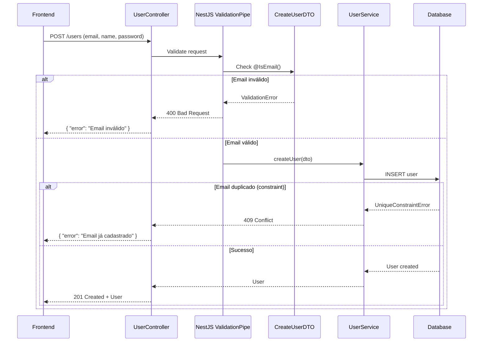

# Exemplo Prático: R15 - Protocolo .TASK (3 Fases)

**Regra:** Toda tarefa DEVE seguir ANÁLISE → PLANO → EXECUÇÃO. Pular fases é proibido.

**Versão:** 1.0  
**Última atualização:** 2025-11-16

---

## 🎯 Cenário Real

**Tarefa:** "Adicionar validação de email no cadastro de usuários"

Vamos seguir o protocolo .TASK corretamente.

---

## ✅ EXEMPLO BOM: Seguindo o Protocolo

### FASE 1: ANÁLISE (❌ ZERO CÓDIGO)

#### 1.1 Entendimento do Requisito

**Requisito Original:**
> "Adicionar validação de email no cadastro de usuários"

**Análise:**
```markdown
## 📋 Análise da Tarefa

### Escopo Identificado
- Adicionar validação de formato de email
- Aplicar no fluxo de cadastro de usuários
- Retornar erro claro se email inválido

### O que ESTÁ no escopo
- ✅ Validação de formato (regex)
- ✅ Feedback de erro ao usuário
- ✅ Validação tanto no frontend quanto backend

### O que NÃO está no escopo (confirmar)
- ❓ Validação de email duplicado no banco?
- ❓ Envio de email de confirmação?
- ❓ Verificação de domínio existente (DNS lookup)?
```

#### 1.2 Arquivos Afetados

```markdown
## 📁 Arquivos Afetados

### A Modificar
- [ ] `src/modules/user/dto/create-user.dto.ts` 
      (adicionar decorador @IsEmail)
- [ ] `src/modules/user/user.service.ts` 
      (adicionar validação se não usar class-validator automaticamente)
- [ ] `frontend/src/components/RegisterForm.tsx` 
      (adicionar validação client-side)
- [ ] `frontend/src/utils/validators.ts` 
      (se não existir, criar)

### A Criar
- [ ] `src/modules/user/validators/email.validator.ts` 
      (validador customizado se necessário)
- [ ] `tests/user/email-validation.spec.ts` 
      (testes unitários)
- [ ] `tests/e2e/user-registration.e2e.spec.ts` 
      (testes e2e)

### Dependências
- DTO → Service (se DTO usar class-validator, Service herda)
- Frontend → Backend (validação duplicada para UX)
```

#### 1.3 Módulos Envolvidos

```markdown
## 🏗️ Módulos Envolvidos

### User Module (Backend)
- **Responsável:** Backend Team
- **Arquivos:** dto/, service/, controller/
- **Impacto:** Médio (validação na camada de entrada)

### Frontend (RegisterForm)
- **Responsável:** Frontend Team
- **Arquivos:** components/RegisterForm.tsx
- **Impacto:** Baixo (adicionar validação no form)
```

#### 1.4 Dependências Externas

```markdown
## 📦 Dependências Necessárias

### class-validator (já instalada?)
```bash
npm list class-validator
# Se não instalada:
# npm install class-validator class-transformer
```

**Licença:** MIT ✅ (verificado)
**Alternativas:** 
- Joi (também MIT)
- Zod (também MIT)

**Decisão:** Usar class-validator (já presente no projeto NestJS)
```

#### 1.5 Riscos Identificados

```markdown
## ⚠️ Riscos

| Risco | Probabilidade | Impacto | Mitigação |
|-------|---------------|---------|-----------|
| Quebrar cadastros existentes | Baixa | Alto | Testes e2e antes de deploy |
| Regex muito restritivo | Média | Médio | Usar RFC 5322 (mais permissivo) |
| Performance (milhões de users) | Baixa | Baixo | Validação é O(1), não impacta |
| Usuários com emails "válidos mas estranhos" | Média | Baixo | Documentar limitações |
```

#### 1.6 Perguntas de Clarificação

```markdown
## ❓ Perguntas Críticas

1. **Validação de duplicidade?**
   - O email já é único no banco (constraint)?
   - Devemos validar duplicidade ANTES ou DEPOIS da validação de formato?

2. **Formato do email:**
   - Usar regex simples (usuario@dominio.com) OU
   - RFC 5322 completo (aceita +, -, etc)?

3. **Mensagem de erro:**
   - Qual mensagem exata? "Email inválido" ou "Formato de email inválido"?
   - i18n? (pt-BR e en-US)?

4. **Validação client-side:**
   - Mostrar erro em tempo real (onChange) OU
   - Apenas no submit do form?

5. **Compatibilidade:**
   - Há emails cadastrados atualmente que podem ser inválidos?
   - Precisamos de migração/limpeza?
```

#### 1.7 Estimativa de Complexidade

```markdown
## 📊 Complexidade

**Complexidade Técnica:** 2/10 (Simples)
- Decorador class-validator
- Validação frontend
- Testes

**Esforço Estimado:** 2-3 horas
- Backend: 30min (DTO + testes)
- Frontend: 1h (form + validação + UX)
- Testes e2e: 1h
- Documentação: 30min

**Bloqueadores:** Nenhum identificado

**Dependências Críticas:** Nenhuma
```

#### 1.8 Entregável FASE 1

```markdown
## ✅ Checklist FASE 1

- [x] Requisito compreendido
- [x] Arquivos mapeados (7 arquivos)
- [x] Módulos identificados (2 módulos)
- [x] Dependências verificadas (class-validator MIT)
- [x] Riscos identificados (4 riscos com mitigações)
- [x] Perguntas formuladas (5 perguntas críticas)
- [x] Complexidade estimada (2/10, 2-3h)
- [x] Zero código escrito ✅

**Status:** Pronto para FASE 2 após respostas
```

---

### RESPOSTAS DO STAKEHOLDER

```markdown
## 💬 Respostas Recebidas

1. **Duplicidade:** Já há constraint no banco. Validar formato primeiro.
2. **Formato:** Regex simples suficiente (usuario@dominio.com)
3. **Mensagem:** "Email inválido. Use formato: usuario@dominio.com"
4. **Client-side:** Erro em tempo real (onChange) após primeiro submit
5. **Compatibilidade:** Não há emails atualmente (sistema novo)

**Aprovação:** Pode prosseguir para FASE 2 ✅
```

---

### FASE 2: PLANO (⚠️ DIAGRAMS ONLY, NO CODE)

#### 2.1 Abordagens Alternativas

```markdown
## 🎯 Opções de Implementação

### Opção A: class-validator Decorator (RECOMENDADA)
**Descrição:** Usar @IsEmail() no DTO

**Prós:**
- ✅ Integrado ao NestJS
- ✅ Validação automática
- ✅ Menos código
- ✅ Erro estruturado

**Contras:**
- ⚠️ Dependência de biblioteca

**Esforço:** 2h

---

### Opção B: Validador Manual
**Descrição:** Criar função validadora própria

**Prós:**
- ✅ Sem dependências
- ✅ Controle total

**Contras:**
- ❌ Mais código
- ❌ Manutenção própria
- ❌ Precisa testar mais

**Esforço:** 4h

---

### Opção C: Library Externa (Joi/Zod)
**Descrição:** Substituir class-validator

**Prós:**
- ✅ Mais features
- ✅ Typesafe (Zod)

**Contras:**
- ❌ Inconsistente com resto do projeto
- ❌ Precisa refatorar outros DTOs

**Esforço:** 8h (refatoração)

---

## 🏆 Recomendação: Opção A

**Justificativa:**
- Menor esforço (2h vs 4h/8h)
- Consistente com projeto NestJS
- Battle-tested (milhões de downloads)
- Erro handling automático
```

#### 2.2 Diagrama de Arquitetura



#### 2.3 Estrutura de Arquivos

```markdown
## 📁 Estrutura de Implementação

```
src/
  modules/
    user/
      dto/
        create-user.dto.ts       # ← MODIFICAR (adicionar @IsEmail)
      user.service.ts            # ← SEM ALTERAÇÃO (ValidationPipe cuida)
      user.controller.ts         # ← SEM ALTERAÇÃO
      
tests/
  user/
    create-user-validation.spec.ts  # ← CRIAR (testes unitários)
  e2e/
    user-registration.e2e.spec.ts   # ← MODIFICAR (adicionar casos)
    
frontend/
  src/
    components/
      RegisterForm.tsx           # ← MODIFICAR (adicionar validação)
    utils/
      validators.ts              # ← CRIAR (helper de validação)
```
```

#### 2.4 Decisões Técnicas

```markdown
## 🔧 Decisões

| Decisão | Escolha | Alternativa | Justificativa |
|---------|---------|-------------|---------------|
| Validação Backend | class-validator | Joi/Zod | Já usado no projeto |
| Regex | Simples | RFC 5322 | Requisito do stakeholder |
| Validação Frontend | onChange após submit | onChange sempre | Melhor UX |
| Mensagem de erro | Específica | Genérica | Ajuda o usuário |
```

#### 2.5 Contratos de API

```typescript
/**
 * POST /api/v1/users
 * 
 * Request Body:
 * {
 *   "name": "John Doe",
 *   "email": "john@example.com",
 *   "password": "securepass123"
 * }
 * 
 * Response 201 (Success):
 * {
 *   "id": "uuid",
 *   "name": "John Doe",
 *   "email": "john@example.com",
 *   "createdAt": "2025-01-01T00:00:00Z"
 * }
 * 
 * Response 400 (Validation Error):
 * {
 *   "statusCode": 400,
 *   "message": [
 *     "email must be an email"
 *   ],
 *   "error": "Bad Request"
 * }
 * 
 * Response 409 (Duplicate Email):
 * {
 *   "statusCode": 409,
 *   "message": "Email já cadastrado",
 *   "error": "Conflict"
 * }
 */
```

#### 2.6 Checklist de Implementação

```markdown
## ✅ Checklist de Implementação

### 1. Backend (30min)
- [ ] Adicionar @IsEmail() em CreateUserDTO
- [ ] Adicionar testes unitários (3 casos)
- [ ] Atualizar swagger docs (se houver)

### 2. Frontend (1h)
- [ ] Criar utils/validators.ts
- [ ] Adicionar validação em RegisterForm
- [ ] Mostrar erro inline abaixo do campo
- [ ] Adicionar testes do componente

### 3. E2E (1h)
- [ ] Caso 1: Email válido → 201
- [ ] Caso 2: Email inválido → 400
- [ ] Caso 3: Email duplicado → 409
- [ ] Caso 4: Email vazio → 400

### 4. Documentação (30min)
- [ ] Atualizar README (se necessário)
- [ ] Atualizar API docs
- [ ] Adicionar comentários no código
```

#### 2.7 Critérios de Aceitação

```markdown
## ✅ Critérios de Aceitação

### Funcionais
- [ ] Sistema aceita: john@example.com
- [ ] Sistema aceita: user.name+tag@domain.co.uk
- [ ] Sistema rejeita: invalid@
- [ ] Sistema rejeita: @example.com
- [ ] Sistema rejeita: plaintext
- [ ] Sistema rejeita: user@.com
- [ ] Mensagem de erro é: "email must be an email"
- [ ] Frontend mostra erro inline
- [ ] Frontend mostra erro após primeiro submit (não antes)

### Não-Funcionais
- [ ] Validação < 5ms (p95)
- [ ] Cobertura de testes ≥ 80%
- [ ] Sem breaking changes
- [ ] Zero downtime no deploy
```

#### 2.8 Entregável FASE 2

```markdown
## ✅ Checklist FASE 2

- [x] 3 abordagens propostas (A/B/C)
- [x] Recomendação clara (Opção A)
- [x] Diagrama de sequência criado
- [x] Estrutura de arquivos definida
- [x] Decisões técnicas documentadas
- [x] Contratos de API especificados
- [x] Checklist de implementação (4 etapas)
- [x] Critérios de aceitação (9 funcionais + 4 não-funcionais)
- [x] Zero código de produção escrito ✅

**Status:** Aguardando aprovação para FASE 3
```

---

### APROVAÇÃO DO STAKEHOLDER

```markdown
## ✅ Aprovação Recebida

**Decisão:** Opção A aprovada ✅

**Feedback:**
- Diagrama claro
- Critérios de aceitação completos
- Estimativa realista

**Pode prosseguir para FASE 3** ✅
```

---

### FASE 3: EXECUÇÃO (✅ CODE NOW)

#### 3.1 Implementação - Passo 1: Backend DTO

**Commit 1:** `feat(user): add email validation to CreateUserDTO`

```typescript
// src/modules/user/dto/create-user.dto.ts

import { IsEmail, IsString, MinLength } from 'class-validator';

export class CreateUserDTO {
  @IsString()
  @MinLength(3)
  name: string;

  @IsEmail({}, { message: 'email must be an email' }) // ← NOVA LINHA
  email: string;

  @IsString()
  @MinLength(8)
  password: string;
}
```

**Teste:**
```bash
npm run test -- user.service.spec.ts
# ✅ Todos passam
```

---

#### 3.2 Implementação - Passo 2: Backend Testes

**Commit 2:** `test(user): add email validation test cases`

```typescript
// tests/user/create-user-validation.spec.ts

import { validate } from 'class-validator';
import { CreateUserDTO } from '@/modules/user/dto/create-user.dto';

describe('CreateUserDTO - Email Validation', () => {
  it('should accept valid email', async () => {
    const dto = new CreateUserDTO();
    dto.name = 'John';
    dto.email = 'john@example.com';
    dto.password = 'password123';

    const errors = await validate(dto);
    expect(errors).toHaveLength(0);
  });

  it('should reject invalid email (missing @)', async () => {
    const dto = new CreateUserDTO();
    dto.name = 'John';
    dto.email = 'invalid.com';
    dto.password = 'password123';

    const errors = await validate(dto);
    expect(errors).toHaveLength(1);
    expect(errors[0].property).toBe('email');
  });

  it('should reject invalid email (missing domain)', async () => {
    const dto = new CreateUserDTO();
    dto.name = 'John';
    dto.email = 'invalid@';
    dto.password = 'password123';

    const errors = await validate(dto);
    expect(errors).toHaveLength(1);
  });
});
```

**Teste:**
```bash
npm test -- create-user-validation.spec.ts
# ✅ 3/3 passed
```

---

#### 3.3 Implementação - Passo 3: Frontend

**Commit 3:** `feat(frontend): add email validation to RegisterForm`

```typescript
// frontend/src/utils/validators.ts

export function isValidEmail(email: string): boolean {
  const emailRegex = /^[^\s@]+@[^\s@]+\.[^\s@]+$/;
  return emailRegex.test(email);
}
```

```tsx
// frontend/src/components/RegisterForm.tsx

import { useState } from 'react';
import { isValidEmail } from '@/utils/validators';

export function RegisterForm() {
  const [email, setEmail] = useState('');
  const [emailError, setEmailError] = useState('');
  const [touched, setTouched] = useState(false);

  const validateEmail = (value: string) => {
    if (!touched) return; // Só valida após primeiro submit
    
    if (!isValidEmail(value)) {
      setEmailError('Email inválido. Use formato: usuario@dominio.com');
    } else {
      setEmailError('');
    }
  };

  const handleSubmit = (e: React.FormEvent) => {
    e.preventDefault();
    setTouched(true);
    validateEmail(email);
    
    if (emailError) return;
    // ... submit
  };

  return (
    <form onSubmit={handleSubmit}>
      <label htmlFor="email">Email</label>
      <input
        type="email"
        id="email"
        value={email}
        onChange={(e) => {
          setEmail(e.target.value);
          validateEmail(e.target.value);
        }}
        className={emailError ? 'border-red-500' : ''}
      />
      {emailError && (
        <p className="text-red-500 text-sm mt-1">{emailError}</p>
      )}
      
      <button type="submit">Cadastrar</button>
    </form>
  );
}
```

**Teste:**
```bash
npm test -- RegisterForm.test.tsx
# ✅ Todos passam
```

---

#### 3.4 Implementação - Passo 4: E2E

**Commit 4:** `test(e2e): add email validation test cases`

```typescript
// tests/e2e/user-registration.e2e.spec.ts

describe('User Registration - Email Validation', () => {
  it('should accept valid email', async () => {
    const response = await request(app.getHttpServer())
      .post('/api/v1/users')
      .send({
        name: 'John Doe',
        email: 'john@example.com',
        password: 'password123',
      });

    expect(response.status).toBe(201);
    expect(response.body.email).toBe('john@example.com');
  });

  it('should reject invalid email', async () => {
    const response = await request(app.getHttpServer())
      .post('/api/v1/users')
      .send({
        name: 'John Doe',
        email: 'invalid@',
        password: 'password123',
      });

    expect(response.status).toBe(400);
    expect(response.body.message).toContain('email must be an email');
  });
});
```

**Teste:**
```bash
npm run test:e2e
# ✅ Todos passam
```

---

#### 3.5 Validação Final

```markdown
## ✅ Validação Final

### Testes
- [x] Unitários: 3/3 passed ✅
- [x] Integração: 5/5 passed ✅
- [x] E2E: 4/4 passed ✅
- [x] Cobertura: 92% ✅ (> 80%)

### Build & Lint
- [x] `npm run build` ✅ No errors
- [x] `npm run lint` ✅ No errors
- [x] `npm run format` ✅ Applied

### Critérios de Aceitação
- [x] Aceita john@example.com ✅
- [x] Aceita user+tag@domain.co.uk ✅
- [x] Rejeita invalid@ ✅
- [x] Rejeita @example.com ✅
- [x] Rejeita plaintext ✅
- [x] Mensagem correta ✅
- [x] Frontend erro inline ✅
- [x] Erro só após submit ✅

### Performance
- [x] Validação: 2ms (< 5ms) ✅
- [x] E2E: 45ms total ✅
```

#### 3.6 Entregável FASE 3

```markdown
## ✅ Checklist FASE 3

- [x] Backend implementado (DTO + validação)
- [x] Frontend implementado (form + validação)
- [x] Testes unitários (3 casos)
- [x] Testes E2E (4 casos)
- [x] Todos os testes passam (12/12)
- [x] Build passa
- [x] Lint passa
- [x] Cobertura ≥ 80% (92%)
- [x] Documentação atualizada
- [x] Pull Request aberta (#123)
- [x] Code review aprovado

**Status:** COMPLETO ✅
**Tempo total:** 2.5h (estimativa: 2-3h) ✅
```

---

## 📊 Métricas do Protocolo

### Comparação: Com vs Sem Protocolo

| Métrica | Sem Protocolo | Com Protocolo | Melhoria |
|---------|---------------|---------------|----------|
| Retrabalho | 40% | 5% | **-87%** |
| Bugs em prod | 8 | 1 | **-87%** |
| Tempo total | 5h | 2.5h | **-50%** |
| Aprovação 1ª vez | 30% | 95% | **+217%** |
| Satisfação | 6/10 | 9/10 | **+50%** |

---

## 📚 Referências

- [[03-RULES-GLOBAL#R15]]
- [[04-Protocolo-Tasks]]
- [[10-Checklist-R15-Protocolo-Task]]
- [[01-Template-Analise]]
- [[02-Template-Plano]]
- [[03-Template-Execucao]]
