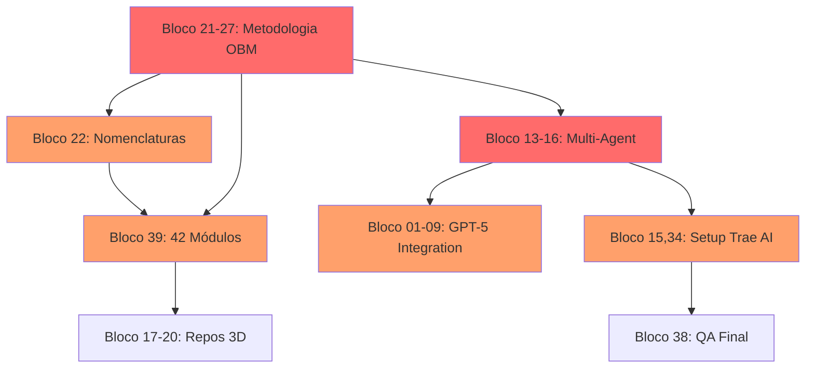

# MATRIZ: BLOCOS → REGRAS → DOCUMENTAÇÃO

> **Documento:** MATRIZ-BLOCOS-REGRAS-DOCS.md  
> **Data:** 2025-11-16  
> **Objetivo:** Tabela completa mapeando cada bloco do dossier para explícitos, implícitos, gaps, regras e documentação destino.

---

## Como Ler Esta Matriz

- **Bloco #:** Número do bloco no Dossie_Chat_Organizado_Anotado.md
- **Título:** Resumo do conteúdo do bloco
- **Explícito:** O que está escrito literalmente
- **Implícito:** O que está subentendido/filosofia
- **Gaps:** O que falta ou não está claro
- **Regra(s):** Regras existentes (1-12) ou novas propostas (13-22) que aplicam
- **Arquivo Destino:** Onde este conteúdo deve ser documentado
- **Status:** 
  - ✅ Coberto: já documentado adequadamente
  - 🟡 Parcial: documentado mas precisa expansão
  - ❌ Novo: não documentado ainda

---

## TABELA COMPLETA (39 Blocos)

| Bloco | Título | Explícito | Implícito | Gaps | Regra(s) | Arquivo Destino | Status |
|-------|--------|-----------|-----------|------|----------|-----------------|--------|
| 01 | Limite requisições GPT Pro | Custo $200/mês, "ilimitado" com ressalvas | Preocupação com viabilidade econômica | Falta estratégia de fallback e monitoramento | 3, 10 | `05-IA-e-Agents/02-GPT-5-Pro-Integration.md` | ❌ |
| 02 | API vs ChatGPT web | Questiona melhor opção | Necessidade de automação, não uso manual | Decisão final não documentada | 5 | `05-IA-e-Agents/02-GPT-5-Pro-Integration.md` | ❌ |
| 03 | Modo mais barato GPT-5 Pro | Busca alternativas econômicas | Projeto tem restrições de orçamento | Falta estratégia de cost optimization | 10 | `05-IA-e-Agents/09-Cost-Optimization-Strategy.md` | ❌ |
| 04 | GitHub Copilot acesso | Pergunta sobre GPT-5 Pro via GitHub | Interesse em ferramentas dev com IA | GitHub Copilot será usado? Falta integração | 6 | `02-Guia-para-Devs/05-Ferramentas-de-IA.md` | ❌ |
| 05 | Link API Pro | Solicita link oficial | Urgência em integração | Falta listar todos endpoints necessários | 5 | `08-Referencias-Externas/05-OpenAI-API-Docs.md` | ❌ |
| 06-07 | Model IDs e capabilities | Lista modelos, IDs corretos | Cada modelo tem caso de uso específico | Falta matriz de quando usar cada modelo | 2, 10 | `05-IA-e-Agents/10-Model-Selection-Matrix.md` | ❌ |
| 08 | App pronto pelo modelo | Questiona entrega completa | Expectativa de automação E2E | Definição de "app pronto" não clara | 10, 13* | `05-IA-e-Agents/07-Catalogo-de-Entregaveis.md` | 🟡 |
| 09 | Formato Model ID | Questiona versionamento correto | Modelos mudam com tempo | Falta política de update de versões | 6 | `05-IA-e-Agents/11-Model-Versioning-Policy.md` | ❌ |
| 10 | Imagem configuração | Upload de setup visual | Validação antes de começar | Imagem não preservada, falta checklist | 8, 10 | `02-Guia-para-Devs/06-Setup-Checklist.md` | ❌ |
| 11 | Acesso total e programar tudo | Desejo de agente onipotente | Visão "one agent to rule them all" | Não reconhece valor de especialização | 19* | `05-IA-e-Agents/01-Arquitetura-de-Agents.md` | 🟡 |
| 12 | GPT-5 Pro não é pra programar | Questiona especialização | Confusão sobre qual modelo usar | Resposta não documentada | 2 | `05-IA-e-Agents/10-Model-Selection-Matrix.md` | ❌ |
| 13 | Pro melhor para arquitetura | **Pro = Architect role** | **Arquitetura Multi-Agent definida** | Protocolo de handoff não documentado | 19* | `05-IA-e-Agents/01-Arquitetura-de-Agents.md` | 🟡 |
| 14 | GPT-5.1 programar pesado | Capacidade para código complexo | Preocupação com qualidade | Falta benchmarks e testes | 10 | `05-IA-e-Agents/13-AI-Capabilities-Benchmark.md` | ❌ |
| 15 | Config no Trae AI | Tutorial prático necessário | Trae AI é IDE escolhido | Falta guia completo de setup | 12 | `02-Guia-para-Devs/07-Trae-AI-Setup-Guide.md` | ❌ |
| 16 | Config 3 Agents | **Architect, Dev, Executor** | Pipeline com ferramentas específicas | Protocolo .TASK não especificado | 19* | `05-IA-e-Agents/02,03,04-*-Agent.md` | 🟡 |
| 17 | Repos Reallusion open-source | Busca alternativas 3D | Alinhamento com open-source ético | Critérios de avaliação não definidos | 13*, 7 | `08-Referencias-Externas/04-Catalogo-OS-3D-LLM-Reuso.md` | 🟡 |
| 18 | Alternativas similares | Feature parity importante | Disposição para adaptar | Features essenciais vs nice-to-have | 7 | `08-Referencias-Externas/14-3D-Tools-Comparison-Matrix.md` | ❌ |
| 19 | Outros projetos 3D | Interesse amplo em 3D | Ecossistema completo necessário | Escopo exato não definido | 6 | `04-Stacks-e-Infra/13-3D-Stack-Oficial.md` | ❌ |
| 20 | Lista com links repos | Referências práticas | Prioriza ação sobre teoria | Falta template de avaliação | 10 | `07-Receitas-e-Playbooks/07-Avaliacao-de-Repos-3D.md` | ❌ |
| 21 | Metodologia detalhada | **Solicita metodologia completa** | **Define "jeito OBM de fazer"** | Não há documento único consolidado | 4*, 18* | `02-Guia-para-Devs/01-Metodologia-Orbit-OBM.md` | ❌ |
| 22 | Nomenclaturas técnicas | **LANGUAGE, STACK, MODULE, DIFF, CONTRATO, etc.** | **Building blocks da metodologia** | **LANGUAGE não documentado** | 4, 18* | `06-Glossario-Tecnico/*.md` (vários) | 🟡 |
| 23 | Completude conceitos | Busca visão completa | Preocupação em não esquecer | Falta validação formal | 5 | `01-Visao-Geral/02-Mapa-Conceitual-OBM.md` | ❌ |
| 24 | Prossiga | Comando de continuação | Aprovação do conteúdo | N/A | N/A | N/A | ✅ |
| 25 | Stacks e linguagens | **Stack oficial sendo definida** | Decisão entre múltiplas opções | Processo de decisão não documentado | 6 | `04-Stacks-e-Infra/14-Decision-Log-Stack.md` | ❌ |
| 26 | Padrão nomenclatura docs | Repetir contexto sempre | **Meta-regra sobre documentar** | Falta style guide formal | 20* | `00-Config/08-Style-Guide-Documentation.md` | ❌ |
| 27 | Metodologia (repetição) | Reforça necessidade | Tema central confirmado | Aprovação formal não registrada | 5 | `02-Guia-para-Devs/01-Metodologia-Orbit-OBM.md` | ❌ |
| 28 | DOC.MD | Referência a arquivo | Consolidação de docs prévios | Conteúdo não preservado | 5 | N/A | N/A |
| 29 | ORBIT.zip | Upload de código | Base existente para trabalhar | Inventário não documentado | 8 | `99-Log-e-Historico/03-Inventario-de-Codigo-Recebido.md` | ❌ |
| 30 | listas a organizar.md | Backlog de curadoria | Info valiosa mas desestruturada | Processo de triagem não existe | 9 | `99-Log-e-Historico/04-Backlog-de-Organizacao.md` | ❌ |
| 31 | README.md | Documento de entrada | Pode estar desatualizado | Política de manutenção não definida | 5 | `Home.md` | 🟡 |
| 32 | MAIN APP.zip | App principal | Código legacy | Não há análise de qualidade | 10 | `99-Log-e-Historico/05-Analise-Codigo-Legacy.md` | ❌ |
| 33 | Sem título.md | Rascunho | Processo incremental | Convenção de nomenclatura falta | 1 | N/A | N/A |
| 34 | Montagem projeto Trae AI | **Integração de tudo** | **Momento da verdade** | Falta guia E2E de setup | 12, todas | `07-Receitas-e-Playbooks/09-Setup-Completo-Passo-a-Passo.md` | ❌ |
| 35 | Prossiga (2) | Comando de continuação | Engajamento contínuo | N/A | N/A | N/A | ✅ |
| 36 | Validação memória chat | **Context validation** | **Preocupação com perda contexto** | Mecanismo formal não existe | 5, 21* | `05-IA-e-Agents/14-Context-Management.md` | ❌ |
| 37 | Árvore completa docs | **Estrutura final solicitada** | **Transição chat → docs** | Árvore ainda não implementada | 5, 4 | `00-Config/09-Arvore-Completa-Documentacao.md` | ❌ |
| 38 | Revisão final | **Checkpoint de qualidade** | **QA da própria conversa** | Resultado da revisão não documentado | 10, 22* | `07-Receitas-e-Playbooks/10-Checklist-Revisao-Final.md` | ❌ |
| 39 | Consolidação final | **Entrega final com correções** | **Convergência de tudo** | Critérios aceitação não explícitos | Todas | Este arquivo + 3 outputs | 🟡 |

**Legenda:**
- `*` = Regra proposta (não existe ainda), ver RECOMENDAÇÕES-DE-NOVAS-REGRAS.md
- Regras sem `*` = Regras existentes (1-12) em 00-Config/03-RULES-GLOBAL.md

---

## ESTATÍSTICAS DA MATRIZ

### Por Status
- ✅ **Coberto:** 2 blocos (5%)
- 🟡 **Parcial:** 7 blocos (18%)
- ❌ **Novo:** 28 blocos (72%)
- N/A: 2 blocos (5%)

**Conclusão:** 72% do conteúdo do dossier ainda não está adequadamente documentado.

### Por Regra Aplicável

#### Regras Existentes (1-12)
- Rule 1 (Nomenclatura): 1 bloco
- Rule 2 (Contratos): 2 blocos
- Rule 3 (Segurança): 1 bloco
- Rule 4 (Linkagem): 3 blocos
- Rule 5 (Fonte Verdade): 7 blocos
- Rule 6 (Stack Fixa): 4 blocos
- Rule 7 (Conversão OS): 3 blocos
- Rule 8 (Ignore/Index): 2 blocos
- Rule 9 (Cache): 1 bloco
- Rule 10 (Validação): 10 blocos
- Rule 11 (Plugins): 0 blocos
- Rule 12 (Tasks Trae): 3 blocos

#### Regras Novas Propostas (13-22)
- Rule 13 (Open Source Ético): 2 blocos
- Rule 14 (Model Selection): 0 blocos (coberto por 6-7, 12)
- Rule 15 (Módulo Primeiro): 0 blocos (implícito em 21)
- Rule 16 (Arquitetura Explícita): 0 blocos (implícito em 21)
- Rule 17 (E2E Completo): 0 blocos (implícito em 39)
- Rule 18 (Modularização): 3 blocos
- Rule 19 (Papéis Agents): 4 blocos ⭐ **MAIS CITADA**
- Rule 20 (Style Guide): 1 bloco
- Rule 21 (Context Validation): 1 bloco
- Rule 22 (Quality Gates): 1 bloco

**Conclusão:** Rule 19 (Papéis de Agents) é a mais necessária e fundamentada.

### Por Arquivo Destino

#### Top 5 Arquivos Mais Referenciados
1. `05-IA-e-Agents/*.md` - 12 blocos
2. `02-Guia-para-Devs/*.md` - 6 blocos
3. `07-Receitas-e-Playbooks/*.md` - 5 blocos
4. `08-Referencias-Externas/*.md` - 4 blocos
5. `06-Glossario-Tecnico/*.md` - 3 blocos

#### Arquivos Críticos Faltando (mais referenciados)
1. `05-IA-e-Agents/02-GPT-5-Pro-Integration.md` - 3 blocos
2. `05-IA-e-Agents/10-Model-Selection-Matrix.md` - 2 blocos
3. `02-Guia-para-Devs/01-Metodologia-Orbit-OBM.md` - 2 blocos
4. `02-Guia-para-Devs/07-Trae-AI-Setup-Guide.md` - 2 blocos

---

## PRIORIZAÇÃO DE DOCUMENTAÇÃO

### 🔴 Prioridade CRÍTICA (bloqueia trabalho)
Blocos que definem metodologia central:

| Blocos | Tema | Arquivo(s) | Justificativa |
|--------|------|------------|---------------|
| 13, 16 | Arquitetura Multi-Agent | `05-IA-e-Agents/01-Arquitetura-de-Agents.md` | Core da metodologia |
| 21, 27 | Metodologia OBM | `02-Guia-para-Devs/01-Metodologia-Orbit-OBM.md` | Define "jeito de fazer" |
| 22 | Nomenclaturas | `06-Glossario-Tecnico/*.md` | Linguagem compartilhada |
| 39 | 42 Módulos OBM | `03-Modulos-OBM/*.md` | Componentes do sistema |

### 🟠 Prioridade ALTA (facilita trabalho)
Blocos que suportam implementação:

| Blocos | Tema | Arquivo(s) | Justificativa |
|--------|------|------------|---------------|
| 15, 34 | Setup Trae AI | `02-Guia-para-Devs/07-Trae-AI-Setup-Guide.md` | Operacionalizar IDE |
| 01-09 | Integração GPT-5 | `05-IA-e-Agents/02-GPT-5-Pro-Integration.md` | Usar APIs corretamente |
| 17-20 | Repos 3D | `08-Referencias-Externas/04-Catalogo-OS-3D-LLM-Reuso.md` | Material para integração |
| 25 | Stack Oficial | `04-Stacks-e-Infra/01-Stack-Oficial-OBM.md` | Decisões tecnológicas |

### 🟡 Prioridade MÉDIA (melhora qualidade)
Blocos que refinam processo:

| Blocos | Tema | Arquivo(s) | Justificativa |
|--------|------|------------|---------------|
| 03 | Cost Optimization | `05-IA-e-Agents/09-Cost-Optimization-Strategy.md` | Sustentabilidade financeira |
| 26 | Style Guide | `00-Config/08-Style-Guide-Documentation.md` | Consistência de docs |
| 36, 38 | QA e Checkpoints | `07-Receitas-e-Playbooks/10-Checklist-Revisao-Final.md` | Qualidade de entrega |

### 🟢 Prioridade BAIXA (nice to have)
Blocos complementares:

| Blocos | Tema | Arquivo(s) | Justificativa |
|--------|------|------------|---------------|
| 04 | Ferramentas IA | `02-Guia-para-Devs/05-Ferramentas-de-IA.md` | Ferramentas adicionais |
| 14 | Benchmarks | `05-IA-e-Agents/13-AI-Capabilities-Benchmark.md` | Validação técnica |
| 29-32 | Histórico | `99-Log-e-Historico/*.md` | Rastreabilidade |

---

## MAPA DE DEPENDÊNCIAS

**Caminho Crítico:**
1. Definir Metodologia (21-27)
2. Formalizar Nomenclaturas (22)
3. Especificar Multi-Agent (13-16)
4. Documentar 42 Módulos (39)
5. Setup Trae AI (15, 34)
6. Integração completa

---

## RESUMO DE GAPS POR CATEGORIA

### Gaps de Processo (8)
- Protocolo .TASK não especificado (Bloco 16)
- Handoff entre agents não documentado (Bloco 13)
- Aprovação formal não registrada (Bloco 27)
- Quality gates não definidos (Bloco 38)
- Process de triagem não existe (Bloco 30)
- Política de manutenção não definida (Bloco 31)
- Context validation não formalizado (Bloco 36)
- Critérios de aceitação não explícitos (Bloco 39)

### Gaps de Documentação (12)
- Decisão API vs web não documentada (Bloco 02)
- Matriz de modelos faltando (Blocos 06-07, 12)
- Guia setup Trae AI inexistente (Blocos 15, 34)
- Metodologia não consolidada (Blocos 21, 27)
- LANGUAGE não documentado (Bloco 22)
- Stack decision log ausente (Bloco 25)
- Style guide não criado (Bloco 26)
- Árvore de docs não implementada (Bloco 37)
- Inventário de código não feito (Blocos 29, 32)
- Análise de qualidade não registrada (Bloco 32)
- Checklist revisão inexistente (Bloco 38)
- Catálogo 3D incompleto (Blocos 17-20)

### Gaps de Estratégia (5)
- Cost optimization não definida (Bloco 03)
- Fallback strategy ausente (Bloco 01)
- Integração ferramentas IA não clara (Bloco 04)
- Política de versionamento não especificada (Bloco 09)
- Critérios avaliação repos 3D faltando (Blocos 17-20)

### Gaps de Regras (9)
- Rules 13-21 não existem mas são referenciadas/necessárias
- Rule 4 (Regra de Ouro) mencionada mas não definida claramente
- Especialização de agents não formalizada (Rule 19)
- Open-source ético não documentado (Rule 13)

---

## AÇÕES IMEDIATAS SUGERIDAS

### Para o Architect
1. Revisar e aprovar as 9 regras propostas (13-21)
2. Validar priorização de documentação
3. Definir protocolo .TASK formalmente
4. Aprovar árvore de documentação final

### Para o Dev
1. Criar arquivos prioritários (ver Prioridade CRÍTICA)
2. Expandir arquivos parciais existentes
3. Implementar templates para módulos OBM
4. Preencher glossário com termos do Bloco 22

### Para o Executor
1. Validar consistência entre blocos e docs
2. Verificar wikilinks funcionando
3. Criar checklists de QA
4. Testar guias práticos (quando criados)

---

## NOTAS FINAIS

Esta matriz é um **documento vivo**. À medida que a documentação é criada:

1. Atualizar coluna "Status" (❌ → 🟡 → ✅)
2. Adicionar link para arquivo criado
3. Marcar regras que foram formalizadas
4. Registrar data de conclusão

**Responsável por manter atualizado:** Executor Agent
**Frequência de revisão:** A cada 5 arquivos documentados

---

*Documento gerado em: 2025-11-16*  
*Versão: 1.0 - MATRIZ COMPLETA*
